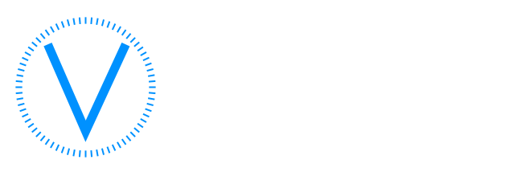

## Описание

Сайт собран на [MkDocs Material](https://squidfunk.github.io/mkdocs-material/) с плагином [mkdocs-static-i18n](https://github.com/ultrabug/mkdocs-static-i18n).  
Контент страниц хранится в Markdown в каталоге `/docs`.

- русская версия: `имя.md` (язык по умолчанию)
- английская версия: `имя.en.md`

Навигация задаётся один раз в `mkdocs.yml` на русском языке. Переводы пунктов меню — в блоке `plugins → i18n → languages → en → nav_translations`.

## Структура проекта

| Назначение     | Путь               |
|----------------|--------------------|
| Страницы сайта | `/docs`            |
| Изображения    | `/docs/images`     |
| Прошивки       | `/docs/firmwares`  |
| Параметрии     | `/docs/parameters` |
| Шаблоны утилит | `/overrides/pages` |
| Главный конфиг | `mkdocs.yml`       |

## Шаблон страницы с кодировкой

```
    # Название страницы
    
    ### Название кодировки/адаптации
    
    !!! tip ""
        Описание/цель, если есть
    
    !!! warning ""
        Предупреждение, если есть
    
    ``` yaml title="логин-пароль: XXXXX (если есть)"
    Блок XX → Адаптация/Кодирование:
    Байт XX – Бит X (название бита): Активировать
    Название раздела:
    - Название адаптации: Активировать
    → Применить
    ```
    
    ??? note "Название раскрывающегося списка"
        Информация, которая на сайте отображается свёрнутой
```

Пример вставки изображения:
```

```

Пример вставки файла:
```
[(Name of file)](LinkToFile)
```

## Двуязычный контент

Сайт поддерживает русский и английский языки. **Любые изменения кодировок, адаптаций и описаний нужно вносить сразу в обе языковые версии.**

### Добавление новой кодировки

1. Добавьте блок в соответствующий файл `docs/.../page.md`.
2. Добавьте тот же блок в парный файл `docs/.../page.en.md`.
3. Если создаётся новая страница — добавьте оба файла (`page.md` и `page.en.md`) и пункт в `nav` файла `mkdocs.yml`.
4. Для нового пункта меню добавьте перевод в `nav_translations` (секция `locale: en`).

### Изменение существующей кодировки

1. Найдите русский файл, например `docs/MQB/drive.md`.
2. Внесите правку в русскую версию.
3. Внесите **эквивалентную** правку в `docs/MQB/drive.en.md`.
4. Отправьте один PR с изменениями в обоих файлах.

Не отправляйте PR только с русской версией: английская страница не должна отставать.

### Новая страница или раздел

| Шаг | Действие                                                            |
|-----|---------------------------------------------------------------------|
| 1   | Создать `docs/.../name.md`                                          |
| 2   | Создать `docs/.../name.en.md`                                       |
| 3   | Добавить страницу в `nav` (`mkdocs.yml`)                            |
| 4   | При необходимости добавить перевод пункта меню в `nav_translations` |

Подробнее о процессе — в [CONTRIBUTING.md](CONTRIBUTING.md).

## Участие в проекте

1. Сделайте fork репозитория.
2. Создайте ветку с изменениями.
3. Обновите русскую и английскую версии затронутых страниц.
4. Проверьте сборку: `mkdocs serve` или `mkdocs build`.
5. Создайте pull request.

## Поддержка проекта

Если проект вам полезен, вы можете поддержать его развитие:

- перевод в рублях: [YooMoney](https://yoomoney.ru/to/4100110582992748/100)
- BTC-кошелёк: `1BKR5d91YUic3aqwc6nTGTMLkGBBrZkkcj`
