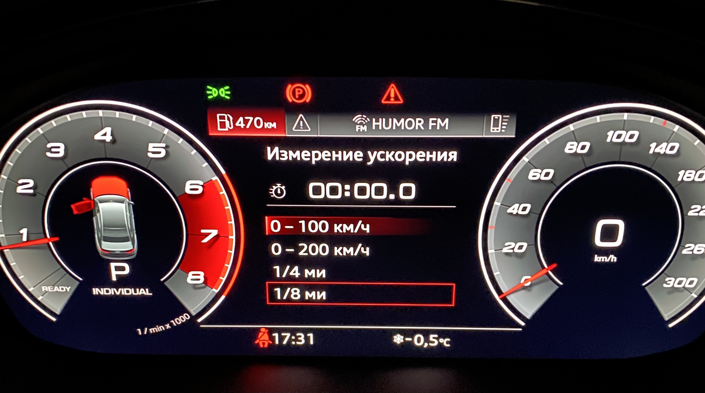

#Dashboard

### Free space in tank

``` yaml title="Login code: 20103"
Block 17 → Coding:
Byte 10 – Bit 4 (refuel_volume): Activate
→ Apply (with block reboot)
```


### Disabling audible and visual warnings if the key is outside the vehicle while the vehicle is running

``` 
Block 17 → Coding:
Leaving_warning → no
→ Apply (with block reboot)
```


### Adding intermediate scales to the speedometer

:octicons-verified-24: Audi
``` 
Block 17 → Coding:
Tachometer_erweiterte_Skalenteilung: yes
→ Apply (with block reboot)
```


### Display lap timer and oil temperature

:octicons-verified-24: Audi + e-tron
``` 
Block 17 → Coding:
Byte 1 – Bit 3 (lap timer active): yes
→ Apply (with block reboot)
```


In some models this encoding may be called "Lap counter"

### Sports menu

:octicons-verified-24: Audi e-tron
``` 
Block 17 → Coding:
Acceleration display: on
→ Apply
```


### Display acceleration measurement

:octicons-verified-24: Audi
``` 
Block 17 → Adaptation:
Displayable_content_configuration:
- Drag_indicator: no_display → readout
- Acceleration measurement: Display # (1)!
→ Apply
```


1. Some machines may require this option



### Set the display of the current gear (in normal mode, in S mode or both)

:octicons-verified-24: Audi
``` yaml
Block 02 → Coding:
Block 3 – Functions: → select the required value
```


or
``` yaml
Block 02 → Adaptation:
Activate_gear_information_display:
- Activate_gear_information_display: → select the required value
```


### Head-up display display

:octicons-verified-24: Audi
``` yaml
Block 82 → Coding:
Navigation System: not available → available 
Laptimer_activated: not available → available 
clock: not available → available 
Telephone: not available → available 
speedlimiter: not available → available 
predictive_efficiency_assistant: not available → available 
→ Apply
```


### Arrow test

``` yaml title="Login code: 20103"
Block 17 → Coding:
Byte 01 – Bit 0 : Activate
→ Apply (with block reboot)
```


### Recommendation for shifting to a higher gear (when driving in manual mode)

:octicons-verified-24: Audi
``` yaml title="Login code: 20103"
Block 17 → Adaptation:
Upshift_indicator_in_the_centre_display: no_display change to display
→ Apply
```
