# Instrument cluster Active Info Display (AID)

### Change max speed of the speedometer

:octicons-verified-24: SFD: yes :octicons-verified-24: Tested SW: 3460-3470

``` yaml 
Control unit 17 → Adjustments:
Speedometer_final_value:
- Speedometer_final_value: 
variant_0 = 260km/h
variant_1 = 280 km/h
variant_2 = 240 km/h
variant_3 = 300 km/h
variant_4 = 320 km/h
→ Apply
```

### Additional view in the AID

:octicons-verified-24: SFD: no :octicons-verified-24: Tested SW: 3460-3470

``` yaml 
Control unit 17 → Adjustments:
Unlock_views:
- view_6: active
→ Apply
```
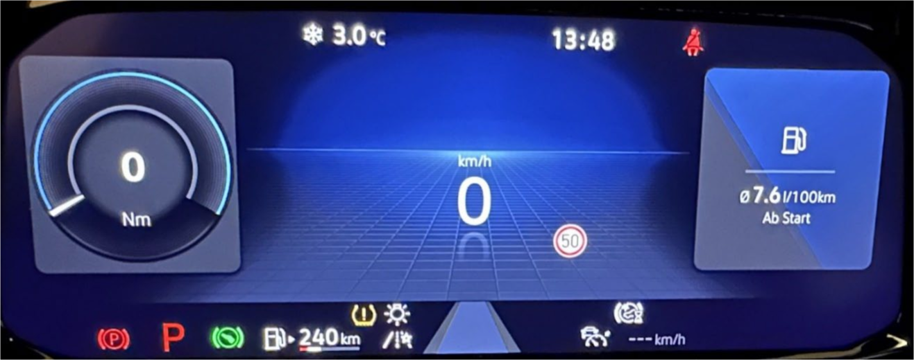   

### Style of AID

:octicons-verified-24: SFD: no :octicons-verified-24: Tested SW: 3460-3470

Golf 8 GTE (Hybrid) view in the AID
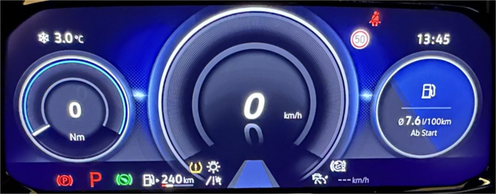   
``` yaml 
Control unit 17 → Adjustments:
Unlock_views:
- view_7: activ
→ Apply
```

Golf 8 GTI view in the AID
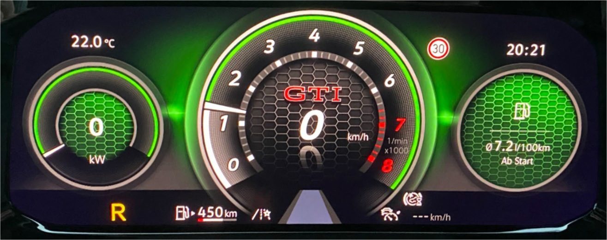   
``` yaml 
Control unit 17 → Adjustments:
Unlock_views:
- view_8: active
→ Apply
```

Golf 8 R view in the AID
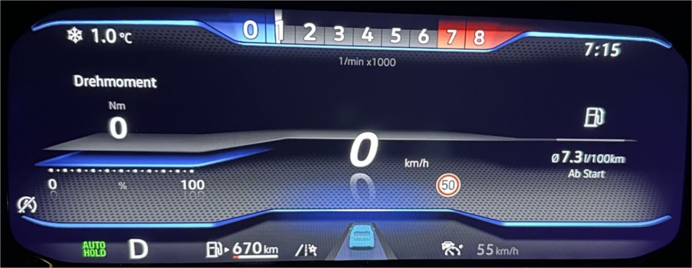   
``` yaml 
Control unit 17 → Adjustments:
unlock_views:
- view_9: active
→ Apply
```

### Off-road view in the AID (Active Info Display)

:octicons-verified-24: SFD: no :octicons-verified-24: Tested SW: 3460-3470

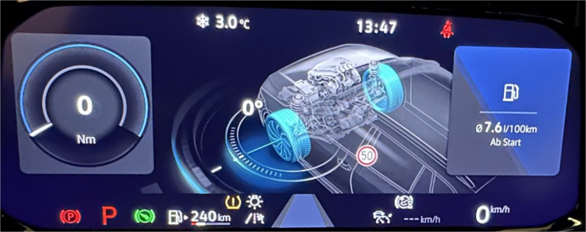   

``` yaml 
Control unit 17 → Adjustments:
Unlock_views:
- view_10: active
→ Apply
```

### Activate steering angle display in the AID info window

:octicons-verified-24: SFD: yes :octicons-verified-24: Tested SW: 3460-3470

   

!!! note ""
    May need to be activated in the AID menu

``` yaml 
Control unit 17 → Adjustments:
Offroad:
- Offroad: yes
→ Apply
```

### Activate boost pressure display in the AID info window

:octicons-verified-24: SFD: yes :octicons-verified-24: Tested SW: 3460-3470 (none GTE)

!!! note ""
    May need to be activated in the AID menu

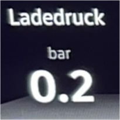  

``` yaml 
Control unit 17 → Adjustments:
Displayable_content_configuration:
- Boost_Pressure: active
→ Apply
```

### Activate G-force display in the AID info display window

:octicons-verified-24: SFD: no :octicons-verified-24: Tested SW: 3460-3470

   

!!! note ""
    May need to be activated in the AID menu

``` yaml 
Control unit 17 → Adjustments:
Displayable_content_configuration:
- G_Meter: active
→ Apply
```

### Activate torque display in the AID info display window

:octicons-verified-24: SFD: yes :octicons-verified-24: Tested SW: 3460-3470 (none GTE)

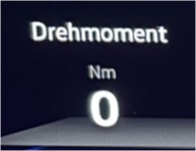   

!!! note ""
    May need to be activated in the AID menu

``` yaml 
Control unit 17 → Adjustments:
Displayable_content_configuration:
- Engine_Torque: active
→ Apply
```

### Activate engine power display in the AID info display

:octicons-verified-24: SFD: yes :octicons-verified-24: Tested SW: 3460-3470 (none GTE)

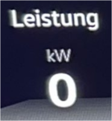   

!!! note ""
    May need to be activated in the AID menu

``` yaml 
Control unit 17 → Adjustments:
Displayable_content_configuration:
- Engine_Power: active
→ Apply
```

### Activate transmission temperature display in the AID info window

:octicons-verified-24: SFD: yes :octicons-verified-24: Tested SW: 3460-3470

   

!!! note ""
    May need to be activated in the AID menu

``` yaml 
Control unit 17 → Adjustments:
Displayable_content_configuration:
- Transmission_Temperature: active
→ Apply
```

### Lap timer with lap counter

:octicons-verified-24: SFD: yes :octicons-verified-24: Tested SW: 3460-3470

!!! note ""
    May need to be activated in the AID menu

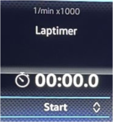   

``` yaml 
Control unit 17 → Coding:
Laptimer: yes
→ Apply
```

Lap counter in conjunction with the lap timer:

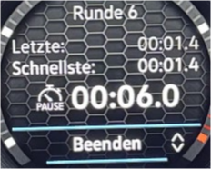  

``` yaml 
Control unit 17 → Adjustments:
Displayable_content_configuration:
- Laptimer: active
→ Apply
```

### Activate refuelling amount in the AID (Active Info Display)

:octicons-verified-24: SFD: no :octicons-verified-24: Tested SW: 3460-3470

!!! note ""
    May need to be activated in the AID menu

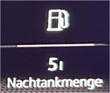  

``` yaml 
Control unit 17 → Coding:
Refuel_volume: yes
→ Apply
```

### Customize logo in the AID (Active Info Display)

:octicons-verified-24: SFD: no :octicons-verified-24: Tested SW: 3460-3470

!!! note ""
    Some logos only appear in the Golf 8 R view starting from a speedometer with part number 5H0920340B!

``` yaml 
Control unit 17 → Adjustments:
Logo:
- logo: no_Logo = select
→ Apply
```

     

Logo_1 = R  
Logo_2 = R alternative style  
Logo_3 = GTE  
Logo_4 = GTI  
Logo_5 = GTD  

### Deactivate seatbelt warning

:octicons-verified-24: SFD: yes :octicons-verified-24: Tested SW: 1400-7380

``` yaml 
Control unit 17 → Adjustments:
Deactivate_belt_warning:
- State: yes
→ Apply
```

### Change the startup screen of the dashboard

:octicons-verified-24: SFD: yes :octicons-verified-24: Tested SW: 7360-7380

``` yaml 
Control unit 17 → Coding:
derivative: derivative_1 (normal Golf), derivative_3 (Golf R)
→ Apply
```

### Change the color of the RPM display in Golf R view

:octicons-verified-24: SFD: no :octicons-verified-24: Tested SW: 7360-7380

``` yaml 
Control unit 17 → Adjustments:
Adjustments:
- tachometer_colour: Rot 0, Grün 0, Blau 0
→ Apply
```

Examples:  
Violet: 127, 0, 255  
Blue: 0, 0, 255  

### Change outside temperature warning threshold in the AID (Active Info Display)

:octicons-verified-24: SFD: no :octicons-verified-24: Tested SW: 3460-3470

``` yaml 
Control unit 17 → Adjustments:
outside_temperature:
- p_ice_warning_exit_temperature: 6° (Adjust as desired, maximum 10°C)
- p_ice_warning_entry_temperature: 4° (Adjust as desired, maximum 10°C)
- p_storage_time_engine_off: 180 (Adjust as desired, Warning appears again after restarting the engine)  
→ Apply
```

### Disable beeping when engaging reverse gear (DSG in "R")

:octicons-verified-24: SFD: no :octicons-verified-24: Tested SW: 3460-3470

!!! note ""
    Only works after ignition change

``` yaml 
Control unit 17 → Adjustments:
Acoustics_driving_position_R:
- Acoustics_driving_position_R: not_active
→ Apply
```

### Disable animation when switching AID displays

:octicons-verified-24: SFD: yes :octicons-verified-24: Tested SW: 3470

``` yaml 
Control unit 17 → Adjustments:
Locking_display_content:
- Locking_decoration_animation: yes
→ Apply
```

### Activate acceleration measurement 0-100km/h, 80-120km/h and 1/4 mile

:octicons-verified-24: SFD: yes

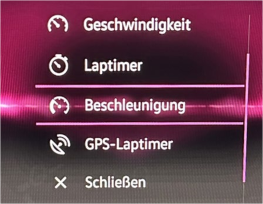{ width="300" } 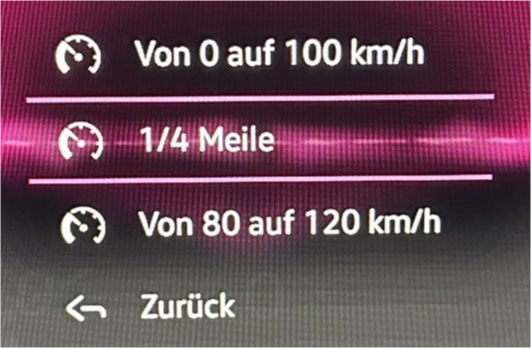{ width="300" } 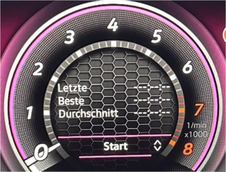{ width="300" } 

``` yaml title="Tested SW: 1447"
Control unit 4B → Coding:
Function_activation_speed_up_measuring: activated
Speed_up_measuring_0_to_100_km_per_h: activated
Speed_up_measuring_80_to_120_km_per_h: activated
Time_measuring_for_0_to_QuaterMile: activated
→ Apply
```

``` yaml title="Tested SW: 3470"
Control unit 17 → Adjustments:
Displayable_content_configuration:
Acceleration_measurement: display
→ Apply
```

!!! warning ""
    After the coding has been changed in control unit 4B, a basic adjustment of the headlights must be performed!  
    It seems to be related to the software version of the dashboard. Probably only at revision B, but not confirmed yet.

### Compass Display in the AID Info Window

:octicons-verified-24: SFD: ??? :octicons-verified-24: Tested SW: 3470

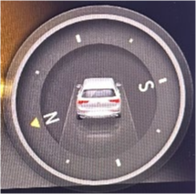   

``` yaml 
Control unit 17 → Coding:
navigation_compass: yes
→ Apply
```

### Change timing of upcoming service notification

:octicons-verified-24: SFD: ??? :octicons-verified-24: Tested SW: 3470

``` yaml 
Control unit 17 → Adjustments:
Service_early_warning_in_days:
- time: 30d (Adjust as desired)
→ Apply
```

### Torque distribution display in the AID info window

:octicons-verified-24: SFD: yes :octicons-verified-24: Tested SW: 3460-3470

!!! error ""
    Display is present, but no functionality recognizable, probably only on Golf R

``` yaml 
Control unit 17 → Adjustments:
Displayable_content_configuration:
- Torque_Distibution: active
→ Apply
```

### Display driving profile in the AID (Active Info Display)

:octicons-verified-24: SFD: yes :octicons-verified-24: Tested SW: 3460-3470

!!! error ""
    No changes recognizable, maybe linked in the dataset

``` yaml 
Control unit 17 → Adjustments:
Displayable_content_configuration:
- Display_FPA: display
→ Apply
```

### Extended scales in the speedometer

:octicons-verified-24: SFD: no :octicons-verified-24: Tested SW: 3460-3470

!!! error ""
    No changes recognizable, maybe linked in the dataset

``` yaml 
Control unit 17 → Coding:
Tachometer_erweiterte_Skalenteilung: yes
→ Apply
```

### GPS Lap timer

:octicons-verified-24: SFD: yes :octicons-verified-24: Tested SW: 1447

!!! error ""
    1. DO NOT CODE, otherwise you will have a blank display and won't be able to exit the menu!
    2. Tested with an AID 5H0920340A SW 3470

!!! tip "How revert this coding"
    If you have coded it despite the warning, the automatic key assignment must be deactivated. 
    To do this, go to the infotainment system, select "User -> Setup -> Automatic Key Assignment," and disable this feature. 
    After that, restart the MIB, either by holding the "Power" button for about 20 seconds or locking the vehicle and waiting for 15 minutes.

    If key assignment is still needed:  
    1. Re-enable the key assignment.  
    2. Lock the vehicle with key 1.  
    3. Unlock the vehicle with key 1.  
    4. Select the user.  
    5. Lock the vehicle with key 1 and wait for 15 minutes.  
    6. Repeat the same process with key 2.  

``` yaml 
Control unit 4B → Coding:
Gps_laptimer_round_route: not_activated
Gps_laptimer_distance_route: not_activated
→ Apply
```