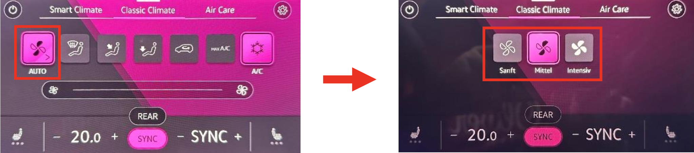

# Climate Control System Management

### Display ventilation level in "Auto" mode

:octicons-verified-24: SFD: no :octicons-verified-24: Tested SW: 0440-0531

!!! warning ""
    Applicable only for old-style climate with rotation buttons

``` yaml 
Control unit 08 → Adjustments:
Blower display during auto mode:
Blower display during auto mode: activated
→ Apply
```

### Save AirCare setting
:octicons-verified-24: SFD: no :octicons-verified-24: Tested SW: 0440-0531

``` yaml
Control unit 08 → Adjustments:
Filtering_interior_air_saving: 
- Filtering_interior_air_saving: not_active (Will not be stored), active (Will be stored), depending_on_standing_time (Stored depending on standing time)
→ Apply
```

### Automatically reduce seat heating to a lower level after a certain time
:octicons-verified-24: SFD: no :octicons-verified-24: Tested SW: 0440-0531

``` yaml
Control unit 08 → Adjustments:
Time for seat heating power reduction Level 3 to level 2: 
- param_Time_for_seat_heating_power_reduction_Level_3_to_level_2: 0 min (adjust value as desired, 0 = off)
Time for seat heating power reduction Level 2 to level 1:
- param_Time_for_seat_heating_power_reduction_Level_2_to_level_1: 0 min (adjust value as desired, 0 = off)
→ Apply
```

### Save recirculation setting
:octicons-verified-24: SFD: no :octicons-verified-24: Tested SW: 0440-0531

``` yaml
Control unit 08 → Adjustments:
Save air recirculation status at terminal 15 off:
- Save air recirculation status at terminal 15 off: storring, Do_not_store, resttime_dependent_storage (Stored depending on standing time)
→ Apply
```

### Enable fan levels "gentle", "medium" and "intensive"
:octicons-verified-24: SFD: no :octicons-verified-24: Tested SW: 0440-0531

``` yaml
Control unit 08 → Adjustments:
Climate_style:
- Climate_style: display
→ Apply
```

   

### Adjust seat heating temperatures

!!! note ""
    "lower" is the activation temperature  
    "upper" is the deactivation temperature

``` yaml
Control unit 08 → Adjustments:
Seat_Heating_Level_Adaptation:
- Seat_heating_stage_1_lower_threshold: 20,0 [UN]_°C (stage 1)
- Seat_heating_stage_1_upper_threshold: 20,5 [UN]_°C (stage 1)
- Seat_heating_stage_2_lower_threshold: 20,0 [UN]_°C (stage 1)
- Seat_heating_stage_2_upper_threshold: 20,5 [UN]_°C (stage 1)
- Seat_heating_stage_3_lower_threshold: 33,0 [UN]_°C (stage 2)
- Seat_heating_stage_3_upper_threshold: 33,5 [UN]_°C (stage 2)
- Seat_heating_stage_4_lower_threshold: 33,0 [UN]_°C (stage 2)
- Seat_heating_stage_4_upper_threshold: 33,5 [UN]_°C (stage 2)
- Seat_heating_stage_5_lower_threshold: 50,0 [UN]_°C (stage 3)
- Seat_heating_stage_5_upper_threshold: 50,5 [UN]_°C (stage 3)
- Seat_heating_stage_6_lower_threshold: 50,0 [UN]_°C (stage 3)
- Seat_heating_stage_6_upper_threshold: 50,5 [UN]_°C (stage 3)
→ Apply
```

### Save seat heating settings
:octicons-verified-24: SFD: no :octicons-verified-24: Tested SW: 0440-0531

``` yaml
Control unit 08 → Adjustments:
Seat heating level driver side, saving condition:
- param_Seat_heating_level_driver_side,_saving_condition: not_active, 10_minutes_activ, active (Last configuration will be stored)
→ Apply
```

``` yaml
Control unit 08 → Adjustments:
Seat heating level passenger side, saving condition:
- param_Seat_heating_level_passenger_side,_saving_condition: not_active, 10_minutes_activ, active (Last configuration will be stored)
→ Apply
```