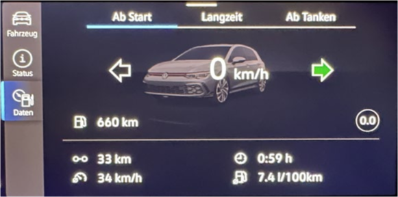

# Head control unit

### Navigation map on both AID and infotainment display simultaneously

:octicons-verified-24: SFD: yes :octicons-verified-24: Tested SW: 1803-1941

!!! note ""
    Works only after restarting the infotainment system

``` yaml 
Control unit 5F → Adjustments:
Dashboard_Display_Configuration:
- ability_switch_nav_maps: no
- navigation_map_compression_mode: H264
- navigation_map_resolution: 1
- navigation_map_transmission_mode: IP_streaming
→ Apply
```

Alternatively:

``` yaml 
Control unit 5F → Adjustments:
Dashboard_Display_Configuration:
- navigation_map_resolution: 2
- navigation_map_transmission_mode: MOST_High
→ Apply
```

### Driving instructor mode
:octicons-verified-24: SFD: yes :octicons-verified-24: Tested SW: 1803-1941

 

``` yaml 
Control unit 5F → Adjustments:
Car_Function_Adaptations:
- menu_display_driving_school_over_threshold_high: activated
- menu_display_driving_school: activated
→ Apply
```

### Deactivation of input blocking during driving in the navigation system

:octicons-verified-24: SFD: yes :octicons-verified-24: Tested SW: 1803-1941

``` yaml 
Control unit 5F → Adjustments:
Disabled_menu_contents:
- FB_MEDIA_19: non_blocked
- FB_MISC_14: non_blocked
- FB_MISC_19: non_blocked
- FB_MISC_18: non_blocked
- FB_MISC_31: non_blocked
- FB_MISC_29: non_blocked
- FB_MISC_25: non_blocked
- FB_MISC_33: non_blocked
- FB_MISC_44: non_blocked
- FB_MISC_41: non_blocked
→ Apply
```

### Enable/Disable AM Frequency Band in the Radio

:octicons-verified-24: SFD: ??? :octicons-verified-24: Tested SW: 1941

``` yaml 
Control unit 5F → Adjustments:
function_configuration_radio:
- AM_disable: activated
→ Apply
```

### Enable summer time setting in the HMI

:octicons-verified-24: SFD: ??? :octicons-verified-24: Tested SW: 1941

``` yaml 
Control unit 5F → Adjustments:
Summer_Time_Shift_Method:
- shift_method: none
→ Apply
```

### Enable Comp Improve Sound Quality without Harman/Kardon Sound System

:octicons-verified-24: SFD: ??? :octicons-verified-24: Tested SW: 1941

``` yaml 
Control unit 5F → Adjustments:
function_configuration_sound:
- brand_sound: Beats
→ Apply
```

### Enable/Disable Harman/Kardon logo in the MIB3 boot logo

:octicons-verified-24: SFD: ??? :octicons-verified-24: Tested SW: 1941

   

``` yaml 
Control unit 5F → Adjustments:
Startup_Screen_Sticker_HMI:
- Startup_Screen_Sticker_HMI: 3 (0 = no logo, 3 = Harman/Kardon logo)
→ Apply
```

### Allow connecting multiple smartphones

:octicons-verified-24: SFD: ??? :octicons-verified-24: Tested SW: 1941

``` yaml 
Control unit 5F → Adjustments:
function_configuration_phone:
- Support_second_phone: none (one, two, three)
→ Apply
```

### Adjust MIB3 boot logo

:octicons-verified-24: SFD: ??? :octicons-verified-24: Tested SW: 1941

  

``` yaml 
Control unit 5F → Adjustments:
function_configuration_hmi:
- screenings: 3
→ Apply
```

### Display images from USB stick

:octicons-verified-24: SFD: yes :octicons-verified-24: Tested SW: 1899-1941

!!! error ""
    Cannot be successfully coded

``` yaml 
Control unit 5F → Adjustments:
function_configuration_media:
- picture_viewer: on
→ Apply
```

### Off-road monitor in the HMI

:octicons-verified-24: SFD: yes :octicons-verified-24: Tested SW: 1941

!!! error ""
    Cannot be successfully coded

``` yaml 
Control unit 5F → Adjustments:
Car_Function_Adaptations:
- menu_display_compass_over_threshold_high: activated
- menu_display_compass: activated
Car_Function_List_BAP:
- compass_0x15_msg_bus: Databus_Infotainment
- compass_0x15: activated
→ Apply
```

### Welcome tone

:octicons-verified-24: SFD: yes :octicons-verified-24:

!!! error ""
    No changes recognizable, maybe linked in the dataset

``` yaml 
Control unit 5F [Tested SW: 1899-1941] → Adjustments:
function_configuration_audio:
- welcome_sound: on
- function_configuration_sound:
- vehicle_leaving_sound: activated
- vehicle_readiness_sound: activated
→ Apply
```

``` yaml 
Control unit 47[Tested SW: 4319] → Adjustments:
function_configuration_audio:
- welcome_sound: on
→ Apply
```

### Connect Bluetooth headphones

:octicons-verified-24: SFD: yes :octicons-verified-24: Tested SW: 1941

!!! error ""
    Cannot be successfully coded

``` yaml 
Control unit 5F → Adjustments:
function_configuration_connectivity:
- Bluetooth_Headphones: available
→ Apply
```