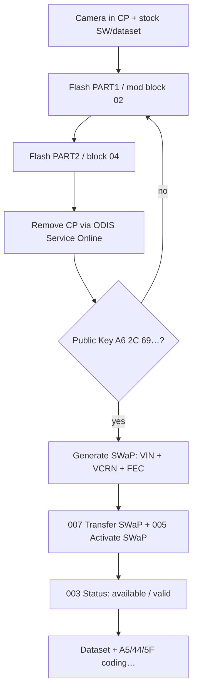

# SWaP for 2Q0980653 camera (MFK 3.0)

Full guide to unlocking **SWaP** on the **2Q0980653×** front assistance camera (**classic MQB**, MFK 3.0).  
After the procedure you can generate and apply your own SWaP codes (Sign Assist, aLDW, etc.) — same logic as [ACC / pACC radar SWaP](pACC.en.md).

!!! warning ""
    All steps are **at your own risk**. Wrong firmware or datasets can brick the camera or cause **Dataset Implausible**.  
    This guide **does not apply** to **5WA 980 653** (MQB-Evo) cameras — see [MQB-Evo Travel Assist](../MQB-Evo/travelAssist.en.md).

!!! note "Sources"
    Ready flash files: **A5_2Q0_SWaP_Solution** on [mibsolution.one](https://mibsolution.one/) (`MQB_Solution` → `pACC` → `A5_2Q0_SWaP_Solution`, login `guest` / `guest`).

## What camera SWaP is

**SWaP** is a signed code (RSA) tied to **VIN**, ECU **VCRN**, and **FEC** list. Factory codes use VW’s key.  
To generate codes **yourself**, the camera’s **public key** in EEPROM is replaced via a special flash. Then use the same generator as for the **2Q0 radar** (`A6 2C 69 …`).

Lane Assist, FLA coding after SWaP — [2Q0 camera coding](2Q0_assistants.en.md).

## 2Q0 camera FEC codes

| FEC                   | Purpose                      |
|-----------------------|------------------------------|
| `100E0F00`            | Sign Assist (VZE / TSR)      |
| `100E1000`            | Advanced lane keeping (aLDW) |
| `100E1100`–`100E1500` | Reserved (navigation)        |
| `100E1600`            | Object detection             |
| `100E1700`            | Pedestrian detection (FCPW)  |

Full set for the generator (space-separated):

```
100E0F00 100E1000 100E1100 100E1200 100E1300 100E1400 100E1500 100E1600 100E1700
```

## Requirements

| | |
|---|---|
| **ECU** | **A5** / **00A5**, camera **2Q0980653** (letter D/J/… — match SW) |
| **Software** | ODIS **Service** (online, CP removal), ODIS **Engineering** 17–18 |
| **Adapter** | VAS6154A / VNCI (grey 6154 preferred for flashing) |
| **State** | Camera in **Component Protection (CP)**, **stock** flash and **stock dataset** |
| **Generator** | [accGenerator.zip](../firmwares/accGenerator.zip) — `afcg.exe`, `FecCalc.py` (same as radar) |

!!! tip ""
    Before flashing, **restore stock parametrization** if you used a custom dataset. Otherwise **Dataset Implausible** and broken VZE are common.

## Overview



---

## Replace the SWaP public key

Two ways to install the custom public key (`A6 2C 69 …`). Steps after flashing (generate SWaP, activate, coding) are the same for both.

=== "Method A — PART1 / PART2 (recommended)"

    Archive **A5_2Q0_SWaP_Solution** on mibsolution.one provides two files per SW version:

    | File                     | Content                                   |
    |--------------------------|-------------------------------------------|
    | `2Q0980653*_PART1.odx-f` | Modified **block 02** (custom public key) |
    | `2Q0980653*_PART2.odx-f` | **Block 04** — exits programming mode     |

    Modified full flashes for all versions are also published there (see UPD in the [Drive2 post](https://www.drive2.ru/b/696873494415150543/)).

    #### Step 1. Preparation

    1. Install the camera, connect CAN (Extended + Local to radar if needed).
    2. Back up **A5** codings/adaptations (ODIS E → **046** or manual export).
    3. Confirm **stock** flash and dataset.
    4. Put **00A5** into **Component Protection** — on first pairing of a new camera this happens during **component protection / equipment adaptation** in ODIS Service **before** SWaP.

    #### Step 2. Flash (ODIS Engineering)

    **A5** → **042 — Flashing**:

    1. Flash **`…PART1.odx-f`** for your letter/SW.  
       Process **fails with an error** — block 02 waits for a signature. Camera stuck in programming mode. **Expected.**
    2. Immediately flash **`…PART2.odx-f`**.  
       Camera should return to normal.

    !!! danger ""
        Order **PART1 → PART2** is mandatory. Do not cut power between steps. Flash may take **40+ minutes** on 6154.

    #### Step 3. Remove Component Protection

    ODIS **Service**, **online** (GeKo / UMA):

    1. Remove CP from **A5**.
    2. If Service does not see CP — pick a **factory model** that shipped with this camera (e.g. VW Polo GTI AW1), as in the [detailed post](https://www.drive2.ru/l/700119252740344031/).

    #### Step 4. Verify public key

    **A5** → **003 — Measuring values** → **SWaP Public Key…**

    Must start with **`A6 2C 69 …`** (same as 2Q0 radar in [pACC](pACC.en.md)).

    If the key is **already** `A6 2C 69 …`, skip flashing and go to [Generate SWaP code](#generate-swap-code).

=== "Method B — manual key swap"

    Use this if you do not have PART1/PART2 from mibsolution.one.

    #### 1. Prepare firmware

    1. Take camera **.odx-f** (unpack ZIP like a dataset).
    2. In **program block 02**, replace **RSA public key** with yours — usually the **2Q0 radar** key (`A6 2C 69 …` from [accGenerator.zip](../firmwares/accGenerator.zip)).
    3. Repack the file.

    #### 2. Flash with CP active

    1. Camera **must** be in CP.
    2. ODIS E → **042** → flash modified file.
    3. **Block 02** loads without valid signature → error, programming mode — **expected**.
    4. **Flash another block** (e.g. **04**) from the same file to finish.

    Block order can be experimented with; **modified 02 must reach the ECU**.

    #### 3. Remove CP and verify key

    Same as **Method A — Step 3** and **Step 4** (remove CP in ODIS Service, then check **SWaP Public Key** in measuring values).

---

## Generate SWaP code

You need:

| Parameter | Source                                          |
|-----------|-------------------------------------------------|
| **VIN**   | Vehicle                                         |
| **VCRN**  | A5 → **003** → *Individualizing characteristic* |
| **FEC**   | Table above                                     |

**Generators** ([accGenerator.zip](../firmwares/accGenerator.zip)):

=== "FecCalc.py"

    ```bash
    python FecCalc.py
    ```
    Press **Enter** at FEC selection to use all camera codes.

=== "afcg.exe"

    1. VIN  
    2. VCRN  
    3. FEC codes space-separated  
    4. Project **`4`** — **`2Q0_MRR MQB`**


## Enter and activate SWaP (ODIS Engineering)

**A5**:

``` yaml title="Login code: 20103 (if block 008 asks)"
009 — Diagnostic session → End of line (EOL)
008 — Access authorization → 20103
007 — Adaptation → Transfer SWaP unlock code → paste generated code
005 — Basic settings → Activation of SWaP / Unlock SWaP Feature
003 — Measuring values → Status of all SWaP functions
```


Success: each FEC shows **available**, **valid**, **condition met**.

Same sequence for radar **13** — [pACC, step 8](pACC.en.md#firmware-and-swap-code-generation).

---

## After SWaP

1. **Calibration** if required after install — see [3Q0 calibration](3Q0_calibration.en.md) for similar steps and ODIS docs.
2. Load the **correct dataset** — [Camera firmwares](camAssistFirmwares.en.md).
3. **Coding** A5, 44, 5F, 17, 09, 19 — [2Q0 camera coding](2Q0_assistants.en.md).

!!! tip ""
    TJA and some features need a **dataset**, not SWaP alone. Sign Assist (VZE) is mainly **SWaP + coding**.

---

## Limitations

| Topic                   | Note                                                                                                |
|-------------------------|-----------------------------------------------------------------------------------------------------|
| **G / H firmware**      | **RSA3072** public key, different block logic — method may **not work** without a separate solution |
| **MQB-Evo 5WA 980 653** | Different camera/SW — **not covered here**                                                          |
| **SFD / SFD2**          | Usually not required for classic MQB **2Q0**; verify on newer cars                                  |
| **Dataset**             | Use verified parametrization only; broken XML from editors often kills VZE                          |
