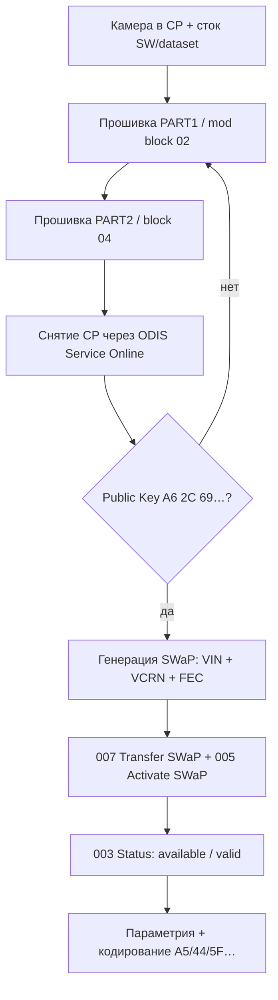
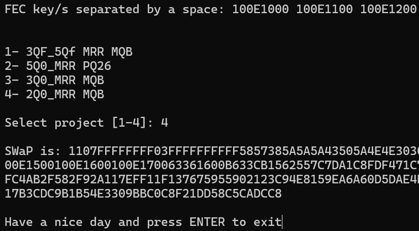
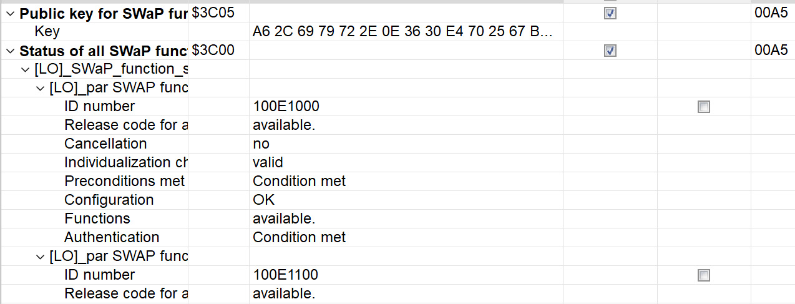

# SWaP для камеры 2Q0980653 (MFK 3.0)

Полная инструкция по разблокировке **SWaP** на фронтальной камере ассистентов **2Q0980653×** (классический **MQB**, MFK 3.0).  
После процедуры можно генерировать и вводить свои SWaP-коды (Sign Assist, aLDW и др.) — по той же логике, что для [радара ACC / pACC](pACC.md).

!!! warning ""
    Все действия — **на свой страх и риск**. Неверная прошивка или параметрия могут «окирпичить» камеру или дать ошибки **Dataset Implausible**.  
    Инструкция **не подходит** для камер **5WA 980 653** (MQB-Evo) — см. [Travel Assist MQB-Evo](../MQB-Evo/travelAssist.md).

!!! note "Источники"
    Готовые файлы прошивки — архив **A5_2Q0_SWaP_Solution** на [mibsolution.one](https://mibsolution.one/) (`MQB_Solution` → `pACC` → `A5_2Q0_SWaP_Solution`, логин `guest` / `guest`).

## Что такое SWaP на камере

**SWaP** — подписанный код (RSA), привязанный к **VIN**, **VCRN** блока и списку **FEC**. Заводские коды подписаны ключом VW.  
Чтобы генерировать коды **самостоятельно**, в EEPROM камеры подменяют **публичный ключ** через специальную прошивку. После смены ключа используется тот же генератор, что для **2Q0-радара** (`A6 2C 69 …`).

Кодирование Lane Assist, FLA и т.д. после SWaP — в [Кодирование 2Q* камеры](2Q0_assistants.md).

## FEC-коды камеры 2Q0

| FEC                   | Назначение                          |
|-----------------------|-------------------------------------|
| `100E0F00`            | Sign Assist (VZE / TSR)             |
| `100E1000`            | Улучшенное ведение по полосе (aLDW) |
| `100E1100`–`100E1500` | Зарезервированы (навигация)         |
| `100E1600`            | Распознавание предметов на пути     |
| `100E1700`            | Распознавание пешеходов (FCPW)      |

Максимальный набор для генератора (через пробел):

```
100E0F00 100E1000 100E1100 100E1200 100E1300 100E1400 100E1500 100E1600 100E1700
```

## Что понадобится

|               |                                                                                               |
|---------------|-----------------------------------------------------------------------------------------------|
| **Блок**      | **A5** / **00A5**, камера **2Q0980653** (буква D/J/… — сверяйте SW)                           |
| **ПО**        | ODIS **Service** (онлайн, снятие CP), ODIS **Engineering** 17–18                              |
| **Адаптер**   | VAS6154A / VNCI (для прошивки предпочтителен «серый» 6154)                                    |
| **Состояние** | Камера в **Component Protection (CP)**, **стоковая** прошивка и **стоковый dataset**          |
| **Генератор** | [accGenerator.zip](../firmwares/accGenerator.zip) — `afcg.exe`, `FecCalc.py` (как для радара) |

!!! tip ""
    Перед прошивкой **верните стоковую параметрию**, если заливали кастомную. Иначе после SWaP часто остаётся **Dataset Implausible** и не работает VZE.

## Общая схема



---

## Подмена публичного ключа SWaP

Два способа установить свой публичный ключ (`A6 2C 69 …`). Дальнейшие шаги (генерация SWaP, активация, кодирование) для обоих одинаковы.

=== "Способ A — PART1 / PART2 (рекомендуется)"

    Архив **A5_2Q0_SWaP_Solution** на mibsolution.one содержит для каждой версии SW два файла:

    | Файл                     | Содержимое                                            |
    |--------------------------|-------------------------------------------------------|
    | `2Q0980653*_PART1.odx-f` | Модифицированный **блок 02** (свой публичный ключ)    |
    | `2Q0980653*_PART2.odx-f` | **Блок 04** — вывод камеры из режима программирования |

    На том же ресурсе также есть **готовые модифицированные прошивки всех версий** (см. UPD в [посте на Drive2](https://www.drive2.ru/b/696873494415150543/)).

    #### Шаг 1. Подготовка

    1. Установите камеру, подключите CAN (Extended + при необходимости Local к радару).
    2. Сделайте backup кодировок/адаптаций **A5** (ODIS E → **046** или экспорт вручную).
    3. Убедитесь: прошивка и dataset **заводские**.
    4. Переведите блок **00A5** в **Component Protection** — при первой установке «чужой» камеры это происходит при **адаптации оборудования** в ODIS Service **до** SWaP.

    #### Шаг 2. Прошивка (ODIS Engineering)

    Блок **A5** → **042 — Прошивка**:

    1. Прошить **`…PART1.odx-f`** под вашу букву/SW.  
       Процесс **завершится ошибкой** — блок 02 ждёт подпись. Камера «зависнет» в programming mode. **Это нормально.**
    2. Сразу прошить **`…PART2.odx-f`**.  
       Камера должна вернуться в рабочее состояние.

    !!! danger ""
        Порядок **PART1 → PART2** обязателен. Не прерывайте питание между шагами. Прошивка может занять **40+ минут** (6154).

    #### Шаг 3. Снять Component Protection

    ODIS **Service**, **онлайн-доступ** (GeKo / UMA):

    1. Снять CP с блока **A5**.
    2. Если Service не видит CP — выберите модель, на которую такая камера **ставилась с завода** (например VW Polo GTI AW1), как в [подробном посте](https://www.drive2.ru/l/700119252740344031/).

    #### Шаг 4. Проверить публичный ключ

    **A5** → **003 — Измеряемые величины** → **SWaP Public Key…**

    Должен начинаться с **`A6 2C 69 …`** (как у 2Q0-радара в [pACC](pACC.md)).

    Если ключ **уже** `A6 2C 69 …` — прошивку можно пропустить и перейти к [генерации SWaP](#генерация-swap-кода).

=== "Способ B — ручная подмена ключа"

    Если нет PART1/PART2 с mibsolution.one — логика из [короткого поста на Drive2](https://www.drive2.ru/b/696873494415150543/).

    #### 1. Подготовить прошивку

    1. Взять **.odx-f** прошивку камеры (распаковать ZIP, как параметрию).
    2. В **программном блоке 02** заменить **публичный ключ RSA** на свой — обычно берут ключ **2Q0-радара** (`A6 2C 69 …` из [accGenerator.zip](../firmwares/accGenerator.zip)).
    3. Собрать файл обратно.

    #### 2. Прошить при активной CP

    1. Камера **обязательно** в CP.
    2. ODIS E → **042** → прошивка модифицированного файла.
    3. **Блок 02** заливается без валидной подписи → ошибка, programming mode — **ожидаемо**.
    4. **Допрошить другой блок** (например **04**) из той же прошивки — процесс завершится.

    Порядок блоков можно подбирать; главное — **изменённый 02 должен попасть в камеру**.

    #### 3. Снять CP и проверить ключ

    Как **способ A — шаг 3** и **шаг 4** (снятие CP в ODIS Service, затем проверка **SWaP Public Key** в измеряемых величинах).

---

## Генерация SWaP-кода

Нужны три значения:

| Параметр | Где взять                                    |
|----------|----------------------------------------------|
| **VIN**  | Автомобиль                                   |
| **VCRN** | A5 → **003** → *Индивидуализирующий признак* |
| **FEC**  | Таблица выше                                 |

**Генераторы** (из [accGenerator.zip](../firmwares/accGenerator.zip)):

=== "FecCalc.py"

    ```bash
    python FecCalc.py
    ```
    На запрос набора FEC можно нажать **Enter** — подставятся все коды камеры.

=== "afcg.exe"

    1. VIN  
    2. VCRN  
    3. FEC через пробел  
    4. Проект **`4`** — строка **`2Q0_MRR MQB`**



## Ввод и активация SWaP (ODIS Engineering)

Блок **A5**:

``` yaml title="Login code: 20103 (если запросит блок 008)"
009 — Диагностический сеанс → Режим при сходе с конвейера (EOL)
008 — Право доступа → 20103
007 — Адаптация → Передача кода разблокировки функции SWaP → вставить сгенерированный код
005 — Базовая установка → Активация функции SWaP / Unlock SWaP Feature
003 — Измеряемые величины → Статус всех функций SWaP
```



Успех: для каждого FEC — **available**, **valid**, **condition met** (доступн. / действ. / условие выполнено).

Та же последовательность для радара **13** — см. [pACC, шаг 8](pACC.md#прошивка-и-генерация-swap-кода).

---

## После SWaP

1. **Калибровка** камеры (если требуется после установки) — см. [Калибровка 3Q*](3Q0_calibration.md) по аналогии и документацию ODIS.
2. Заливка **подходящей параметрии** — [Прошивки камеры](camAssistFirmwares.md).
3. **Кодирование** A5, 44, 5F, 17, 09, 19 — [Кодирование 2Q* камеры](2Q0_assistants.md).

!!! tip ""
    TJA и часть функций требуют **параметрию**, а не только SWaP. Sign Assist (VZE) — в первую очередь **SWaP + кодирование**.

---

## Ограничения

| Тема                    | Комментарий                                                                                                             |
|-------------------------|-------------------------------------------------------------------------------------------------------------------------|
| **Прошивки G / H**      | Публичный ключ **RSA3072** (длиннее), другая логика заливки блоков — метод может **не работать** без отдельного решения |
| **MQB-Evo 5WA 980 653** | Другая камера и SW — эта страница **не применима**                                                                      |
| **SFD / SFD2**          | На классическом MQB для **2Q0** обычно не требуется; на новых авто уточняйте отдельно                                   |
| **Dataset**             | Только проверенные параметрии; «левые» XML из редакторов часто ломают VZE                                               |
