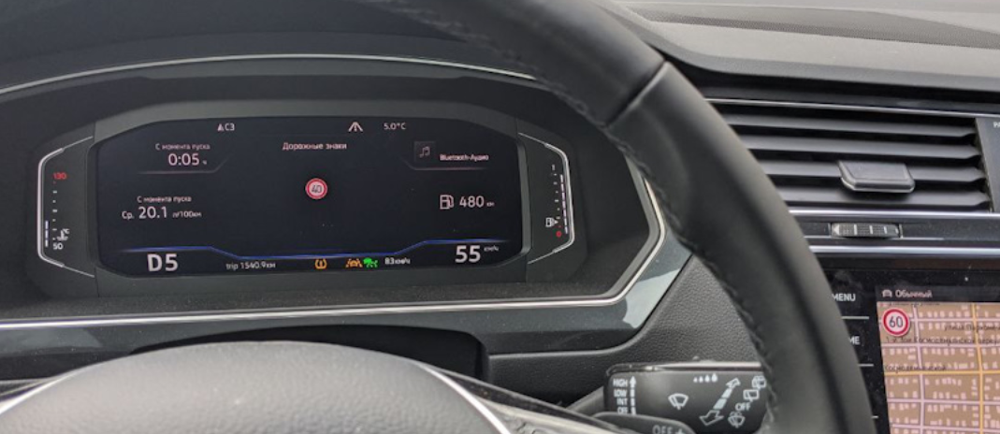

# Encoding 3Q0/3QD* (MFK 2.0) camera assistants

**This manual is only suitable for cameras 3Q0980654**  

Lane Assist with adaptive lane guidance — adaptive guidance eliminates “ping-pong” from lane to lane.  
The option is excellent: it lets you relax behind the wheel without hunting for the center of the lane; on the highway it is simply indispensable.

Traffic Jam Assist — traffic jam assistant.  
This extends Lane Assist to work from 0 km/h. In a traffic jam the car steers, accelerates and brakes on its own. After stopping for more than 3 seconds, press RES or the accelerator to move off.

Emergency Assist — emergency stop assistant.  
If the driver will not or cannot take part in driving, the car first wakes them with sound, then with sharp braking.  
If they still do not take control, the car switches on the hazard lights and stops.

Sign Assist — traffic sign recognition assistant. Shows signs read by the camera.

## Assistant camera firmware

Located here: [Firmware and parameters](camAssistFirmwares.md){ .md-button .md-button--primary }

## Assistant activations

### IQ Light matrix headlights

``` yaml
Block A5 (assistant camera) → Coding:
AFS_coding_Light_Assist: Matrixbeam
→ Apply
```

### Activating the assistant call button (for 5Q0 953 502 AJ / Valeo 408 876)

``` yaml title="Login code: 20103"
Block 16 → Adaptation:
Steering column electronics
Driver assistance systems button
Installed
→ Apply
```

### Activating Lane Assist without adaptive lane guidance

!!! warning
    To activate Lane Assist, updating parameters for the installed assistant camera is not required
  
Enable Lane Assist display on the instrument cluster
``` yaml
Block 17 (instrument cluster/ActiveInfoDisplay) → Coding:
Byte 04 – Bit 6 (Lane_assist): Activate
Byte 11 – Bit 1 (Lane_assist_BAP): Activate
```

Assistant camera configuration  
You can use ready-made coding:  
000307060007040100220044C150890080000E20004000 
``` yaml
Block A5 (assistant camera) → Coding:
Byte 14 – change value to A0/A1
Byte 16 – Bit 7: Activate (or change byte value to 90/98)
```

``` yaml title="Login code: 20103"
Block A5 (assistant camera) → Adaptation:
Lan_assist_system_mode - Selection_over_menu  
Lane_assist_warning_intensity - Selection_over_menu 
Personalization of lane dept. warning Cl. 15 on - Last Setting (last setting)
→ Apply
```

HCA — tell the steering control unit that Lane Assist is present
``` yaml title="Login code: 19249"
Block 44 (steering assist) → Coding:
Byte 01 – Bit 3 (Heading_control_assist): Activate
→ Apply
```

Enable new functions in the menu
``` yaml
Block 5F (multimedia) → Adaptation:
Car_Function_List_BAP_Gen2:
- LDW_HCA_0x19: activated
Car_Function_Adaptations_Gen2:
- menu_display_Lane_Departure_Warning: Activate
- menu_display_Lane_Departure_Warning_over_threshold_high: Activate
→ Apply
```

Tell the parking assistant unit that Lane Assist is present (PLA3.0 with 12 sensors)

!!! note ""
    On the 2020 Tiguan 2G, PLA3.0 may appear in the system as block 10, not 76
  
``` yaml
Block 76 → Coding:
Lane assist linked to steering assist
Byte 3 – Bit 5 (HeadingControl Unterstutzung Auswahl): Activate (Spurhalteassistent aktiviert)
→ Apply
```

### Full set: adaptive Lane Assist, Traffic Jam Assist, Sign Assist

Lane Assist with adaptive lane guidance — eliminates “ping-pong” from lane to lane.  
The option is excellent: it lets you relax behind the wheel without hunting for the center of the lane; on the highway it is simply indispensable.

!!! warning
    Traffic Jam Assist requires parameters for the installed assistant camera.  
    Located here: [Firmware and parameters][1]

[1]: camAssistFirmwares.md

Tell the climate control unit (08) that camera heating is installed.

=== "Coding in ODIS"
    ``` yaml
    Block 08 → Coding:
    Byte 08 – Bit 0 (Camera heating): Installed
    → Apply
    ```
=== "Coding in OBD11"
    ``` yaml
    Block 08 – Long coding:
    Camera heating element: not installed → installed
    ```

Tell the ACC radar that a camera is installed

=== "Coding in ODIS"
    ``` yaml
    Block 13 (adaptive cruise) → Coding:
    Byte 03 – Bit 6 (Front_camera): Installed
    → Apply
    ```
=== "Coding in OBD11"
    ``` yaml
    Block 13 → Long coding:
    Front_camera: not installed → installed
    ```

Change high-beam assistant type from simple to MDF — masked or non-dazzling high beam. Add the assistant to the menu
``` yaml title="Login code: 31347"
Block 09 (on-board network) → Adaptation:
Aussenlicht_Blinker:
- Warnblinken_durch_Fahrerassistenz: available
Fernlicht_assistent:
- Erweiterte_Fernlichtsteuerung: AFS, FLA, Fernlicht ueber AFS → AFS, FLA, Fernlicht (GLW,MDF)
- Menuesteuerung Fernlichtassistent: available
- Fernlichtassistent Reset: Deactivate
- Menuesteuerung Fernlichtassistent Werkseinstellung: available
- Assistance_lighting_sensitivity_adjustable: detected
→ Apply
```

Enable Lane Assist and road sign display on the instrument cluster

=== "Coding in ODIS"
    ``` yaml
    Block 17 (instrument cluster/ActiveInfoDisplay) → Coding:
    Byte 04 – Bit 6 (Lane_assist): Activate
    Byte 11 – Bit 1 (Lane_assist_BAP): Activate (add Lane Assist to instrument cluster assistant menu)
    Byte 05 – Bit 2 (traffic_sign_display): Activate
    → Apply
    ```
=== "Coding in OBD11"
    ``` yaml
    Block 17 → Long coding:
    Lane assist: No → Yes
    Road sign recognition: No → Yes
    Lane assist, BAP, route: No → Yes
    ```

Activate installed modules: add A5 (front driver assistance sensors) and remove block 20 (FLA camera mirror)

=== "Coding in ODIS"
    ``` yaml
    Block 19 (gateway) → Adaptation:
    Gateway_Component_List: Node_0x30: not_coded
    Gateway_Component_List: Node_0x4F: coded
    → Apply
    ```
=== "Coding in OBD11"
    ``` yaml
    Block 19 → Adaptation:
    High beam assistant: Not coded.
    Front driver assistance sensors: Coded
    ```

HCA — tell the steering control unit that Lane Assist is present

=== "Coding in ODIS"
    ``` yaml title="Login code: 19249"
    Block 44 (steering assist) → Coding:
    Byte 03 – Bit 0 (Heading_control_assist): Activate
    → Apply
    ```
=== "Coding in OBD11"
    ``` yaml title="Login code: 19249"
    Block 44 → Long coding:
    Lane assist: active
    ```

Headlight unit setup

!!! warning "Attention!"
    Changing coding in this block resets basic headlight settings. [How to restore basic settings?](../codingLights/#_12)

=== "Coding in ODIS"
    ``` yaml
    Block 4B (multifunction module) → Coding:
    Byte 10 – Bit 6 (mdf_activation): Activate
    headlamp_coding_word: 1
    multi_function_camera: installed
    → Apply
    ```
=== "Coding in OBD11"
    ``` yaml
    Block 4B → Coding:
    headlamp_coding_word: 0 → 1
    mdf_activation: not unlocked → unlocked
    ```

Tell the ABS unit that emergency braking is available
``` yaml
Block 03 (ABS) → Coding:
Byte 29 – Bit 5 (Electromechanical parking brake): Activate (emergenay braking)
→ Apply
```

Configure block 3C (lane change assistant)
``` yaml
Block 3C → Coding:
Lane_Departure_Warning_System:_with_Lane_Departure_Warning_System
Front_Sensors_Driver_Assistance_System:_with_Front_Sensors_Driver_Assistance_System
→ Apply
```

Tell the parking assistant unit that Lane Assist is present (PLA with 12 sensors)

!!! note "Useful information"
    On the 2020 Tiguan 2G, PLA3.0 may appear in the system as block 10, not 76
  
``` yaml
Block 76 → Coding:
Lane assist linked to steering assist
Byte 3 – Bit 5 (HeadingControl Unterstutzung Auswahl): Activate (Spurhalteassistent aktiviert)
→ Apply
```

Enable new functions in the menu
``` yaml
Block 5F (multimedia) → Adaptation:
Car_Function_List_BAP_Gen2:
- LDW_HCA_0x19: Activate
- traffic_sign_recognition_0x21: Activate
- traffic_sign_recognition_0x21_msg_bus: CAN_Extended (additional data bus)
Car_Function_Adaptations_Gen2:
- menu_display_Lane_Departure_Warning: Activate
- menu_display_Lane_Departure_Warning_over_threshol d_high: Activate
- menu_display_road_sign_identification: Activate
- menu_display_road_sign_identification_over_threshold_high: Activate
→ Apply
```

Tell the projection unit (if fitted)
``` yaml
Block 82 → Coding:
Road_sign_detection: available
Lane_departure_warning: available
→ Apply
```

Assistant camera configuration.

!!! note "Ready-made coding"
    ```yaml
    000307060007040100222346C154890098000E20004000
    ```
    Check this coding very carefully against the options actually fitted to your car.  
    For convenience use the [bit calculator](../../utils/longCoding) with A5 block decoding.  
    For example, open the ready-made coding [in the calculator](../../utils/longCoding/?code=000307060007040100222346C154890098000E20004000&label=A5_3Q0)

``` yaml
Block A5 (assistant camera) → Coding:
Brand: VW
Class: A
Generation: Generation_7
Bodystyle: Suv
Expansion: Not_coded
Production_region: EU
Country_variant: Europe
Chassis: Steel_springs
Steering_bar: Not_coded
Windshield: Heat_protecting_glass
Traffic_side: Right_traffic
PSD_Version: PSD_15 # (1)!
Navigation: MIB_High # (2)!
AAG: Coded # (3)!
SWA (Side assist): Coded # (4)!
ACC: Coded
Pedestrian_break: Not_coded
Blind_spot_detection: Not_coded
Rain_light_sensor: Coded
Main_unit: enabled
PLA: Coded # (5)!
ESP: Coded
Personalize_VZE:	Not_Coded
Lan_assist_system_mode: Selection_over_menu
Personalized_key: Version_1.x
Networking_variant: MQB
Radar_interface: Coded
Perso_HC: Last_setting # (6)!
Point_of_intervention: early_setting_over_menu
LaneAssist_AGW_output: disabled
Lane_assist_off_text: disabled
Emergency_Assist: EA_Variant_2
Traffic Sign Recognition (TSR/VZE): coded
HC_mob_line: Not_coded
HC: Coded
FCWP_default_on_prewarning: last_mode
FCWP_delivery_status_prewarning: off
FCWP_extended_prewarning_settings: Not_coded
FCWP_warning_indicator: Not_coded
FCWP: Not_coded
FLA_Additional_High_Beam: no_Additional_High_Beam
FLA_Headinglight_type: LED
Mains_frequency: 50_Hz
AFS_coding_Light_Assist: Dynamic_Light_Assist (or Matrixbeam for Tiguan 2021)
HC_LONGPRESS: Not_Coded (only for Audi)
→ Apply
```

1. Predictive route data. Depends on the head unit (if no navigation, use `Not coded`)
2. Navigation type. Depends on the head unit
3. If a tow bar is fitted
4. If blind spot monitoring is fitted
5. If Park Assist is fitted
6. Remember the selected mode when the ignition is switched off

!!! warning ""
    These adaptations disable warnings about non-working signs

``` yaml title="In ODIS, enter block A5 in developer mode, login 89687"
Block A5 (assistant camera) → Adaptation:
Road_sign_recognition_fusion_mode (road sign recognition: Fusion mode): Road_Sign_Fusion
Lane_assist_warning_intensity (lane assist warning intensity): Selection_over_menu 
Personalisation_point_of_intervention (intervention moment personalization): Last Setting (last setting)
Adaptation_tsr:
- Par_relevance_mode: enabled  
- Par_country_mode: manuel  
- Par_country_code_RSR: 205 # (1)!
- Par_country_code_VZF: 205  
→ Apply
```

1. For CIS countries you can use Poland’s value. Possible values:  
    57 — Czech Republic  
    68 — Estonia (50/90/90)  
    73 — Finland  
    74 — France  
    82 — Germany  
    118 — Latvia  
    124 — Lithuania (50/90/130)  
    172 — Poland (50/60/90/100/120/140)  
    173 — Portugal  
    177 — Romania  
    178 — Russia  
    197 — Spain  
    205 — Sweden (50/90/110)  

!!! note "BAP Personalization"
    BAP Personalization — per-key profile storage. On Tiguan this option is not used; the value has no effect.

### Separating road signs
You can show navigation database speed limits (Sat Nav Speed Limits) on the head unit,  
and camera-read signs on AID (Virtual Cockpit).



``` yaml
Block 5F (multimedia) → Adaptation:
Car_Function_List_BAP_Gen2:
- traffic_sign_recognition_0x21: Deactivate
→ Apply 
Car_Function_Adaptations_Gen2:
- menu_display_road_sign_identification: Deactivate
- menu_display_road_sign_identification_over_threshold_high: Deactivate
→ Apply 
```

``` yaml
Block 5F (multimedia) → Coding:
byte_24_vza: Activate
```

### Intersection lighting when approaching
Top-spec MID LED headlights can switch on side light at intersections and aim light into turns early using navigation data.

``` yaml
Block 4B → Coding:
psd_data: Activate
Crossing_light_with_route_data: Activate — enables side light when approaching an intersection
Predictive_afs: Activate — aims light into turns using navigation map data
```

!!! warning ""
    Basic headlight setup is required afterwards!
