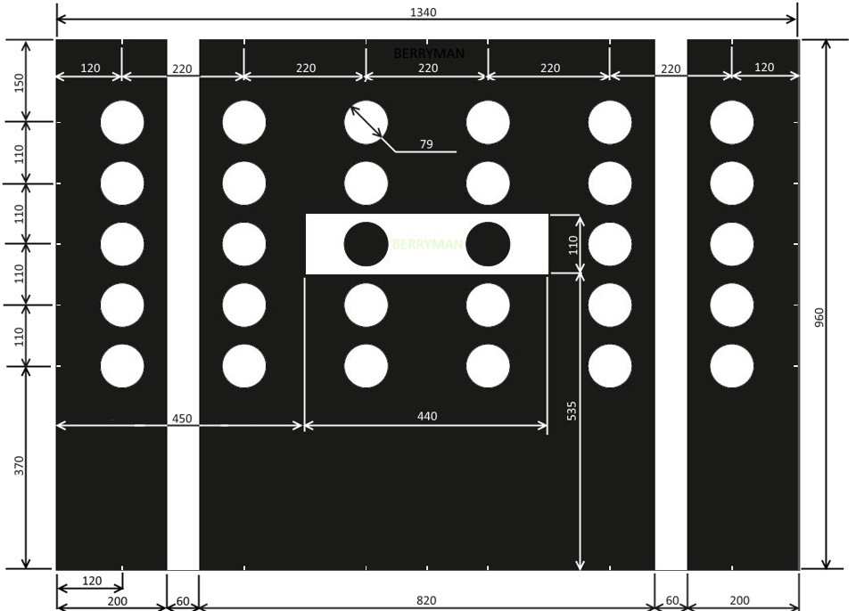

# Калибровка камеры ассистентов 3Q0/3QD* (MFK 2.0)

Для успешной и правильной работы камеры Lane Assist необходимо:
1. Залитая правильная параметрия
2. Правильно установленная камера Lane Assist
3. Правильная кодировка камеры
4. Правильно произведена процедура калибровки камеры

## Адаптации

Каналы адаптации Calibration target position не влияют на калибровку камеры, но они могут влиять на ее работу
``` yaml
Блок A5 (камера ассистентов) → Адаптация:
Calibration target position-Target 1: calibration mark 1: x-coordinate, Passat 2400 mm (Tiguan 2541 mm)
Calibration target position-Target 1: calibration mark 1: y-coordinate, Passat 745 mm (Tiguan 735 mm)
Calibration target position-Target 1: calibration mark 1: z-coordinate, Passat 1506 mm (Tiguan 1694 mm)
Calibration target position-Target 1: calibration mark 2: x-coordinate, Passat 2400 mm (Tiguan 2541 mm)
Calibration target position-Target 1: calibration mark 2: y-coordinate, Passat -745 mm (Tiguan -735 mm)
Calibration target position-Target 1: calibration mark 2: z-coordinate, Passat 1506 mm (Tiguan 1694 mm)
Calibration target position-Target 1: calibration mark 3: x-coordinate, Passat 2400 mm (Tiguan 2541 mm)
Calibration target position-Target 1: calibration mark 3: y-coordinate, Passat 745 mm (Tiguan 735 mm)
Calibration target position-Target 1: calibration mark 3: z-coordinate, Passat 846 mm (Tiguan 1106 mm)
Calibration target position-Target 1: calibration mark 4: x-coordinate, Passat 2400 mm (Tiguan 2541 mm)
Calibration target position-Target 1: calibration mark 4: y-coordinate, Passat -745 mm (Tiguan -735 mm)
Calibration target position-Target 1: calibration mark 4: z-coordinate, Passat 846 mm (Tiguan 1106 mm)
```
Координата X — расстояние от глазка камеры до калибровочного поля (продольная ось),  
Y — это точки калибровки по горизонтальной поперечной оси,  
Z — это точки калибровки по вертикальной оси (меняются с изменением высоты камеры на разных автомобилях). 

## Установка калибровочной панели

Макет для калибровки  
  

Калибровочная панель должна быть центрирована перед автомобилем и быть на расстоянии 1500 мм от центральной оси передних колес, высота установки стенда — 1570 мм от плоскости, на которой стоит автомобиль, до верхнего края стенда.  

Шаг 1 — Расположите калибровочной стенд на расстоянии 1500 мм ± 20 мм от центральной оси передних колес автомобиля. Высота установки стенда — 1570 мм от плоскости, на которой стоит автомобиль, до верхнего края стенда. Стенд должен стоять строго по уровню (как вертикальному, так и горизонтальному), вертикальный центр стенда должен совпадать с продольным центром автомобиля и плоскость стенда должна быть строго перпендикулярна продольной оси автомобиля.  
Шаг 2 — Выполните калибровку (процесс калибровки описан ниже). При калибровке вводим РЕАЛЬНЫЕ значения высоты колесных арок!

Расчет установки высоты плаката:

=== "в кузове Седан"
    1200 — высота камеры  
    535 — расстояние от нижней кромки стенда до белого прямоугольника  
    110/2=55 — расстояние от нижней части прямоугольника до его центра  
    960 — расстояние от нижней кромки до верхней кромки плаката  
    ИТОГО: 1200-535-55+960=1570 (до верхней кромки плаката)

=== "в кузове Кроссовера"
    1480 — высота камеры  
    535 — расстояние от нижней кромки стенда до белого прямоугольника  
    110/2=55 — расстояние от нижней части прямоугольника до его центра  
    960 — расстояние от нижней кромки до верхней кромки плаката  
    ИТОГО: 1480-535-55+960=1850 (до верхней кромки плаката)

## Процесс калибровки

1. Odis Service - "Топология шин данных", блок A5, нажимаем правой кнопкой "Идентификация блока", в списке блоков станет активным блок A5. 
2. Выбираем пункт "Передние датчики вспомогательных систем для водителя (BOSCH)"
3. Правой кнопкой на блоке A5 - измерительная техника
4. Выбираем А5 - калибровка
5. В следующих 4 шагах вводим РЕАЛЬНЫЕ значения высоты колесных арок.

Длительность процесса калибровки до 10 секунд, после чего система попросит выключить зажигание, подождать и включить его снова.   
Углы в результатах должны быть как можно ближе к 0. 
3 градуса — предельное значение, при котором камера не откалибруется. На практике углы до 1 градуса — норма.
  

Выполняем тестовую поездку на скорости более 65 кмч в течение 10 минут по дороге с разметкой и проверяем значения динамической калибровки (калибровка во время езды).  
Максимальное значение углов динамической калибровки — 3 градуса.  
Как только этот угол больше, камера будет выбивать ошибку и ассистенты отключатся.  
Если динамическая калибровка, а именно угол продольного наклона выше 1,5 градуса, то это говорит о том, что при калибровке стенд был установлен не правильно или залита неверная параметрия.
  

