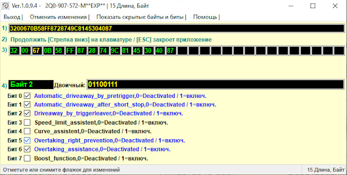
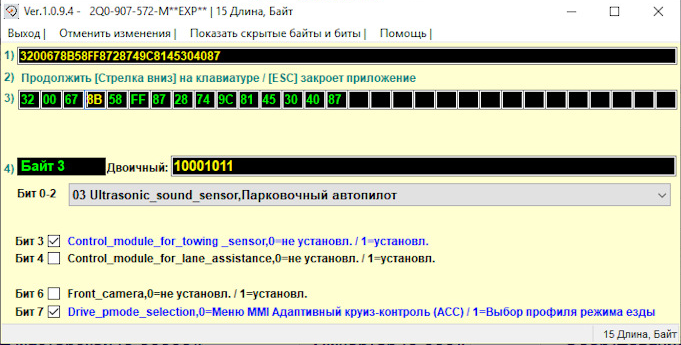
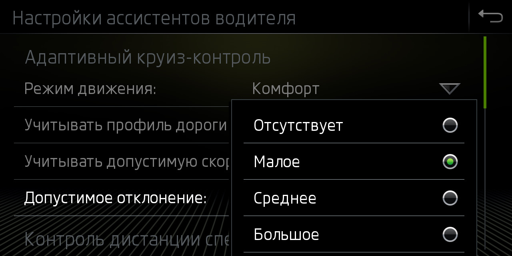

# Adaptive cruise control. Coding

### Allow overtaking/overtaking on the right for Adaptive Cruise Control (ACC)

!!! tip ""
By default, ACC will brake the vehicle if there is a slow vehicle in the left lane (even if the road is empty).

=== "Coding in ODIS"
    
``` yaml
    Block 13 → Coding:
    Overtaking_right_prevention (Vermeidung für unzulässigen Überholvorgang): Deactivate
    → Apply
    ```


=== "Coding in OBD11"
    
``` yaml title="Login code: 20103"
Block 13 → Security access → Login password 20103 → Long coding:
    Overtaking_right_prevention: Deactivate
    → Apply
    ```


=== "Coding in VCDS" 
    
``` yaml title="Login code: 20103"
    13 Block Adaptive Cruise Control → Long coding:
    Byte 2 – Bit 5 (Overtaking_right_prevention): Deactivate  
    Exit → Save
    ```

 
    

### Activate the selection of the Adaptive Cruise Control (ACC) operating mode, regardless of the selected Driving Profile

=== "Coding in ODIS"
    
``` yaml title="Login code: 20103"
    Block 13 → Coding:
Drive_pmode_selection: MMI menu Adaptive cruise control (ACC)
    → Apply
    ```


=== "Coding in VCDS" 
    
``` yaml title="Login code: 20103"
    Block 13 Adaptive Cruise Control → Coding → Long coding:
    Byte 3 – Bit 7 (Drive_pmode_selection, 0=MMI menu ACC / 1=Driving profile selection): Deactivate 
    Exit → Save
    ```

 
    

### Increased Adaptive Cruise Control (ACC) start-up waiting time

By default, the Stop & Go system is only active for 3 seconds after a complete stop. After this time, you can continue driving only with a button on your hand or with the accelerator pedal.  

It is impossible to remove this limitation, however, on the latest firmware versions you can increase the time interval to 10 seconds. Requires parking sensors with 5QA unit.  

Firmware requirements:
```
3QF907561, 5Q0907561: SW 0780, H10-H11  
2Q0907561, 2Q0907572: SW 0383, H01-H04
```


``` yaml
Block 13 → Coding:
Byte 11 – Bit 0 (Pretriggertime_reduction): Deactivate  
→ Apply
```


### Tolerance adjustment (5Q0 radars only)

  

The menu item “Take into account the permissible speed” directly turns on or off the ACC speed control mode depending on the signs in the navigation or recognized by the camera.
``` yaml
Block 13 → Coding:
Tempolimitassistent_CarMenu: Activate
```


Item for setting permissible deviations in the “Adaptive Cruise Control” menu
``` yaml
Block 13 → Coding:
zul_Regelabweichung_CarMenu: large
```


The restrictions you set for a particular sign will be saved and automatically substituted each time these signs are recognized.
``` yaml
Block 13 → Coding:
pACC_Learning_drivers_offset: Activate
```


### Setting the Front Assist warning

``` yaml
Block 13 → Coding:
adjustability_awv_pre_warning: Deactivate
default_value_awv_pre_warning: Activate
```
