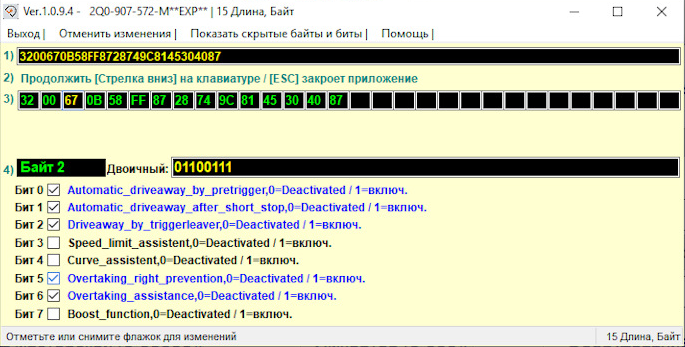
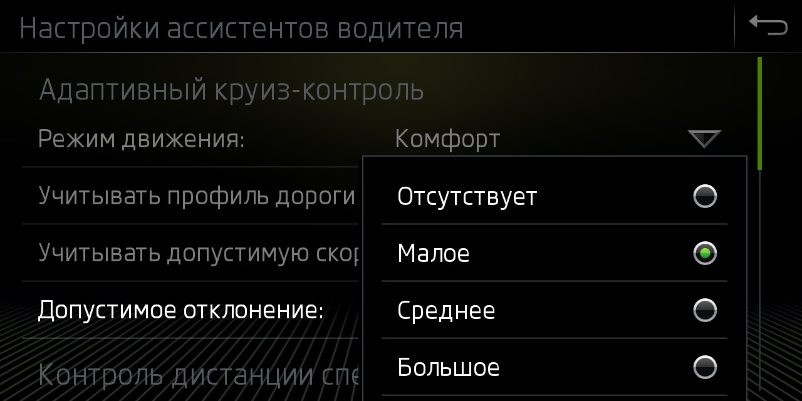

# Адаптивный круиз контроль. Кодирование

### Разрешить обгон/опережение справа для Адаптивного Круиз Контроля (АСС)

!!! tip ""
    По умолчанию система ACC тормозит автомобиль, если на полосе слева едет медленный автомобиль (даже при пустой дороге).

=== "Кодирование в ODIS"
    ``` yaml
    Блок 13 → Кодирование:
    Overtaking_right_prevention (Vermeidung für unzulässigen Überholvorgang): Деактивировать
    → Применить
    ```
=== "Кодирование в OBD11"
    ``` yaml title="логин-пароль: 20103"
    Блок 13 (Адаптивный круиз контроль) → Безопасный доступ → Логин-пароль 20103 → Длинное кодирование:
    Overtaking_right_prevention: Деактивировать
    → Применить
    ```
=== "Кодирование в VCDS" 
    ``` yaml title="логин-пароль: 20103"
    13 Блок Adaptive Cruise Control → Длинное кодирование:
    Байт 2 – Бит 5 (Overtaking_right_prevention): Деактивировать  
    Выход → Сохранить
    ``` 
    
  
### Активация выбора режима работы Адаптивного Круиз Контроля (АСС), независимо от выбранного Профиля езды

=== "Кодирование в ODIS"
    ``` yaml title="логин-пароль: 20103"
    Блок 13 → Кодирование:
    Drive_pmode_selection: Меню MMI Адаптивный круиз контроль (ACC)
    → Применить
    ```
=== "Кодирование в VCDS" 
    ``` yaml title="логин-пароль: 20103"
    Блок 13 Adaptive Cruise Control → Кодирование → Длинное кодирование:
    Байт 3 – Бит 7 (Drive_pmode_selection, 0=MMI menu ACC / 1=Driving profile selection): Деактивировать 
    Выход → Сохранить
    ``` 
    

### Увеличение времени ожидания трогания Адаптивного Круиз Контроля (АСС)

По умолчанию система Stop & Go после полной остановки активна только 3 секунды. По истечении этого времени продолжить движение можно только кнопкой на руке, либо педалью акселератора.  

Снять это ограничение невозможно, однако на последних версиях прошивки можно увеличить временной интервал до 10 секунд. Требуется наличие паркторников с блоком 5QA.  

Требования к прошивкам:  
```
3QF907561, 5Q0907561: SW 0780, H10-H11  
2Q0907561, 2Q0907572: SW 0383, H01-H04
```

``` yaml
Блок 13 → Кодирование:
Байт 11 – Бит 0 (Pretriggertime_reduction): Деактивировать  
→ Применить
```

### Регулировка толерантности (только для 5Q0 радаров)

  

Пункт меню «Учитывать допустимую скорость» и непосредственно включает или выключает режим регулирования скорости АСС в зависимости от знаков в навигации или распознанных камерой.
``` yaml
Блок 13 → Кодирование:
Tempolimitassistent_CarMenu: Активировать
```

Пункт настроек допустимых отклонений в меню «Адаптивного Круиз Контроля»
``` yaml
Блок 13 → Кодирование:
zul_Regelabweichung_CarMenu: large
```

Выставленные Вами для того или иного знака ограничения будут сохраняться и автоматически подставляться каждый раз при распознавании этих знаков.
``` yaml
Блок 13 → Кодирование:
pACC_Learning_drivers_offset: Активировать
```

### Настройка предупреждения Front Assist
``` yaml
Блок 13 → Кодирование:
adjustability_awv_pre_warning: Деактивировать
default_value_awv_pre_warning: Активировать
```
