# Dashboard customization

### Arrow test

!!! info ""
Only works for Active Info Display type 1 (5NA920790A/B/C, 5NA920791A/B/C)  
    Type 2 instrument panels (5NA920790D) are not supported

!!! warning ""
    Coding is performed only with the ignition on and the engine not running
  
=== "Coding in ODIS"
    
``` yaml title="Login code: 20103"
    Block 17 → Coding:
Demo: Activate
    → Apply (with block reboot)
    ```


=== "Coding in OBD11"
    
``` yaml title="Login code: 20103"
Block 17 – Instrument cluster → Long coding:
Demo: yes
    ```


=== "Coding in VCDS"
    
``` yaml title="Login code: 20103"
    Block 17 Instrument cluster → Coding → Long coding:
    Byte 1 – Bit 0 (Gauge test/ Needle Sweep / Staging): Activate
    Exit → Save  
    ```


    

### Disabling audible and visual warnings if the key is outside the vehicle while the vehicle is running

``` yaml
Block 17 → Coding:
Leaving_warning: no
→ Apply (with block reboot)
```


### Display caller's photo, album cover, radio station logo on the dashboard

``` yaml title="Login code: 20103 or 47115"
Block 17 → Adaptation:
Picture_Upload_Download: Activate
→ Apply
```


### Remaining in tanks

!!! warning ""
Coding is performed only with the ignition on and the engine not running

=== "Coding in ODIS"
    
``` yaml title="Login code: 20103"
    Block 17 → Coding:
Volume to be filled: Activate
    → Apply (with block reboot)
    ```


  
=== "Coding in OBD11"
    
``` yaml title="Login code: 20103"
Block 17 Instrument cluster → Long coding:
Amount that needs to be refilled: yes
    ```


  
=== "Coding in VCDS"
    
``` yaml title="Login code: 20103"
    17 Instrument cluster → Coding → Long coding:
    Byte 10 – Bit 4 (Volume to be Replenished): Activate  
    Exit → Save  
    ```


    

!!! tip ""
    The step of indications of how much fuel to fill is a multiple of 5 liters, i.e. 5-10-15-20, etc.
    (checked, it fits even a little more than it shows - showed 30 freely, 32 liters fit)

### Lap timer

!!! warning ""
Coding is performed only with the ignition on and the engine not running

=== "Coding in ODIS"
    
``` yaml title="Login code: 20103"
    Block 17 → Coding:
Lap Timer: Activate
    → Apply (with block reboot)
    ```


=== "Coding in VCDS"
    
``` yaml title="Login code: 20103"
    Block 17 Instrument cluster → Coding → Long coding:
    Byte 1 – Bit 3 (Lap Timer active): Activate  
    Exit → Save  
    ```


    

### Display instantaneous flow rate

``` yaml title="Login code: 20103"
Block 17 → Adaptation:
Instantaneous Consumption Display: Display
→ Apply
```


### Deactivating the audible warning that the ignition is on when the door is opened

``` yaml title="Login code: 20103"
Block 17 → Adaptation:
Ignition active message; trigger : «No display (tbd)»
→ Apply
```


!!! tip
There are 3 values: No display (tbd), Driver door, All doors.

### Disabling the seat belt warning

!!! tip ""
Switches off to avoid distractions on rare occasions when short distance travel is necessary

``` yaml title="Login code: 20103"
Block 17 → Adaptation:
Disable seat belt warning: yes
→ Apply
```


### Activating intermediate speedometer values

!!! note ""
Works only on new AID dashboards from 2019.  
    In any case, 100 km/h is always at the top.

??? Variants
    Variant_0
    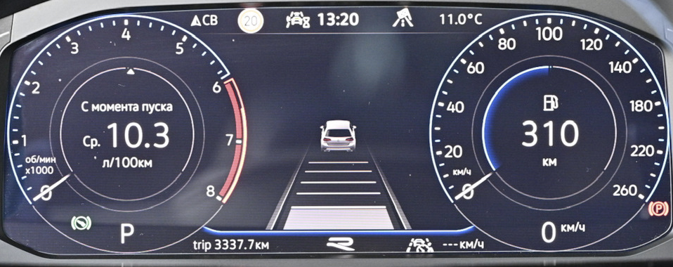
    Variant_1
    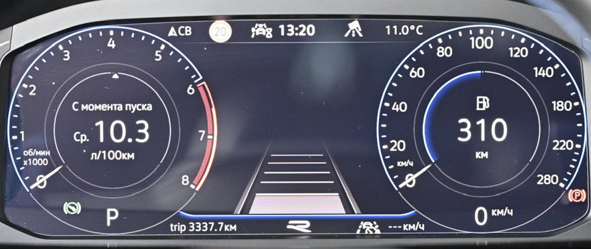
    Variant_2
    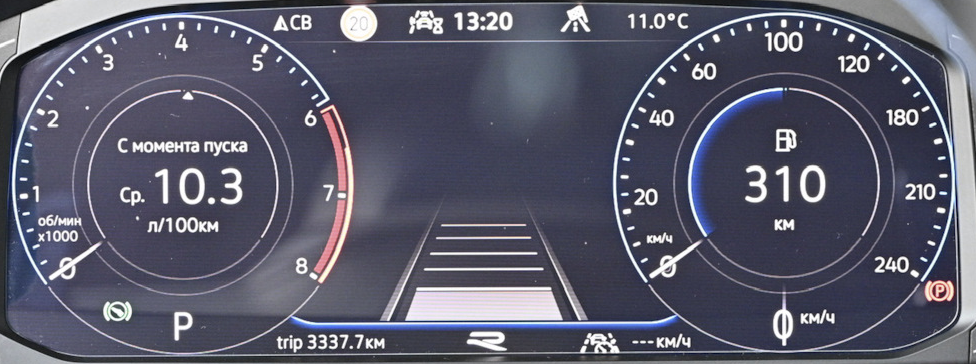
    Variant_3
    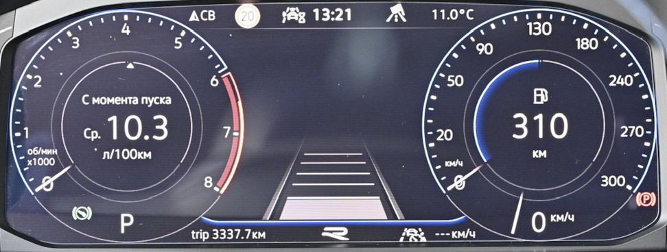
    Variant_4
    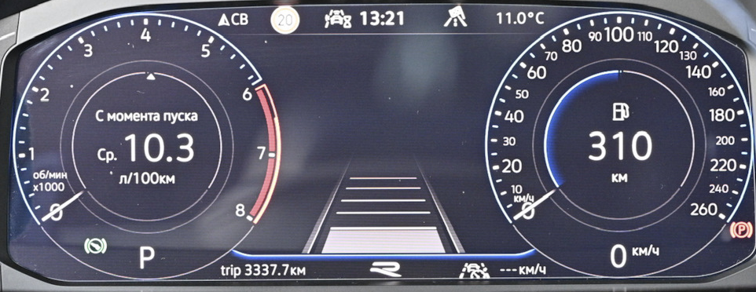
    Variant_5
    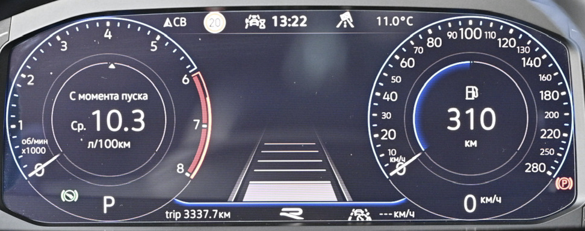
    Variant_6
    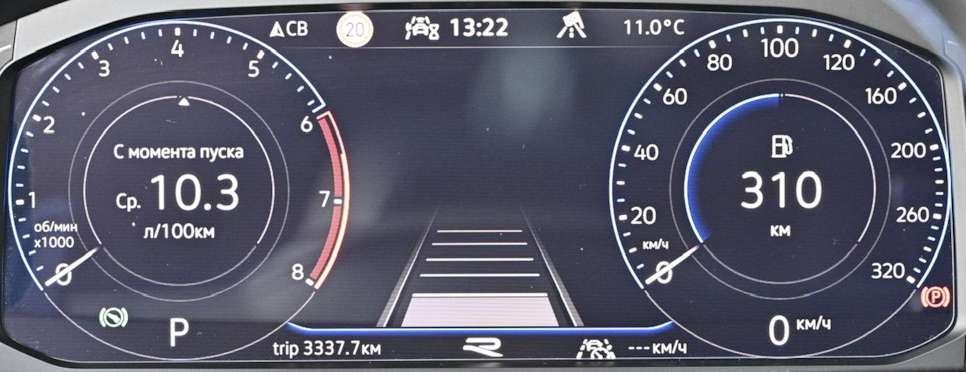
    Variant_7
    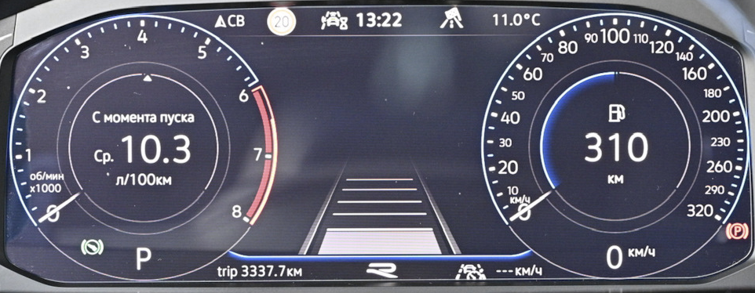
    Variant_8
    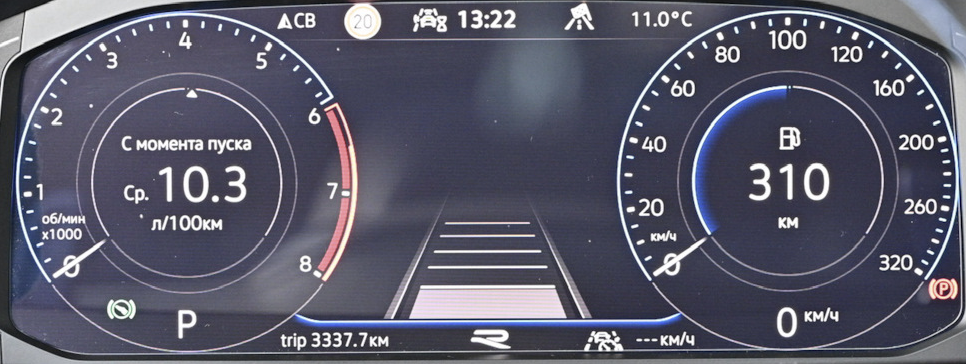    
    Variant_9
    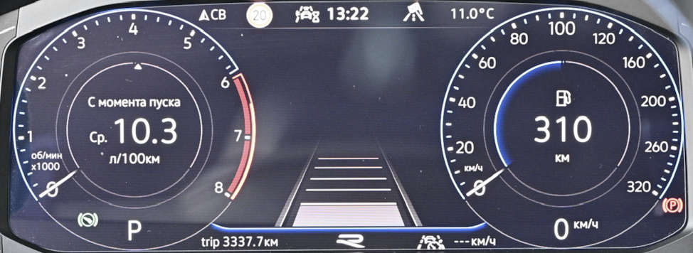  

``` yaml title="Login code: 20103"
Block 17 → Adaptation:
Speedometer_final_value / Tachometer end value: version_4
→ Apply
```


### Changing the animation/display of the central part of the dashboard

!!! info "Installation options"
execution_1 – classic
    execution_3 – dots/carbon theme

``` yaml title="Login code: 20103"
Block 17 → Adaptation:
Display: version_3
→ Apply
```


### R-line logo (for new type 5NA920790D instrument panels)

!!! tip "Possible options"
Without R logo  
    With R logo  
    With R-Line logo  
    R logo from model update 25/19  
    R-Line logo from model update 25/19

``` yaml title="Login code: 20103"
Block 17 → Adaptation:
R_Logo: select the one you need
→ Apply
```


### Adjusting the speedometer readings

!!! tip ""
For each tire size you need to select its own value

=== "Coding in ODIS"
    
``` yaml title="Login code: 20103"
    Block 17 → Coding:
Tire Circumference: Version 3
    → Apply
    ```


  
=== "Coding in VCDS"
    
``` yaml title="Login code: 20103"
    Block 17 Instrument cluster → Coding → Long coding:  
Byte 3 – Bit 0-2: Version 3
    Exit → Save  
    ```


    

### Changing the type of displayed car

!!! warning
does not work if Aesthetic lighting is enabled

### Changing the dashboard skin

=== "Dashboards VW 5NA920790A/B/C, 5NA920791A/B/C"

Themes are set by changing combinations of 2 parameters
    
``` yaml title="Login code: 20103"
    Block 17 → Coding:
    Tube_version: 0..9
    Vehicle variant: 0..9
    → Apply
    ```


    variant 1
    
    
``` yaml title="Login code: 20103"
    Block 17 → Adaptation:
Tube_version: variants 0, 5, 6, 7, 8, 9
    → Apply
    ```


    variant 2
    
    
``` yaml title="Login code: 20103"
    Block 17 → Adaptation:
    Tube_version: variant 1
    → Apply
    ```


    variant 3
    
    
``` yaml title="Login code: 20103"
    Block 17 → Adaptation:
    Tube_version: variant 2
    → Apply
    ```


    variant 4
    
    
``` yaml title="Login code: 20103"
    Block 17 → Adaptation:
    Tube_version: variant 3
    → Apply
    ```


    variant 5
    
    
``` yaml title="Login code: 20103"
    Block 17 → Adaptation: 
    Tube_version: variant 4
    → Apply
    ---
Vehicle variant: variants 2, 4
    → Apply
    ```


    variant 6
    
    
``` yaml title="Login code: 20103"
    Block 17 → Adaptation:
    Tube_version: variant 4
    → Apply
    ---
Vehicle variant: variants 6, 8
    → Apply
    ```


=== "Dashboards VW 5NA920790D"

    
``` yaml title="Login code: 20103"
    Block 17 → Coding:
    Tube_version
    - Skinning: 0..9
    → Apply
    ```


    variant 7
    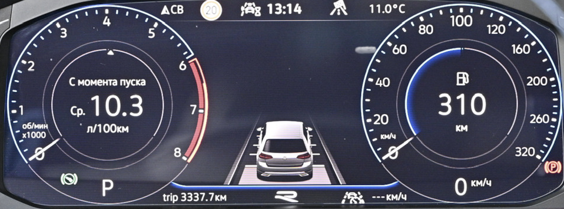  
    variant 8
    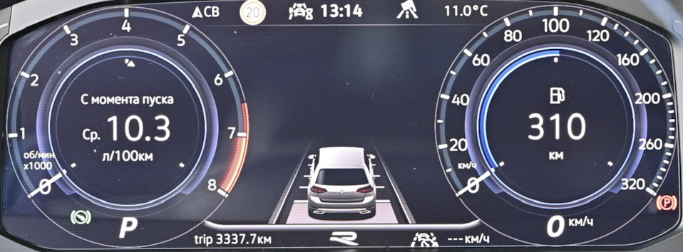  
    variant 9
    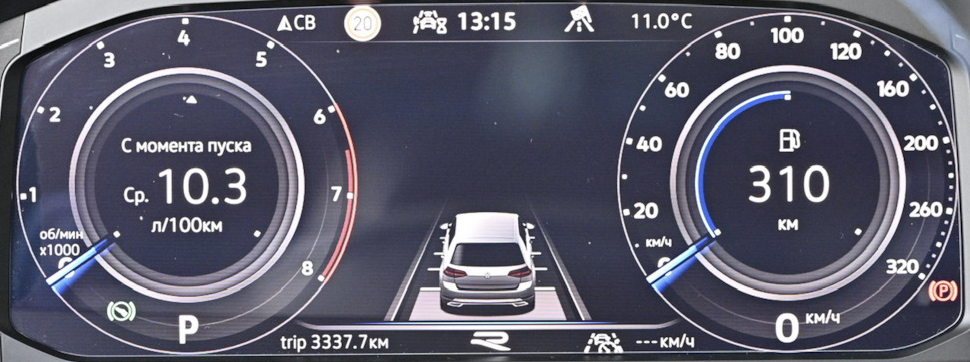  
    variant 3  
    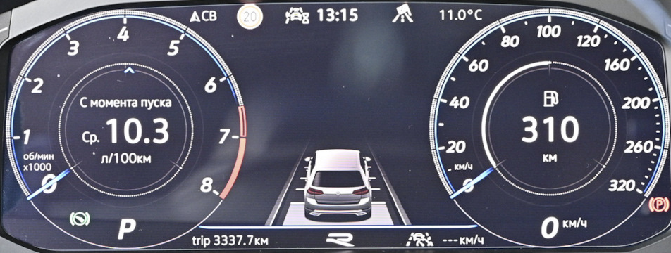  
    variant 4  
    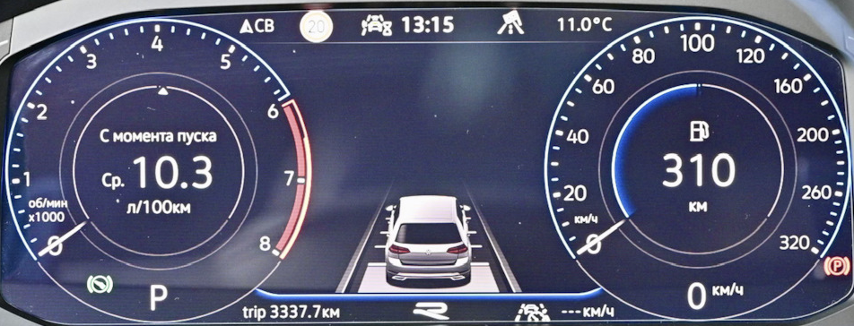  
    variant 5  
    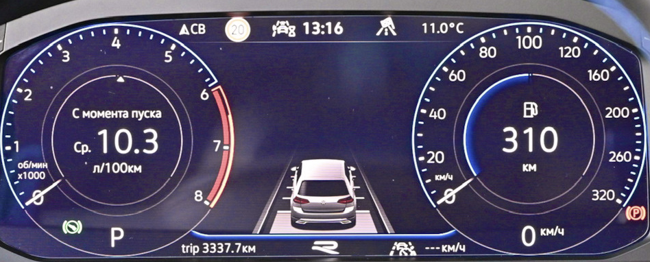  
    variant 6  
    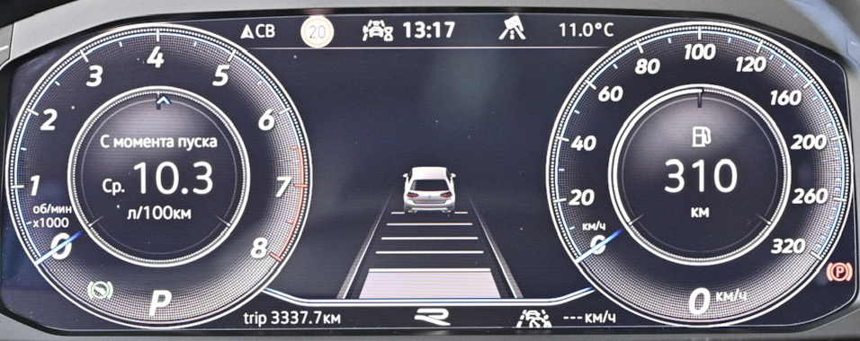  
    variant 7  
    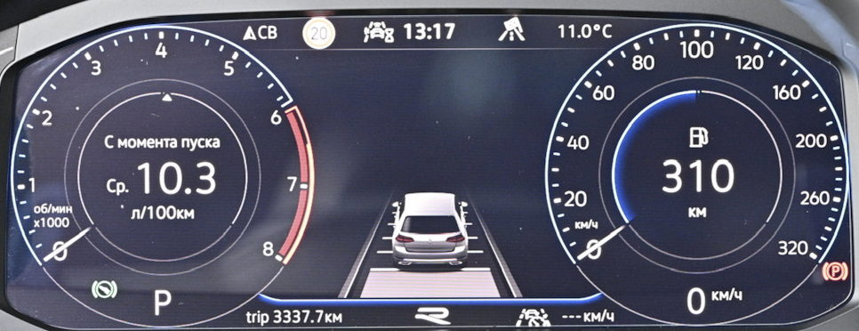  
    variant 8  
    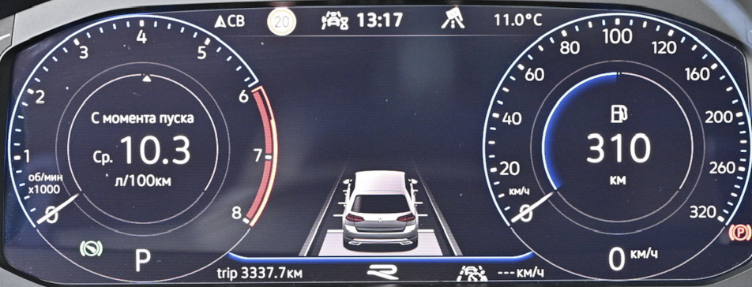  
    variant 9  
    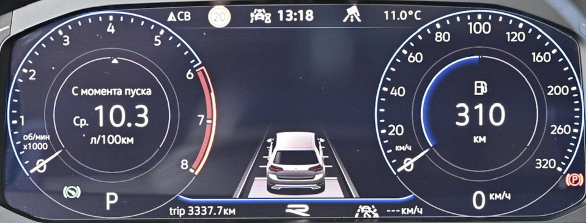

=== "Dashboards Seat"

### Reset Service Interval

``` yaml title="Login code: 20103"
Block 17 → Adaptation:
Resetting extended service interval counters: Reset
→ Apply
```
