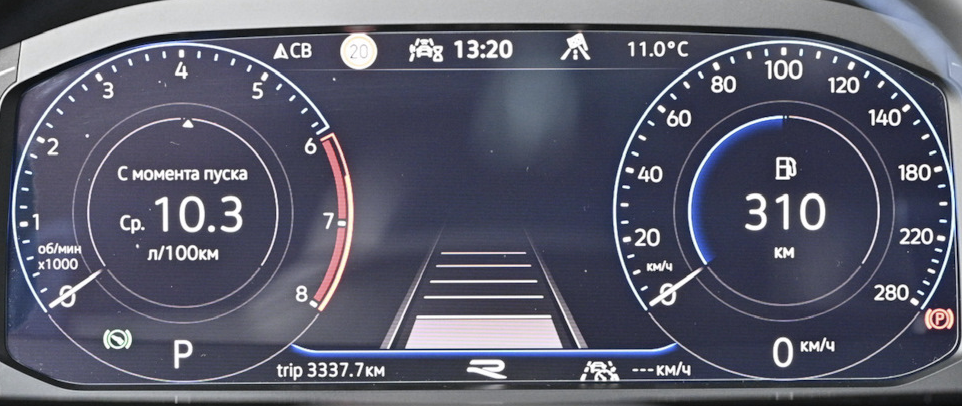
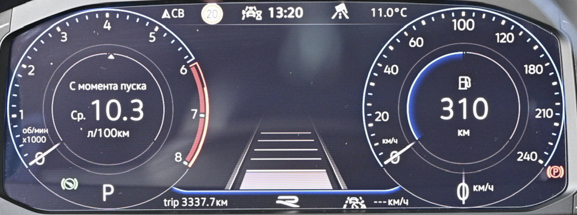
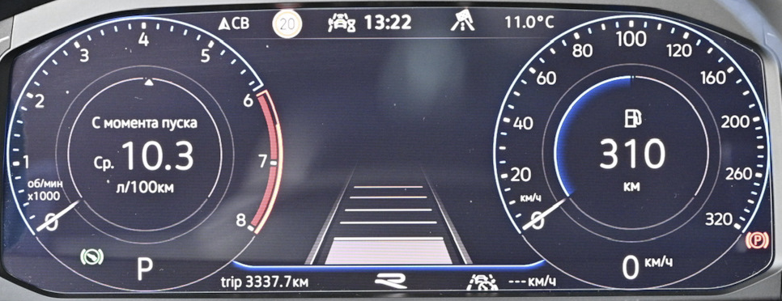
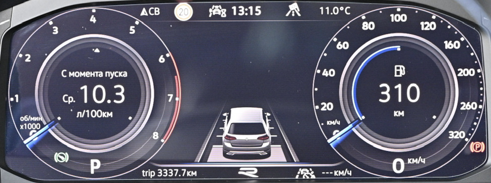
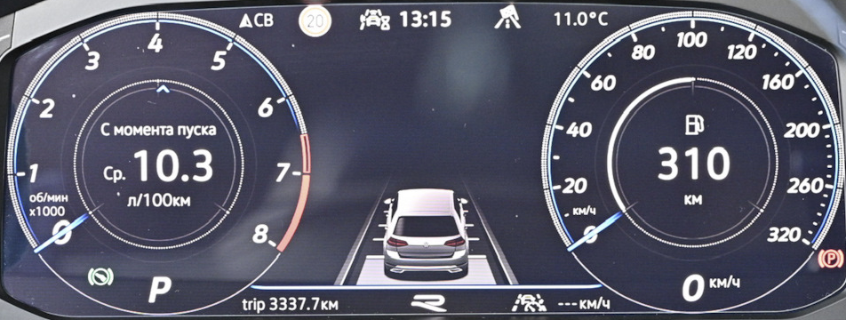
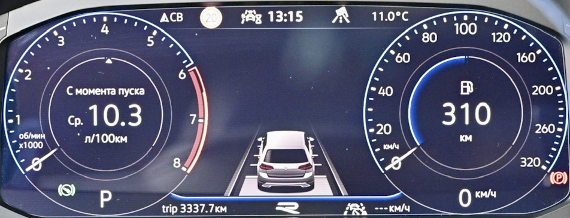
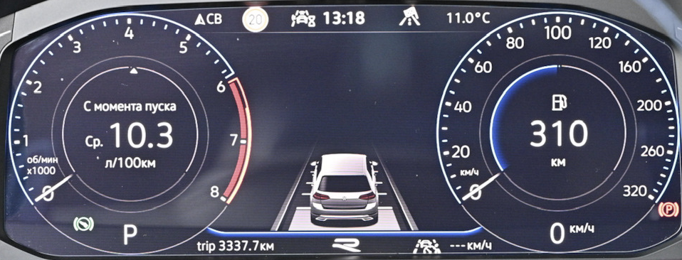

# Настройка приборной панели

### Тест стрелок

!!! info ""
    Работает только для Active Info Display первого типа (5NA920790A/B/C, 5NA920791A/B/C)  
    Приборные панели второго типа (5NA920790D) не поддерживаются

!!! warning ""
    Кодирование выполняется только при включенном зажигании и незапущенном двигателе
  
=== "Кодирование в ODIS"
    ``` yaml title="логин-пароль: 20103"
    Блок 17 → Кодирование:
    Демонстрация: Активировать
    → Применить (с перезагрузкой блока)
    ```

=== "Кодирование в OBD11"
    ``` yaml title="логин-пароль: 20103"
    Блок 17 – Комбинация приборов → Длинное кодирование:
    Демонстрация: да
    ```

=== "Кодирование в VCDS"
    ``` yaml title="логин-пароль: 20103"
    Блок 17 Панель приборов → Кодирование → Длинное кодирование:
    Байт 1 – Бит 0 (Gauge test/ Needle Sweep / Staging): Активировать
    Выход → Сохранить  
    ```
    

### Отключение звукового и визуального предупреждения, если при заведенном автомобиле ключ оказался вне салона
``` yaml
Блок 17 → Кодирование:
Leaving_warning: no
→ Применить (с перезагрузкой блока)
```

### Отображение на приборной панели фото звонящего, обложки альбома, логотипа радиостанции

``` yaml title="логин-пароль: 20103 или 47115"
Блок 17 → Адаптация:
Picture_Upload_Download: Активировать
→ Применить
```
  
### Остаток в баках

!!! warning ""
    Кодирование выполняется только при включенном зажигании и незапущенном двигателе

=== "Кодирование в ODIS"
    ``` yaml title="логин-пароль: 20103"
    Блок 17 → Кодирование:
    Объем, который необходимо заправить: Активировать
    → Применить (с перезагрузкой блока)
    ```
  
=== "Кодирование в OBD11"
    ``` yaml title="логин-пароль: 20103"
    Блок 17 Комбинация приборов → Длинное кодирование:
    Объём, который необходимо заправить: да
    ```
  
=== "Кодирование в VCDS"
    ``` yaml title="логин-пароль: 20103"
    17 Панель приборов → Кодирование → Длинное кодирование:
    Байт 10 – Бит 4 (Volume to be Replenished): Активировать  
    Выход → Сохранить  
    ```
    

!!! tip ""
    Шаг показаний сколько заливать топлива кратен 5 литрам т.е. 5-10-15-20 и т.д  
    (проверено, влезает даже чуть больше чем показывает – показывал 30 свободно, влезло 32 литра)
  
### Таймер круга

!!! warning ""
    Кодирование выполняется только при включенном зажигании и незапущенном двигателе

=== "Кодирование в ODIS"
    ``` yaml title="логин-пароль: 20103"
    Блок 17 → Кодирование:
    Таймер круга: Активировать
    → Применить (с перезагрузкой блока)
    ```

=== "Кодирование в VCDS"
    ``` yaml title="логин-пароль: 20103"
    Блок 17 Панель приборов → Кодирование → Длинное кодирование:
    Байт 1 – Бит 3 (Lap Timer active): Активировать  
    Выход → Сохранить  
    ```
    

### Отображение мгновенного расхода

``` yaml title="логин-пароль: 20103"
Блок 17 → Адаптация:
Instantaneous Consumption Display: Display
→ Применить
```

### Деактивация звукового оповещения о включенном зажигании при открытии двери

``` yaml title="логин-пароль: 20103"
Блок 17 → Адаптация:
Ignition active message; trigger (Сообщение Поджиг активен, пиропатрон): «No display (tbd)»
→ Применить
```

!!! tip
    Есть 3 значения: No display (tbd), Driver door, All doors.  

### Отключение предупреждения о не пристегнутом ремне безопасности

!!! tip ""
    Отключается, чтобы не отвлекало в редких случаях, когда необходимо перемещение на короткие дистанции

``` yaml title="логин-пароль: 20103"
Блок 17 → Адаптация:
Отключение предупреждения о непристегнутом ремне безопасности: да
→ Применить
```
  
### Активация промежуточных значений спидометра

!!! note ""
    Работает только на приборных панелях AID нового образца с 2019 года.  
    В любом варианте 100 км/ч всегда вверху.

??? Variants
    Variant_0
    
    Variant_1
    
    Variant_2
    
    Variant_3
    
    Variant_4
    
    Variant_5
    
    Variant_6
    
    Variant_7
    
    Variant_8
        
    Variant_9
      

``` yaml title="логин-пароль: 20103"
Блок 17 → Адаптация:
Конечное значение спидометра / Speedometer_final_value / Tachometer end value: исполнение_4 (было исполнение_1)
→ Применить
```

### Смена анимации/отображения центральной части приборной панели

!!! info "Варианты установки"
    исполнение_1 – классическое
    исполнение_3 – тема точек/карбона

``` yaml title="логин-пароль: 20103"
Блок 17 → Адаптация:
Отображение на дисплее: исполнение_3 (было исполнение_1)
→ Применить
```

### Логотип R-line (для приборных панелей нового типа 5NA920790D)

!!! tip "Возможные варианты"
    Без логотипа R  
    С логотипом R  
    С логотипом R-Line  
    Логотип R с обновления модели 25/19  
    Логотип R-Line с обновления модели 25/19  

``` yaml title="логин-пароль: 20103"
Блок 17 → Адаптация:
R_Logo: выбрать нужное
→ Применить
```

### Корректировка показаний спидометра

!!! tip ""
    Для каждого размера шин нужно подбирать своё значение

=== "Кодирование в ODIS"
    ``` yaml title="логин-пароль: 20103"
    Блок 17 → Кодирование:
    Длинна окружности колеса / Tire Circumference: Исполнение 3
    → Применить
    ```
  
=== "Кодирование в VCDS"
    ``` yaml title="логин-пароль: 20103"
    Блок 17 Панель приборов → Кодирование → Длинное кодирование:  
    Байт 3 – Бит 0-2: Исполнение 3
    Выход → Сохранить  
    ```
    

### Смена вида отображаемого автомобиля

!!! warning
    не работает, если включена Эстетическая подсветка

### Смена скина приборной панели

=== "Приборные панели VW 5NA920790A/B/C, 5NA920791A/B/C"

    Темы задаются путем изменения комбинаций 2-х параметров
    ``` yaml title="логин-пароль: 20103"
    Блок 17 → Кодирование:
    Tube_version: 0..9
    Vehicle variant: 0..9
    → Применить
    ```

    Вариант 1 – Стандартная схема  
    
    ``` yaml title="логин-пароль: 20103"
    Блок 17 → Адаптация:
    Tube_version: варианты 0, 5, 6, 7, 8, 9
    → Применить
    ```

    Вариант 2 – Стандартная схема c большим количеством точек  
    
    ``` yaml title="логин-пароль: 20103"
    Блок 17 → Адаптация:
    Tube_version: вариант 1
    → Применить
    ```

    Вариант 3 – Alltrack тема  
    
    ``` yaml title="логин-пароль: 20103"
    Блок 17 → Адаптация:
    Tube_version: вариант 2
    → Применить
    ```

    Вариант 4 – GTI / GTD тема  
    
    ``` yaml title="логин-пароль: 20103"
    Блок 17 → Адаптация:
    Tube_version: вариант 3
    → Применить
    ```

    Вариант 5 – R-line тема  
    
    ``` yaml title="логин-пароль: 20103"
    Блок 17 → Адаптация: 
    Tube_version: вариант 4
    → Применить
    ---
    Vehicle variant: варианты 2, 4
    → Применить
    ```

    Вариант 6 – R-line тема со логотипом R-line внизу приборной панели  
    
    ``` yaml title="логин-пароль: 20103"
    Блок 17 → Адаптация:
    Tube_version: вариант 4
    → Применить
    ---
    Vehicle variant: варианты 6, 8
    → Применить
    ```

=== "Приборные панели VW 5NA920790D"

    ``` yaml title="логин-пароль: 20103"
    Блок 17 → Кодирование:
    Tube_version
    - Skinning: 0..9
    → Применить
    ```

    variant 0  
      
    variant 1  
      
    variant 2  
      
    variant 3  
      
    variant 4  
      
    variant 5  
      
    variant 6  
      
    variant 7  
      
    variant 8  
      
    variant 9  
    

=== "Приборные панели Seat"

### Сброс Сервисного Интервала

``` yaml title="логин-пароль: 20103"
Блок 17 → Адаптация:
Сброс счетчиков расширенных интервалов ТО: Сбросить
→ Применить
```
