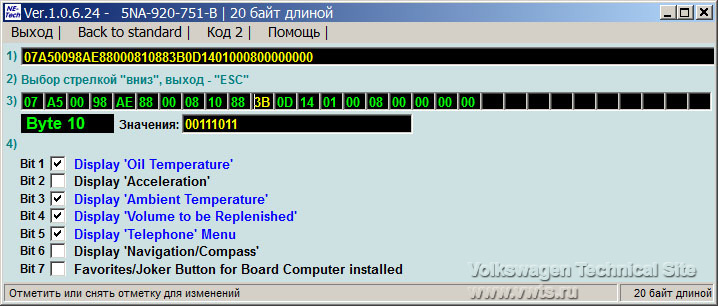
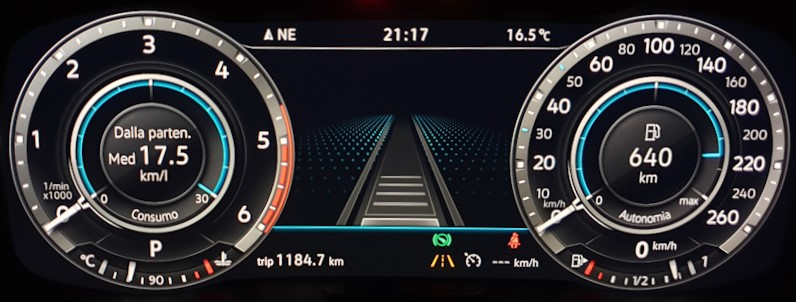

disqus: https-mqb-readthedocs-io
# Настройка приборной панели

### Тест стрелок

!!! info ""
    Работает только для Active Info Display первого типа (5NA920790A/B/C, 5NA920791A/B/C)  
    Приборные панели второго типа (5NA920790D) не поддерживаются

!!! warning ""
    Кодирование выполняется только при включенном зажигании и не запущенном двигателе

```
Блок 17 → Кодирование
> Демонстрация
выбираем «Вкл»
→ Применить (с перезагрузкой блока)
```
```
ODIS E: 006: 0017 → [LN]_scenering → yes
```
	
> логин-пароль 20103
  
??? note "Кодирование в VCDS"
    7 - Панель приборов  
    Кодирование - 07 → Длинное кодирование  
    Байт 1 → Бит 0: (Gauge test/ Needle Sweep / Staging) → ставим галочку  
    Выход  
    Сохранить  
    
  
### Остаток в баках

!!! warning ""
    Кодирование выполняется только при включенном зажигании и не запущенном двигателе

```   
Блок 17 → Кодирование  
> Объем, который необходимо заправить
выбираем «Вкл»
→ Применить (с перезагрузкой блока)
```
```
ODIS E: 006: 0017 -> [IDE04848] Объем, который необходимо заправить -> Да
```
    
> логин-пароль 20103
    
!!! tip ""
    Шаг показаний сколько заливать топлива кратен 5 литрам т.е. 5-10-15-20 и т.д  
    (проверено, влезает даже чуть больше чем показывает - показывал 30 свободно, влезло 32 литра)
    
??? note "Кодирование в VCDS"    
    17 - Панель приборов  
    Кодирование - 07 → Длинное кодирование  
    Байт 10 → Бит 4: Display "Volume to be Replenished" → ставим галочку  
    Выход  
    Сохранить  
    
    
### Таймер круга

!!! warning ""
    Кодирование выполняется только при включенном зажигании и не запущенном двигателе

```
Блок 17 → Кодирование  
> Таймер круга
выбираем «Вкл»
→ Применить (с перезагрузкой блока)
```

> логин-пароль 20103

??? note "Кодирование в VCDS"    
    17 - Панель приборов  
    Кодирование - 07 → Длинное кодирование  
    Байт 1 → Бит 3: Lap Timer active → ставим галочку  
    Выход  
    Сохранить  
     
    
### Отображение мгновенного расхода

```
Блок 17 → Адаптация  
> Instantaneous Consumption Display → Display
→ Применить
```

> логин-пароль 20103

### Деактивация звукового оповещения о включенном зажигании при открытии двери

	Блок 17 → Адаптация
	> Ignition active message; trigger (Сообщение Поджиг активен, пиропатрон)
	выбираем «No display (tbd)»
	→ Применить

> логин-пароль 20103

!!! tip
    Есть 3 значения: No display (tbd), Driver door, All doors.  

### Отключение предупреждения о непристегнутом ремне безопасности

!!! tip ""
    Отключается, чтобы не отвлекало в редких случаях, когда необходимо перемещение на короткие дистанции

```
Блок 17 → Адаптация  
> Отключение предупреждения о непристегнутом ремне безопасности
Старое значение: нет, Новое значение: да
→ Применить
```

> логин-пароль 20103
    
### Активация промежуточных значений спидоментра

!!! note ""
    Работает только на приборных панелях AID нового образца с 2019 года

```
Блок 17 → Адаптация  
> Конечное значение спидометра / Speedometer_final_value / Tachometer end value
Заменить исполнение_1 на исполнение_4
→ Применить
```

> логин-пароль 20103

### Смена анимации/отображения центральной части приборной панели

!!! info "Варианты установки"
    исполнение_1 - классическое
    исполнение_3 - тема точек/карбона

```
Блок 17 → Адаптация  
> Отображение на дисплее
Заменить исполнение_1 на исполнение_3
→ Применить
```

> логин-пароль 20103

### Корректировка показаний спидометра

!!! tip ""
    Для каждого размера шин нужно подбирать своё значение

```
Блок 17 → Кодирование  
> Длинна окружности колеса
Выбрать "Исполнение 3"
→ Применить
```

> логин-пароль 20103

??? note "Кодирование в VCDS"    
    17 - Панель приборов  
    Кодирование - 07 → Длинное кодирование  
    Байт 3 → Бит 0-2: Исполнение 3
    Выход  
    Сохранить  
    

### Смена вида отображаемого автомобиля

!!! warning
    не работает, если включена Эстетическая подсветка

```
Блок 17 → Кодирование  
> Vehicle variant - варианты 2, 4, 6, 8
→ Применить
```

> логин-пароль 20103

### Смена скина приборной панели

Вариант 1 - Стандартная схема

```
Блок 17 → Адаптация  
> Tube_version - варианты 0, 5, 6, 7, 8, 9
→ Применить
```

Вариант 2 - Стандартная схема c большим количеством точек

```
Блок 17 → Адаптация  
> Tube_version - вариант 1
→ Применить
```

Вариант 3 - Alltrack тема

```
Блок 17 → Адаптация  
> Tube_version - вариант 2
→ Применить
```

Вариант 4 - GTI / GTD тема

```
Блок 17 → Адаптация  
> Tube_version - вариант 3
→ Применить
```

Вариант 5 - R-line тема

```
Блок 17 → Адаптация  
> Tube_version - вариант 4
→ Применить
Блок 17 → Кодирование  
> Vehicle variant - варианты 2, 4
→ Применить
```

Вариант 6 - R-line тема со логотипом R-line внизу приборной панели

```
Блок 17 → Адаптация  
> Tube_version - вариант 4
→ Применить
Блок 17 → Кодирование  
> Vehicle variant - варианты 6, 8
→ Применить
```

> логин-пароль 20103

### Сброс Сервисного Интервала

```
Блок 17 → Адаптация  
> Сброс счетчиков расширенных интервалов ТО - Сбросить
→ Применить
```

> логин-пароль 20103
