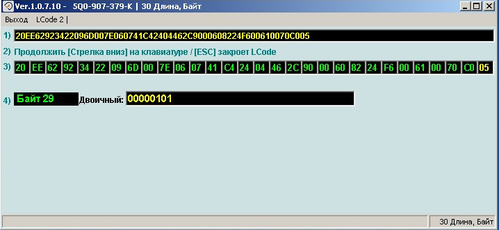
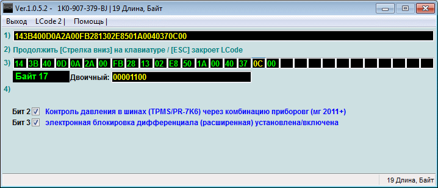

# Active driving assistance systems

### Setting up BDW (Brake Disc Wiper)

``` yaml title="Login code: 40304"
Block 3-ABS/ESP → Adaptation:
Disk drying:
- Default: default stands weak
- New value: strong
→ Apply
```


### Setting ASR (Starting vibration reduction)

!!! tip ""
Normal (less traction reduction)  
    Strong (default)  
    Maximum (for those who don’t want to wear out the tires, but the system is strangling the engine)
  
``` yaml title="Login code: 20103"
Block 3-ABS/ESP → Adaptation:
Starting vibration reduction: enter the required level value
→ Apply
```


### TSC (Traction Control System / Side Slip Compensation)

In the event of sudden acceleration, compensation for the vehicle's pull to the right will be automatically made.  

!!! tip
    The following values are possible:  
    - inactive  
    - with learned Value active / with adaptation value (2 bits)  
    - without learned Value active (3 bits)

=== "Coding in ODIS"
    
``` yaml title="Login code: 19249"
    Block 44  → Coding:
torque_steer_function: desired value
    → Apply
    ```


=== "Coding in VCDS"  
    
``` yaml title="Login code: 19249"
    Block 44 Steering assist → Coding → Long coding:
    Byte 0 – Activate value
    Exit → Save
    ```


### Hill Hold Control (HHC)

!!! note ""
HHC keeps the car on a downhill or uphill slope and prevents it from rolling away until the driver presses the gas pedal.

``` yaml
Block 3-ABS/ESP → Coding → Long coding:
Byte 25 – Bit 0: Activate
```


!!! note "Adaptation Values"
    There are 3 levels of HHC: early, normal, late
  
``` yaml title="Login code: 20103"
Block 3-ABS/ESP → Adaptation:
HHC (Berganfahrassistent, Hill_hold_assist_control): earlier (early)
→ Apply
```


!!! warning ""
    If after activation your ABS error does not disappear, then your unit does not support HHC.

### Disabling ESC via menu

!!! warning
On 2016-17 cars, it is possible to install 31-byte ABS blocks.  
    There is one last byte in it, usually the value 03 is there - you don’t need to touch it!
  
!!! tip
    The following values are possible:  
    01 = ESC & ASR On  
    02 = ESC & ASR On/Off  
    03 = ESC & ASR On + ESC SPORT  
    04 = ESC & ASR On + ESC Off  
    05 = ESC On/Off + ASR Off  
    06 = ESC On/Off + ESC Sport  
    07 = ESC On/Off + ASR Off  
    08 = ESC On/Off + ESC Sport  
    09 = ESC On + ASR Off + ESC Sport

=== "Coding in ODIS"
    
``` yaml title="Login code: 20103"
    Block 3-ABS/ESP → Coding:
Byte 29 – replace with “05”
    → Apply
    ```


  
    To prevent ESP from turning back on at speeds above 100 km/h:
    
``` yaml title="Login code: 20103"
    Block 3-ABS/ESP → Adaptation:
    ESP activation depending on speed (Electronic stabilitin program): Deactivate
    → Apply
    ```


=== "Coding in VCDS"  
    
``` yaml title="Login code: 20103"
    01 — ABS/ESP → Coding → Long coding:
Byte 29: replace with “05”
    Exit → Save
    ```

 
    

### Setting XDS (braking the inside wheel to turn into turns)

!!! tip
I set it to max and tried it in comparison with strong, it felt like the braking of the inner (in a turn) wheel in strong occurs at a higher speed and with a greater steering turn than in maximum mode.  
    The turning radius is definitely smaller at maximum.
  
=== "Coding in ODIS"
    
``` yaml title="Login code: 20103"
    Block 03 → Coding:
    Byte 17 – Bit 3: Activate
    ```


=== "Coding in VCDS" 
    
``` yaml title="Login code: 20103"
    03 Block ABS → Coding → Long coding:  
    Byte 17 – Bit 3 ): Activate
    Exit → Save
    ```

 
    

### Adaptation BAS (Brake Assist System)

Emergency braking system is an electronic pressure control system in the hydraulic brake system, which, if emergency braking is necessary and there is insufficient force on the brake pedal, independently increases the pressure in the brake line.

``` yaml title="Login code: 20103"
Block 03  → Adaptation:
brake assist: 
→ Apply
```


### Activate CBC (Corner Brake Control)

!!! note ""
The system is most often already active. Part of ABS, ESP or other safety system  
  
The corner braking stabilization system - CBC (Corner Brake Control), is activated when braking in a corner in such a way as to create a corrective turning “counter-torque” using the braking force, thereby correcting the manifestation of “yaw” when braking in a corner.

``` yaml
Block 03  → Coding:
Byte 15 – 4 bits: Activate
→ Apply
```
