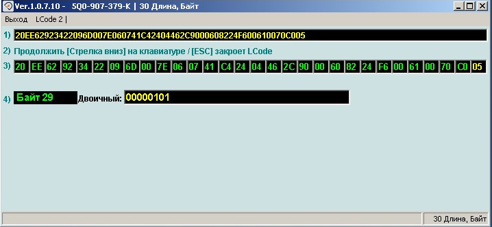

disqus: https-mqb-readthedocs-io
# Активные системы помощи при вождении

## Адаптивный круиз контроль

### Разрешить обгон/опережение справа для Адаптивного Круиз Контроля (АСС)

!!! tip ""
    По умолчанию система ACC тормозит автомобиль, если на полосе слева едет медленный автомобиль (даже при пустой дороге).

=== "Кодирование в ODIS"
    ```
    Control Unit 13 (Adaptive Cruise Control) → Adaptation 
    > Overtaking_right_prevention (Vermeidung für unzulässigen Überholvorgang)
    > Установить Deactivated [Default: Activated]
    → Применить
    ```
=== "Кодирование в OBD11"
    ```
    Блок 13 (Адаптивный круиз контроль) → Безопасный доступ → Логин-пароль 20103
    > Длинное кодирование
    > Overtaking_right_prevention → Установить Deactivated [Default: Activated]
    → Применить
    ```
=== "Кодирование в VCDS" 
    ```
    13 Блок Adaptive Cruise Control  
    2 Байт → 5 Бит: Overtaking_right_prevention - выключить  
    Выход   
    Сохранить
    ```   
    

> логин-пароль 20103
   
### Активация выбора режима работы Адаптивного Круиз Контроля (АСС), независимо от выбранного Профиля езды

=== "Кодирование в ODIS"
    ```
    Блок 13 → Кодирование
    > Drive_pmode_selection - Меню MMI Адаптивный круиз контроль (ACC)
    → Применить
    ```
=== "Кодирование в VCDS" 
    ```
    13 Блок Adaptive Cruise Control  
    Кодирование - 07 → Длинное кодирование  
    Байт 3 → бит 7: Drive_pmode_selection, 0=MMI menu ACC / 1=Driving profile selection → снимаем галочку  
    Выход    
    Сохранить
    ``` 
    

> логин-пароль 20103 

### Увеличение времени ожидания трогания Адаптивного Круиз Контроля (АСС)

По умолчанию система Stop & Go после полной остановки активна только 3 секунды. По истечении этого времени продолжить движение можно только кнопкой на руке, либо педалью акселератора.  

Снять эо ограничение невозможно, однако на последних версиях прошивки можно увеличить временной интервал до 10 секунд.  

Требования к прошивкам:  
```
3QF907561, 5Q0907561 - SW 0780, H10-H11  
2Q0907561, 2Q0907572 - SW 0383, H01-H04
```

```
Блок 13 → Кодирование  
> Байт 11 - бит 0: Pretriggertime_reduction - деактивировать  
→ Применить
```

## Активная безопасность

### Настройка BDW (Brake Disc Wiper / Просушка дисков)

    Блок 3-ABS/ESP → Адаптация
	> Disk drying
	> По умолчанию: по умолч. стоит слабо (weak)
	> Новое значение: сильно (strong)
	→ Применить
	
> логин-пароль: 40304

### Настройка ASR (Starting vibration reduction / Уменьшение колебания при трогании)

!!! tip ""
    Normal (меньше режет тягу)  
    Strong (по умолчанию)  
    Maximum (для тех кто не хочет стирать резину, но система душит движок)  
    
```
Блок 3-ABS/ESP → Адаптация →  
> Уменьшение колебания при трогании / Starting vibration reduction → вводим нужное значение уровня
→ Применить
```

> логин-пароль: 20103

### TSC (Traction Control System / Компенсация увода вбок)

!!! tip ""
     В случае резкого разгона автоматически будет произведена компенсация увода автомобиля вправо.

```
Блок 44 (Усилитель рулевого управления) → Кодирование
> Выбор активного профиля вождения
Выбираем "активировать"
→ Применить
```

> логин-пароль: 19249

### Ассистент удержания на спуске или подъеме Hill Hold Control (HHC)

!!! note ""
    HHC удерживает автомобиль на спуске или подъеме и предотвращает его самопроизвольное скатывание, пока водитель не нажмет педаль газа.

```
Блок 3-ABS/ESP → Кодирование → длинное кодирование → 
> Байт 25 → 0 бит → активировать
```

!!! note "Значения адаптации"
    Есть 3 уровня HHC: early, normal, late
    
```
Блок 3-ABS/ESP → Адаптация →  
> HHC (Berganfahrassistent, Hill_hold_assist_control) → ранее (early)
→ Применить
```

> логин-пароль: 20103

!!! warning ""
    Если после активации у Вас не пропадает ошибка по ABS, значит Ваш блок не поддерживает HHC.

### Отключение ESC через меню

!!! warning
    На машинах 2016-17г возможна установка 31-байтных блоков ABS.  
    В нем есть еще 1 последний байт, обычно там стоит значение 03 - его трогать не надо!
    
!!! tip
    Возможны следующие значения:  
    01 = ESC & ASR On  
    02 = ESC & ASR On/Off  
    03 = ESC & ASR On + ESC SPORT  
    04 = ESC & ASR On + ESC Off  
    05 —ESC On/Off + ASR Off  
    06 —ESC On/Off + ESC Sport  
    07 —ESC On/Off + ASR Off  
    08 —ESC On/Off + ESC Sport  
    09 —ESC On + ASR Off + ESC Sport  

=== "Кодирование в ODIS"
    ```
    Блок 3-ABS/ESP → Кодирование
    > Байт 29 → заменить на «05» (даёт меню ESC ВКЛ, ASR выкл, ESC выкл.) 
    → Применить
    ```
    
    Чтобы, ESP не включалась обратно при скорости выше 100км/ч: 
    ```
    Блок 3-ABS/ESP → Адаптация → 
    > ESP activation depending on speed (Electronic stabilitin program) → деактивировать
    → Применить
    ```

=== "Кодирование в VCDS"    
    ```
    01 — ABS/ESP  
    Кодирование - 07 → Длинное кодирование  
    Байт 29 → заменить на «05» (даёт меню ESC ВКЛ, ASR выкл, ESC выкл.)  
    Выход   
    Сохранить
    ```   
    
       
> логин-пароль: 20103

### Настройка XDS (притормаживание внутреннего колеса для ввинчивания в поворот)

!!! tip
    Поставил на max и попробовал в сравнении с strong, по ощущениям притормаживание внутреннего (в повороте) колеса в strong происходит на большей скорости и с большим выворотом руля чем в режиме maximum.  
    Радиус поворота однозначно меньше при maximum.  
    
=== "Кодирование в ODIS"
    ```
    Блок 03 → Кодирование
    > 17 байт - поставить галочку в 3-м бите 17 байта
    ```
=== "Кодирование в VCDS" 
    ```
    03 Блок ABS  
    Кодирование - 07 → Длинное кодирование  
    Байт 17 → Бит 3: Электронная блокировка дифференциала (расширенная) → ставим галочку   
    Выход  
    Сохранить
    ``` 
    
    
> логин-пароль: 20103

### Адаптация BAS (Brake Assist System /  Система экстренного торможения)
Система экстренного торможения — электронная система управления давлением в гидравлической системе тормозов, которая в случае необходимости экстренного торможения и недостаточного при этом усилия на педали тормоза самостоятельно повышает давление в тормозной магистрали.  

```
Блок 03 (АБС) → адаптация 
> brake assist → (0-среднее, 1-низкое, 2-высокое)
→ Применить
```

> логин-пароль: 20103

### Активация CBC (Corner Brake Control / Система стабилизации торможения при повороте)

!!! note ""
    Система чаще всего уже активна. Является частью ABS, ESP или другой системы безопасности    
    
Система стабилизации торможения при повороте — CBC (Corner Brake Control), срабатывает при торможении в повороте таким образом, чтобы тормозным усилием создать корректирующий разворачивающий «противомомент», тем самым корректирует проявление «рыскания» при торможении в повороте.  

```
Блок 03 (АБС) → кодирование → 
> 15 Байт → 4 бит → включить
→ Применить
```