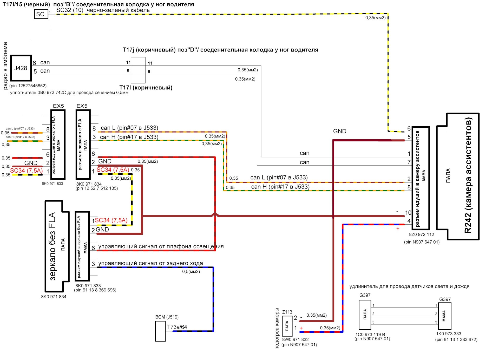
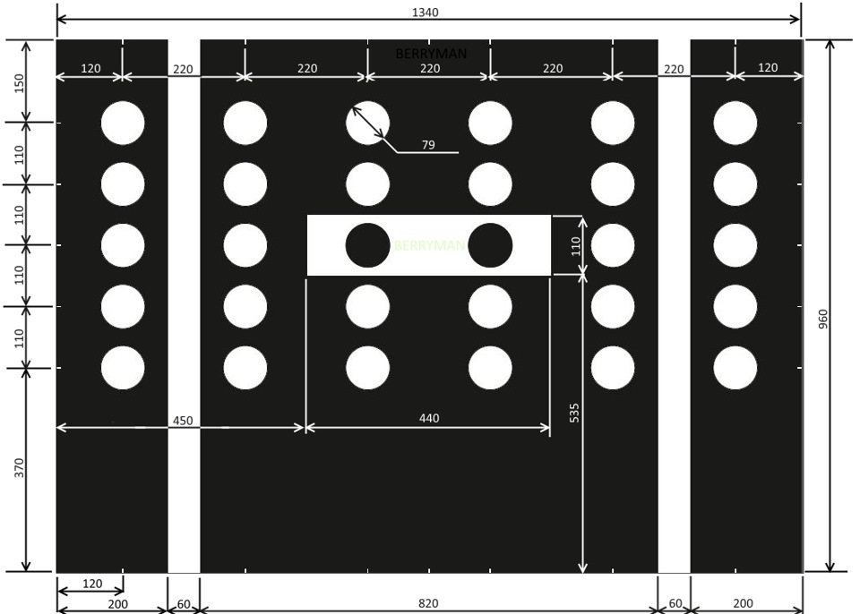
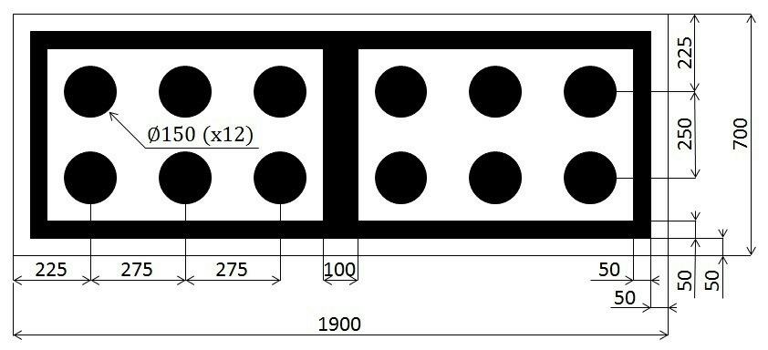
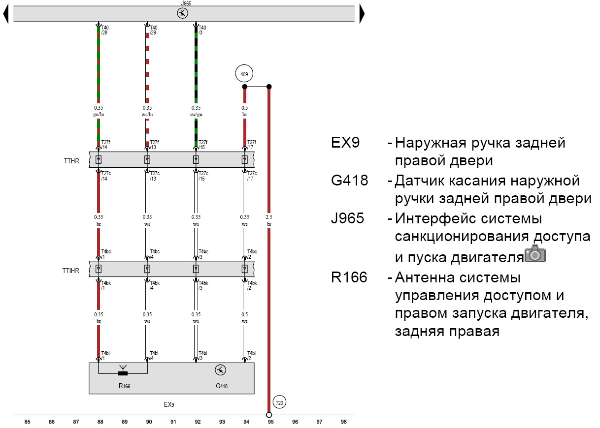
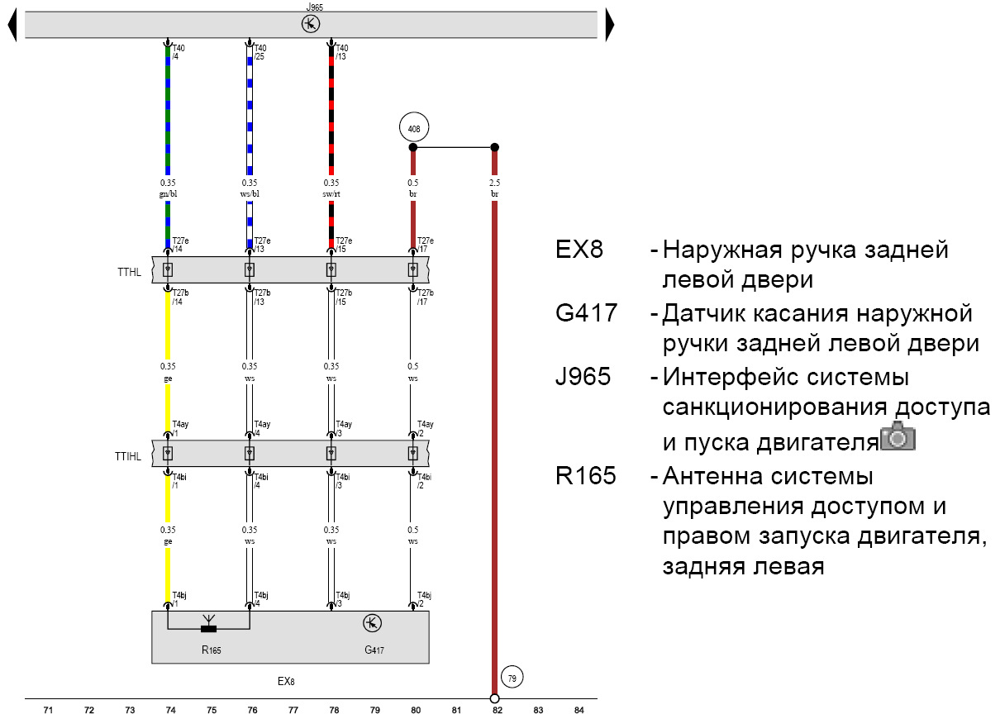
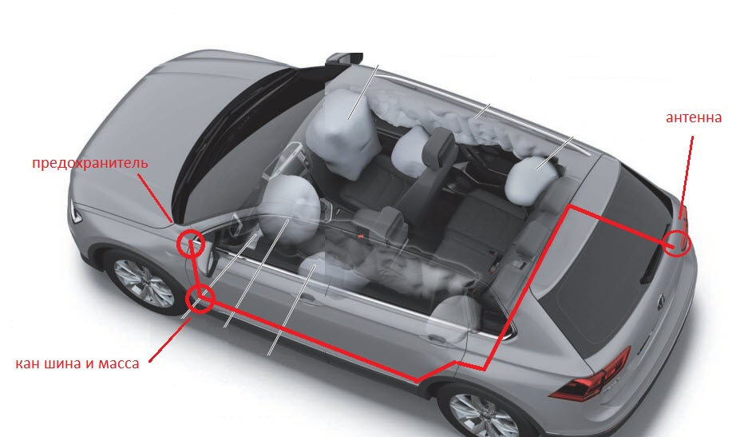
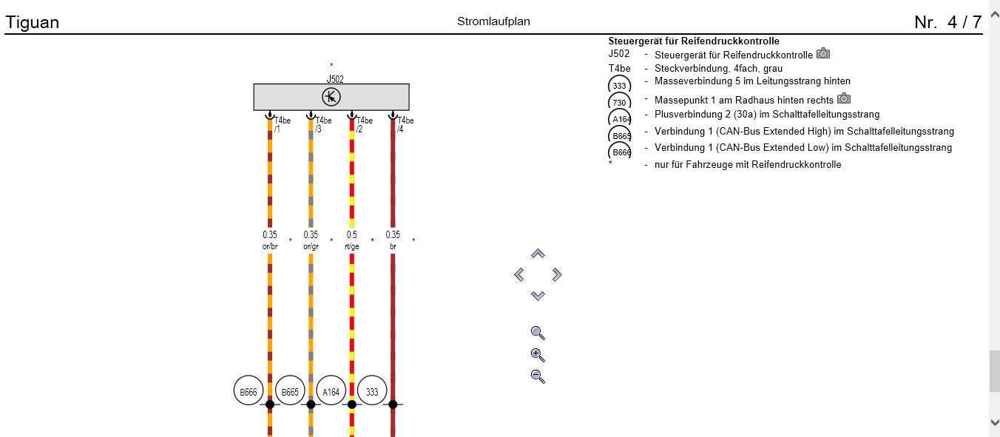
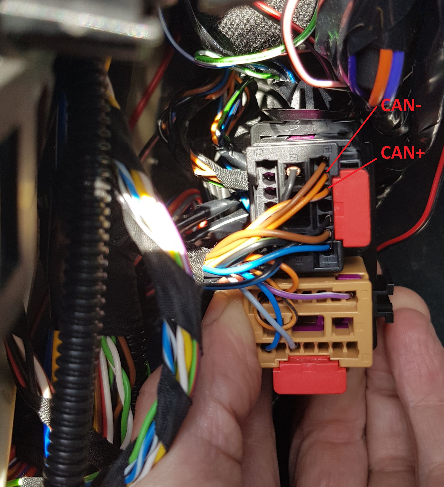

# Retrofitting

### Assistant camera

Equipment:  
Connection diagram:  
1 pin camera A5 (R242) -→ 6 pin ACC radar (J428)  
7 pin camera A5 (R242) -→ 5 pin ACC radar (J428)  
6 pin - "+"  
5 pin - "-"  

2 pin – Can extended low – 8 pin in the mirror connector  
8 pin – Can extended high – 3 pin in the mirror connector  
4 pin - positive wire of the camera heater  
10 pin - negative wire of the camera heater  
Scheme  
Calibration layout  
[(Camera coding)](3Q0_assistants)
[(Camera calibration)](3Q0_calibration)
1. Assistant camera
  
2. Casing
  

3. Frameless mirror without FLA
  

4. Housing for mounting the mirror
5. Wiring

### Climate touch panel

``` yaml
Block 08 → Coding:
Climate_style → display on Anzeige Front und Heck
→ Apply (with block reboot)
```


``` yaml
Block 08 → Adaptation:
Detection_time_tap:
- par_Detection_time_tap: 600 ms
Detection_time_hold:
- par_Detection_time_hold: 600 ms
Off_time_neighbor_key_during_sliding:
- par_Off_time_neighbor_key_during_sliding: 400 ms
Sensitivity_touch:
- par_Sensitivity_touch: 0
Steps_temp_slider:
- par_Steps_temp_slider: 8
Step_size_temp_slider:
- par_Step_size_temp_slider: 0.5°C
22_degree_jump_temp_slider:
- par_22_degree_jump_temp_slider: not_active
Flick_function_temp_slider:
- par_Flick_function_temp_slider: not_active
Profile_selection_touch:
- par_Profile_selection_touch: 0
dimming_characteristic_new_1:
- X1: 0
- Y1: 16
- X2: 10
- Y2: 16
- X3: 50
- Y3: 60
- X4: 100
- Y4: 125
- X5: 150
- Y5: 500
- X6: 253
- Y6: 1,000
dimming_characteristic_new_2:
- X1: 0
- Y1: 0
- X2: 10
- Y2: 100
- X3: 25
- Y3: 250
- X4: 50
- Y4: 500
- X5: 75
- Y5: 750
- X6: 100
- Y6: 1,000
dimming_characteristic_new_3:
- X1: 0
- Y1: 6
- X2: 10
- Y2: 6
- X3: 50
- Y3: 12
- X4: 100
- Y4: 25
- X5: 150
- Y5: 100
- X6: 253
- Y6: 300
dimming_characteristic_new_4:
- X1: 0
- Y1: 20
- X2: 10
- Y2: 20
- X3: 50
- Y3: 60
- X4: 100
- Y4: 120
- X5: 150
- Y5: 800
- X6: 253
- Y6: 1,000
dimming_characteristic_new_5:
- X1: 0
- Y1: 10
- X2: 10
- Y2: 10
- X3: 50
- Y3: 50
- X4: 100
- Y4: 100
- X5: 150
- Y5: 1,000
- X6: 253
- Y6: 1,000
dimming_characteristic_new_6:
- X1: 0
- Y1: 4
- X2: 10
- Y2: 4
- X3: 50
- Y3: 15
- X4: 100
- Y4: 30
- X5: 150
- Y5: 600
- X6: 253
- Y6: 1,000
dimming_characteristic_new_7:
- X1: 0
- Y1: 20
- X2: 10
- Y2: 20
- X3: 50
- Y3: 50
- X4: 100
- Y4: 100
- X5: 150
- Y5: 800
- X6: 253
- Y6: 1,000
dimming_characteristic_new_8:
- X1: 0
- Y1: 8 
- X2: 10
- Y2: 8 
- X3: 50
- Y3: 20 
- X4: 100
- Y4: 25 
- X5: 150
- Y5: 600 
- X6: 253
- Y6: 1,000 
dimming_characteristic_new_9:
- X1: 0
- Y1: 14 
- X2: 10
- Y2: 14 
- X3: 50
- Y3: 32 
- X4: 100
- Y4: 41 
- X5: 150
- Y5: 800 
- X6: 253
- Y6: 1,000 
dimming_characteristic_new_10:
- X1: 0
- Y1: 10 
- X2: 10
- Y2: 10 
- X3: 50
- Y3: 25 
- X4: 100
- Y4: 50 
- X5: 150
- Y5: 800 
- X6: 253
- Y6: 1,000 
damping_dimming_characteristic_01:
- PWM_Daempfung_Aufdimmen: 0.2 s
- PWM_Daempfung_Abdimmen: 0.1 s
damping_dimming_characteristic_02:
- PWM_Daempfung_Aufdimmen: 0.2 s
- PWM_Daempfung_Abdimmen: 0.1 s
damping_dimming_characteristic_03:
- PWM_Daempfung_Aufdimmen: 0.2 s
- PWM_Daempfung_Abdimmen: 0.1 s
damping_dimming_characteristic_04:
- PWM_Daempfung_Aufdimmen: 0.2 s
- PWM_Daempfung_Abdimmen: 0.1 s
Sun_sensor_supplier_differentiation:
- par_Sun_sensor_supplier_differentiation: none
→ Apply
```


### Humidity sensor

Sensor 3Q0907643 is installed instead of the standard dirty air sensor

``` yaml
Block 08 → Coding:
Byte 9 – Bit 4-5 : Activate
Reduction of window misting outside at high humidity: Matching glass temperature model
→ Apply (with block reboot)
```


``` yaml
Block 08 → Adaptation:
Reduction of window misting outside at high humitity:
- param_Reduction_of_window_misting_outside_at_high_humitity: Matching coding
→ Apply
```


### DYNAUDIO

``` yaml
Block 19 → Adaptation:
Installation list – specified installations:
- Sound System: Not coded
- Digital Sound System Control Module: Yes
GW_Enable_CAN_Timeout_DTC:
- Sound System: Enabled
→ Apply
```


``` yaml
Block 5F → Coding:
byte_4_Channel_1_HT: not_installed
byte_4_Channel_1_TT: not_installed
byte_4_Channel_2_HT: not_installed
byte_4_Channel_2_TT: not_installed
byte_4_Channel_3_HT: not_installed
byte_4_Channel_3_TT: not_installed
byte_4_Channel_4_HT: not_installed
byte_4_Channel_4_TT: not_installed
byte_5_Channel_5_HT: not_installed
byte_5_Channel_5_TT: not_installed
byte_5_Channel_6_HT: not_installed
byte_5_Channel_6_TT: not_installed
byte_5_Channel_7_HT: not_installed
byte_5_Channel_7_TT: not_installed
byte_5_Channel_8_HT: not_installed
byte_5_Channel_8_TT: not_installed
byte_6_Channel_9_HT: not_installed
byte_6_Channel_9_TT: not_installed
byte_6_Channel_10_HT: not_installed
byte_6_Channel_10_TT: not_installed
byte_6_Channel_11_HT: not_installed
byte_6_Channel_11_TT: not_installed
byte_6_Channel_12_HT: not_installed
byte_6_Channel_12_TT: not_installed
byte_7_Channel_13_HT: not_installed
byte_7_Channel_13_TT: not_installed
byte_7_Channel_14_HT: not_installed
byte_7_Channel_14_TT: not_installed
byte_7_Channel_15_HT: not_installed
byte_7_Channel_15_TT: not_installed
byte_7_Channel_16_HT: not_installed
byte_7_Channel_16_TT: not_installed
byte_11_Sound_System: Sound_System_external_MOST
→ Apply (with block reboot)
```


``` yaml title="Login code: 20103"
Block 5F → Adaptation:
Sound System: yes
Startup_screen_sticker_HMI: 2
Car_Function_List_BAP_Gen2:
- Amplifier_0x2D: not activated
- Amplifier_0x2D_msg_bus: Databus Infotainment
→ Apply
```


### [PR-KA1] Rear view camera

??? note "Connecting Wires" 
    - The “braid”/screen of the video cable from the camera must be connected to pin number 12 - black wire  
    - To pin number 6 - the central core of the same cable - white wire  
    - Orange-violet - to orange-violet Quadlock - gray connector 6 pin  
    - Orange-brown - to orange-brown Quadlock - gray connector 12 pin  
    BE SURE TO CLOSE THE TRUNK WHEN CHECKING!
    If the camera is not calibrated, an error will appear - there are no basic parameters.
    You can also connect a Chinese camera to the GU without support for trajectories. But in this case it will be necessary to correct a number of encodings:
1. Plus terminal 30 is taken from the Quadlock connector red or red-yellow thick
    2. Ground is taken from the Quadlock connector, brown thick

``` yaml
Block 19 → Installation list:
6C : installed
→ Apply
```


    3. Kan bus infotainment - Signal from camera
``` yaml title="Login code: 20103"
Block 5F → Coding:
Byte 19 – Bit 4 (byte_19_Rear_View_Low): Deactivate
→ Apply
```


``` yaml title="Login code: 20103"
Block 5F → Adaptation:
Car_Function_List_BAP_Gen2:
- VPS_0x0B: Activate
- VPS_0x0B_msg_bus: Replace Databus with Infotainment
→ Apply
```


    4. These are the outermost pins for the blue connector.
``` yaml
Block 76 → Coding:
Byte 2 – Bit 4-5 (10 – Camera Type: Rear View Camera (RVC)): Activate
→ Apply (with block reboot)
```


!!! note ""
    If the camera is not calibrated, an error will appear - there are no basic parameters.

!!! warning "Installing a Chinese camera"
    You can also connect a Chinese camera to the GU without support for trajectories. But in this case it will be necessary to correct a number of encodings:
    
``` yaml
    Block 5F → Coding:
    Byte 19 – Bit 4 (byte_19_Rear_View_Low): Activate
    → Apply
    ```


    
``` yaml
    Block 5F → Adaptation:
    Car_Function_List_BAP_Gen2 
    - VPS_0x0B: Deactivate
    → Apply
    ```


Calibration layout


### Kessy rear handles

Equipment:  
— handles 510837205G 510837206G  
— wiring from the Tiguan assembly from the front doors  
- connector to the mating part of the wiring  
— pins for door connectors, 6 pieces each 12527545852 and 12527512135  
— pins to the kessy block 6 pieces N90764701  

Right door connection diagram:  
  

Left door connection diagram:  
  

Wiring principle:  
Steps:
1. There are 4 wires from the handles - 3 to the kessy block, 1 to ground.
2. 3 wires from the handles must be pulled through the rubber coupling in the casing.
3. Next, the wires go through the corrugation to the door connector.

4. From the connector the wires go to the kessy block.
1. Disassemble the doors (remove the trim), dismantle the old ones and install new handles according to the instructions from ELSA, pull the wire out from the “wet” part of the door, laying it so that it does not catch on the glass when lowering.
2. Pull 3 wires from the finished wiring from the handles to the door connector, tie the ground to the ground on the door blocks, wind everything up with the factory braid and pin the connectors between the door and the pillar; for this you need to partially dismantle the wiring from the door.
3. We push the wires into the rear door connectors.
4. We push the handles into the connectors of the racks.
5. Along the threshold and along the wiring harness for the footwell lighting, we lay wires from the door pillar to the Kessy block and push the block according to the instructions.

``` yaml
Block B7 → Coding:
Byte 0 – Bit 2 : Activate
Byte 0 – Bit 3 : Activate
Byte 1 – Bit 2 : Deactivate
Byte 1 – Bit 3 : Deactivate
→ Apply
```


### [PR-7Y1,7Y5] Side Assist - blind spot monitoring system

!!! note ""
There are 2 types of radars. Since 2020, radars have been supplied that do not require removal of component protection and calibration

Parameters:

| Equipment ID | Firmware |                      Parameter<br/>(ODIS XML) |
|-------------------------------|-----------------------------------------------------------------|:--------------------------------------------------------------------:|
| 2Q0907685B / 2Q0907686B (176) | [(Download)](../firmwares/DB_03C_7100_2G0_MB19_VW3260EUK0BA.frf) | [(Download)](../parameters/DB_03C_7100_2G0_MB19_VW3260EUK0BA.xml.zip) |
| 2Q0907685C / 2Q0907686C | [(Download)](../firmwares/DB_03C_7100_2G0_MB19_VW4820EUK0BA.frf) | [(Download)](../parameters/DB_03C_7100_2G0_MB19_VW4820EUK0BA.xml.zip) |

``` yaml
Block 19 → Installation list:
3C : installed
CF : installed
Gateway_Component_List:
- Node_0x4E: coded
- Node_0x8A: coded
→ Apply
```


Coding dashboard
``` yaml
Block 17 → Coding:
Lane_change_assistant: yes
Lane_change_assistant_BAP: yes
→ Apply (with block reboot)
```


Coding adaptive cruise
``` yaml
Block 13 → Coding:
Control_module_for_lane_assistance: installed
Lane_change_support: Activate
→ Apply (with block reboot)
```


Coding ABS
``` yaml
Block 03 → Coding:
Byte 29 – Bit 7: Activate 
→ Apply (with block reboot)
```


Coding GU
``` yaml
Block 5F → Coding:
Car_Function_List_BAP_Gen2:
- SWA_0x1A: Activate
- SWA_0x1A_msg_bus → Additional data bus (CAN_Extended)
Car_Function_Adaptations_Gen2:
- menu_display_lane_assistant: Activate
- menu_display_lane_assistant_over_threshold_high: Activate
```


Coding of the all-round viewing system (if available)
``` yaml
Block 6C → Coding:
equipment_RTA: installed
→ Apply (with block reboot)
```


Parking assistant
``` yaml
Block 76 → Coding:
Rear_Cross_Traffic: Alert: mit RCTA
→ Apply (with block reboot)
```


Assistant camera (if available)
``` yaml
Block A5 → Coding:
SWA: Coded
→ Apply (with block reboot)
```


Lane change assistant
``` yaml
Block 3C → Coding:
Pre_Sense: without_Pre_Sense
Rear_Cross_Traffic_Alert: with_RCTA
ECU for draw bar: no ECU for draw bar
steering: left-hand drive
Rear_Axle_Steering: without_Rear_Axle_Steering
Lane_Departure_Warning_System: with_Lane_Departure_Warning_System
Front_Sensors_Driver_Assistance_System: with_Front_Sensors_Driver_Assistance_System
Diagnosis_RCTA: tone_via_PLA
→ Apply (with block reboot)
```


### Autolight

This requires a new switch 5G0941431BD and light and rain sensor 5Q0955547C

Switch Installation
``` yaml title="Login code: 31347"
Block 09 → Adaptation:
Aussenlicht_uebergreifend:
- LDS_mit_AFL: Yes
→ Apply
```


We write the encoding into it:
``` yaml title="Login code: 31347"
Block 09 → Adaptation:
Lighting_Assist_Adaptation:
- Regen_Lichtsensor: LIN_Regen_Licht_Sensor
- Feuchtesensor: Installed
```


After these encodings, the light and rain sensor appears in block 9 encoding.
We write the encoding into it:
``` yaml title="Login code: 31347"
Block 09 → Coding → Subblock RLHS:
- 3CA8DD — headlights come on earlier, at about 1200 lx
- 3CA8D7 — headlights come on very late, at 800 lx
```


### [PR-7K3] Direct RDKS/TPMS – direct tire pressure monitoring system

RDKS (Reifen Druck Kontrolle System) or TPMS (Tires Pressure Monitoring System)

Parameter:

| Equipment ID |                     Parameter<br/>(ODIS XML) |
|-----------------|:-----------------------------------------------------------------:|
| 5Q0907273B | [(Download)](../parameters/65_5Q0907273B_0009_V03935251EE.xml.zip) |

!!! note "Actions Required"
Circuit from ELSA (4 wires are used - 12V power supply, ground and CAN Ext High and Low wires)
The CAN bus is located in the area of the hood release handle, behind the trim. Chip T17a and pins 12 (CAN High) and 13 (CAN Low)
Power comes from the fuse box. If the “native” 7th fuse is busy, then you can use the free 45th or 38th.
Coding

  

    1. Installation of the RDKS system antenna (5Q0907273B) in the right rear fender (standard place under the bumper)
 

    2. Wiring, connection to power and CAN bus

    3. Installation of pressure sensors (5Q0907275B)

    3. Loading parameters into the antenna, encoding vehicle systems
``` yaml
Block 19 → Installation list:
65 : installed
→ Apply
```


Disabling indirect pressure if activated
``` yaml
Block 03 → Coding:
Byte 27 – Bits 4,5,6: Deactivate
Byte 28 – Bit 7: Deactivate
→ Apply (with block reboot)
```


``` yaml
Block 17 → Coding:
Byte 4 – Bit 0 (Indirect Tire Pressure Monitoring System(TPMS) installed: Deactivate
→ Apply (with block reboot)
```


Activation of RDKS
``` yaml
Block 17 → Coding:
Byte 3 – Bit 7 (Direct Tire Pressure Monitoring System(TPMS) installed: Activate
Byte 11 – Bit 2 (Direct Tire Pressure Monitoring System(TPMS) BAP installed): Activate
→ Apply (with block reboot)
```


Activation in the radio menu
``` yaml
Block 5F → Adaptation:
Car_Function_Adaptations_Gen2:
- menu_display_rdk: Activate
- menu_display_rdk_over_threshold_high: Activate
→ Apply 
---
Car_Function_List_BAP_Gen2:
- tire_pressure_system_0x07: Activate
- tire_pressure_system_0x07_msg_bus: CAN_Extended
→ Apply
```


To activate the system after coding you need to drive approximately 1 kilometer