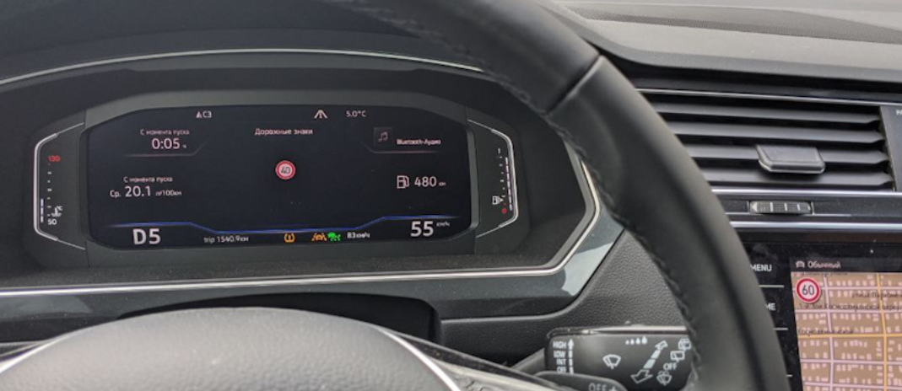

# Кодирование 3Q0/3QD* (MFK 2.0) камеры ассистентов

**Данная инструкция подходит только для камер 3Q0980654**  

Lane Assist с адаптивным ведением по полосе — адаптивное ведение исключает "пин-понг" от полосы к полосе.  
Опция отличная, позволяет расслабиться за рулем и не вылавливать центр полосы, по трассе просто незаменима. 

Traffic Jam Assist — Ассистент движения в пробке.  
Это расширение работы Lane Assist для работы с 0 км/ч. В пробке машина подруливает, разгоняется и тормозит сама, без участия водителя. При остановке более 3 секунд для старта нужно нажать RES или тапнуть педаль газа.

Emergency Assist — Ассистент медицинской остановки.  
Если водитель не желает или не может принимать участие в управлении автомобилем, то машина начинает его будить, сначала звуком, потом резким схватыванием тормозов,   
если и далее человек не принимает управление, то машина сама включает аварийку и останавливается.

Sign Assist — Ассистент распознавания дорожных знаков. Показывает знаки, которые считывает камера. 

## Прошивка камеры ассистентов

Расположены тут: [Прошивки и параметрия](camAssistFirmwares.md){ .md-button .md-button--primary }

## Активации ассистентов

### Матричные фары IQ Light

``` yaml
Блок A5 (камера ассистентов) → Кодирование:
>> AFS_coding_Light_Assist: Matrixbeam
→ Применить 
```

### Активация кнопки вызова ассистентов (для 5Q0 953 502 AJ / Valeo 408 876)

``` yaml
Блок 16 → Адаптация:
> Электроника рулевой колонки
> Клавиша вспомогательных систем водителя
> Установл.
→ Применить
```
> логин-пароль 20103

### Активация Line Assist без адаптивного ведения по полосе

!!! warning
    Для активации Line Assist обновление параметрии для установленной камеры ассистентов не требуется
    
Включаем отображение Line Assist на приборной панели
``` yaml
Блок 17 (комбинация приборов/ActiveInfoDisplay) → Кодирование:
> Lane_assist: yes
 (Байт 04 – Бит 6 (Lane_assist: no → yes)): Активировать)
> Lane_assist_BAP: yes.
 (Байт 11 – Бит 1 (Lane_assist_BAP: no → yes)): Активировать)
```

Конфигурация камеры ассистентов   
Можно использовать готовое кодирование:   
000307060007040100220044C150890080000E20004000 
``` yaml
Блок A5 (камера ассистентов) → Кодирование:
Байт 14 – меняем значение на A0/A1
Байт 16 – Бит 7: Активировать (либо меняем значение байта на 90/98)
```

``` yaml
Блок A5 (камера ассистентов) → Адаптация:
> Lan_assist_system_mode (Состояние включение ассистента движение по полосе) - Selection_over_menu  
> Lane_assist_warning_intensity (Интенсивность предупреждений ассистента движения по полосе) - Selection_over_menu 
> Personalization of lane dept. warning Cl. 15 on (Персонализация момента вмешательство при вкл клеммы 15) - Last Setting (последняя настройка)
→ Применить 
```
> логин-пароль 20103

HCA - Указание блоку рулевого управления о наличии Line Assist
``` yaml
Блок 44 (усилитель рулевого) → Кодирование:
> Heading_control_assist: Активировать   
 (Байт 03 – Бит 1: Активировать)   
→ Применить 
```
> логин-пароль 19249

Включаем в меню новые функции
``` yaml
Блок 5F (мультимедия) → Адаптация:
> Car_Function_List_BAP_Gen2
>> LDW_HCA_0x19:  activated
> Car_Function_Adaptations_Gen2
>> menu_display_Lane_Departure_Warning: Активировать
>> menu_display_Lane_Departure_Warning_over_threshold_high: Активировать
→ Применить 
```

Указание блоку парковочного ассистента о наличии Line Assist (У кого PLA3.0 12 Датчиков)

!!! note ""
    В Tiguan 2G 2020 года выпуска PLA3.0 может стоять в системе как 10 блок, а не 76
    
``` yaml
Блок 76 → Кодирование:
Ассистент движения по полосе, связ. с усилителем рул. управления
> HeadingControl Unterstutzung Auswahl: Spurhalteassistent aktiviert (Heading-Control)
(Байт 3 – Бит 5)
→ Применить 
```

### Активация полного комплекта: адаптивный Line Assist, Traffic Jam Assist, Sign Assist

Lane Assist с адаптивным ведением по полосе — исключает "пин-понг" от полосы к полосе.  
Опция отличная, позволяет расслабиться за рулем и не вылавливать центр полосы, по трассе просто незаменима.

!!! warning
    Для работы Traffic Jam Assist необходима параметрия для установленной камеры ассистентов.  
    Расположены тут: [Прошивки и параметрия][1]

[1]: camAssistFirmwares.md

Указание блоку климата (08), что установлен обогрев камеры.  

=== "Кодирование в ODIS"
    ``` yaml
    Блок 08 → Кодирование:    
    > Camera heating: installed
    (Байт 08 – Бит 0 (Camera heating: not installed → installed)): Активировать)
    → Применить 
    ```
=== "Кодирование в OBD11"
    ``` yaml
    Блок 08 - Длинное кодирование:
    > Нагревательный элемент камеры: не установл.→ установл.
    ```

Указание радару ACC, что, установлена камера  

=== "Кодирование в ODIS"
    ``` yaml
    Блок 13 (адаптивный круиз) → Кодирование:
    > Front_camera: installed
    (Байт 03 – Бит 6 (>> Front_camera: not_installed → installed)): Активировать)
    → Применить 
    ```
=== "Кодирование в OBD11"
    ``` yaml
    Блок 13 → Длинное кодирование:
    > Front_camera: не установл.→ установл.
    ```

Изменение типа ассистента дальнего света с простого на MDF - маскируемый или неослепляющий дальний. Добавляем ассистент в меню
``` yaml
Блок 09 (бортовая сеть) → Адаптация:
>> Aussenlicht_Blinker 
> Warnblinken_durch_Fahrerassistenz → available
>> Fernlicht_assistent
> Erweiterte_Fernlichtsteuerung: AFS, FLA, Fernlicht ueber AFS → AFS, FLA, Fernlicht (GLW,MDF)
> Menuesteuerung Fernlichtassistent: not available → available
> Fernlichtassistent Reset: Деактивировать
→ Применить 
```

> логин-пароль 31347

Включаем отображение Line Assist и дорожных знаков на приборной панели

=== "Кодирование в ODIS"
    ``` yaml
    Блок 17 (комбинация приборов/ActiveInfoDisplay) → Кодирование:
    > Lane_assist: yes 
     (Байт 04 – Бит 6 (Lane_assist: no → yes)): Активировать)
    > Lane_assist_BAP: yes (Добавить лайн ассист в меню ассистентов приборной панели)
     (Байт 11 – Бит 1 (Lane_assist_BAP: no → yes)): Активировать)
    > traffic_sign_display: yes.
     (Байт 05 – Бит 2 (traffic_sign_display: no → yes)): Активировать)
    → Применить 
    ```
=== "Кодирование в OBD11"
    ``` yaml
    Блок 17 → Длинное кодирование:
    > Ассистент движения по полосе: Нет → Да
    > Распознавание дорожных знаков: Нет → Да
    > Ассистент движения по полосе, BAP, путь: Нет → Да
    ```

Активация установленных блоков. Нужно добавить A5 (передние датчики вспомогательных систем) и убрать блок 20 (зеркало с камерой FLA)

=== "Кодирование в ODIS"
    ``` yaml
    Блок 19 (гейтвэй) → Адаптация:
    > Gateway_Component_List: Node_0x30:coded → not_coded; 
    > Gateway_Component_List: Node_0x4F: not_coded → coded. 
    → Применить 
    ```
=== "Кодирование в OBD11"
    ``` yaml
    Блок 19 → Адаптация:
    >> Перечень элементов, которые должны быть установлены
    > Ассистент дальнего света: Закодирован→ Не закодир.
    > Передние датчики вспомогательных систем для водителя: Не закодир.→ Закодирован
    ```

HCA - Указание блоку рулевого управления о наличии Line Assist

=== "Кодирование в ODIS"
    ``` yaml
    Блок 44 (усилитель рулевого) → Кодирование:
    > Heading_control_assist: Активировать   
     (Байт 03 – Бит 0: Активировать)   
    → Применить 
    ```
=== "Кодирование в OBD11"
    ``` yaml
    Блок 44 → Длинное кодирование:
    > Ассистент движения по полосе: Не акт. → акт.
    ```

> логин-пароль 19249

Настройка блока фар

!!! warning "Внимание!"
    Изменение кодировок в данном блоке приводит к сбросу базовых настроек фар. [Как вернуть базовые настройки?](../codingLights/#_12)

=== "Кодирование в ODIS"
    ``` yaml
    Блок 4B (многофункциональный модуль) → Кодирование:
    > mdf_activation: Активировать
     (Байт 10 – Бит 6 (>> mdf_activation: not_enabled → enabled)): Активировать)
    > headlamp_coding_word: 1
    → Применить 
    ```
=== "Кодирование в OBD11"
    ``` yaml
    Блок 4B → кодирование: 
    > headlamp_coding_word: 0 → 1
    > mdf_activation: не разблокирован → разблокирован
    ```

Указание блоку ABS об возможности экстренной остановки
``` yaml
Блок 03 (ABS) → Кодирование:
> Electromechanical parking brake: emergenay braking
  (Байт 29 – Бит 5: Активировать)
→ Применить 
```

Настройка блока 3С (Ассистент смены полосы движения)
``` yaml
Блок 3С → Кодирование:
> Lane_Departure_Warning_System:_with_Lane_Departure_Warning_System
Ю Front_Sensors_Driver_Assistance_System:_with_Front_Sensors_Driver_Assistance_System
→ Применить 
```

Указание блоку парковочного ассистента о наличии Line Assist (У кого PLA 12 Датчиков)

!!! note "Полезная информация"
    В Tiguan 2G 2020 года выпуска PLA3.0 может стоять в системе как 10 блок, а не 76
    
``` yaml
Блок 76 → Кодирование:
Ассистент движения по полосе, связ. с усилителем рул. управления
> HeadingControl Unterstutzung Auswahl: Spurhalteassistent aktiviert (Heading-Control)
(Байт 3 – Бит 5)
→ Применить 
```

Включаем в меню новые функции
``` yaml
Блок 5F (мультимедия) → Адаптация:
> Car_Function_List_BAP_Gen2
>> LDW_HCA_0x19: Активировать
>> traffic_sign_recognition_0x21: Активировать
>> traffic_sign_recognition_0x21_msg_bus: CAN_Extended (Дополнительная шина данных)
> Car_Function_Adaptations_Gen2
>> menu_display_Lane_Departure_Warning: Активировать
>> menu_display_Lane_Departure_Warning_over_threshol d_high: Активировать
>> menu_display_road_sign_identification: Активировать
>> menu_display_road_sign_identification_over_threshold_high: Активировать
→ Применить 
```

Даем указание блоку проекции (если есть)
``` yaml
Блок 82 → Кодирование:
> Road_sign_detection:  available
> Lane_departure_warning: available
→ Применить 
```

Конфигурация камеры ассистентов. 

!!! note "Готовое кодирование"
    ```
    000307060007040100222346C154890098000E20004000
    ```
    Данную кодировку нужно очень внимательно проверить относительно того, какие опции имеются в машине.  
    Для удобства можно воспользоваться [калькулятором битов](../../utils/longCoding) с расшифровкой А5 блока.  
    Например, готовую кодировку можно [Открыть в калькуляторе](../../utils/longCoding/?code=000307060007040100222346C154890098000E20004000&label=A5)

``` yaml
Блок A5 (камера ассистентов) → Кодирование:
>> Brand: VW
>> Class: A
>> Generation: Generation_7
>> Bodystyle: Suv
>> Expansion: Not_coded
>> Production_region: EU
>> Country_variant: Europe
>> Chassis: Steel_springs
>> Steering_bar: Not_coded
>> Windshield: Heat_protecting_glass
>> Traffic_side: Right_traffic
>> PSD_Version: PSD_15 # (1)
>> Navigation: MIB_High # (2)
>> AAG: Coded # (3)
>> SWA (Side assist): Coded # (4)
>> ACC: Coded
>> Pedestrian_break: Not_coded
>> Blind_spot_detection: Not_coded
>> Rain_light_sensor: Coded
>> Main_unit: enabled
>> PLA: Coded # (5)
>> ESP: Coded
>> Personalize_VZE:	Not_Coded
>> Lan_assist_system_mode: Selection_over_menu
>> Personalized_key: Version_1.x
>> Networking_variant: MQB
>> Radar_interface: Coded
>> Perso_HC: Last_setting # (6)
>> Point_of_intervention: early_setting_over_menu
>> LaneAssist_AGW_output: disabled
>> Lane_assist_off_text: disabled
>> Emergency_Assist: EA_Variant_2
>> Traffic Sign Recognition (TSR/VZE): coded
>> HC_mob_line: Not_coded
>> HC: Coded
>> FCWP_default_on_prewarning: last_mode
>> FCWP_delivery_status_prewarning: off
>> FCWP_extended_prewarning_settings: Not_coded
>> FCWP_warning_indicator: Not_coded
>> FCWP: Not_coded
>> FLA_Additional_High_Beam: no_Additional_High_Beam
>> FLA_Headinglight_type: LED
>> Mains_frequency: 50_Hz
>> AFS_coding_Light_Assist: Dynamic_Light_Assist (or Matrixbeam for Tiguan 2021)
>> HC_LONGPRESS: Not_Coded (only for Audi)
→ Применить 
```

1. Прогнозируемые данные по маршруту. Зависит от установленного ГУ (если нет навигации, то `Not coded`)
2. Тип навигации. Зависит от установленного ГУ
3. Если установлен фаркоп
4. Если установлен контроль слепых зон
5. Если установлен Park Assist
6. Запоминание выбранного режима при выключении зажигания

``` yaml
Блок A5 (камера ассистентов) → Адаптация:
> Road_sign_recognition_fusion_mode (Распознавание дорожных знаков: режим Fusion) → Road_Sign_Recognition
> Lane_assist_warning_intensity (Интенсивность предупреждений ассистента движения по полосе) → Selection_over_menu 
> Personalisation_point_of_intervention (Персонализация момента вмешательства) → Last Setting (последняя настройка)
→ Применить 
```
> логин-пароль 20103

!!! note "BAP Personalization"
    BAP Personalization - персонализация программирования настроек под каждый ключ в машине. Для автомобилей Tiguan данная опция не задействована — значение ни на что не влияет. 

### Чтение дорожных знаков (Fusion Mode)
Существует возможность добавить на головное устройство отображение дорожных знаков из базы навигации (Sat Nav Speed Limits),  
а на AID (Virtual Cockpit) — отображение знаков с камеры ассистентов.  
 
Если вдруг камера в засаде, то можно на всякий случай скинуть скорость до того значения, которое имеет наименьшее значение.   



``` yaml
Блок 5F (мультимедия) → Адаптация:
> Car_Function_List_BAP_Gen2
>> traffic_sign_recognition_0x21: Деактивировать
→ Применить 
> Car_Function_Adaptations_Gen2
>> menu_display_road_sign_identification: Деактивировать
>> menu_display_road_sign_identification_over_threshold_high: Деактивировать
→ Применить 
```

``` yaml
Блок 5F (мультимедия) → Кодирование:
>> byte_24_vza: Активировать
```

### Подсветка перекрестков при приближении к ним
Топовые MID LED фары умеют активировать боковой свет на перекрестках и сами поворачивать свет еще при приближении к повороту по навигационным данным. 

``` yaml
Блок 4B → Кодирование:
psd_data: Активировать
Crossing_light_with_route_data: Активировать — включает боковой свет при приближении к перекрестку
Predictive_afs: Активировать — управляет светом на поворотах по навигационным картам
```

!!! warning ""
    После этого необходима базовая установка фар!  