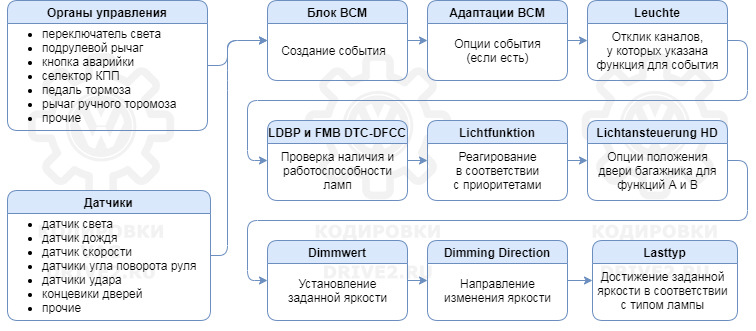

# Coding of lighting equipment

!!!note ""
    For help in creating this manual, I express my gratitude to [Vyacheslav](https://www.drive2.ru/users/slavian116)

### Lighting channel operation diagram



Different cars (Tiguan, Škoda, Golf, Passat) may have different lamp channel assignments.

### List of VW Tiguan 2 front light channels

| Lamp names |                 BASIS LED |                     MID LED |
|-----------------------------------------------|:-----------------------------------------:|----------------------------:|
| Leuchte0BLK VLB36 / Leuchte1BLK VRB20 |     Left/Right turn signal |                             |
| Leuchte2SL VLB10 / Leuchte3SL VRB21 |       Left/Right control DRL |                             |
| Leuchte4TFL LB44 / Leuchte5TFL RB32 |            Left/Right DRL |                             |
| Leuchte6ABL LC5 / Leuchte7ABL RB1 |        Left/Right low beam | Left/Right low beam |
| Leuchte8FL LB39 / Leuchte9FL RB2 |        Left/Right high beam |          Left/Right DRL |
| Leuchte10SHUTTER LB23 / Leuchte11SHUTTER RB22 | Left / Right low beam diagnostics |      Module power / Empty |
| Leuchte12NL LB45 / Leuchte13NL RB5 |            Left / Right PTF |          Left / Right PTF |

### List of VW Tiguan 2 rear light channels

| Lamp names |                             BASIS |                                          HIGH |
|----------------------------------------------------------------------------|:-------------------------------------------------------------:|----------------------------------------------:|
| Leuchte16BLK SLB35BLK SL KC9 /<br/>Leuchte17TFL R BLK SRB3TFL R BLK SR KC3 |                                                               |                 Left/Right parking light |
| Leuchte18BLK HLA60 / Leuchte19BLK HRC31 |               Left/Right turn signal |               Left/Right turn signal |
| Leuchte20BR LA71 / Leuchte21BR RC8 | Left/Right fender brake light + parking light |                 Left/Right brake light |
| Leuchte22BR MA57 |                    Central brake light |                       Central brake light |
| Leuchte23SL HLC10 / Leuchte24SL HRA65 |        Left/Right tail light | Left/Right tail light |
| Leuchte25KZL HA59 |                       Number plate illumination |                              Number plate illumination |
| Leuchte26NSL LA72 / Leuchte27NSL RC6 |                       Left PTF / Empty |              Left PTF/Brake light on the cover |
| Leuchte28RFL LC11 / Leuchte29RFL RA64 |                   empty / Right reverse |                     Left/Right Reverse |

### List of other lamps

Leuchte 35 LED Warnblinktaster C48 – alarm button  
Leuchte30FR LC72 – interior footlights

### Transcript of channels

Using Leuchte9FL RB2 as an example.

Leuchte9FL RB2 – [Leuchte][9][FL][R][B2]

[Leuchte] - lamp  
[9] - lamp number  
[FL] - designation of the lamp function (often may not coincide with reality)  
[R] - location – rechts (right)/links (left)  
[B2] - Contact on BCM (connector B, pin 2)

| Lamp Function Abbreviation | German title | Russian name |
|:---------------------------|:-------------------------------------------------------------------------------------------------------------------------------------|:----------------------|
| ABL | <span style="font-weight:bold">A</span>b<span style="font-weight:bold">b</span>lend<span style="font-weight:bold">l</span>icht | Low beam |
| AMBL | <span style="font-weight:bold">Amb</span>iente<span style="font-weight:bold">l</span>icht | Atmospheric lighting |
| BLK | <span style="font-weight:bold">Bl</span>in<span style="font-weight:bold">k</span>en | Turn signal |
| BR | <span style="font-weight:bold">Br</span>emslicht | Stop light |
| FL | <span style="font-weight:bold">F</span>ern<span style="font-weight:bold">l</span>icht | High beam |
| FR | <span style="font-weight:bold">F</span>uss<span style="font-weight:bold">r</span>aumlicht | Leg lighting |
| HD | <span style="font-weight:bold">H</span>eck<span style="font-weight:bold">d</span>eckel | Trunk lid |
| KZL | <span style="font-weight:bold">K</span>enn<span style="font-weight:bold">z</span>eichen<span style="font-weight:bold">l</span>euchte | Number plate illumination |
| NL | <span style="font-weight:bold">N</span>ebel<span style="font-weight:bold">l</span>icht | PTF front |
| NSL | <span style="font-weight:bold">N</span>ebel<span style="font-weight:bold">s</span>chluss<span style="font-weight:bold">l</span>icht | PTF rear |
| RFL | <span style="font-weight:bold">R</span>ueck<span style="font-weight:bold">f</span>ahr<span style="font-weight:bold">l</span>icht | Reverse |
| SL | <span style="font-weight:bold">S</span>tand<span style="font-weight:bold">l</span>icht | Dimensions |
| TFL | <span style="font-weight:bold">T</span>ag<span style="font-weight:bold">f</span>ahr<span style="font-weight:bold">l</span>icht | DRL |

### Lamp type

For each lamp you can specify its type – Lasttype

??? note "Possible lamp options and their numbers"
    | Lamp type number | Lamp type description |
    |:------------------:|:------------------:|
    | 1 | LED Tagfahrlichtmodul Versorgung   |
    | 2 | Shutter; Diagnosesensierung für "LED low"   |
    | 3 | Xenon Abblendlicht   |
    | 4 | LED Tagfahrlichtmodul Signal   |
    | 5 | LED Abblendlicht   |
    | 6 | LED Lichtmodul   |
    | 7 | Reserved_07   |
    | 8 | allgemeine Glühlampe 12W   |
    | 9 | allgemeine Glühlampe 27W; auch H15   |
    | 10 | allgemeine Scheinwerfer   |
    | 11 | Abblendlicht   |
    | 12 | Blinkleuchten   |
    | 13 | Bremsleuchten   |
    | 14 | kombinierte Blink- Bremsleuchten   |
    | 15 | allgemeine Glühlampe 6W; auch H6W   |
    | 16 | 2* 3W   |
    | 17 | 4* 3W   |
    | 18 | 2* 5W   |
    | 19 | 3* 5W   |
    | 20 | 4* 5W   |
    | 21 | 2* 13W Blinker   |
    | 22 | 2* 16W Blinker   |
    | 23 | allgemeine Scheinwerfer   |
    | 24 | 2* 5W KZL + LED Sidemarker   |
    | 25 | allgemeine Glühlampe innen- oder Außenlicht   |
    | 32 | allgemeine LED bis 12W   |
    | 33 | LED-Modul Blinkleuchten   |
    | 34 | LED Bremsleuchten   |
    | 35 | kombinierte LED Blink-Bremsleuchten   |
    | 36 | LED Kleinleistung   |
    | 37 | allgemeine LED bis 12W   |
    | 38 | LED Blinkleuchten   |
    | 39 | LED Bremsleuchten   |
    | 40 | allgemeine LED   |
    | 41 | LED Kleinleistung   |
    | 42 | LED dritte Bremsleuchte   |
    | 43 | allgemeine LED   |
    | 44 | LED Fußraum- oder -Innenleuchte   |
    | 45 | allgemeine LED bis 6W   |
    | 46 | LED Kleinleistung  |

### 

Lampendefektbitposition and Fehlerort mittleres Byte DTC-DFCC - two fields indicating the bits used to check the presence and operation of lamps.

This is diagnostic information that is transmitted via the BAP bus

### Lighting functions

!!! warning "VCDS warning"
For some reason they decided to transfer these functions to VCDS or as they like to call it, Vasya. As a result, a bunch of values ​​in the select list have the same name.  
    Be careful

??? note "73 functions"
  
    | Function name | Function description |
    |------------------|------------------|
    | nicht active | not included |
    | nicht_definiert_4c | always operates at 30% brightness, and when the hazard lights are on, alternates between 50% and 100% brightness |
    | nicht_definiert_c4 | Alternates between 50% and 100% brightness when the hazard lights are turned on |
    | active 100% | always on |
    | Blinken links Hellphase | works when the left turn signal comes on |
    | Blinken links Dunkelphase | works when the left turn signal is dimmed |
    | Blinken rechts Hellphase | works when the right turn signal comes on |
    | Blinken rechts Dunkelphase | works when the right turn signal is dimmed |
    | Blinken links active (beide Phase) | works constantly when the left turn signal is on |
    | Blinken rechts aktiv (beide Phase) | works constantly when the right turn signal is on |
    | Standlicht allgemein (Schlusslicht, Positionslicht, Begrenzungslicht) | lights up in size mode |
    | Parklicht links (beidseitiges Parklicht aktiviert li & re) | lights up in parking light mode left (ignition off) |
    | Parklicht rechts | lights up in parking light mode right (ignition off) |
    | Abblendlichts links | burns with low left fire |
    | Abblendlicht rechts | burns with near right fire |
    | Fernlicht links | burns with far left fire |
    | Fernlicht rechts | burns with far right fire |
    | Lichthupe generell | turns on when blinking distant |
    | Lichthupe bei bereits aktivem Abblendlicht oder bereits aktivem Dauerfahrlicht | Flasher with already active dimmed headlights or already active long-term driving light |
    | Lichthupe bei nicht aktivem Abblendlicht oder bereits aktivem Dauerfahrlicht | Flasher with not active dimmed headlights or already active long-term driving light |
    | Nebellicht links | lights up when the left PTF is turned on |
    | Nebellicht rechts | lights up when the right PTF is turned on |
    | Tagfahrlicht | lights up with DRL |
    | Dauerfahrlicht | lights up with DRL |
    | Abbiegelichts rlinks | lights up when the left Corner is turned on |
    | Abbiegelichts rechts | lights up when the right Corner is turned on |
    | Bremslicht | lights up when you press the brake |
    | Rueckfahrlicht | lights up when reverse gear is engaged |
    | Nebelschlusslicht | lights up when the rear PTF is turned on |
    | Nebelschlusslicht wenn kein Anhaenger gesteckt und Rechtsverkehr | Rear fog light when no trailer attached and right-hand traffic |
    | Nebelschlusslicht wenn kein Anhaenger gesteckt und Linksverkehr | Rear fog light when no trailer attached and left-hand traffic |
    | Fernlicht über Assistent aktiviert | High beam assistant activated |
    | Coming Home oder Leaving Home aktiv | Coming Home Leaving Home or active |
    | Standlicht vorn (Positionslicht; Begrenzungslicht) | Auxiliary light (position light, parking light) |
    | Nebelschlusslicht auch wenn ein Anhaenger gesteckt | Rear fog light even when trailer fitted |
    | Heckdeckel offen | lights up when the trunk is opened |
    | Heckdeckel geschlossen | lights up when closing the trunk |
    | CCP-Lichtfunktion: Nach Kl.30-Reset auf 0 initialisiert und ueber CCP aenderbar | CCP-light function: After Terminal 30 reset is initialized to 0 and can be changed via CCP |
    | Quittierungsfunktion 1 | Acknowledge 1 |
    | Klemme 30G | Terminal 30G |
    | Dimmung terminal 58xs | brightness is adjusted with a regulator from the interior |
    | Dimmung Klemme 58xt | Dimming terminal 58xt |
    | Dimmung Klemme 58xd | (Terminal 58xd dimmer)Terminal 58xd dimmer |
    | Klemme 15 mit Nachlauf bis Fahrzeugstillstand | Terminal 15 with a lag after vehicle standstill |
    | Klemme 15 ohne Nachlauf| Terminal 15 without running |
    | Innenlicht | interior lighting, switches on smoothly when the door is opened |
    | Kofferraumlicht | lights up when the trunk light is turned on (with the trunk open) |
    | Fussraumlicht | foot lighting |
    | Ambientelicht 1 | center console lighting 1 |
    | Ambientelicht 2 | center console lighting 2 |
    | Ambientelicht 3 | door lighting 3 |
    | Ambientelicht 4 | Ambient lighting 4 |
    | Ambientelicht 5 | Ambient lighting 5 |
    | Umfeldbeleuchtung | Ambient lighting |
    | Tuerausstiegslicht vorn links | lights up when the front left door is opened |
    | Tuerausstiegslicht vorn rechts | lights up when the front right door is opened |
    | Tuerausstiegslicht hinten links | lights up when the rear left door is opened |
    | Tuerausstiegslicht hinten rechts | lights up when the rear right door is opened |
    | Tuerausstiegslichtv links | lights up when the door is opened on the left side |
    | Tuerausstiegslichtv rechts | lights up when opening the door on the right side |
    | Fahrzeug mit Automatik Start-Stopp ist im Stopp-Modu(s) | Vehicle with automatic start-stop is in stop Modu (s) |
    | Klemme 75 Variante a_vfzg | Terminal 75 variant a_vfzg  |
    | Klemme 75 Variante vfzg | Terminal 75 variant vfzg  |
    | beidseitiges Dauerparklicht | Both sides permanent parking light |
    | Blinken links aktiv (beide Phasen); Auf- und Abdimmend mit p_t_blinken_rampe | Flashing left active (both phases);Dimming up and down with p_t_ flash ramp |
    | Blinken rechts aktiv (beide Phasen); Auf- und Abdimmend mit p_t_blinken_rampe | Flashing right active (both phases);Dimming up and down with p_t_ flash ramp |
    | Schlusslicht aktiv ohne Bremslicht aktiv;ist deaktiviert;wenn Bremslicht aktiv ist !!! | Taillight active without stop light; disabled if the brake light is active !!! |
    | Aktive Blinkfunktion hat ein auf 1 gesetztes zugeordnetes Bit in pa_dynamisch_blinken | Active flashing function Bit1 is set t associated in pa_ dynamic_flash  |
    | Motorraumlicht| Lights up when the engine compartment (hood) is opened |
    | Fahrzeug ist nicht fahrbereit (Motor läuft nicht; Elektroantrieb nicht aktiv o.ä.) | Vehicle is not roadworthy (electric drive not active or similar, engine is not running) |
    | Handbremse ist angezogen| Hand brake is applied |
    | Debug-Lichtfunktion (in Anlehnung an CCP) | Debug light function (based on CCP) |
    | Debug-Lichtfunktion Fehlerspeicher | Debug light function error memory |
    | Versorgungsbedarf der LCM Module | Supply requirements of the LCM modules |
    | Zuschaltung Trennrelais für 2. Batterie | Switching cut-off relay for 2nd battery |

### Group chains

Each lamp is divided into a maximum of 8 functions, 4 brightness values and 4 brightness directions.  

Lichtfunktion A, B, C, D, E, F, G, H - functions of the lamp in the on-board network. They turn on when an external event occurs.  

Each channel has four pairs - AB CD EF GH, that is, in total eight functions can be registered in one channel.  
Each pair can also be given their own chain of work.  

The higher the lighting group, the more important the function: GH > EF > CD > AB. The occurrence of a new event overrides the current one, function H has the highest priority.

If the flashing function is coded in groups AB and CD and the fog light is coded as function E, 
The turn signal on the appropriate side will remain on continuously, even if you flash while the fog light is on!

Each function group has a brightness option and a direction to change the brightness.

For example,
```
Lichtfunktion C 6:	nicht aktiv  
Lichtfunktion D 6:	nicht aktiv  
Dimmwert CD 6:	0  
Dimming Direction CD 6: maximize  
```


Lighting function group AB does not have a dimming direction since the light is normally off.  

Instead there is "Lichtansteuerung HD AB" - HD stands for trunk lid and can be coded as "Always" and "only_if_closed".  
So if you want to access the light source only when the trunk lid is closed, then "only_if_closed" should be coded there.
So if you want to access the light source only when the trunk lid is closed, then "only_if_closed" should be coded there.

### Brightness

In each pair, the channel has a lamp dimming option - Dimmwert.  

For halogen lamps, adjustment is carried out in the range from 0 to 100.  
For diodes, adjustment is carried out in the range from 0 to 127.  

When set to 127, they stop responding to dimming in the interface; only on/off works.  
When set to 126, the upper brightness limit is higher and dimming is maintained.

Values ​​greater than 127 are not accepted for this field. Unlike all the others, it is 7-bit, the block resets the eighth bit.

!!! warning ""
    Not all diodes can be dimmed.  
    An increase or decrease in the brightness of the glow is realized by increasing or decreasing the duty cycle of the PWM signal.  
    If the brightness is set too low (< 25), the channel may produce an error.

### Brightness adjustment

To adjust the brightness there is an option – Dimming direction.  
There are only two values for the dimming direction:  

+ minimize (reduce brightness to the set value)  
+ maximize (increase brightness to the set value)

### Coding example

We want the fog lights to flash along with the high beams.

1. Find the required headlights: Leuchte12NL LB45 for the left side and Leuchte13NL RB5 for the right.
2. Find a free group of lighting functions. In our case this is CD
3. Set the functions for the left headlight:
    
```
    Lichtfunktion C 12: Lichthupe generell (enabled when flashing high beam)  
    Dimming direction CD 12: maximum  (brightness increase)  
    Dimmwert CD 12: 0 → 100
    ```


4. Set the functions for the right headlight:
    
``` 
    Lichtfunktion C 13: Lichthupe generell (enabled when flashing high beam)  
    Dimming direction CD 13: maximum  (brightness increase)  
    Dimmwert CD 13: 0 → 100  
    ```


### Basic headlight calibration 

Carried out when there is a hanging AFS error. The engine must be running and the headlights must be on.

``` yaml title="Login code: 20103"
Block 4B → Basic settings (04)
Basic headlight installation (002) → Read
We take the steering wheel with our hands, turn the steering wheel to the left until it stops and hold the steering wheel in this position 3c.
Turn the steering wheel to the right until it stops and hold the same 3 seconds. then put the steering wheel straight, wait 3s → Save
Basic installation confirmation (003) → Apply
```
