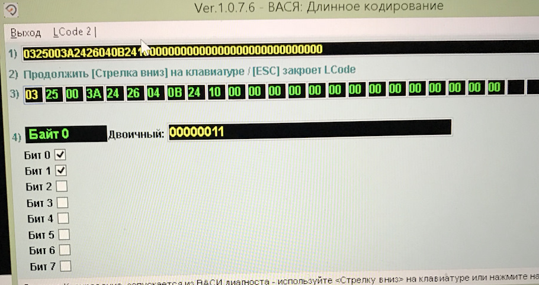

# Движение и управление

### Перенастройка рулевой рейки

!!! tip ""
     Руль становится более информативным.  
     Если поставить профиль "Direct" — руль будет тяжелым с самых малых скоростей.  
     Если поставить профиль "Incremental" — руль будет наливаться тяжестью с ростом скорости.

```
Блок 44 (Усилитель рулевого управления) → Кодирование
> Выбор активного профиля вождения
Выбираем "активировать"
→ Применить
	
Блок 44 (Усилитель рулевого управления) → Адаптация
> Характеристики усилителя рулевого управления -> Ставим "Dynamik"
> Переключение профиля режима езды -> Ставим "Incremental"
→ Применить
```

> логин-пароль: 19249

### Отключение стабилизации прицепа

	Блок 03 → Кодирование
	> Trailer Stabilization - Неактив
	→ Применить (с перезагрузкой блока)
	
??? note "Кодирование в VCDS"
    03 — ABS  
    канал адаптации № 56  
    1 - включено, 0 - выключено   
    Выход   
    Сохранить   
    
    
### Мягкое трогание с Autohold

!!! tip ""
    Иногда ощущается небольшой рывок при начале движения со включенным AutoHold. Эффект есть и весьма ощутимый, теперь авто трогается очень плавно.
    
```
Блок 3-ABS/ESP → Адаптация
> Anpassung des Dynamischen Anfahrassistenten
> IDE04871-Динамический ассистент трогания (Dynamischer Anfahrassistent)
> По умолчанию: нормально
> Новое значение: рано (Früh)
→ Применить
```

> логин-пароль: 20103

??? note "Кодирование в OBD11"
    03 Блок управления электроника тормозной системы → Адаптация  
    > Динамический ассистент трогания  
    Старое значение: нормально  
    Новое значение: рано  
    > Ассистент движения на подъёме  
    Старое значение: нормально  
    Новое значение: рано  

### Перенастройка педали газа

    Блок 01 → Кодирование
    > Байт 0  
    > Было: бит 0 и 3, с 3 галочку снимаем и ставим на 1, на 0 галочку оставляем.
    Заводская кодировка: 01110012230410080000 
    Действующая кодировка: 02110012230410080000 (Байт 0: было 01, стало 02)
    
    Блок 44 → Адаптация
    > Переключение профиля режима езды
	> Непосредственно, управление по пороговой величине
	→ Применить

??? note "Кодирование в VCDS"
    01 — Двигатель  
    Кодирование - 07 → Длинное кодирование  
    Байт 0 → биты 0, 1: Галочку ставим, с остальных битов снимаем  
    Выход   
    Сохранить   
    

!!! tip
    Наиболее полный эффект будет после адаптации ДСГ-7.
   
> логин-пароль 27971

### Адаптация DSG-7

Разогреть мотор и коробку — около часа езды. Двигатель заглушен, зажигание включено. 

    Блок 02 → электроника КП → базовые установки 
    > запуск быстрой адаптации двойной фрикционной муфты 
    > ждем надпись о завершении 
    > выкл зажигание.
    
    > Запускаем мотор — вкл. ручник (тормоз не нажимаем)
    > передача P 
    
    Блок 02 → электроника КП → базовые установки 
    > базовая установка КП 
    > ждем надпись о завершении и слушаем пугающий скрежет и толчки КП
