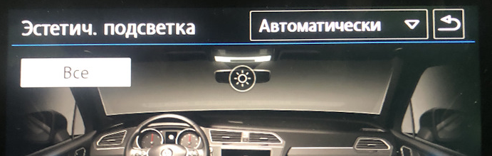
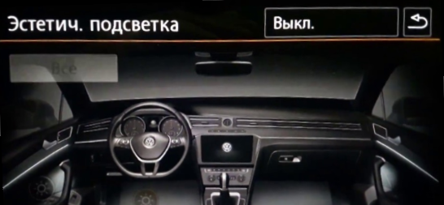

# Coding of interior lighting zones

## General information

!!! note ""
For help in creating this manual, I express my gratitude to [Vyacheslav](https://www.drive2.ru/users/slavian116)

??? tip "List of designation of brightness adjustment zones"  
innenlicht – interior lighting  
fussraum – legs  
tueren – door  
cockpit – front panel (wireless charging niche)
miko – center console  
dach – cover

??? tip "List of existing lanterns"
Ambiente_Applikationsleisten_in_Tuertafel – door panel lighting Ambiente_Lautsprecher – speaker lighting  
Ambiente_Applikationsleisten_in_Instrumententafel – illumination of the wireless charging niche  
Cockpitbeleuchtung – front console lighting  
Mittelkonsolenbeleuchtung – illumination of the wireless charging niche  
Dachbeleuchtung – roof lighting  
Panoramaschiebedachbeleuchtung – panorama illumination  
Fussraumbeleuchtung – foot lighting

!!! note ""
These encodings are only possible via OBD11 or ODIS

    To install additional interior lighting lamps, you need to perform several steps:  
    - install the lantern, hang it on a free lantern
    - activate the flashlight  
    - set brightness

### Drawing "suns" in the Aesthetic lighting menu

!!! note ""
Doesn't work with composition color (it doesn't have visualization of zones, its zones are a list).  
This encoding is only possible via OBD11 or ODIS

This coding is relevant for those who only have foot lighting from the factory, and no aesthetic lighting.  
Often in this case, when the aesthetic lighting is activated, the ability to adjust the leg lighting zone disappears, namely
the same sun and visualization of this backlight.

In addition, this information will be useful for those who have installed additional backlight lamps, or just
is going to do it.

3 adaptation parameters are responsible for activating additional zones in the Aesthetic lighting menu in block 9 *Lighting
salon, parameters / Interior_light_parameter*

```
- p_ambientelicht_verbauinformation_HMI
```


| Bit | Description |
|-----|-----------------------------------------------------|
| 0 | Foot lighting (visualization of foot lights)* |
| 1 | Leg lighting (no rendering) |
| 2 | Front panel lighting (strip visualization)* |
| 3 | Empty |
| 4 | Center console (without visualization) |
| 5 | Front panel lighting (without visualization) |
| 6 | Front panel lighting (without visualization) |
| 7 | Front panel lighting (without visualization) |

```
- p_ambientelicht_verbauinformation_HMI2
```


| Bit | Description |
|-----|---------------------------------------------------------|
| 0 | Center console (without visualization) |
| 1 | Center console (without visualization) |
| 2 | Door lighting (visualization of handle lights)* |
| 3 | Door lighting (without visualization) |
| 4 | Door lighting (stripe visualization)* |
| 5 | Door lighting (without visualization) |
| 6 | Door lighting (without visualization) |
| 7 | Door lighting (without visualization) |

```
- p_ambientelicht_verbauinformation_HMI3
```


| Bit | Description |
|-----|----------------------------------------------------|
| 0 | Door lighting (without visualization) |
| 1 | Ceiling lighting (without visualization) |
| 2 | Ceiling lighting (visualization of lantern lighting)* |
| 3 | Ceiling lighting (without visualization) |
| 4 | Empty |
| 5 | Empty |
| 6 | Empty |
| 7 | Empty |

Coding example – activation of the “sun” and visualization of ceiling lighting


``` yaml title="Login code: 31347"
Block 09 → Adaptation:
Interior_light_parameter:
- p_ambientelicht_verbauinformation_HMI3: 110
→ Apply
```


Coding example - activating the visualization of handle illumination


``` yaml title="Login code: 31347"
Block 09 → Adaptation:
Interior_light_parameter:
- p_ambientelicht_verbauinformation_HMI2: 100
→ Apply
```


### Installing the flashlight on a free channel

To connect the diodes, you need to find free pins on the VSM. It depends on the configuration.  
Then the corresponding free channel is searched, for example, MID LED owners can connect a lamp to pin 36,  
and then set to configure a free channel in Leuchte0BLK VLB36 encodings and register a diode and function in it.

Possible functions:

| Function | Description |
|-----------------|------------------------|
| Ambientelicht 1 | Sunshine over the glove compartment |
| Ambientelicht 2 | Sunshine over the glove compartment |
| Ambientelicht 3 | Sunshine doors |
| Ambientelicht 4 | Empty |
| Ambientelicht 5 | Empty |

``` yaml
Lasttyp 0 — LED Kleinleistung
Lichtfunktion A 0 – Ambientelicht 1
Dimmwert AB 0 — 99
```


### Activating the flashlight

If some “sun” does not appear after switching on, then you need to activate the flashlight itself.  
For example, activating the foot light:

``` yaml title="Login code: 31347"
Block 09 → Adaptation:
Interior_light_lamp_configuration
- Fussraumbeleuchtung: installed
```


### Setting the backlight brightness

The following parameters are responsible for the brightness values of a particular flashlight in block 9:

``` yaml title="Login code: 31347"
Block 09 → Adaptation:
Interior_light_parameter:
p_adaption_kundenwunsch_
p_helligkeit_entriegelt_
p_helligkeit_max_
p_helligkeit_HD_auf_zuendung_ein_
p_helligkeit_HD_auf_zuendung_aus_
p_helligkeit_dieseTuer_auf_zuendung_ein_
p_helligkeit_andereTuer_auf_zuendung_ein_
p_helligkeit_Fzg_geschlossen_zuendung_ein_
p_helligkeit_dieseTuer_auf_zuendung_aus_
p_helligkeit_andereTuer_auf_zuendung_aus_
p_helligkeit_einausstieg_
p_helligkeit_Fzg_geschlossen_zuendung_aus_
p_helligkeit_Tueren_geschlossen_HD_auf_zuendung_aus_
p_helligkeit_Tueren_geschlossen_HD_zu_zuendung_aus_
p_helligkeit_Tueren_geschlossen_schluessel_ab_
p_helligkeit_Fzg_geschlossen_schluessel_ab_
```


Default lamp brightness

Default lamp brightness

``` yaml title="Login code: 31347"
Block 09 → Adaptation:
Interior_light_2nd_generation
- Defaultwert Ambienteprofil Mittelkonsole: 80
- Defaultwert Ambienteprofil Dach: 80
- Defaultwert Ambienteprofil Farbe: 80
- Defaultwert Ambienteprofil Fussraum: 80
- Defaultwert Ambienteprofil Tuer: 80
```


Brightness adjustment

``` yaml title="Login code: 31347"
Block 09 → Adaptation:
Interior_light_2nd_generation
- Helligkeit Mittelkonsolenbeleuchtung nicht berechnen - not active
- Farbausgabe Mittelkonsolenbeleuchtung nicht berechnen — active
```


## Delay for turning on interior lighting

The encodings in block 9 make it possible to sequentially turn on the lights in the cabin.

The following parameters are responsible for this:

``` yaml title="Login code: 31347"
Block 09 → Adaptation:
Interior_light_parameter:
- p_t verzoegerung einstieg innenlicht - delay in turning on the interior lighting at the entrance, ignition off
- p_t verzoegerung ausstieg innenlicht - delay in turning on the interior lighting when exiting, ignition off
- p_t verzoegerung oeffnen innenlicht - delay in turning on the interior lighting when the door is opened, the ignition is on
- p_t verzoegerung entriegelt innenlicht - delay in turning on the interior lighting when unlocking the central locking
- p_t verzoegerung schliessen innenlicht - delay in turning off the interior lighting when the door is closed, the ignition is on
- p_t verzoegerung schluessel ab innenlicht - delay in turning off the interior lighting when the ignition is turned on
- p_t verzoegerung verriegelt innenlicht - delay in turning off the interior lighting when the central locking is locked
```


For example,  

We set the switching on for the door lamps to 0.8s, and to 1.6s for the interior lights.  
The foot lights remain the same and light up first, then the doors, then the ceiling.
The light from the interior lighting goes out first. Then the doors and then just the legs.

``` yaml title="Login code: 31347"
Block 09 → Adaptation:
Interior_light_parameter:
- p_t_verzoegerung_einstieg_fussraum: 0,0 s
- p_t_verzoegerung_einstieg_tueren: 0.8 s
- p_t_verzoegerung_einstieg_innenlicht: 1,6 s
→ Apply
```


We also set the switch-off for the doors to 0.8s, and for the legs we set it to 1.6s.
The light from the interior lighting goes out first. Then the doors and then just the legs.

``` yaml title="Login code: 31347"
Block 09 → Adaptation:
Interior_light_parameter:
- p_t_verzoegerung_ausstieg_fussraum: 1,6 s
- p_t_verzoegerung_ausstieg_tueren: 0.8 s
- p_t_verzoegerung_ausstieg_innenlicht: 0,0 s
→ Apply
```
