# Installation and configuration of RGB backlight

This material is a copy of the resource: https://www.drive2.ru/l/553166225153198981/  

!!! info "What RGB lighting includes"
    1. Color-changing decorative lighting in the doors  
    2. Color-changing footwell lighting  
    3. Color-changing illumination of the center console niche  
    4. Monochrome background lighting of the interior ceiling lamp  
    5. Color and brightness adjustment via the factory head unit menu  
    6. Linking color profiles to driving profiles  
    7. Linking colors to the driver (or key)  
    8. Door pocket lighting (lamp part numbers 8W0919390A, B, C, D)  

### Files and links to instructions
+ [ODIS_E Linking driving profiles for ECU 09 (adaptations)](../odis-files/09 – LIN RGB.PRE)

### Vehicle equipment requirements:

1. On-board network control unit (BCM) High version 5Q0937084CG/CQ/DD/DH.  
The High version was installed in Russia only on cars with a panoramic roof light package or on Škoda Octavia with factory color ambient lighting.  
On any other trim level, BCM replacement is REQUIRED. Versions 5Q0937084CF/CP/DC do not support multi-color ambient lighting.  
The full package also cannot be implemented on BCM 5Q0937086 (Passat B8, Kodiaq) — multi-color footwell lighting will not work on that BCM.  
  
2. If monochrome door panel lighting is missing, door trim must be replaced (rear door modules are optional)  
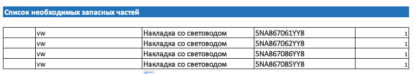

3. For driving-profile color linking, verify the gateway (J533 / ECU 19) software is at least 4344 or 5344 with index Q or higher; otherwise find a specialist to flash the gateway and upload parameters

## Theory

1. All color LEDs are controlled via LIN — three wires per LED: +, −, LIN  
2. LIN RGB in BCM — pin 29 in connector C  
3. Ambient ceiling lamps are also controlled via LIN  
4. LIN for ceiling lamps in BCM — pin 15 in connector A  
5. Several ambient channels can be adjusted from the head unit: doors, footwell, front panel, center console, ceiling lamp, panoramic roof lighting.  

Each MQB model has limitations — some channels may be unavailable:  

+ Tiguan — all channels  
+ Golf — cannot display or adjust the ceiling lamp  
+ Octavia — cannot display or adjust the center console

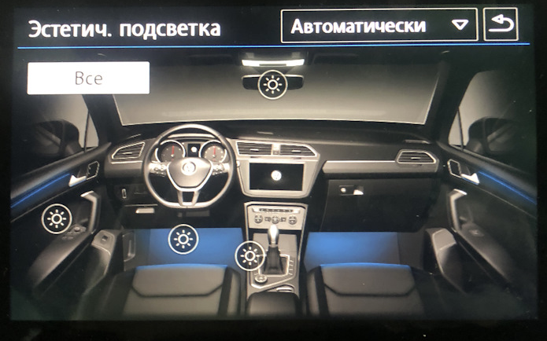
  
### Wiring diagram

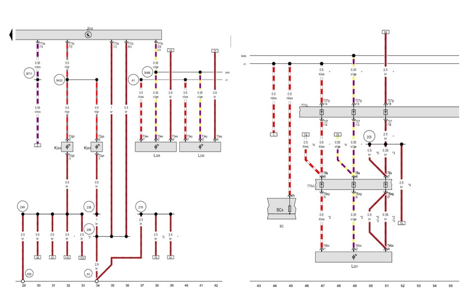

J519 – BCM  
L2** — LEDs  
SC8 – fuse  

### Tools

1. Interior trim removal tool set  
2. Drill with 4.5–5 mm metal bit  
3. Dremel or similar tool to cut the opening in the center console niche  
4. Crimping tool for terminals  
5. Sharp knife to prepare LEDs for installation  

### Parts

Parts for wiring RGB LEDs in doors, footwell, and center console:  
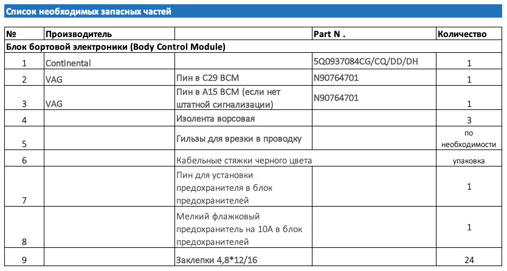
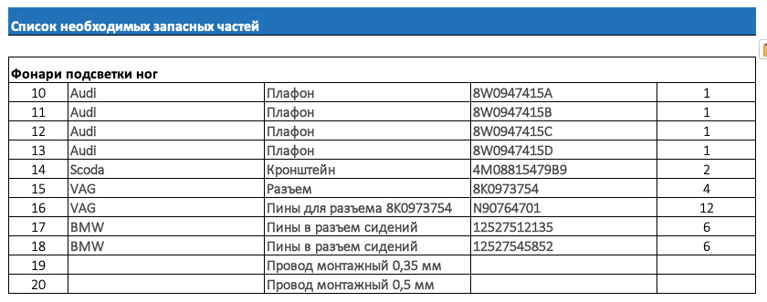
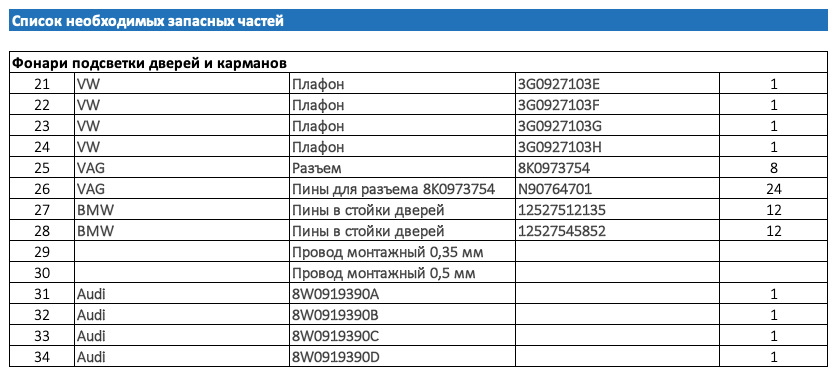
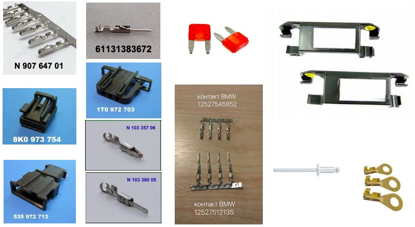
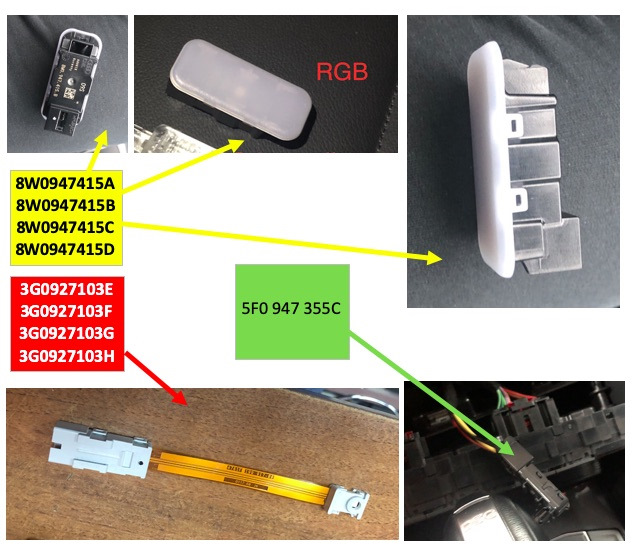

Optional — you can skip the items below. They allow a wiring break between the door and trim panel (front doors only) — part of the harness runs on the trim, part on the door; a connector makes disassembly easier.  
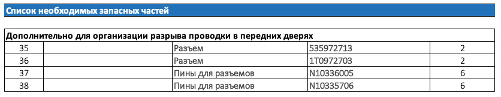

Ceiling lamp  
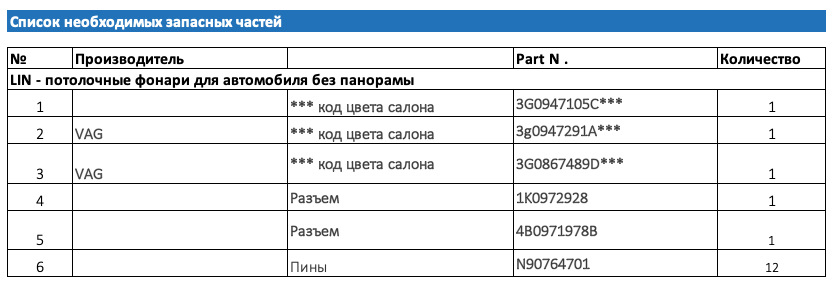
Overhead lamps for panoramic-roof cars:  
Front lamp — 3G0947105E  
Rear 1 — 3G9947292A  
Rear 2 — 3G9947291A  

## Routing all required wiring

1. If fuse SC8 (slot 8) is missing, install it — all RGB lighting power is routed through this fuse.  
2. Disconnect the battery terminal.  
3. Remove door trims, interior sills, lower door pillars, and front seats for access.  

#### Doors  
1. Drill out speaker rivets, disconnect door connectors, and remove door wiring harnesses. WARNING — when removing factory tape, note seal positions and tape wrap length. Incorrect reassembly may damage the flex section of the door harness in cold weather.  
2. Add three wires to each door harness: two 0.35 mm² and one 0.5 mm².  
3. Pin wires at the door connector (12527545852 for door connectors).  
4. Route wires to LED locations on the trims; on front doors, add a break between door and trim (parts listed above).  
5. Pin the LED connector (N90764701): pin 1 — + 0.5 mm², pin 2 — LIN 0.35 mm², pin 4 — ground 0.35 mm².  
6. After continuity checks and crimp inspection, reinstall speakers and rivet them.  
7. Pin three wires at the A-pillar connectors; route LIN to BCM, + to fuse SC8, ground to nearest bolt (12527512135).  
8. Before reassembling the interior, wire the footwell RGB lighting.  
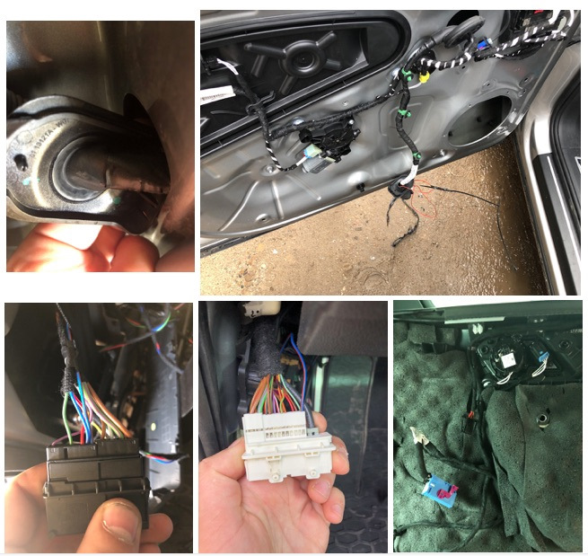
  
#### Seats  
1. Disconnect the red seat connector, airbag connector, and disassemble the seat-side connector.  
2. Route three wires (two 0.35 mm², one 0.5 mm²) along the seat harness to the LED location.  
3. Pin the LED connector (N90764701): pin 1 — + 0.5 mm², pin 2 — LIN 0.35 mm², pin 4 — ground 0.35 mm².  
4. Pin the other end with terminals for the seat connector.  
5. Remove the seat connector housing from the latch and pin three wires — two 0.35 mm², one 0.5 mm²; route + to fuse SC8, LIN to BCM, ground to nearest bolt.  
6. Install brackets 4M08815479B9 on seat springs and mount footwell lights.  
7. Reassemble in reverse order.  
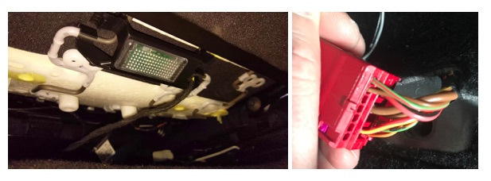
  
#### Center console  
1. Remove the climate panel cover.  
2. Remove the climate control unit.  
3. Remove the tunnel side panel.  
4. Bundle two 0.35 mm² and one 0.5 mm² wires.  
5. Pin the LED connector.  
6. Route + to fuse SC8, LIN to BCM, crimp ground to a ring terminal and attach to the nearest ground bolt, or use a bolt and nut on the console metal brace.  
7. Proceed to BCM connections.  
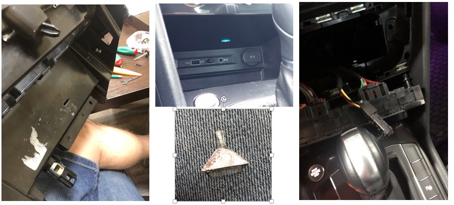
  
#### Front footwell lights  
1. Bundle two 0.35 mm² and one 0.5 mm² wires.  
2. Pin the LED connector.  
3. Route + to fuse SC8, LIN to BCM, ground to nearest bolt.  
4. If factory light mounts are missing, buy and install them.  
5. Install the driver footwell light above the accelerator pedal.  
6. Install the passenger footwell light above the passenger's right foot.  

### Connecting the LIN bus to BCM

1. Remove the BCM connector (nearest one) by releasing the white clip and pressing the latch — tight space.  
2. Cut the tie wrap on the outer shell.  
3. Release tabs and remove the two inner connector shells.  
4. Locate pin 29 socket.  
5. Crimp a wire of required length with N90764701.  
6. Insert the wire into pin 29.  
7. Join all LIN wires (4 doors, 4 seats, 1 console) in a star topology; VAG has dedicated connectors, but a crimp splice also works.  
8. Insulate and secure the harness.  
9. Reassemble; use a new cable tie.  
10. LIN wiring is complete.  
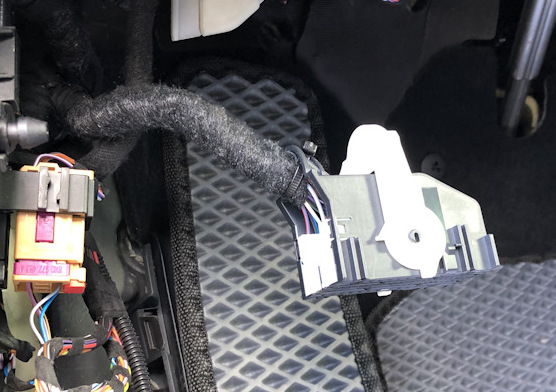

### Connection to the fuse

Join all + wires and connect them to the wire fed from fuse SC8 installed earlier.

### Installing LEDs in the doors

1. Modify LEDs mechanically to match the factory monochrome unit — Passat and Tiguan mounts differ; front and rear LED clips are not interchangeable.  
2. Install them in the ambient light strip.  
3. Secure harnesses so trims do not pinch them.  
4. Reinstall door trims.  

### Installing the LED in the center console

1. Remove the center console per ELSA instructions
2. Cut the light-guide opening with a Dremel
3. Make the light guide
4. Insert and secure the light guide in the console
5. Fit the LED onto the light guide and connect the plug
6. Wiring for the ambient ceiling lamp (if fitted)

### Installing ambient ceiling lamps

1. Pry off the glass lens and disconnect the connectors.  
2. Remove the bulb carrier using trim tools.  
3. Remove the GLONASS button trim.  
4. Remove four perimeter Torx screws.  
5. Remove the front lamp trim and mirror bell cover.  
6. Disconnect connectors and remove the frame.  
7. Repin connectors (N90764701):  
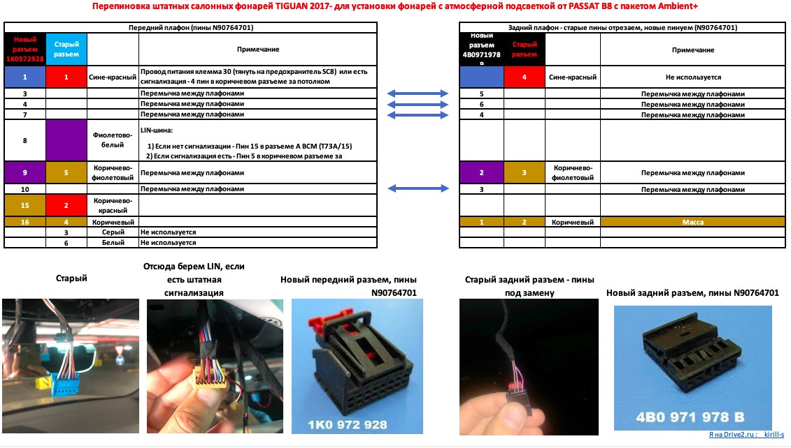

## Coding

``` yaml title="Login code: 31347"
Block 09 → Adaptation:
Interior_light_lamp_configuration:
- Ambiente_Applikationsleisten_in_Tuertafel: installed. (door strips)
- Ambiente_Lautsprecher: not installed.
- Ambiente_Applikationsleisten_in_Instrumententafel: not installed.
- Cockpitbeleuchtung: not installed.
- Mittelkonsolenbeleuchtung: installed. (center console lamp)
- Dachbeleuchtung: installed. (Ambient+ ceiling lamp)
- Panoramaschiebedachbeleuchtung: not installed.
- Fussraumbeleuchtung: installed. (footwell lighting)
- LIN-Dachkonsole lokal aktivierbar: active (enables LIN control of the ceiling lamp)
- Ambientemenue mit globalem aus: active (global ambient lighting control)
- Ambientemenue mit alle Zonen: active (per-zone adjustment)
- Ambient_Farbliste_HMI: active (color picker scale in HMI)
- Ambience_light_colorlist_default: 1
→ Apply
```

``` yaml title="Login code: 31347"
Block 09 → Adaptation:
Interior_light_2nd_generation:
- Aufloesung Dimmzeit: 0.8
- weicher Farbwechsel: active
- Tuertafelbeleuchtung mehrfarbig: active (color door strips)
- Instrumententafelbeleuchtung mehrfarbig: not active
- Cockpitbeleuchtung mehrfarbig: not active
- Lautsprecherbeleuchtung mehrfarbig: not active
- Mittelkonsolenbeleuchtung mehrfarbig: active (color center console LED)
- Dachbeleuchtung mehrfarbig: not active (monochrome ceiling lamp)
- Panoramaschiebedachbeleuchtung mehrfarbig: not active
- Panoramaschiebedachbeleuchtung bei geoeffnetem Rollo deaktivieren: not active
- BAP Farbwert Farbe 1: 1
- BAP Farbwert Farbe 2: 4
- BAP Farbwert Farbe 3: 5
- Defaultwert Ambienteprofil Mittelkonsole: 80 (default lamp brightness)
- Defaultwert Ambienteprofil Dach: 80 (default lamp brightness)
- Defaultwert Ambienteprofil Farbe: 8
- Defaultwert Ambienteprofil Fussraum: 80 (default lamp brightness)
- Defaultwert Ambienteprofil Tuer: 80 (default lamp brightness)
- Ambiente_Farbliste_HMI_mit_Farbtransformation: active (separate on-screen vs LED color mapping to match displayed color to LED capability)
- Helligkeit_Tuertafelbeleuchtung_nicht_berechnen: not active (disable brightness lock)
- Helligkeit Instrumententafelbeleuchtung nicht berechnen: active
- Helligkeit Cockpitbeleuchtung nicht berechnen: active
- Helligkeit Lautsprecherbeleuchtung nicht berechnen: active
- Helligkeit Mittelkonsolenbeleuchtung nicht berechnen: not active (disable brightness lock)
- Helligkeit Dachbeleuchtung nicht berechnen: not active (disable brightness lock)
- Helligkeit Panoramaschiebedachbeleuchtung nicht berechnen: active
- Farbausgabe Tuertafelbeleuchtung nicht berechnen: not active (disable brightness lock)
- Farbausgabe Instrumententafelbeleuchtung nicht berechnen: active
- Farbausgabe Cockpitbeleuchtung nicht berechnen: active
- Farbausgabe Lautsprecherbeleuchtung nicht berechnen: active
- Farbausgabe Mittelkonsolenbeleuchtung nicht berechnen: not active(disable brightness lock)
- Farbausgabe Dachbeleuchtung nicht berechnen: not active(disable brightness lock)
- Farbausgabe Panoramaschiebedachbeleuchtung nicht berechnen: active
- LIN-Dachkonsole mit Flaechenlicht: installed. (ceiling lamp area lighting)
- Ambiente_Farbwahl_FPA_waehlbare_Kopplung: active (driving profile linking)
- Ambiente_Fahrprofil_Individual: 1
- Ambiente_Farbwahl_FPA_waehlbare_Kopplung_Status_hmi_default: paired (driving profile linking)
→ Apply
```

Brightness and smoothness of channel adjustment
``` yaml title="Login code: 31347"
Block 09 → Adaptation:
Interior_light_parameter:
- p_adaption_kundenwunsch_tuer: 0.67 (adjustment linearity)
- p_helligkeit_entriegelt_tueren: 100
- p_helligkeit_max_tueren: 100
- p_helligkeit_HD_auf_zuendung_ein_tueren: 126
- p_helligkeit_HD_auf_zuendung_aus_tueren: 127
- p_helligkeit_dieseTuer_auf_zuendung_ein_tueren: 100
- p_helligkeit_andereTuer_auf_zuendung_ein_tueren: 100
- p_helligkeit_Fzg_geschlossen_zuendung_ein_tueren: 126
- p_helligkeit_dieseTuer_auf_zuendung_aus_tueren: 100
- p_helligkeit_andereTuer_auf_zuendung_aus_tueren: 100
- p_helligkeit_einausstieg_tueren: 100
- p_helligkeit_Fzg_geschlossen_zuendung_aus_tueren: 127
- p_helligkeit_Tueren_geschlossen_HD_auf_zuendung_aus_tueren: 100
- p_helligkeit_Tueren_geschlossen_HD_zu_zuendung_aus_tueren: 100
- p_helligkeit_Tueren_geschlossen_schluessel_ab_tueren: 100
- p_helligkeit_Fzg_geschlossen_schluessel_ab_tueren: 100

- p_adaption_kundenwunsch_fussraum: 0.67
- p_helligkeit_entriegelt_fussraum: 100
- p_helligkeit_max_fussraum: 100
- p_helligkeit_HD_auf_zuendung_ein_fussraum: 126
- p_helligkeit_HD_auf_zuendung_aus_fussraum: 127
- p_helligkeit_dieseTuer_auf_zuendung_ein_fussraum: 100
- p_helligkeit_andereTuer_auf_zuendung_ein_fussraum: 100
- p_helligkeit_Fzg_geschlossen_zuendung_ein_fussraum: 126
- p_helligkeit_dieseTuer_auf_zuendung_aus_fussraum: 100
- p_helligkeit_andereTuer_auf_zuendung_aus_fussraum: 100
- p_helligkeit_einausstieg_fussraum: 100
- p_helligkeit_Fzg_geschlossen_zuendung_aus_fussraum: 127
- p_helligkeit_Tueren_geschlossen_HD_auf_zuendung_aus_fussraum: 100
- p_helligkeit_Tueren_geschlossen_HD_zu_zuendung_aus_fussraum: 100
- p_helligkeit_Tueren_geschlossen_schluessel_ab_fussraum: 100
- p_helligkeit_Fzg_geschlossen_schluessel_ab_fussraum: 100

- p_adaption_kundenwunsch_miko: 0.67
- p_helligkeit_entriegelt_miko: 100
- p_helligkeit_max_miko: 100
- p_helligkeit_HD_auf_zuendung_ein_miko: 126
- p_helligkeit_HD_auf_zuendung_aus_miko: 127
- p_helligkeit_dieseTuer_auf_zuendung_ein_miko: 100
- p_helligkeit_andereTuer_auf_zuendung_ein_miko: 100
- p_helligkeit_Fzg_geschlossen_zuendung_ein_miko: 126
- p_helligkeit_dieseTuer_auf_zuendung_aus_miko: 100
- p_helligkeit_andereTuer_auf_zuendung_aus_miko: 100
- p_helligkeit_einausstieg_miko: 100
- p_helligkeit_Fzg_geschlossen_zuendung_aus_miko: 100
- p_helligkeit_Tueren_geschlossen_HD_auf_zuendung_aus_miko: 100
- p_helligkeit_Tueren_geschlossen_HD_zu_zuendung_aus_miko: 100
- p_helligkeit_Tueren_geschlossen_schluessel_ab_miko: 100
- p_helligkeit_Fzg_geschlossen_schluessel_ab_miko: 100

- p_adaption_kundenwunsch_dach: 1
- p_helligkeit_entriegelt_dach: 100
- p_helligkeit_max_dach: 100
- p_helligkeit_HD_auf_zuendung_ein_dach: 100
- p_helligkeit_HD_auf_zuendung_aus_dach: 100
- p_helligkeit_dieseTuer_auf_zuendung_ein_dach: 100
- p_helligkeit_andereTuer_auf_zuendung_ein_dach: 100
- p_helligkeit_Fzg_geschlossen_zuendung_ein_dach: 126
- p_helligkeit_dieseTuer_auf_zuendung_aus_dach: 100
- p_helligkeit_andereTuer_auf_zuendung_aus_dach: 100
- p_helligkeit_einausstieg_dach: 100
- p_helligkeit_Fzg_geschlossen_zuendung_aus_dach: 100
- p_helligkeit_Tueren_geschlossen_HD_auf_zuendung_aus_dach: 100
- p_helligkeit_Tueren_geschlossen_HD_zu_zuendung_aus_dach: 100
- p_helligkeit_Tueren_geschlossen_schluessel_ab_dach: 100
- p_helligkeit_Fzg_geschlossen_schluessel_ab_dach: 100
→ Apply
```

Sun icons and color graphics on the head unit screen
``` yaml title="Login code: 31347"
Block 09 → Adaptation:
Interior lighting, parameters / Interior_light_parameter:
- p_ambienteumfang_mehrfarbig_HMI: 100
- p_ambienteumfang_mehrfarbig_HMI_2: 100
- p_ambienteumfang_mehrfarbig_HMI_3: 0
- p_ambienteumfang_mehrfarbig_HMI_4: 0
→ Apply
```

Sun icons and monochrome graphics on the head unit screen
``` yaml title="Login code: 31347"
Block 09 → Adaptation:
Interior lighting, parameters / Interior_light_parameter:
- p_ambientelicht_verbauinformation_HMI: 1
- p_ambientelicht_verbauinformation_HMI_2: 10001
- p_ambientelicht_verbauinformation_HMI_3: 10
- p_ambientelicht_verbauinformation_HMI_4: 0
→ Apply
```

Color change speed (ms)
``` yaml title="Login code: 31347"
Block 09 → Adaptation:
Interior lighting, parameters / Interior_light_parameter:
- p_t_HMI_verzoegerung_helligkeitswerte: 200
→ Apply
```

Registering physical LEDs (LIN slaves)
``` yaml title="Login code: 31347"
Block 09 → Adaptation:
ambient_lighting_lin_slaves_modules:
- pa_einzeladresse_slave_1: 1
- pa_verbauinfo_slave_1: installed.
- pa_fehlerort_slave_1: 0

- pa_einzeladresse_slave_2: 2
- pa_verbauinfo_slave_2: installed.
- pa_fehlerort_slave_2: 0

- pa_einzeladresse_slave_3: 3
- pa_verbauinfo_slave_3: installed.
- pa_fehlerort_slave_3: 0

- pa_einzeladresse_slave_4: 4
- pa_verbauinfo_slave_4: installed.
- pa_fehlerort_slave_4: 0

- pa_einzeladresse_slave_5: 0
- pa_verbauinfo_slave_5: not installed.
- pa_fehlerort_slave_5: 0

- pa_einzeladresse_slave_6: 0
- pa_verbauinfo_slave_6: installed.
- pa_fehlerort_slave_6: 0

- pa_einzeladresse_slave_7: 0
- pa_verbauinfo_slave_7: not installed.
- pa_fehlerort_slave_7: 0

- pa_einzeladresse_slave_8: 0
- pa_verbauinfo_slave8: not installed.
- pa_fehlerort_slave8: 0

- pa_einzeladresse_slave_9: 0
- pa_verbauinfo_slave_9: not installed.
- pa_fehlerort_slave_9: 0

- pa_einzeladresse_slave_10: 0
- pa_verbauinfo_slave_10: not installed.
- pa_fehlerort_slave_10: 0

- pa_einzeladresse_slave_11: 0
- pa_verbauinfo_slave_11: not installed.
- pa_fehlerort_slave_11: 0

- pa_einzeladresse_slave_:12: 0
- pa_verbauinfo_slave_12: not installed.
- pa_fehlerort_slave_12: 0

- pa_einzeladresse_slave_13: 0
- pa_verbauinfo_slave_13: not installed.
- pa_fehlerort_slave_13: 0

- pa_einzeladresse_slave_14: 0
- pa_verbauinfo_slave_14: not installed.
- pa_fehlerort_slave_14: 0

- pa_einzeladresse_slave_15: 0
- pa_verbauinfo_slave_15: not installed.
- pa_fehlerort_slave_15: 0

- pa_einzeladresse_slave_16: 0
- pa_verbauinfo_slave_16: not installed.
- pa_fehlerort_slave_16: 0

- pa_einzeladresse_slave_17: 0
- pa_verbauinfo_slave_17: not installed.
- pa_fehlerort_slave_17: 0

- pa_einzeladresse_slave_18: 0
- pa_verbauinfo_slave_18: not installed.
- pa_fehlerort_slave_18: 0

- pa_einzeladresse_slave_19: 0
- pa_verbauinfo_slave_19: not installed.
- pa_fehlerort_slave_19: 0

- pa_einzeladresse_slave_20: 0
- pa_verbauinfo_slave_20: not installed.
- pa_fehlerort_slave_20: 0
→ Apply
```

LED adjustment groups and assignments
``` yaml title="Login code: 31347"
Block 09 → Adaptation:
ambient_lighting_lin_slaves_groups:
- pa_verbauinfo_gruppe_1: multicolor
- pa_lichtfunktion_gruppe_1: Door
- pa_korrekturfaktor_gruppe_1: 1

- pa_verbauinfo_gruppe_2: multicolor
- pa_lichtfunktion_gruppe_2: Center console
- pa_korrekturfaktor_gruppe_2: 1.2

- pa_verbauinfo_gruppe_3: not installed.
- pa_lichtfunktion_gruppe_3: Door
- pa_korrekturfaktor_gruppe_3: 1

- pa_verbauinfo_gruppe_4: not installed.
- pa_lichtfunktion_gruppe_4: Door
- pa_korrekturfaktor_gruppe_4: 1

- pa_verbauinfo_gruppe_5: not installed.
- pa_lichtfunktion_gruppe_5: Door
- pa_korrekturfaktor_gruppe_5: 1

- pa_verbauinfo_gruppe_6: not installed.
- pa_lichtfunktion_gruppe_6: Door
- pa_korrekturfaktor_gruppe_6: 1

- pa_verbauinfo_gruppe_7: not installed.
- pa_lichtfunktion_gruppe_7: Door
- pa_korrekturfaktor_gruppe_7: 1

- pa_verbauinfo_gruppe_8: not installed.
- pa_lichtfunktion_gruppe_8: Door
- pa_korrekturfaktor_gruppe_8: 1

- pa_verbauinfo_gruppe_9: not installed.
- pa_lichtfunktion_gruppe_9: Door
- pa_korrekturfaktor_gruppe_9: 1

- pa_verbauinfo_gruppe_10: not installed.
- pa_lichtfunktion_gruppe_10: Door
- pa_korrekturfaktor_gruppe_10: 1

- pa_verbauinfo_gruppe_11: single color
- pa_lichtfunktion_gruppe_11: Footwell
- pa_korrekturfaktor_gruppe_11: 1.2

- pa_verbauinfo_gruppe_12: not installed.
- pa_lichtfunktion_gruppe_12: Door
- pa_korrekturfaktor_gruppe_12: 1

- pa_verbauinfo_gruppe_13: not installed.
- pa_lichtfunktion_gruppe_13: Door
- pa_korrekturfaktor_gruppe_13: 1

- pa_verbauinfo_gruppe_14: 3_not_defined
- pa_lichtfunktion_gruppe_14: Footwell
- pa_korrekturfaktor_gruppe_14: 1.2

- pa_verbauinfo_gruppe_15: not installed.
- pa_lichtfunktion_gruppe_15: Door
- pa_korrekturfaktor_gruppe_15: 1
→ Apply
```

Base color list
``` yaml title="Login code: 31347"
Block 09 → Adaptation:
Ambience_lightning_color_list:
- Rotwert Farbe 1: 217
- Gruenwert Farbe 1: 221
- Blauwert Farbe 1: 235

- Rotwert Farbe 2: 255
- Gruenwert Farbe 2: 172
- Blauwert Farbe 2: 5

- Rotwert Farbe 3: 253
- Gruenwert Farbe 3: 108
- Blauwert Farbe 3: 55

- Rotwert Farbe 4: 222
- Gruenwert Farbe 4: 70
- Blauwert Farbe 4: 20

- Rotwert Farbe 5: 252
- Gruenwert Farbe 5: 116
- Blauwert Farbe 5: 240

- Rotwert Farbe 6: 132
- Gruenwert Farbe 6: 76
- Blauwert Farbe 6: 222

- Rotwert Farbe 7: 0
- Gruenwert Farbe 7: 102
- Blauwert Farbe 7: 225

- Rotwert Farbe 8: 1
- Gruenwert Farbe 8: 192
- Blauwert Farbe 8: 255

- Rotwert Farbe 9: 0
- Gruenwert Farbe 9: 204
- Blauwert Farbe 9: 0

- Rotwert Farbe 10: 182
- Gruenwert Farbe 10: 255
- Blauwert Farbe 10: 57
→ Apply
```

Second group of custom colors
``` yaml title="Login code: 31347"
Block 09 → Adaptation:
Ambience_lightning_color_list_2:
- Rotwert Farbe 11: 255
- Gruenwert Farbe 11: 255
- Blauwert Farbe 11: 0

- Rotwert Farbe 12: 5
- Gruenwert Farbe 12: 102
- Blauwert Farbe 12: 192

- Rotwert Farbe 13: 222
- Gruenwert Farbe 13: 70
- Blauwert Farbe 13: 21

- Rotwert Farbe 14: 1
- Gruenwert Farbe 14: 204
- Blauwert Farbe 14: 0

- Rotwert Farbe 15: 80
- Gruenwert Farbe 15: 80
- Blauwert Farbe 15: 80
→ Apply
```

Colors for LEDs (LIN)
``` yaml title="Login code: 31347"
Block 09 → Adaptation:
Ambience_lightning_color_list_lin:
- Rotwert_Farbe_1_lin: 120
- Gruenwert_Farbe_1_lin: 231
- Blauwert_Farbe_1_lin: 71

- Rotwert_Farbe_2_lin: 255
- Gruenwert_Farbe_2_lin: 200
- Blauwert_Farbe_2_lin: 0

- Rotwert_Farbe_3_lin: 245
- Gruenwert_Farbe_3_lin: 73
- Blauwert_Farbe_3_lin: 6

- Rotwert_Farbe_4_lin: 255
- Gruenwert_Farbe_4_lin: 9
- Blauwert_Farbe_4_lin: 2

- Rotwert_Farbe_5_lin: 255
- Gruenwert_Farbe_5_lin: 134
- Blauwert_Farbe_5_lin: 106

- Rotwert_Farbe_6_lin: 106
- Gruenwert_Farbe_6_lin: 140
- Blauwert_Farbe_6_lin: 162

- Rotwert_Farbe_7_lin: 0
- Gruenwert_Farbe_7_lin: 110
- Blauwert_Farbe_7_lin: 254

- Rotwert_Farbe_8_lin: 29
- Gruenwert_Farbe_8_lin: 255
- Blauwert_Farbe_8_lin: 153

- Rotwert_Farbe_9_lin: 0
- Gruenwert_Farbe_9_lin: 255
- Blauwert_Farbe_9_lin: 4

- Rotwert_Farbe_10_lin: 57
- Gruenwert_Farbe_10_lin: 132
- Blauwert_Farbe_10_lin: 0
→ Apply
```

Second part of LED (LIN) colors
``` yaml title="Login code: 31347"
Block 09 → Adaptation:
Ambience_lightning_color_list_lin_2:
- Rotwert_Farbe_11_lin: 255
- Gruenwert_Farbe_11_lin: 255
- Blauwert_Farbe_11_lin: 0

- Rotwert_Farbe_12_lin: 120
- Gruenwert_Farbe_12_lin: 231
- Blauwert_Farbe_12_lin: 71

- Rotwert_Farbe_13_lin: 120
- Gruenwert_Farbe_13_lin: 230
- Blauwert_Farbe_13_lin: 80

- Rotwert_Farbe_14_lin: 121
- Gruenwert_Farbe_14_lin: 231
- Blauwert_Farbe_14_lin: 71

- Rotwert_Farbe_15_lin: 130
- Gruenwert_Farbe_15_lin: 241
- Blauwert_Farbe_15_lin: 80
→ Apply
```

Driving profiles and color numbers
``` yaml title="Login code: 31347"
Block 09 → Adaptation:
Ambientelicht Zuordnung der Farbe zum Fahrprofil:
- pFahrprofil_0: 1 profile when ignition off
- pFahrprofil_1: 1
- pFahrprofil_2: 7 normal
- pFahrprofil_3: 4 sport
- pFahrprofil_4: 6 off-road
- pFahrprofil_5: 9 eco
- pFahrprofil_6: 8
- pFahrprofil_7: 5 individual
- pFahrprofil_8: 1
- pFahrprofil_9: 1
- pFahrprofil_10: 8 snow
- pFahrprofil_11: 1
- pFahrprofil_12: 1
- pFahrprofil_13: 1
- pFahrprofil_14: 1
- pFahrprofil_15: 1
→ Apply
```

``` yaml
Block 19 → Coding:
FPA_Funktion_AMB: Activate
→ Apply (with block reboot)
```

Increase driving profile switch speed
``` yaml
Block 19 → Adaptation:
Driving Profile Selection Parameter:
- Driving Profile Selection Toogle Time Adaptation: set 0 instead of 2000 ms
→ Apply
```

Coding for illuminated door pockets
``` yaml title="Login code: 31347"
Block 09 → Adaptation:
ambient_lighting_lin_slaves_groups:
- pa_verbauinfo_gruppe_7: Multi_color
- pa_lichtfunktion_gruppe_7: door
- pa_korrekturfaktor_gruppe_7: 1.00
- pa_verbauinfo_gruppe_8: Multi_color
- pa_lichtfunktion_gruppe_8: door
- pa_korrekturfaktor_gruppe_8: 1.00
- pa_verbauinfo_gruppe_9: Multi_color
- pa_lichtfunktion_gruppe_9: door
- pa_korrekturfaktor_gruppe_9: 1.00
- pa_verbauinfo_gruppe_10: Multi_color
- pa_lichtfunktion_gruppe_10: door
→ Apply
```
