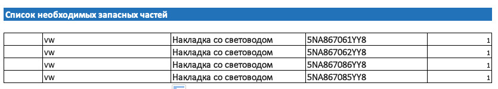
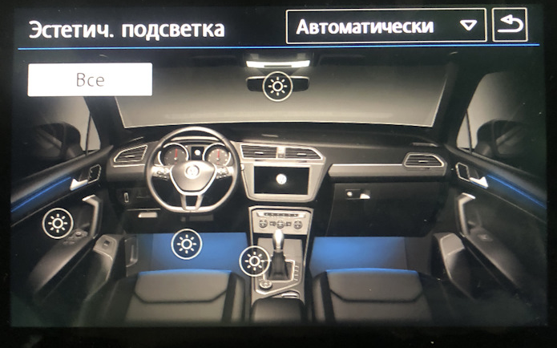
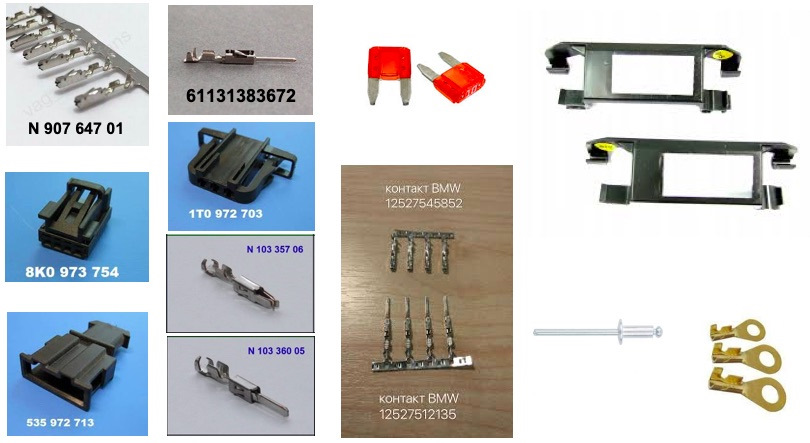
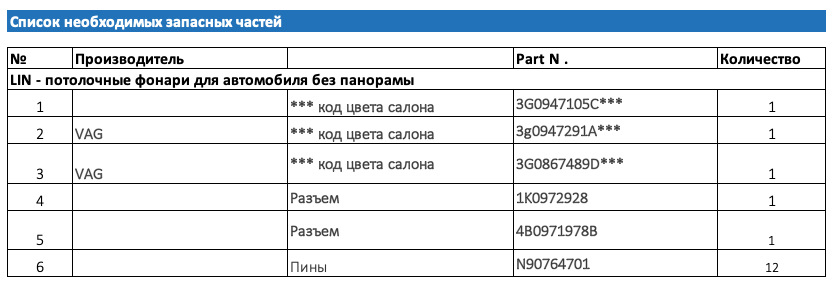
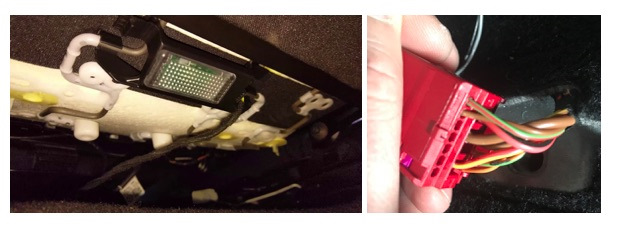
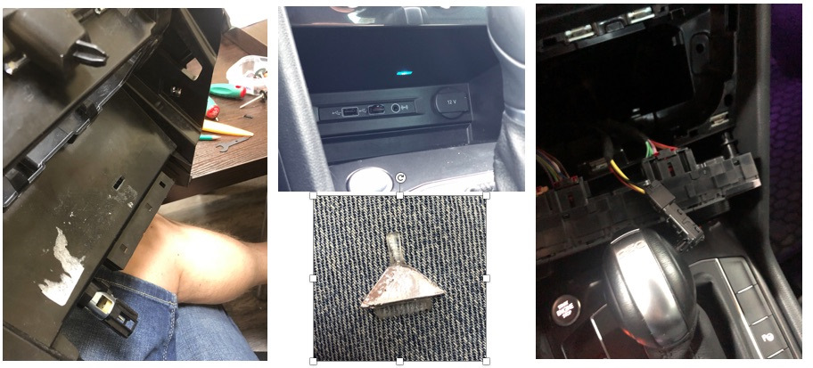
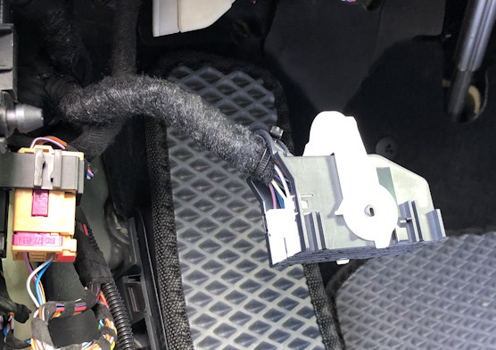
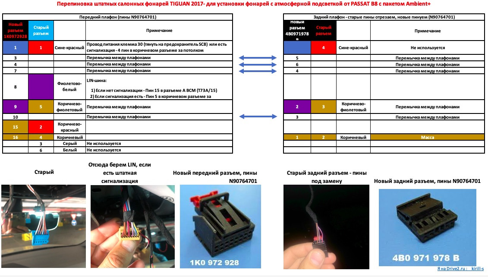

# Установка и настройка RGB подсветки

Данный материал является копией ресурса: https://www.drive2.ru/l/553166225153198981/  

!!! info "Что включает в себя RGB подсветка"
    1. Меняющая цвет подсветка декора в дверях  
    2. Меняющая цвет подсветка ног  
    3. Меняющая цвет подсветка ниши центральной консоли  
    4. Монохромная фоновая подсветка плафона освещения салона  
    5. Регулировка цвета и яркости через штатное меню в ГУ  
    6. Привязка цветовых профилей к профилям движения  
    7. Привязка цветов к водителю (или ключу)  
    8. Подсветка карманов дверей (номера плафонов 8W0919390A, B, C, D)  

### Файлы и ссылки на инструкции
+ [ODIS_E Привязка профилей движения для 09 блока (адаптации)](../odis-files/09 – LIN RGB.PRE)

### Требования предъявляются к комплектации автомобиля:

1. Блок бортовой сети BCM версии High 5Q0937084CG/CQ/DD/DH.  
Версия High устанавливалась в России только на автомобили с подсветкой панорамной крыши или на Scoda Octavia со штатной цветной подсветкой.  
На любых других комплектациях авто НЕОБХОДИМА замена ВСМ. Версии 5Q0937084CF/CP/DC многоцветную подсветку не поддерживают.  
Также полностью весь пакет нельзя внедрить на любом ВСМ 5Q0937086 Passat B8, Kodiaq, на этом BCM не будет работать многоцветная подсветка ног.  
  
2. Монохромная подсветка дверных карт, если ее нет, необходима замена декора дверей (устанавливать дверные блоки в задние двери необязательно)  


3. Для реализации функций привязки цветов к профилю движения важно убедиться, что гейтвей (J533 или 19 блок), имеет версию софта не ниже 4344 или 5344 и имеет индекс Q и выше, в противном случае, ищем тех кто умеет прошивать и заливать параметрию

## Теория

1. Все цветные диоды в машине управляются шиной LIN, поэтому проводов на диод идет 3 +, -, Lin-шина  
2. LIN RGB в ВСМ – пин 29 в разъеме С  
3. Потолочные плафоны атмосферной подсветки аналогично управляются по LIN  
4. LIN потолочных плафонов в ВСМ – пин 15 в разъеме А  
5. Существует несколько каналов атмосферной подсветки, которые мы можем регулировать с ГУ: двери, ноги, передняя панель, центральная консоль, потолочный плафон, подсветка панорамы.  

На каждой из машин на платформе MQB есть свои особенности и регулировка некоторых каналов может отсутствовать:  

+ Tiguan умеет все  
+ Гольф не умеет отображать и регулировать потолочный плафон  
+ Октавия не умеет отображать и регулировать центральную консоль


  
### Схема


J519 – BCM  
L2** — диоды  
SC8 – предохранитель  

### Инструмент

1. Набор лопаток для разбора салона  
2. Дрель со сверлом по металлу на 4,5-5 мм  
3. Dremel или что-то для выпиливания отверстия в нише центральной консоли  
4. Обжимку для пинов  
5. Острый нож для подготовки диодов к установке  

### Запчасти

Запчасти для проводки, необходимой для установки RGB диодов в двери, ноги центральную консоль:  





Дальше по-желанию, можно обойтись и без этого. Элементы нужны для того, чтобы сделать «разрыв» проводки между дверью и обшивкой (на передних дверях) и обусловлено логикой укладки проводки в них — часть проводки идет по обшивке, часть по двери и имея разъем проще все разбирать при необходимости.  


Потолочный плафон  

По верхним плафонам для машин с панорамой:  
Передний плафон — 3G0947105E  
Задний 1 — 3G9947292A  
Задний 2 — 3G9947291A  

## Прокладка всей необходимой проводки

1. Если комплектацией вашего авто не предусмотрено наличие в блоке предохранителей 8 предохранителя (SC8), то его необходимо установить, все питание RGB подсветки сведено на этот предохранитель.  
2. Cнимаем клемму с аккумулятора.  
3. Снимаем обшивки с дверей, внутренние пороги в салоне, нижние части стоек дверей в салоне, снимаем передние сидения для удобства.  

#### Двери  
1. Отсверливаем динамики (высверливаем клепки), размыкаем дверные разъемы и демонтируем дверные жгуты проводки. ВНИМАНИЕ – когда разматываем штатную изоленту, замечаем все заводские размеры установки уплотнителей, длину намотки изоленты и тд. Если потом при сборке ошибетесь, есть шанс ближайшей зимой начать ремонтировать проводку в гибкой части соединения.  
2. В дверные жгуты проводки вплетаем 3 провода: 2 сечением 0,35 мм, 1 сечением 0,5 мм.  
3. Со стороны дверного разъема пинуем провода соответствующими пинами (12527545852 для разъемов в дверях).  
4. Дотягиваем провода до места установки диодов на обшивках, предусмотрев на передних дверях разрыв проводки между дверью и обшивкой (необходимый набор деталей написал выше).  
5. Пинуем новый разъем диода пинами N90764701: Распиновка разъемов диодов и сечение проводов: 1 — плюс 0,5 мм, 2 – LIN 0,35 мм, 4 — масса 0,35 мм.  
6. Предварительно все прозвонив и проверив на качество обжатия устанавливаем все на места, заклепываем динамики.  
7. Запиновываем 3 провода в разъемы расположенные на стойках дверей, провод LIN-шины тянем к ВСМ, питание «плюс» к установленному ранее предохранителю, массу обжимаем кольцом и крепим на ближайший болт массы, пины 12527512135.  
8. Пока салон не собираем, переходим к проводке RGB подсветки ног.  

  
#### Сидения  
1. Размыкаем красный разъем сидения, разъем подушек безопасности и разбираем разъем со стороны сидения.  
2. Прокладываем по штатной проводке три провода 2 сечением 0,35 мм, 1 сечением 0,5 мм от разъема сидения к месту установки диода.  
3. Запиновываем разъем диода пинами N90764701: Распиновка разъемов диодов и сечение проводов: 1 — плюс 0,5 мм, 2 – LIN 0,35 мм, 4 — масса 0,35 мм.  
4. Запиновываем второй конец проводов пинами приобретенными для разъема сидения.  
5. Снимаем с фиксатора ответную часть разъема сидения и запиновываем в нее 3 провода соответствующими пинами — 2 сечением 0,35 мм, 1 сечением 0,5 мм, провод “плюс” тянем к ранее установленному предохранителю, LIN – к ВСМ, массу обжимаем колечком и накручиваем на ближайший болт массы.  
6. Устанавливаем кронштейны 4M08815479B9 к пружинам под сидениями и в них фонари подсветки ног.  
7. Собираем все в обратном порядке.  

  
#### Консоль  
1. Снимаем накладку климата.  
2. Снимаем климат.  
3. Снимаем боковину тоннеля.  
4. Жгутуем провода 2 шт. сечением 0,35 мм, 1 сечением 0,5 мм.  
5. Запиновываем разъем диода.  
6. Протягиваем провода “плюс” к установленному предохранителю, LIN – к ВСМ, массу обжимаем кольцом и крепим к ближайшему болту массы или берем болт с гайкой и прикручиваем к железному усилителю консоли, масса на нем хорошая.  
7. Переходим к подключению всего этого дела в ВСМ.  

  
#### Передние фонари подсветки ног  
1. Жгутуем провода 2 шт. сечением 0,35 мм, 1 сечением 0,5 мм.  
2. Запиновываем разъем диода.  
3. Протягиваем провода “плюс” к установленному предохранителю, LIN – к ВСМ, массу обжимаем кольцом и крепим к ближайшему болту массы.  
4. Если с завода отсутствуют штатные крепления фонарей, то покупаем их и устанавливаем на место.  
5. Устанавливаем плафон ног водителя в штатное место над педалью газа, подключаем разъем.  
6. Устанавливаем плафон ног пассажира в штатное место над правой ногой пассажира.  

### Подключение LIN шины в ВСМ

1. Снимаем разъем с ВСМ (ближний к нам разъем), отгибая белую скобу, одновременно нажимая блокиратор, возможно придется попотеть, место неудобное.  
2. Разрезаем стяжку, которая держит наружный корпус.  
3. Отжимаем усики и вынимаем 2 внутренние части разъема.  
4. Находим гнездо по 29 пин.  
5. Обжимаем провод необходимой длины пином N90764701.  
6. Вставляем обжатый провод в гнездо 29 пина.  
7. Удобно жгутуем провод и соединяем его со всеми ранее протянутыми LIN-проводами (4 от дверей, 4 от сидения, 1 от консоли) по принципу «звезды», у VAG существуют специальные коннекторы для этого, но я так сильно не морочился и скрутил все и обжал гильзой.  
8. Изолируем все и укладываем.  
9. Собираем все в обратном порядке, тут и понадобится кабельная стяжка.  
10. LIN протянут.  


### Подключение к предохранителю

Аналогично предыдущему подключению LIN собираем все провода “плюс” в кучу и подключаем к проводу, запитанному от предохранителя, который ранее установили.

### Установка диодов в двери

1. Механически дорабатываем диоды по образцу штатного монохромного, форма и размер посадочных мест диода пассата и тигуана не совпадают, передние и задние диоды имеют разные замки, при установке диодов на место нужно это учесть.  
2. Устанавливаем их на штатные места в полоску подсветки.  
3. Фиксируем шлейфы так, чтобы при установке обшивки они не повредились.  
4. Собираем обшивки дверей на место.  

### Установка диода в консоль

1. Лучше всего снимаем консоль полностью по инструкции из ELSA
2. Пилим дремелем окошко под световод
3. Изготавливаем световод
4. Вставляем световод в консоль, фиксируем
5. Надеваем на световод диод и подключаем разъем
6. Проводка для потолочного плафона с атмосферной подсветкой

### Установка атмосферных плафонов в потолок

1. Поддеваем лопаткой стеклянную часть и отсоединяем ее от разъемов.  
2. Вставляем лопатку в пазы на самом плафоне и вынимаем часть с лампочкой.  
3. Поддеваем лопаткой и снимаем накладку кнопок Глонасс.  
4. Откручиваем 4 самореза Torx по периметру.  
5. Снимаем переднюю накладку плафона вместе с накладкой-колокольчиком к зеркалу.  
6. Отсоединяем разъемы и снимаем раму.  
7. Перепиновываем разъемы (используя пины N90764701):  


## Кодирование

``` yaml title="логин-пароль: 31347"
Блок 09 → Адаптация:
Interior_light_lamp_configuration:
- Ambiente_Applikationsleisten_in_Tuertafel: установл. (полоски в двери)
- Ambiente_Lautsprecher: не установл.
- Ambiente_Applikationsleisten_in_Instrumententafel: не установл.
- Cockpitbeleuchtung: не установл.
- Mittelkonsolenbeleuchtung: установл. (фонарик в центральной консоли)
- Dachbeleuchtung: установл. (потолочный плафон Ambient+)
- Panoramaschiebedachbeleuchtung: не установл.
- Fussraumbeleuchtung: установл. (подсветка ног)
- LIN-Dachkonsole lokal aktivierbar: акт. (авктивирует управление потолочным плафоном по LIN)
- Ambientemenue mit globalem aus: акт. (Общая регулировка атмосферной подсветки)
- Ambientemenue mit alle Zonen: акт. (Регулировка зон по отдельности)
- Ambient_Farbliste_HMI: акт. (активация показа шкалы выбора цвета)
- Ambience_light_colorlist_default: 1
→ Применить
```

``` yaml title="логин-пароль: 31347"
Блок 09 → Адаптация:
Interior_light_2nd_generation:
- Aufloesung Dimmzeit: 0.8
- weicher Farbwechsel: акт.
- Tuertafelbeleuchtung mehrfarbig: акт. (полоска в дверях цветная)
- Instrumententafelbeleuchtung mehrfarbig: не акт.
- Cockpitbeleuchtung mehrfarbig: не акт.
- Lautsprecherbeleuchtung mehrfarbig: не акт.
- Mittelkonsolenbeleuchtung mehrfarbig: акт. (диод в центральной консоли цветной)
- Dachbeleuchtung mehrfarbig: не акт. (фонарь в потолке одноцветный)
- Panoramaschiebedachbeleuchtung mehrfarbig: не акт.
- Panoramaschiebedachbeleuchtung bei geoeffnetem Rollo deaktivieren: не акт.
- BAP Farbwert Farbe 1: 1
- BAP Farbwert Farbe 2: 4
- BAP Farbwert Farbe 3: 5
- Defaultwert Ambienteprofil Mittelkonsole: 80 (яркость плафонов по умолчанию)
- Defaultwert Ambienteprofil Dach: 80 (яркость плафонов по умолчанию)
- Defaultwert Ambienteprofil Farbe: 8
- Defaultwert Ambienteprofil Fussraum: 80 (яркость плафонов по умолчанию)
- Defaultwert Ambienteprofil Tuer: 80 (яркость плафонов по умолчанию)
- Ambiente_Farbliste_HMI_mit_Farbtransformation: акт. (включает раздельное назначение цветов на экране и на диодах для подбора соответствия экранного цвета цвету, который в состоянии отобразить диод)
- Helligkeit_Tuertafelbeleuchtung_nicht_berechnen: не акт. (выключаем запрет на регулировку)
- Helligkeit Instrumententafelbeleuchtung nicht berechnen: акт.
- Helligkeit Cockpitbeleuchtung nicht berechnen: акт.
- Helligkeit Lautsprecherbeleuchtung nicht berechnen: акт.
- Helligkeit Mittelkonsolenbeleuchtung nicht berechnen: не акт. (выключаем запрет на регулировку)
- Helligkeit Dachbeleuchtung nicht berechnen: не акт. (выключаем запрет на регулировку)
- Helligkeit Panoramaschiebedachbeleuchtung nicht berechnen: акт.
- Farbausgabe Tuertafelbeleuchtung nicht berechnen: не акт. (выключаем запрет на регулировку)
- Farbausgabe Instrumententafelbeleuchtung nicht berechnen: акт.
- Farbausgabe Cockpitbeleuchtung nicht berechnen: акт.
- Farbausgabe Lautsprecherbeleuchtung nicht berechnen: акт.
- Farbausgabe Mittelkonsolenbeleuchtung nicht berechnen: не акт.(выключаем запрет на регулировку)
- Farbausgabe Dachbeleuchtung nicht berechnen: не акт.(выключаем запрет на регулировку)
- Farbausgabe Panoramaschiebedachbeleuchtung nicht berechnen: акт.
- LIN-Dachkonsole mit Flaechenlicht: установл. (фоновая подсветка потолочного фонаря)
- Ambiente_Farbwahl_FPA_waehlbare_Kopplung: акт. (привязка профиля движения)
- Ambiente_Fahrprofil_Individual: 1
- Ambiente_Farbwahl_FPA_waehlbare_Kopplung_Status_hmi_default: сопряжены (привязка профиля движения)
→ Применить
```

Яркость и плавность регулировки каналов
``` yaml title="логин-пароль: 31347"
Блок 09 → Адаптация:
Interior_light_parameter:
- p_adaption_kundenwunsch_tuer: 0.67 (линейность регулировки)
- p_helligkeit_entriegelt_tueren: 100
- p_helligkeit_max_tueren: 100
- p_helligkeit_HD_auf_zuendung_ein_tueren: 126
- p_helligkeit_HD_auf_zuendung_aus_tueren: 127
- p_helligkeit_dieseTuer_auf_zuendung_ein_tueren: 100
- p_helligkeit_andereTuer_auf_zuendung_ein_tueren: 100
- p_helligkeit_Fzg_geschlossen_zuendung_ein_tueren: 126
- p_helligkeit_dieseTuer_auf_zuendung_aus_tueren: 100
- p_helligkeit_andereTuer_auf_zuendung_aus_tueren: 100
- p_helligkeit_einausstieg_tueren: 100
- p_helligkeit_Fzg_geschlossen_zuendung_aus_tueren: 127
- p_helligkeit_Tueren_geschlossen_HD_auf_zuendung_aus_tueren: 100
- p_helligkeit_Tueren_geschlossen_HD_zu_zuendung_aus_tueren: 100
- p_helligkeit_Tueren_geschlossen_schluessel_ab_tueren: 100
- p_helligkeit_Fzg_geschlossen_schluessel_ab_tueren: 100

- p_adaption_kundenwunsch_fussraum: 0.67
- p_helligkeit_entriegelt_fussraum: 100
- p_helligkeit_max_fussraum: 100
- p_helligkeit_HD_auf_zuendung_ein_fussraum: 126
- p_helligkeit_HD_auf_zuendung_aus_fussraum: 127
- p_helligkeit_dieseTuer_auf_zuendung_ein_fussraum: 100
- p_helligkeit_andereTuer_auf_zuendung_ein_fussraum: 100
- p_helligkeit_Fzg_geschlossen_zuendung_ein_fussraum: 126
- p_helligkeit_dieseTuer_auf_zuendung_aus_fussraum: 100
- p_helligkeit_andereTuer_auf_zuendung_aus_fussraum: 100
- p_helligkeit_einausstieg_fussraum: 100
- p_helligkeit_Fzg_geschlossen_zuendung_aus_fussraum: 127
- p_helligkeit_Tueren_geschlossen_HD_auf_zuendung_aus_fussraum: 100
- p_helligkeit_Tueren_geschlossen_HD_zu_zuendung_aus_fussraum: 100
- p_helligkeit_Tueren_geschlossen_schluessel_ab_fussraum: 100
- p_helligkeit_Fzg_geschlossen_schluessel_ab_fussraum: 100

- p_adaption_kundenwunsch_miko: 0.67
- p_helligkeit_entriegelt_miko: 100
- p_helligkeit_max_miko: 100
- p_helligkeit_HD_auf_zuendung_ein_miko: 126
- p_helligkeit_HD_auf_zuendung_aus_miko: 127
- p_helligkeit_dieseTuer_auf_zuendung_ein_miko: 100
- p_helligkeit_andereTuer_auf_zuendung_ein_miko: 100
- p_helligkeit_Fzg_geschlossen_zuendung_ein_miko: 126
- p_helligkeit_dieseTuer_auf_zuendung_aus_miko: 100
- p_helligkeit_andereTuer_auf_zuendung_aus_miko: 100
- p_helligkeit_einausstieg_miko: 100
- p_helligkeit_Fzg_geschlossen_zuendung_aus_miko: 100
- p_helligkeit_Tueren_geschlossen_HD_auf_zuendung_aus_miko: 100
- p_helligkeit_Tueren_geschlossen_HD_zu_zuendung_aus_miko: 100
- p_helligkeit_Tueren_geschlossen_schluessel_ab_miko: 100
- p_helligkeit_Fzg_geschlossen_schluessel_ab_miko: 100

- p_adaption_kundenwunsch_dach: 1
- p_helligkeit_entriegelt_dach: 100
- p_helligkeit_max_dach: 100
- p_helligkeit_HD_auf_zuendung_ein_dach: 100
- p_helligkeit_HD_auf_zuendung_aus_dach: 100
- p_helligkeit_dieseTuer_auf_zuendung_ein_dach: 100
- p_helligkeit_andereTuer_auf_zuendung_ein_dach: 100
- p_helligkeit_Fzg_geschlossen_zuendung_ein_dach: 126
- p_helligkeit_dieseTuer_auf_zuendung_aus_dach: 100
- p_helligkeit_andereTuer_auf_zuendung_aus_dach: 100
- p_helligkeit_einausstieg_dach: 100
- p_helligkeit_Fzg_geschlossen_zuendung_aus_dach: 100
- p_helligkeit_Tueren_geschlossen_HD_auf_zuendung_aus_dach: 100
- p_helligkeit_Tueren_geschlossen_HD_zu_zuendung_aus_dach: 100
- p_helligkeit_Tueren_geschlossen_schluessel_ab_dach: 100
- p_helligkeit_Fzg_geschlossen_schluessel_ab_dach: 100
→ Применить
```

Отображение солнышек и графики на экране ГУ
``` yaml title="логин-пароль: 31347"
Блок 09 → Адаптация:
Освещение салона, параметры / Interior_light_parameter:
- p_ambienteumfang_mehrfarbig_HMI: 100
- p_ambienteumfang_mehrfarbig_HMI_2: 100
- p_ambienteumfang_mehrfarbig_HMI_3: 0
- p_ambienteumfang_mehrfarbig_HMI_4: 0
→ Применить
```

Отображение солнышек и монохромной графики на экране ГУ
``` yaml title="логин-пароль: 31347"
Блок 09 → Адаптация:
Освещение салона, параметры / Interior_light_parameter:
- p_ambientelicht_verbauinformation_HMI: 1
- p_ambientelicht_verbauinformation_HMI_2: 10001
- p_ambientelicht_verbauinformation_HMI_3: 10
- p_ambientelicht_verbauinformation_HMI_4: 0
→ Применить
```

Скорость смены цвета мс
``` yaml title="логин-пароль: 31347"
Блок 09 → Адаптация:
Освещение салона, параметры / Interior_light_parameter:
- p_t_HMI_verzoegerung_helligkeitswerte: 200
→ Применить
```

Прописывание физических диодов
``` yaml title="логин-пароль: 31347"
Блок 09 → Адаптация:
ambient_lighting_lin_slaves_modules:
- pa_einzeladresse_slave_1: 1
- pa_verbauinfo_slave_1: установл.
- pa_fehlerort_slave_1: 0

- pa_einzeladresse_slave_2: 2
- pa_verbauinfo_slave_2: установл.
- pa_fehlerort_slave_2: 0

- pa_einzeladresse_slave_3: 3
- pa_verbauinfo_slave_3: установл.
- pa_fehlerort_slave_3: 0

- pa_einzeladresse_slave_4: 4
- pa_verbauinfo_slave_4: установл.
- pa_fehlerort_slave_4: 0

- pa_einzeladresse_slave_5: 0
- pa_verbauinfo_slave_5: не установл.
- pa_fehlerort_slave_5: 0

- pa_einzeladresse_slave_6: 0
- pa_verbauinfo_slave_6: установл.
- pa_fehlerort_slave_6: 0

- pa_einzeladresse_slave_7: 0
- pa_verbauinfo_slave_7: не установл.
- pa_fehlerort_slave_7: 0

- pa_einzeladresse_slave_8: 0
- pa_verbauinfo_slave8: не установл.
- pa_fehlerort_slave8: 0

- pa_einzeladresse_slave_9: 0
- pa_verbauinfo_slave_9: не установл.
- pa_fehlerort_slave_9: 0

- pa_einzeladresse_slave_10: 0
- pa_verbauinfo_slave_10: не установл.
- pa_fehlerort_slave_10: 0

- pa_einzeladresse_slave_11: 0
- pa_verbauinfo_slave_11: не установл.
- pa_fehlerort_slave_11: 0

- pa_einzeladresse_slave_:12: 0
- pa_verbauinfo_slave_12: не установл.
- pa_fehlerort_slave_12: 0

- pa_einzeladresse_slave_13: 0
- pa_verbauinfo_slave_13: не установл.
- pa_fehlerort_slave_13: 0

- pa_einzeladresse_slave_14: 0
- pa_verbauinfo_slave_14: не установл.
- pa_fehlerort_slave_14: 0

- pa_einzeladresse_slave_15: 0
- pa_verbauinfo_slave_15: не установл.
- pa_fehlerort_slave_15: 0

- pa_einzeladresse_slave_16: 0
- pa_verbauinfo_slave_16: не установл.
- pa_fehlerort_slave_16: 0

- pa_einzeladresse_slave_17: 0
- pa_verbauinfo_slave_17: не установл.
- pa_fehlerort_slave_17: 0

- pa_einzeladresse_slave_18: 0
- pa_verbauinfo_slave_18: не установл.
- pa_fehlerort_slave_18: 0

- pa_einzeladresse_slave_19: 0
- pa_verbauinfo_slave_19: не установл.
- pa_fehlerort_slave_19: 0

- pa_einzeladresse_slave_20: 0
- pa_verbauinfo_slave_20: не установл.
- pa_fehlerort_slave_20: 0
→ Применить
```

Прописывание групп регулировки диодов и их назначение
``` yaml title="логин-пароль: 31347"
Блок 09 → Адаптация:
ambient_lighting_lin_slaves_groups:
- pa_verbauinfo_gruppe_1: многоцветный
- pa_lichtfunktion_gruppe_1: Дверь
- pa_korrekturfaktor_gruppe_1: 1

- pa_verbauinfo_gruppe_2: многоцветный
- pa_lichtfunktion_gruppe_2: Центральная консоль
- pa_korrekturfaktor_gruppe_2: 1.2

- pa_verbauinfo_gruppe_3: не установл.
- pa_lichtfunktion_gruppe_3: Дверь
- pa_korrekturfaktor_gruppe_3: 1

- pa_verbauinfo_gruppe_4: не установл.
- pa_lichtfunktion_gruppe_4: Дверь
- pa_korrekturfaktor_gruppe_4: 1

- pa_verbauinfo_gruppe_5: не установл.
- pa_lichtfunktion_gruppe_5: Дверь
- pa_korrekturfaktor_gruppe_5: 1

- pa_verbauinfo_gruppe_6: не установл.
- pa_lichtfunktion_gruppe_6: Дверь
- pa_korrekturfaktor_gruppe_6: 1

- pa_verbauinfo_gruppe_7: не установл.
- pa_lichtfunktion_gruppe_7: Дверь
- pa_korrekturfaktor_gruppe_7: 1

- pa_verbauinfo_gruppe_8: не установл.
- pa_lichtfunktion_gruppe_8: Дверь
- pa_korrekturfaktor_gruppe_8: 1

- pa_verbauinfo_gruppe_9: не установл.
- pa_lichtfunktion_gruppe_9: Дверь
- pa_korrekturfaktor_gruppe_9: 1

- pa_verbauinfo_gruppe_10: не установл.
- pa_lichtfunktion_gruppe_10: Дверь
- pa_korrekturfaktor_gruppe_10: 1

- pa_verbauinfo_gruppe_11: одноцветный
- pa_lichtfunktion_gruppe_11: Пространство для ног
- pa_korrekturfaktor_gruppe_11: 1.2

- pa_verbauinfo_gruppe_12: не установл.
- pa_lichtfunktion_gruppe_12: Дверь
- pa_korrekturfaktor_gruppe_12: 1

- pa_verbauinfo_gruppe_13: не установл.
- pa_lichtfunktion_gruppe_13: Дверь
- pa_korrekturfaktor_gruppe_13: 1

- pa_verbauinfo_gruppe_14: 3_not_defined
- pa_lichtfunktion_gruppe_14: Пространство для ног
- pa_korrekturfaktor_gruppe_14: 1.2

- pa_verbauinfo_gruppe_15: не установл.
- pa_lichtfunktion_gruppe_15: Дверь
- pa_korrekturfaktor_gruppe_15: 1
→ Применить
```

Список базовых цветов
``` yaml title="логин-пароль: 31347"
Блок 09 → Адаптация:
Ambience_lightning_color_list:
- Rotwert Farbe 1: 217
- Gruenwert Farbe 1: 221
- Blauwert Farbe 1: 235

- Rotwert Farbe 2: 255
- Gruenwert Farbe 2: 172
- Blauwert Farbe 2: 5

- Rotwert Farbe 3: 253
- Gruenwert Farbe 3: 108
- Blauwert Farbe 3: 55

- Rotwert Farbe 4: 222
- Gruenwert Farbe 4: 70
- Blauwert Farbe 4: 20

- Rotwert Farbe 5: 252
- Gruenwert Farbe 5: 116
- Blauwert Farbe 5: 240

- Rotwert Farbe 6: 132
- Gruenwert Farbe 6: 76
- Blauwert Farbe 6: 222

- Rotwert Farbe 7: 0
- Gruenwert Farbe 7: 102
- Blauwert Farbe 7: 225

- Rotwert Farbe 8: 1
- Gruenwert Farbe 8: 192
- Blauwert Farbe 8: 255

- Rotwert Farbe 9: 0
- Gruenwert Farbe 9: 204
- Blauwert Farbe 9: 0

- Rotwert Farbe 10: 182
- Gruenwert Farbe 10: 255
- Blauwert Farbe 10: 57
→ Применить
```

Вторая группа настраиваемых цветов
``` yaml title="логин-пароль: 31347"
Блок 09 → Адаптация:
Ambience_lightning_color_list_2:
- Rotwert Farbe 11: 255
- Gruenwert Farbe 11: 255
- Blauwert Farbe 11: 0

- Rotwert Farbe 12: 5
- Gruenwert Farbe 12: 102
- Blauwert Farbe 12: 192

- Rotwert Farbe 13: 222
- Gruenwert Farbe 13: 70
- Blauwert Farbe 13: 21

- Rotwert Farbe 14: 1
- Gruenwert Farbe 14: 204
- Blauwert Farbe 14: 0

- Rotwert Farbe 15: 80
- Gruenwert Farbe 15: 80
- Blauwert Farbe 15: 80
→ Применить
```

Цвета для диодов
``` yaml title="логин-пароль: 31347"
Блок 09 → Адаптация:
Ambience_lightning_color_list_lin:
- Rotwert_Farbe_1_lin: 120
- Gruenwert_Farbe_1_lin: 231
- Blauwert_Farbe_1_lin: 71

- Rotwert_Farbe_2_lin: 255
- Gruenwert_Farbe_2_lin: 200
- Blauwert_Farbe_2_lin: 0

- Rotwert_Farbe_3_lin: 245
- Gruenwert_Farbe_3_lin: 73
- Blauwert_Farbe_3_lin: 6

- Rotwert_Farbe_4_lin: 255
- Gruenwert_Farbe_4_lin: 9
- Blauwert_Farbe_4_lin: 2

- Rotwert_Farbe_5_lin: 255
- Gruenwert_Farbe_5_lin: 134
- Blauwert_Farbe_5_lin: 106

- Rotwert_Farbe_6_lin: 106
- Gruenwert_Farbe_6_lin: 140
- Blauwert_Farbe_6_lin: 162

- Rotwert_Farbe_7_lin: 0
- Gruenwert_Farbe_7_lin: 110
- Blauwert_Farbe_7_lin: 254

- Rotwert_Farbe_8_lin: 29
- Gruenwert_Farbe_8_lin: 255
- Blauwert_Farbe_8_lin: 153

- Rotwert_Farbe_9_lin: 0
- Gruenwert_Farbe_9_lin: 255
- Blauwert_Farbe_9_lin: 4

- Rotwert_Farbe_10_lin: 57
- Gruenwert_Farbe_10_lin: 132
- Blauwert_Farbe_10_lin: 0
→ Применить
```

Вторая часть цветов для диодов
``` yaml title="логин-пароль: 31347"
Блок 09 → Адаптация:
Ambience_lightning_color_list_lin_2:
- Rotwert_Farbe_11_lin: 255
- Gruenwert_Farbe_11_lin: 255
- Blauwert_Farbe_11_lin: 0

- Rotwert_Farbe_12_lin: 120
- Gruenwert_Farbe_12_lin: 231
- Blauwert_Farbe_12_lin: 71

- Rotwert_Farbe_13_lin: 120
- Gruenwert_Farbe_13_lin: 230
- Blauwert_Farbe_13_lin: 80

- Rotwert_Farbe_14_lin: 121
- Gruenwert_Farbe_14_lin: 231
- Blauwert_Farbe_14_lin: 71

- Rotwert_Farbe_15_lin: 130
- Gruenwert_Farbe_15_lin: 241
- Blauwert_Farbe_15_lin: 80
→ Применить
```

Профили движения и номера цветов
``` yaml title="логин-пароль: 31347"
Блок 09 → Адаптация:
Ambientelicht Zuordnung der Farbe zum Fahrprofil:
- pFahrprofil_0: 1 профиль при заглушенной машине
- pFahrprofil_1: 1
- pFahrprofil_2: 7 обычный
- pFahrprofil_3: 4 спорт
- pFahrprofil_4: 6 бездорожье
- pFahrprofil_5: 9 эко
- pFahrprofil_6: 8
- pFahrprofil_7: 5 индивидуальный
- pFahrprofil_8: 1
- pFahrprofil_9: 1
- pFahrprofil_10: 8 снег
- pFahrprofil_11: 1
- pFahrprofil_12: 1
- pFahrprofil_13: 1
- pFahrprofil_14: 1
- pFahrprofil_15: 1
→ Применить
```

``` yaml
Блок 19 → Кодирование:
FPA_Funktion_AMB: Активировать
→ Применить (с перезагрузкой блока)
```

Увеличиваем скорость переключения профилей
``` yaml
Блок 19 → Адаптация:
Driving Profile Selection Parameter:
- Driving Profile Selection Toogle Time Adaptation: вместо 2000 мс ставим 0
→ Применить
```

Кодировки для подсветки карманов дверей
``` yaml title="логин-пароль: 31347"
Блок 09 → Адаптация:
ambient_lighting_lin_slaves_groups:
- pa_verbauinfo_gruppe_7: Multi_color
- pa_lichtfunktion_gruppe_7: door
- pa_korrekturfaktor_gruppe_7: 1.00
- pa_verbauinfo_gruppe_8: Multi_color
- pa_lichtfunktion_gruppe_8: door
- pa_korrekturfaktor_gruppe_8: 1.00
- pa_verbauinfo_gruppe_9: Multi_color
- pa_lichtfunktion_gruppe_9: door
- pa_korrekturfaktor_gruppe_9: 1.00
- pa_verbauinfo_gruppe_10: Multi_color
- pa_lichtfunktion_gruppe_10: door
→ Применить
```