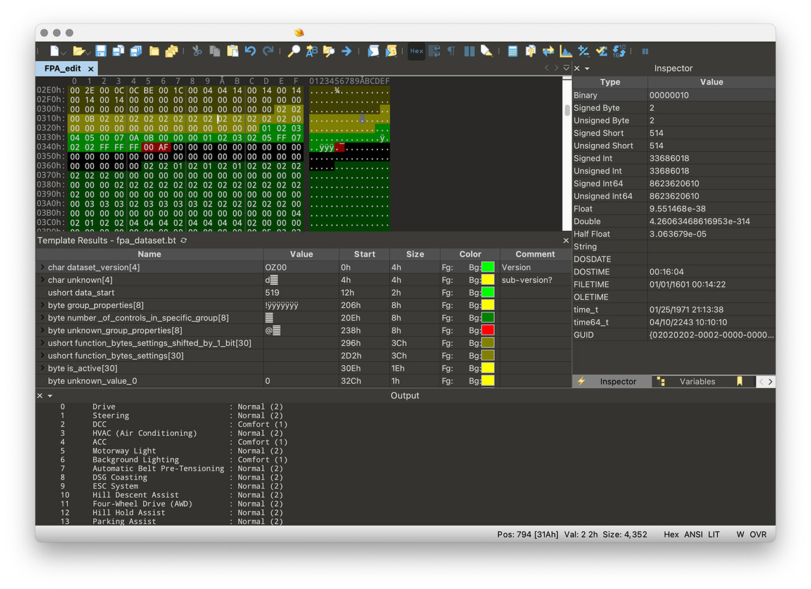

# Setting the choice of driving modes (FPA parameters)

To edit FPA parameters you need to set:  
- 010 Editor (https://www.sweetscape.com/010editor/)  
- fpa_dataset.bt template (https://github.com/jilleb/MQB-FPA/)  
- fpa_dataset_save.1sc script (https://github.com/jilleb/MQB-FPA/)

## Parameter

We are interested in the parameters of block 19, located at address 0x0000B80.  
The first 4 bytes of the parameter are the version. For example, 0x4E, 0x43.0x30.0x30 = NC00.

Parameters can only be obtained using ODIS online.

## Editing parameters in 010 Editor

1. Open the file with the downloaded FPA parameters and copy all the bits that are in the <PARAMETER_DATA> section.
2. Go to 010 editor, create a new document and switch it to hex-mode (View → Edit as → HEX).
3. Paste the copied bytes into the editor (Edit → Paste from → Paste from HEX text).
4. After this, you need to run the fpa_dataset template (Run template). The values ​​in the editor will be marked in different colors:
   1. Green = known and verified values,
   2. Yellow = possible values,
   3. Red = unknown
   4. Blue = for hybrid cars.



## What can be done

1. Turn off the lit Mode LED on the puck in standard mode (mode_light_on = 00).
2. The ability of the DSG to save the selected mode after turning off the ignition (FFFE value).
3. All-wheel drive settings: Eco, Normal, Offroad.
4. Ability to enable/disable DSG coasting mode.
5. Engine settings.
6. Fine-tuning modes.
7. Enable DCC (if installed).

## Saving parameters

The script "fpa_dataset_save.1sc" is used to generate parameters for ODIS or VCP.  
  
In the script file you can set:
```
saveFormat = 0; // VCP format  
saveFormat = 1; // ODIS format  
```


```
saveAddress = 0; // This will use 0x0B80 as flashing address (newer gateway firmware versions)  
saveAddress = 1; // This will use 0x2388 as flashing address (older gateway firmware versions)  
```


After this, using the script, you need to download the corrected parameters and upload it to block 19.