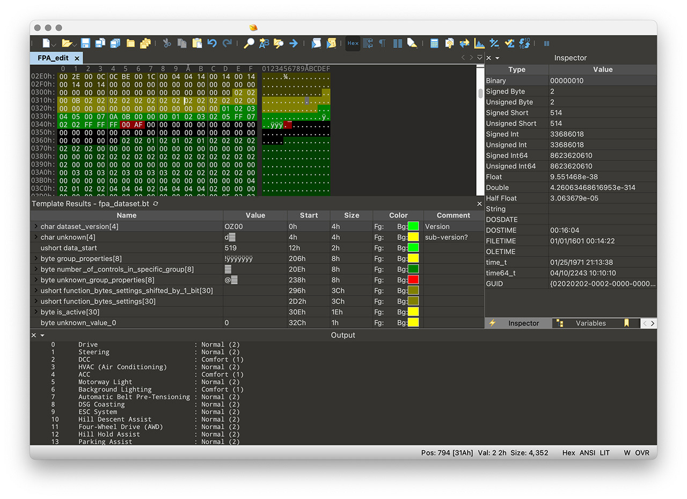

# Настройка выбора режимов движения (FPA параметрия)

Для правок FPA параметрии необходимо установить:  
- редактор 010 Editor (https://www.sweetscape.com/010editor/)  
- fpa_dataset.bt темплейт (https://github.com/jilleb/MQB-FPA/)  
- fpa_dataset_save.1sc скрипт (https://github.com/jilleb/MQB-FPA/)

## Параметрия

Нас интересует параметрия 19 блока, расположенная по адресу 0x0000B80.  
Первые 4 байта параметрии это версия. Например, 0x4E, 0x43,0x30,0x30 = NC00.

Достать параметрию можно только с помощью ODIS online.  

## Редактирование параметрии в 010 Editor

1. Открываем файл со скаченной FPA параметрией и копируем все биты, что находятся в секции <PARAMETER_DATA>.  
2. Заходим в 010 editor, создаем новый документ и переключаем его в hex-mode (View → Edit as → HEX).   
3. Вставляем скопированные байты в редактор (Edit → Paste from → Paste from HEX text).
4. После этого необходимо запустить fpa_dataset шаблон (Run template). Значения в редакторе будут помечены разными цветами:  
   1. Зеленый = известные и проверенные значения,  
   2. Желтый = возможные значения,  
   3. Красный = неизвестно,  
   4. Голубой = для hybrid cars.

  

## Что возможно сделать

1. Отключить горящий светодиод Mode на шайбе в стандартном режиме (mode_light_on = 00).  
2. Возможность DSG сохранять выбранный режим после выключения зажигания (значение FFFE).  
3. Настройка полного привода: Eco, Normal, Offroad.  
4. Возможность включить/отключить режим наката DSG.  
5. Настройки двигателя.  
6. Тонкие настройки режимов.  
7. Включение DCC (если установлена).  

## Сохранение параметрии

Скрипт "fpa_dataset_save.1sc" служит для генерации параметрии под ODIS или VCP.  
  
В файле скрипта можно задать:  
```
saveFormat = 0; // VCP format  
saveFormat = 1; // ODIS format  
```
```
saveAddress = 0; // This will use 0x0B80 as flashing address (newer gateway firmware versions)  
saveAddress = 1; // This will use 0x2388 as flashing address (older gateway firmware versions)  
```

После этого с помощью скрипта необходимо скачать исправленную параметрию и залить её в 19 блок.


