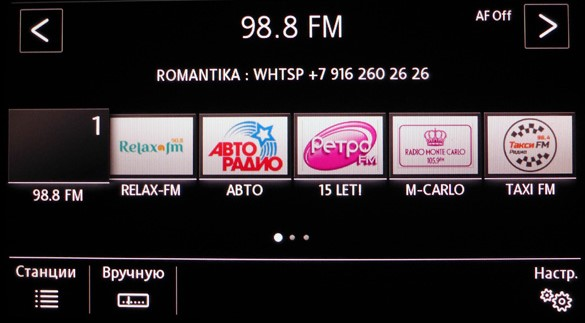
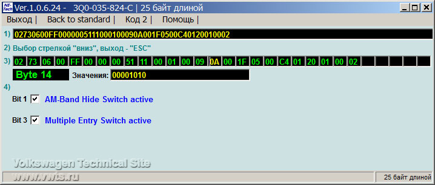
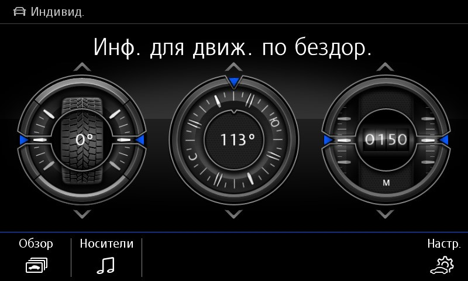

# Head unit

### Decoding encodings

menu_display_xxx_clamp_15_off – operation when the ignition is off  
menu_display_xxx_over_threshold_high – work on the move  
menu_display_xxx_standstill – work in standby mode  
menu_display_xxx_after_disclaimer – work after some garbage

### Unlocking the engineering menu  

Before this, you may have to ODIS E [put into programming mode](../../utils/odis-e/#_4)
``` yaml title="Login code: 12345"
Block 5F → Adaptation:
Developer mode: Activate
```


### Changing car skin

Sometimes when replacing a PG with another, it happens that the profile of another VW car is installed on it.  

Example for VW Tiguan:
``` yaml
Block 5F → Coding:
byte_0_brand: _VW
byte_1_Car_Class: 3
byte_1_Car_Generation: 7
byte_2_Car_Derivate: 6
byte_2_Car_Derivate_Supplement: 0
→ Apply
```


### Ability to simultaneously connect two phones via bluetooth

``` yaml
Block 5F → Adaptation:
function_configuration_phone:
- Support_second_phone: none → change
- Support_for_response_and_hold: off → on
- Dtmf_without_active_call: off → on
- _user_menu_three_way_calling: not_installed → installed
→ Apply
```


``` yaml
Block 17 → Coding:
telephone2_BAP: no → yes
→ Apply
```


## Electronic voice amplifier ICC

To activate this amplifier you need to load the parameters:  
[(Parameters under ODIS)](../parameters/5F_ICC_ONLY.xml.zip)

After loading the parameters, you MUST restart the radio by long pressing the power button!

### Disabling the volume jump when the radio starts

Sometimes, when you turn on the GU, the volume turns up much stronger than it was set when you turned off the machine.

``` yaml
Block 5F → Adaptation:
Adjustment_fm_tuner_mono_stereo:
- l_hf_stereo_lower_threshold: 20 dBµV 
→ Apply
```


### Deactivating the AM band in the radio

At the bottom left, instead of the unnecessary AM/FM “switch”, an icon for manually tuning radio stations appears


=== "Coding in ODIS"
    
``` yaml title="Login code: 20103"
    Block 5F → Coding:
    byte_14_AM_disable: Activate
    → Apply (with block reboot)
    ```


=== "Coding in VCDS"
    
``` yaml title="Login code: 20103"
    5F – MMI / RNS  
    Coding - 07 → Long coding:
    Byte 1 – Bit 1 (byte_14_AM_disable): Activate  
    Exit → Save
    ```


    

### GU screensaver

``` yaml
Block 5F → Coding:
Byte 18 – change 00 to
    01 — Hybrid
    02 — GTD
    03 — GTI
    04 — BlueMotion
    05 — E-Golf
    06 — R-Line
    07 — Golf R
→ Apply (with block reboot)
```


Music system logo
``` yaml
Block 5F → Adaptation:
Startup_screen_sticker_hmi  - change to
    1 — fender premium audio system
    2 — dynaudio
→ Apply
```


### Changing the GU menu image from flipping to tile

=== "Coding in ODIS"
	
```
	Block 5F → Coding:
    byte_17_Skinning: Skin_1 → Skin_5
    → Apply (with block reboot)
    ```


  
=== "Coding in VCDS"
    
```
    5F – MMI / RNS  
    Coding - 07 → Long coding:
    Byte 17: Skin_1 → Skin_5 
    Exit → Save  
    ```


### Video in motion, MirrorLink in motion

:octicons-verified-24: Discover PRO

``` yaml
Block 5F → Adaptation:
nhtsa_properties:
- nhtsa_limitation_switches_for_carplay_no_softKeyboard: Deactivate 
- nhtsa_limitation_switches_for_androidauto_limit_displayed_message_length: Deactivate 
- nhtsa_limitation_switches_for_androidauto_no_setup_configuration: Deactivate 
- nhtsa_limitation_switches_for_androidauto_no_text_input: Deactivate 
- nhtsa_limitation_switches_for_androidauto_no_video_playback: Deactivate 
→ Apply
```


[(Parameters under ODIS)](../parameters/5F_3Q0035864C_V03935274HX_VIM_MIM.xml.zip)
[(Parameters under ODIS)](../parameters/5F_3Q0035864C_V03935274HX_VIM_MIM.xml.zip)

### Menu in the radio for customizing the dashboard

:octicons-verified-24: Škoda Octavia  

``` yaml
Block 5F → Adaptation:
Car_function_list_bap_gen2_extended:
- display_configuration_0x45: Activate
- display_configuration_0x45_msg_bus: CAN_Comfort
→ Apply
```


### Off Road Display


  
!!! note ""
On second-generation Tiguans it works in the Composition Media 6", Discover Media, Discover Pro information and command systems without coding in the 5F block.

``` yaml
Block 5F → Adaptation:
Car_Function_Adaptations_Gen2
menu_display_compass → "active" (default not active)
menu_display_compass_over_threshold_high → "active" (default not active) 
menu_display_compass_clamp_15_off  → "active" (default not active)
→ Apply  
  
Car_Function_List_BAP_Gen2
compass_0x15 "active" (default not active)
→ Apply
```

 
  
!!! warning ""
    For Composition Media 8" you need to encode a 5F block.  
    After coding, an indelible error will appear in the block, which will not affect the functionality in any way.
  
=== "Coding in ODIS"
    
``` yaml title="Login code: 20103"
    Block 5F → Coding:
    Byte 24 – Bit 02 (Navigation System): Activate 
    → Apply (with block reboot)
    ```


  
=== "Coding in VCDS"
    
``` yaml title="Login code: 20103"
    5F – MMI / RNS  
    Coding - 07 → Long coding:
    Byte 24 – Bit 2 (Navigation System): Activate
or edit the binary value – was "02" 00000010, became "06" 00000110
    Exit → Save
    ```


### Driving school mode

!!! tip ""
After adaptation, you need to restart the radio
  
``` yaml
Block 5F → Adaptation:
Car_Function_Adaptations_Gen2:
- menu_display_driving_school – not activated. change to activated.
- menu_display_driving_school_over_threshold_high – not activated change to activated.
Car_Function_List_CAN_Gen2:
- Driving_school – unavailable. change to available
→ Apply
```


### Enable personalization

!!! tip ""
Coding must be performed with the engine not running

``` yaml title="Login code: 20103"
Block 17 → Coding:
Byte 10 – Personalization
select «On»
→ Apply
```


``` yaml title="Login code: 31347"
Block 09 → Adaptation:
Personalisierung:
- Personalisierung_Profilfunkion → profiles_active
- Personalisierung_aktiv → Active
- Aktivierungsoption_im_HMI-Menue_sichtbar → Active
- Benutzerkontenverwaltung_in_HMI-Menue_sichtbar → Active
- Personalisierungsfunktionen_in_HMI-Menue_sichtbar → Active
- PSO_FSG_Setup2_Bit_1 → Active
- PSO_FSG_Setup2_Bit_2 → Active
→ Apply
```


    The sequence of actions is done to ensure that the car does not constantly turn on the GUEST mode.
!!! tip ""
We create profiles and then change:

``` yaml title="Login code: 31347"
Block 09 → Adaptation:
Personalisierung
- Profil_Variante: Konto (v. 1.x)
```


We change:

We create profiles and then change:
``` yaml title="Login code: 31347"
Block 09 → Adaptation:
Personalisierung
- Profil_Variante: Konto (v. 2.x)
```


Save, click, lock the car.
We change:
``` yaml title="Login code: 31347"
Block 09 → Adaptation:
Personalisierung
- Profil_Variante: Konto (v. 1.x)
```


### Using the Glonass antenna for navigation and compass

:octicons-verified-24: Discover Pro · :octicons-verified-24: Discover Media
  
``` yaml
Block 5F → Adaptation:
Navigation_GNSS_Receiver_Setting:
- default_hw_reception: Detect
- GPS: Detect
- galileo: Detect
- glonass: Detect
- compass: Detect
- external_gps_1: Activate
- external_gps_2: Detect
→ Apply
```


``` yaml
Block 75 → Adaptation:
GPS: internal_GPS_output_on_CAN
Navigation_Type: Type_2:
- Gnss_data_rate:
Data Rate: 5 Hz 
→ Apply
```
