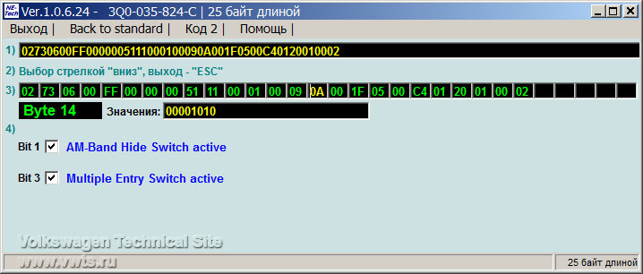
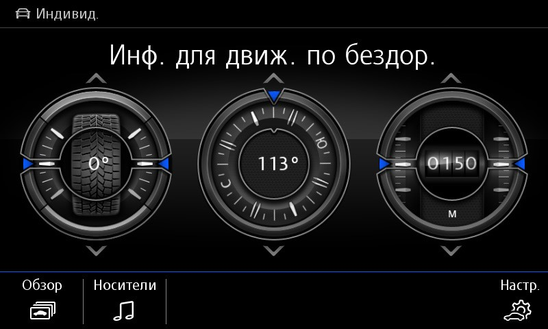

# Головное устройство

### Расшифровка кодировок

menu_display_xxx_clamp_15_off – работа при выкл зажигании  
menu_display_xxx_over_threshold_high – работа в движении  
menu_display_xxx_standstill – работа в режиме ожидания  
menu_display_xxx_after_disclaimer – работа после какой-то фигни

### Разблокировка инженерного меню  

Перед этим, возможно, придется ODIS E [перевести в режим программирования](../../utils/odis-e/#_4)
``` yaml title="логин-пароль: 12345"
Блок 5F → Адаптация:
Режим разрабочика (Developer mode): Активировать
```

### Смена скина автомобиля
Иногда при замене ГУ на другой, бывает, что на нем установлен профиль другого автомобиля VW.  

Пример для VW Tiguan:  
``` yaml
Блок 5F → Кодирование:
byte_0_brand: _VW
byte_1_Car_Class: 3
byte_1_Car_Generation: 7
byte_2_Car_Derivate: 6
byte_2_Car_Derivate_Supplement: 0
→ Применить 
```

### Возможность одновременного подключения двух телефонов по bluetooth

``` yaml
Блок 5F → Адаптация:
function_configuration_phone:
- Support_second_phone: none → меняем
- Support_for_response_and_hold: off → on
- Dtmf_without_active_call: off → on
- _user_menu_three_way_calling: not_installed → installed
→ Применить 
```

``` yaml
Блок 17 → Кодирование:
telephone2_BAP: no → yes
→ Применить
```

## Электронный усилитель голоса ICC

Для активации данного усилителя необходимо загрузить параметрию:  
[(Параметрия под ODIS)](../parameters/5F_ICC_ONLY.xml)

После загрузки параметрии нужно ОБЯЗАТЕЛЬНО перезагрузить магнитолу долгим нажатием на кнопку включения!

### Отключение скачка громкости при старте магнитолы
Иногда при включении ГУ громкость включается намного сильнее, чем она была задана при выключении машины.

``` yaml
Блок 5F → Адаптация:
Adjustment_fm_tuner_mono_stereo:
- l_hf_stereo_lower_threshold: 20 dBµV (было 37 dBµV)
→ Применить 
```

### Деактивация AM диапазона в магнитоле
Слева внизу вместо ненужного "переключателя" AM/FM появляется иконка настройки радиостанций вручную  


=== "Кодирование в ODIS"
    ``` yaml title="логин-пароль: 20103"
    Блок 5F → Кодирование:
    byte_14_AM_disable: Активировать
    → Применить (с перезагрузкой блока)
    ```

=== "Кодирование в VCDS"
    ``` yaml title="логин-пароль: 20103"
    5F – MMI / RNS  
    Кодирование - 07 → Длинное кодирование:
    Байт 1 – Бит 1 (byte_14_AM_disable): Активировать  
    Выход → Сохранить
    ```
    

### Заставка ГУ

``` yaml
Блок 5F → Кодирование:
Байт 18 – меняем 00 на
    01 — Hybrid
    02 — GTD
    03 — GTI
    04 — BlueMotion
    05 — E-Golf
    06 — R-Line
    07 — Golf R
→ Применить (с перезагрузкой блока)
```

Логотип музыкальной системы
``` yaml
Блок 5F → Адаптация:
Startup_screen_sticker_hmi (по умолчанию стоит 0000) - меняем на
    1 — fender premium audio system
    2 — dynaudio
→ Применить 
```

### Изменение картинки меню ГУ с перелистывания на плитку

=== "Кодирование в ODIS"
	```
	Блок 5F → Кодирование:
    byte_17_Skinning: Skin_1 → Skin_5
    → Применить (с перезагрузкой блока)
    ```
  
=== "Кодирование в VCDS"
    ```
    5F – MMI / RNS  
    Кодирование - 07 → Длинное кодирование:
    Байт 17: Skin_1 → Skin_5 
    Выход → Сохранить  
    ```

### Видео в движении, Работа MirrorLink в движении
:octicons-verified-24: Discover PRO

``` yaml
Блок 5F → Адаптация:
nhtsa_properties:
- nhtsa_limitation_switches_for_carplay_no_softKeyboard: Деактивировать (CarPlay, возможность вызова клавиатуры в движении)
- nhtsa_limitation_switches_for_androidauto_limit_displayed_message_length: Деактивировать (AA,отключение ограничения длины выводимого сообщения в движении)
- nhtsa_limitation_switches_for_androidauto_no_setup_configuration: Деактивировать (AA, возможность заходить в настройки в движении)
- nhtsa_limitation_switches_for_androidauto_no_text_input: Деактивировать (AA, отключение запрета ввода текста в движении)
- nhtsa_limitation_switches_for_androidauto_no_video_playback: Деактивировать (АА, возможность проигрывать видео в движении)
→ Применить 
```

Для всех остальных устройств необходимо загружать дополнительно специальный ZDC контейнер или XML параметрию для ODIS
[(Параметрия под ODIS)](../parameters/5F_3Q0035864C_V03935274HX_VIM_MIM.xml)
  
### Меню в магнитоле для настройки приборной панели
:octicons-verified-24: Škoda Octavia  

``` yaml
Блок 5F → Адаптация:
Car_function_list_bap_gen2_extended:
- display_configuration_0x45: Активировать
- display_configuration_0x45_msg_bus: CAN_Comfort
→ Применить 
```
  
### Off Road Display


  
!!! note ""
    На Тигуанах второго поколения работает в информационно командных системах Composition Media 6", Discover Media, Discover Pro без кодирования в 5F блоке.  

``` yaml
Блок 5F → Адаптация:
Car_Function_Adaptations_Gen2
menu_display_compass → "active" (default not active)
menu_display_compass_over_threshold_high → "active" (default not active) 
menu_display_compass_clamp_15_off  → "active" (default not active)
→ Применить  
  
Car_Function_List_BAP_Gen2
compass_0x15 "active" (default not active)
→ Применить 
``` 
  
!!! warning ""
    Для Composition Media 8" необходимо выполнить кодировку 5F блока.  
    После кодирования в блоке будет висеть нестираемая ошибка, никак не влияющая на функциональность
  
=== "Кодирование в ODIS"
    ``` yaml title="логин-пароль: 20103"
    Блок 5F → Кодирование:
    Байт 24 – Бит 02 (Navigation System): Активировать (было "02" 00000010, стало "06" 00000110)
    → Применить (с перезагрузкой блока)
    ```
  
=== "Кодирование в VCDS"
    ``` yaml title="логин-пароль: 20103"
    5F – MMI / RNS  
    Кодирование - 07 → Длинное кодирование:
    Байт 24 – Бит 2 (Navigation System): Активировать
    либо правим двоичное значение – было "02" 00000010, стало "06" 00000110  
    Выход → Сохранить
    ```

### Режим автошкола

!!! tip ""
    После адаптации необходимо перезагрузить магнитолу
  
``` yaml
Блок 5F → Адаптация:
Car_Function_Adaptations_Gen2:
- menu_display_driving_school – не активир.меняем на активир.
- menu_display_driving_school_over_threshold_high – не активир меняем на активир.
Car_Function_List_CAN_Gen2:
- Driving_school – недоступ. меняем на доступен
→ Применить
```

### Включение персонализации

!!! tip ""
    Кодирование должно выполняться на незаведенном двигателе

``` yaml title="логин-пароль: 20103"
Блок 17 → Кодирование:
Байт 10 – Персонализация
выбираем «Вкл»
→ Применить
```

``` yaml title="логин-пароль: 31347"
Блок 09 → Адаптация:
Персонализация / Personalisierung:
- Personalisierung_Profilfunkion → profiles_active
- Personalisierung_aktiv → Active
- Aktivierungsoption_im_HMI-Menue_sichtbar → Active
- Benutzerkontenverwaltung_in_HMI-Menue_sichtbar → Active
- Personalisierungsfunktionen_in_HMI-Menue_sichtbar → Active
- PSO_FSG_Setup2_Bit_1 → Active
- PSO_FSG_Setup2_Bit_2 → Active
→ Применить
```

Активация персонализации
!!! tip ""
    Последовательность действий делается для того, чтобы авто не включало постоянно режим ГОСТЯ.

``` yaml title="логин-пароль: 31347"
Блок 09 → Адаптация:
Персонализация / Personalisierung
- Profil_Variante: Konto (v. 1.x)
```
Сохраняем, клацаем, запираем авто.  

Создаем профили и далее меняем:
``` yaml title="логин-пароль: 31347"
Блок 09 → Адаптация:
Персонализация / Personalisierung
- Profil_Variante: Konto (v. 2.x)
```
Сохраняем, клацаем, запираем авто.  
Меняем:
``` yaml title="логин-пароль: 31347"
Блок 09 → Адаптация:
Персонализация / Personalisierung
- Profil_Variante: Konto (v. 1.x)
```

### Использование глонасс антенны для навигации и компаса
:octicons-verified-24: Discover Pro · :octicons-verified-24: Discover Media
  
``` yaml
Блок 5F → Адаптация:
Navigation_GNSS_Receiver_Setting:
- default_hw_reception: Дективировать
- gps: Дективировать
- galileo: Дективировать
- glonass: Дективировать
- compass: Дективировать
- external_gps_1: Активировать
- external_gps_2: Дективировать
→ Применить
```

``` yaml
Блок 75 → Адаптация:
GPS: internal_GPS_output_on_CAN
Navigation_Type: Type_2:
- Gnss_data_rate:
Data Rate: 5 Hz (было 1)
→ Применить
```

