# SWaP codes and parameters for Composition Media and Discover Media

!!! warning 
    EVERYTHING YOU WILL DO IS ONLY AT YOUR OWN RESPONSIBILITY! IF YOU HAVE NO CONFIDENCE, DON'T START!

## Voice assistant, MirrorLink, Bluetooth and Sports monitor for Delphi devices
### What is needed

Preferred: d-link dub e 100 revisions b1 (silver), c1, d1  
or https://aliexpress.ru/item/32969701309.html?spm=a2g0s.9042311.0.0.3b9d33edZKppDb&sku_id=12000018080745527  
works without dancing with a tambourine, so to speak from a package or another device with an ASIX 88772 chip
1. USB-Ethernet adapter:
2. Firmware for the radio
3. SWaP radios

### Information about GI

How to recognize a Delphi module?  
Delphi modules are always standard devices, not high-level devices.  
Accordingly, Delphi Unit is always Discover Media and not Discover Pro.  
All Delphi modules are Discover Media devices, but not all Discover Media devices are Delphi modules!
Discover Media may also be a Technisat Preh device - just for reference.  
To recognize the device without removing it, you must hold down the "MENU" button on the radio for an extended period of time until another menu opens. 
  
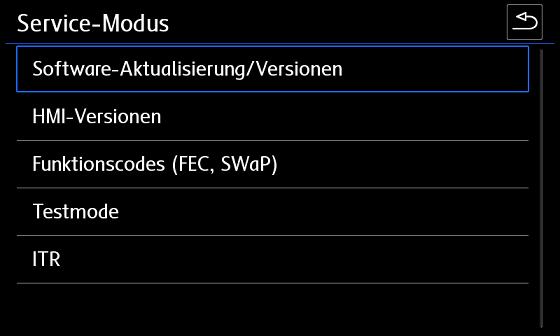

In this menu, under “Update / Software Versions” you can see the software version.  

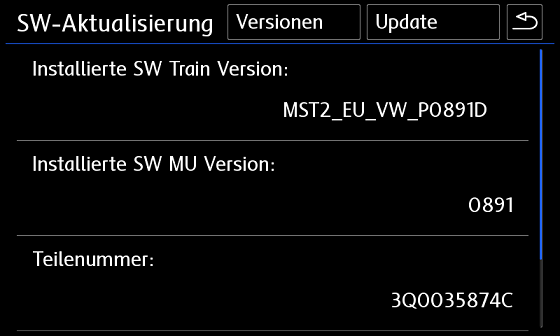

(Delphi) SW Train Version (MST2_EC_VW_P0891D) – are formed as follows:

```
MST2 = standard MIB2 head unit  
EC = European variant (US equivalent differs)  
VW = vehicle brand  
0891 = Firmware 0891  
D = Delphi — short module revision  
```


If you see PQ or ZR after the car brand or the letter T at the end in the SW Train version, then you have a Technisat Preh device.
If you see PQ or ZR after the car brand or the letter T at the end in the SW Train version, then you have a Technisat Preh device.

### Device firmware 

!!! note ""
Only firmware 0891 allows you to connect to MIBII via Ethernet-USB (according to our information)

To flash the radio firmware you will need:

1.SD Card  
MIBII software update  
    What should I pay attention to when updating the firmware?

    Leave the ignition on.  
    Turn off unnecessary consumers (lights, ventilation, ...)  
    Connect the charger (charging power at least 15 A, preferably 20 A or more)  
    Depending on the device (RAM / CPU) the update takes from 20 to 60 minutes  
After updating the firmware, Glonass will flash on the panel - this is normal, don’t be afraid.  
    After updating the firmware, the error “Confirming installation changes” may appear. You will need to confirm the firmware update with a code.  
    [Instructions and XOR calculator](../../xorCalculator)
  
1. SD Card  
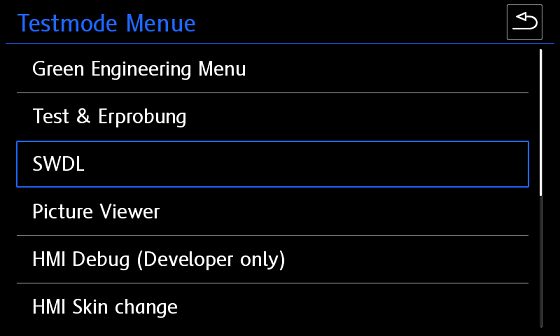  
2. Firmware for Delphi devices [(Download)](https://yadi.sk/d/foeH0Izi_vW4_g)
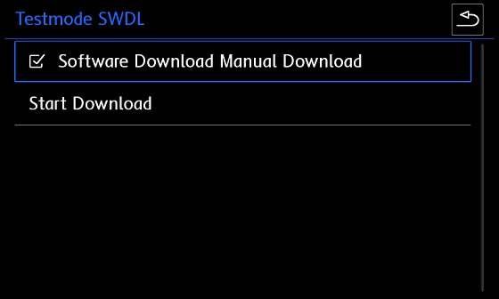  
3. Activated engineering menu [(Instructions)](../headDevice/#_3)
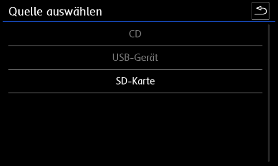  

!!! warning ""
1. Format the SD card to FAT32

2. Copy the firmware update files to the SD card (there should be 3 folders and a text file in the root after unpacking the archive)
3. Insert the SD card into SD card slot 1
4. Remove all other SD cards and USB devices!
5. Press the MENU button on the radio and longer until another (service) menu opens

6. Select test mode there

!!! warning ""
7. Go to the "SWDL" category
8. Activate software download Manual download and click “Start download”

### Activating Telnet connection

To establish a Telnet connection, you must activate Ethernet in the green menu.  
To do this, hold down the MENU button on the radio until the (service) menu appears. Then go to test mode  
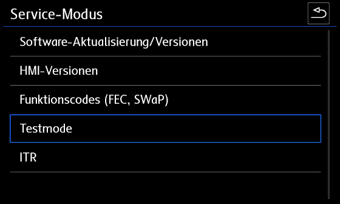  
  
Now we can switch to the Green (Engineering) menu  
(if you wish, you can also get there by pressing the MENU button for a very long time)  
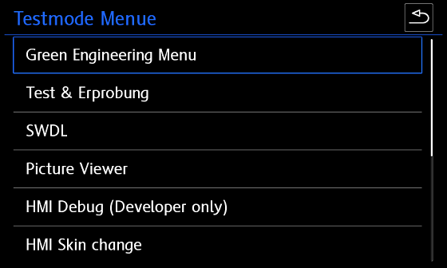  
  
Switch to the "debuggung mlp" category.  
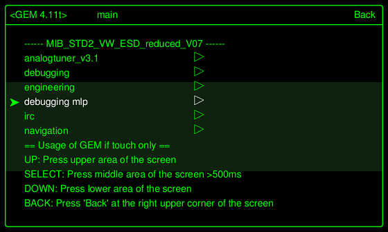  
  
Activate Ethernet and restart the device  
(hold the power button for at least 10 seconds).  
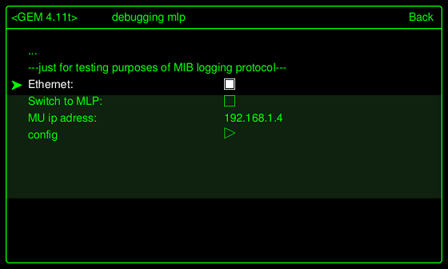  
  
After restarting the unit, “Switch to MLP” must be activated.  
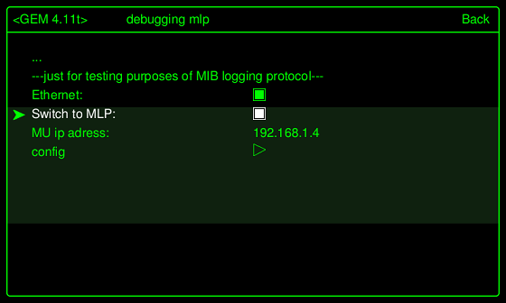

Now the USB-LAN adapter can be plugged into a USB port in your car and connected to your laptop using a LAN cable.  
If the LEDs on the adapter light up, the connection and IPv4 configuration are successful (Ethernet IP Adapter Settings – 192.168.1.10).  
  
Launch the Putty program. The MU IP address is taken from the green menu as the IP address.  
It happened that the MU IP address was not displayed on some devices, but it always used 192.168.1.4 and the port was 23, and then clicked "Open".  
  
If everything is configured correctly, you can tell by the QNX Neutrino login that it is working.  

To log into Delphi Units Login:root. No password needed. Press enter..
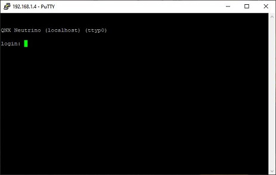
  
Once the welcome message appears, you can enter commands.  
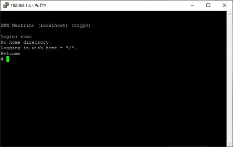

Commands:
```
cp – copy  
rm – delete  
chmod – change permissions (e.g. chmod 777 = full read/write)  
mkdir – create directory  
mount – mount path  
umount – unmount path  
```


1. Backup [(MST2_backup.sh)](../firmwares/MST2_backup.sh)
```
-f – force (overwrite)  
-R – recursive (folder with contents)  
-t – mount type (e.g. followed by qnx6)  
-u – update (remount)  
-V – verbose  
-w – read/write (when mounting)  
```


2. Patch FEC codes [(MST2_fec.sh)](../firmwares/MST2_fec.sh)
3. SWaP patch [(MST2_patch.sh)](../firmwares/MST2_patch.sh)
2. Patch FEC codes [(MST2_fec.sh)](../firmwares/MST2_fec.sh)
3. SWaP patch [(MST2_patch.sh)](../firmwares/MST2_patch.sh)

### MIBII backup

Insert the (blank) SD card into slot 1 and run the following commands via Putty.

1. Mount the SD card
    
```
    cd / && mount -uw /sdc1/
    ```


2. Run the Backup script [(MST2_backup.sh)](../firmwares/MST2_backup.sh)
    
```
    cd / && /sdc1/MST2_backup.sh
    ```


3. Must see:
    
```
    # MST2_backup.sh  
    ROOT access — OK  
    Making backup dir on SD Card — OK  
    mkdir: /sdc1/backup: File exists  
    SWaP *.fec files backup — OK  
    backup /ffs/etc/* — OK  
    cp: Can't create FIFO file (/sdc1/backup/script.fifo)  
    delphibin.ifs backup — OK  
    InstallationManager backup — OK  
    SWaP engine backup — OK  
    cp: Dest (/sdc1/mst2_patch.sh) must be a dir to copy dirs or multiple files to it.  
    profile backup — OK  
    MHConfig.cfg backup — OK  
    fs0 backup — OK  
    Saving unit info to file — OK  
    emmc serial numbler — SAVED  
    FINISHED — You can now remove SD Card  
    ```


### Updating the FEC file

After performing the backup, a *.fec file will appear on the flash drive in the pg folder.  
Using MIB2 Delphi FEC Generator XTR3M3 [(M2DFGX16)](../firmwares/M2DFGX16.rar) we patch this file,  
namely, we mark all the points that you need and save the separately patched fec file.

!!! note "Important"
    If you have App Connect, MirrorLink, etc. codes activated from the factory, and when patching the fec file you do not mark them, then after uploading them to the radio you will not have them.  
    If you have a radio without navigation, then check all the boxes except navigation

??? tip "FCC Available"
    fsc = "00030000" #AMI  
    fsc2 = "00030001" #Gracenote  
    fsc3 = "00040100" # Navigation  
    fsc4 = "00050000" # Bluetooth  
    fsc5 = "00060100" # Vehicle Data Interface  
    fsc6 = "00060200" # Škoda/Audi Connect, VW CarNet  
    fsc7 = "00060300" # Mirror Link  
    fsc8 = "00060400" # Sport HMI  
    fsc9 = "00060500" # Sport Chrono  
    fsc10 = "00060600" # LogBook  
    fsc11 = "00060700" # Online Services  
    fsc12 = "00060800" # Apple CarPlay  
    fsc13 = "00060900" # Google Android Auto  
    fsc14 = "00070100" # SDS  
    fsc15 = "00070200" # SDS for Nav  
    fsc16 = "00070400" #Digital Voice Enhancement

### Activation of SWaP codes 

New SWAP code generator: https://mst2fecgen.mibsolution.one/

SWaP files. These codes contain all existing SWaP codes for GU  

| Type | Link |
|---------|------------------------------------------|
| STD2    | [(SWaP)](../../firmwares/SWAP/SWaP)      |
| PQ STD2 | [(SWaP)](../../firmwares/SWAP/STD2/SWaP) |
| NAV     | [(SWaP)](../../firmwares/SWAP/Nav/SWaP)  |
| PLUS    | [(SWaP)](../../firmwares/SWAP/Plus/SWaP) |

To download the SWaP code, you need to take the required file, as well as the FEC file created in the previous step, and load it into the root of the flash drive.

Insert the SD card into slot 1 and run the following commands via Putty:

    If for some reason it doesn’t work, then the SWaP file is not suitable for you, try another SWaP
    
```
    cd / && mount -uw /sdc1/
    ```


    It may be that the FEC files are still buffered in the device and are still accessible after a reboot.  
    
```
    cd / && /sdc1/MST2_patch.sh
    ```


    They may have to be deleted several times until they are no longer available on the device after a reboot.  
    
```
    # mst2_patch.sh
    ROOT access — ok
    SWaP patch — ok
    cp: Copying /sdc1/SWaP to /home/mmc0t177_tmp/apps/bin/SWaP
    100.00% (xxx/xxx kbytes, xxxx kb/s)
    FINISHED — You can now remove SD Card
    ```


    rm -RVf /Persistence/SWaP/ppw/*  
    
```
    cd / && mount -uw /sdc1/
    umount -f /extbin
    mkdir /home/mmc0t177_tmp
    mount -t qnx6 /dev/mmc0t177 /home/mmc0t177_tmp
    cp -VRf /sdc1/SWaP /home/mmc0t177_tmp/apps/bin/
    chmod 777 /home/mmc0t177_tmp/apps/bin/SWaP
    umount -f /home/mmc0t177_tmp
    rm -R /home/mmc0t177_tmp
    ```


    rm -RVf /Persistence/SWaP/illegal/*  
    You can then import the corrected FEC file.  
    
```
    cd / && mount -uw /sdc1/
    ```


    cp -VRf /sdc1/*.fec /Persistence/SWaP/pg/  
    
```
    cd / && /sdc1/MST2_fec.sh
    ```


    After entering the commands, a complete reboot is required.
    
```
    # MST2_fec.sh
    ROOT access — ok
    *.FEC installation — ok
    mkdir: /home/mmc0t180_tmp: File exists
    FINISHED — You can now remove SD Card
    ```


    After all the steps, be sure to check the functionality of the GU.  

!!! note ""
    Check with a scanner for errors and delete them if they appear.

!!! warning ""
1. Mount the SD card
2. Run the script [(MST2_patch.sh)](../firmwares/MST2_patch.sh)
  
3. Must see:
4. Sometimes the script does not execute and gives an error. Then the steps from the script must be performed manually:
  
5. Reboot the radio by long pressing the power button - MUST!!!!
  
6. Mount the SD card
  
7. Run the script Patch FEC codes [(MST2_fec.sh)](../firmwares/MST2_fec.sh)

!!! warning 
8. Must see:
9. Reboot the radio by long pressing the power button - MUST!!!!

## Electronic voice amplifier ICC

To activate this amplifier you need to load the parameters:  
[(Parameters under ODIS)](../parameters/5F_ICC_ONLY.xml.zip)

After loading the parameters, you MUST restart the radio by long pressing the power button!