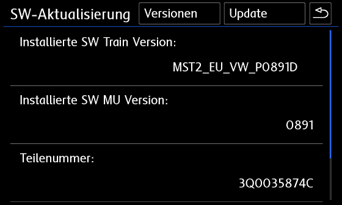
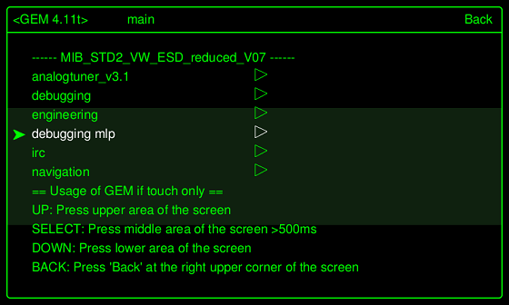

disqus: https-mqb-readthedocs-io
# SWAP коды и параметрии для Composition Media и Discover Media

!!! warning 
    ВСЕ, ЧТО ВЫ БУДЕТЕ ДЕЛАТЬ — ВЫ БУДЕТЕ ДЕЛАТЬ ТОЛЬКО ПОД СВОЮ ОТВЕТСТВЕННОСТЬ! ЕСЛИ НЕТ УВЕРЕННОСТИ — НЕ НАЧИНАЙТЕ!

## Голосовой помощник, MirrorLink, Bluetooth и Спорт-монитор для Delphi устройств

### Что необходимо

1. USB-Ethernet адаптер:  
Предпочтителен: d-link dub e 100 ревизий b1(серебристый), с1, d1  
или https://aliexpress.ru/item/32969701309.html?spm=a2g0s.9042311.0.0.3b9d33edZKppDb&sku_id=12000018080745527   
работает без танцев с бубном, так сказать из посылки или другое устройство с чипом ASIX 88772
2. Прошивка магнитолы  
3. SWAP магнитолы

### Информация о ГУ

Как распознать модуль Delphi?  
Модули Delphi - это всегда стандартные устройства, а не устройства высокого уровня.  
Соответственно, Delphi Unit всегда является Discover Media, а не Discover Pro.  
Все модули Delphi являются устройствами Discover Media, но не все устройства Discover Media являются модулями Delphi!
Discover Media также может быть устройством Technisat Preh - просто для справки.  
Чтобы распознать устройство, не снимая его, необходимо удерживать кнопку «МЕНЮ» на радио в течение длительного периода времени, пока не откроется другое меню. 
  


В этом меню в пункте «Обновление / версии программного обеспечения» можно увидеть версию программного обеспечения.  



(Delphi) SW Train Version (MST2_ЕС_VW_P0891D) - формируются следующим образом:  

```
MST2 = MIB2 стандартного устройство  
ЕС = Европейский вариант (аналог этого США)  
VW = марка автомобиля  
0891 = Firmware 0891  
D = Delphi Краткая версия модуля  
```

Если в конце версии SW Train стоит буква D, значит, у вас есть модуль Delphi.  
Если вы видите PQ или ZR после марки автомобиля или букву T в конце в версии SW Train, значит - у вас устройство Technisat Preh.  

### Прошивка устройства 

!!! note ""
    Только прошивка 0891 позволяет соединиться с MIBII по Ethernet-USB (по нашей информации)

Для прошивки магнитолы понадобится:

1. SD Card  
2. Прошивка Delphi устройств [(Скачать)](https://yadi.sk/d/foeH0Izi_vW4_g)
3. Активированное инженерное меню [(Инструкция)](../headDevice/#_3)

Обновление ПО MIBII  
1. Отформатируйте SD-карту в FAT32  
2. Скопируйте файлы обновления прошивки на SD-карту (в корне должно быть 3 папки и текстовый файл после распаковки архива)  
3. Вставьте SD-карту в слот для SD-карты 1  
4. Удалите все остальные SD-карты и USB-устройства!  
5. Нажимайте на магнитоле кнопку MENU и дольше, пока не откроется другое (сервисное) меню  
6. Выберите там тестовый режим  
  
7. Перейдите в категорию «SWDL»  
  
8. Активируйте загрузку программного обеспечения Загрузка вручную и нажмите «Начать загрузку»  
  
9. Выберите источник (SD-карта), выберите все и запустите обновление прошивки  
  

!!! warning ""
    На что следует обратить внимание при обновлении прошивки?

    Оставьте зажигание включенным.  
    Отключите ненужных потребителей (свет, вентиляция, ...)  
    Подключите зарядное устройство ( мощность зарядки не менее 15 А, лучше 20 А и больше)  
    В зависимости от устройства (RAM / CPU) обновление занимает от 20 до 60 минут  

После обновления прошивки на панели будет мигать глонасс — это нормально, не бойтесь.  
Так же может появиться ошибка "Подтверждение изменения по установке" - нужно будет подтвердить обновление прошивки кодом.  

```
Блок 5F → Адаптация
> Подтверждение изменения установки (Confirmation of installation change)  
Код из адаптации нужно внести в XOR генератор (http://mib-helper.com/im-so-xory/) и получить ответный код  
> Ввести полученный код и подтвердить изменение
```

### Активация Telnet соединения

Чтобы установить соединение Telnet, необходимо активировать Ethernet в зеленом меню.  
Для этого зажмите кнопку МЕНЮ на магнитоле до тех пор, пока не появится (сервисное) меню. Затем перейдите в тестовый режим   
  
  
Теперь мы можем переключиться в Зеленое (Инженерное) меню   
(по желанию вы также можете попасть туда, нажав на кнопку МЕНЮ очень долго)  
  
  
Переключитесь в категорию «debuggung mlp».  
  
  
Активируйте Ethernet и перезапустите устройство   
(удерживайте кнопку питания не менее 10 секунд).  
  
  
После перезапуска агрегата необходимо активировать «Switch to MLP».  


Теперь адаптер USB-LAN можно подключить к USB-порту в автомобиле и подключить к ноутбуку с помощью кабеля LAN.  
Если светодиоды на адаптере загораются, подключение и настройка IPv4 выполнены успешно (Настройки адаптера Ethernet IP - 192.168.1.10).  
  
Запускаем программу Putty. IP-адрес MU берется из зеленого меню в качестве IP-адреса.  
Случалось, что IP-адрес MU не отображался на некоторых устройствах, но он всегда использовался 192.168.1.4 и в качестве порта - 23, а затем нажимали «Открыть».  
  
Если все настроено правильно, вы можете сказать по логину QNX Neutrino, что он работает.  

Для входа в Delphi Units Login:root. Пароль не нужен. Нажимайте энтер..

  
Как только появится приветствие, можно будет вводить команды.  


Команды:  
```
cp - копировать  
rm - удалить  
chmod - изменить права (например, chmod 777= полные права чтения / записи)  
mkdir - создать каталог (папку)  
mount - монтировать путь  
umount - размонтировать путь монтирования  
```

Атрибуты:  
```
-f - принудительно (перезапись / принудительно)  
-R - рекурсивный (например, папка с содержимым и копировать / удалять подпапки)  
-t - Запрос монтирования / особый тип (например, за которым следует qnx6)  
-u - обновление (повторное монтирование)  
-V - индикатор выполнения  
-w - права чтения / записи (при монтировании)   
```

Для удобства 3 скрипта (для запуска их необходимо поместить на корень флешки)  
1. Бэкап [(MST2_backup.sh)](../firmwares/MST2_backup.sh)  
2. Патч FEC кодов [(MST2_fec.sh)](../firmwares/MST2_fec.sh)  
3. Патч SWAP [(MST2_patch.sh)](../firmwares/MST2_patch.sh)  
   
### Резервная копия MIBII

Вставьте (пустую) SD-карту в слот 1 и выполните следующие команды через Putty. 

1. Монтируем SD карту
```
cd / && mount -uw /sdc1/
```

2. Запускаем скрипт Backup [(MST2_backup.sh)](../firmwares/MST2_backup.sh)
```
cd / && /sdc1/MST2_backup.sh
```

3. Должны увидеть:
```
# MST2_backup.sh  
ROOT access — OK  
Making backup dir on SD Card — OK  
mkdir: /sdc1/backup: File exists  
SWaP *.fec files backup — OK  
backup /ffs/etc/* — OK  
cp: Can't create FIFO file (/sdc1/backup/script.fifo)  
delphibin.ifs backup — OK  
InstallationManager backup — OK  
SWaP engine backup — OK  
cp: Dest (/sdc1/mst2_patch.sh) must be a dir to copy dirs or multiple files to it.  
profile backup — OK  
MHConfig.cfg backup — OK  
fs0 backup — OK  
Saving unit info to file — OK  
emmc serial numbler — SAVED  
FINISHED — You can now remove SD Card  
```

### Обновление FEC файла

После выполнения бекапа, на флешке в папке pg появится файл *.fec.  
С помощью MIB2 Delphi FEC Generator XTR3M3 [(M2DFGX16)](../firmwares/M2DFGX16.rar) патчим этот файл,  
а именно отмечаем все пункты которые вам нужны и сохраняем отдельно пропатченный fec файл.

!!! note "Важно"
    Если у вас с завода активированы коды App Connect, MirrorLink и т.д., и во время патча файла fec вы их не отметите, то после заливки в магнитолу их у Вас не будет.  
    Если у Вас магнитола без навигации, то отмечайте все пункты, кроме навигации

??? tip "Доступные FCC"
    fsc = "00030000" # AMI  
    fsc2 = "00030001" # Gracenote  
    fsc3 = "00040100" # Navigation  
    fsc4 = "00050000" # Bluetooth  
    fsc5 = "00060100" # Vehicle Data Interface  
    fsc6 = "00060200" # Skoda/Audi Connect, VW CarNet  
    fsc7 = "00060300" # Mirror Link  
    fsc8 = "00060400" # Sport HMI  
    fsc9 = "00060500" # Sport Chrono  
    fsc10 = "00060600" # LogBook  
    fsc11 = "00060700" # Online Services  
    fsc12 = "00060800" # Apple CarPlay  
    fsc13 = "00060900" # Google Android Auto  
    fsc14 = "00070100" # SDS  
    fsc15 = "00070200" # SDS for Nav  
    fsc16 = "00070400" # Digital Voice Enhancement  

### Активация SWAP кодов 

SWAP файлы. Данные коды содержат в себе все существующие SWAP коды для ГУ  

| Тип     | Ссылка |
|---------|------------------|
| STD2    | [(SWAP)](../firmwares/SWAP/SWaP.zip) |
| PQ STD2 | [(SWAP)](../firmwares/SWAP/STD2/SWaP.zip) |
| NAV     | [(SWAP)](../firmwares/SWAP/Nav/SWaP.zip) |
| PLUS    | [(SWAP)](../firmwares/SWAP/Plus/SWaP.zip) |

Для загрузки SWAP кода необходимо взять нужный файл, а так же созданный на предыдущем шаге FEC файл и загрузить в корень флешки.

Вставьте SD-карту в слот 1 и выполните следующие команды через Putty:

1. Монтируем SD карту  
```
cd / && mount -uw /sdc1/
```

2. Запускаем скрипт [(MST2_patch.sh)](../firmwares/MST2_patch.sh)  

```
cd / && /sdc1/MST2_patch.sh
```

3. Должны увидеть:  
```
# mst2_patch.sh
ROOT access — ok
SWaP patch — ok
cp: Copying /sdc1/SWaP to /home/mmc0t177_tmp/apps/bin/SWaP
100.00% (xxx/xxx kbytes, xxxx kb/s)
FINISHED — You can now remove SD Card
```
Иногда скрипт не выполняется, и выдает ошибку.. тогда в ручную...
```
cd / && mount -uw /sdc1/
umount -f /extbin
mkdir /home/mmc0t177_tmp
mount -t qnx6 /dev/mmc0t177 /home/mmc0t177_tmp
cp -VRf /sdc1/SWaP /home/mmc0t177_tmp/apps/bin/
chmod 777 /home/mmc0t177_tmp/apps/bin/SWaP
umount -f /home/mmc0t177_tmp
rm -R /home/mmc0t177_tmp
```

4. Перезагружаем магнитолу долгим нажатием на кнопку включения — ОБЯЗАТЕЛЬНО!!!!  

5. Монтируем SD карту  
```
cd / && mount -uw /sdc1/
```

6. Запускаем скрипт Патч FEC кодов [(MST2_fec.sh)](../firmwares/MST2_fec.sh)   
```
cd / && /sdc1/MST2_fec.sh
```

7. Должны увидеть:  
```
# MST2_fec.sh
ROOT access — ok
*.FEC installation — ok
mkdir: /home/mmc0t180_tmp: File exists
FINISHED — You can now remove SD Card
```

8. Перезагружаем магнитолу долгим нажатием на кнопку включения — ОБЯЗАТЕЛЬНО!!!!  

!!! note ""
    Если по каким либо причинам не получилось, значит Вам не подошел SWAP файл, пробуйте другой SWAP

!!! warning ""
    Может случиться так, что файлы FEC все еще находятся в буфере в устройстве и все еще доступны после перезагрузки.  
    Их, возможно, придется удалить несколько раз, пока они не станут недоступны в устройстве после перезагрузки.   
  
    rm -RVf /Persistence/SWaP/ppw/*  
    rm -RVf /Persistence/SWaP/illegal/*  
  
    После этого можно импортировать исправленный файл FEC.   
  
    cp -VRf /sdc1/*.fec /Persistence/SWaP/pg/   
  
    После ввода команд обязательна полная перезагрузка.

!!! warning 
    После всех действий обязательно проверьте работоспособность ГУ.  
    Проверьте сканером на наличие ошибок, и удалите их если появились.

## Электронный усилитель голоса ICC

Для активации данного усилителя необходимо загрузить параметрию:  
[(Параметрия под ODIS)](../firmwares/5F_ICC_ONLY.xml)

После загрузки параметрии нужно ОБЯЗАТЕЛЬНО перезагрузить магнитолу долгим нажатием на кнопку включения!
