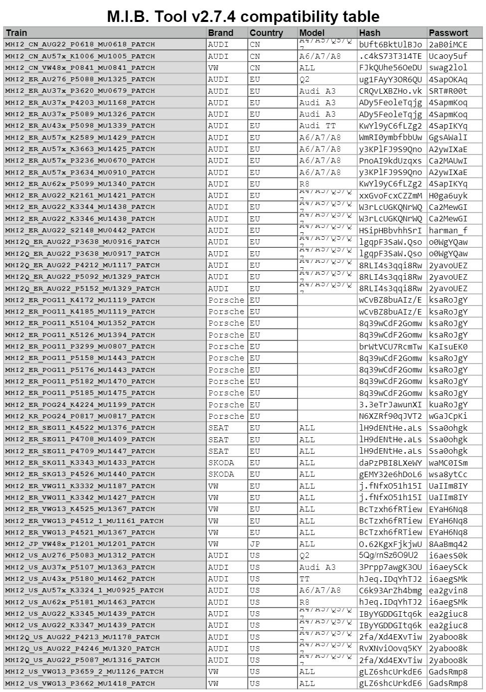
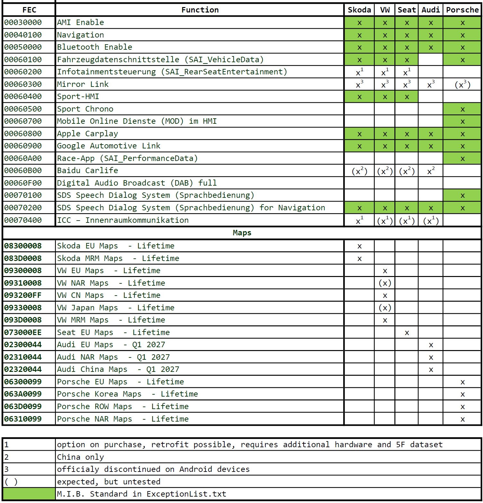
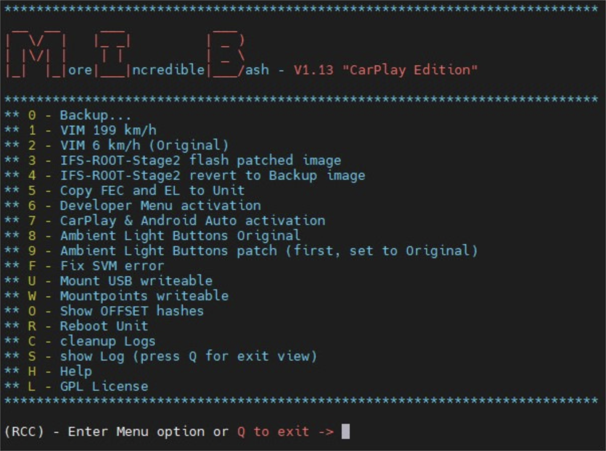

# Removing Component Protection and SWaP codes for Discover Pro

!!! warning 
    EVERYTHING YOU WILL DO IS ONLY AT YOUR OWN RESPONSIBILITY! IF YOU HAVE NO CONFIDENCE, DON'T START!  
  
All actions are carried out only using the [M.I.B. bash](https://wiki.mibsolution.one/en/MHI2), i.e. now to activate all options you only need an SD card.  

List of firmware for which this patch is suitable:  
  

List of functional activations:  
  

If you have MIB2 high, but the firmware does not match the list above, update it. Up to the version for which the patch is available.

Activation procedure:  
1. Copy all files to the SD card 
2. in the patches folder, leave only 1 folder with the version of your current firmware  
3. Start the software update. The patch already contains GEM activation. The GU will restart several times  
4. After installation is complete, go to GEM and select ==>>M.I.B.-More_Incredible_Bash<<==  

  

Point No. 3 contains all the necessary FEC codes, as well as removing the protection of components.  

!!! warning ""
    This patch contains only SWAPS. For some options, you will then need to make changes to the encodings and block adaptations.  
    For example, to activate this amplifier you need to load the parameters:  
    [(Parameters under ODIS)](../parameters/5F_ICC_ONLY.xml.zip)  
  
    To activate Android Auto or Carplay, you must complete the appropriate encodings.