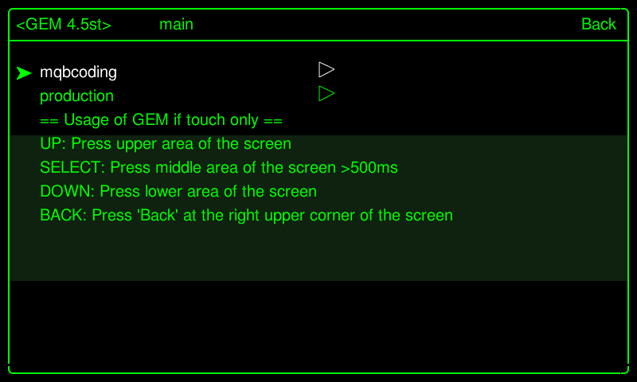
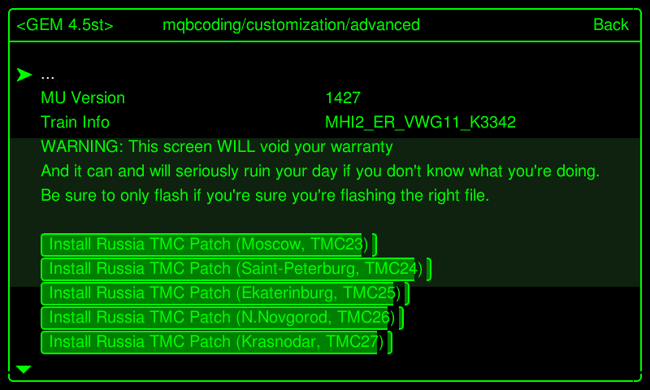
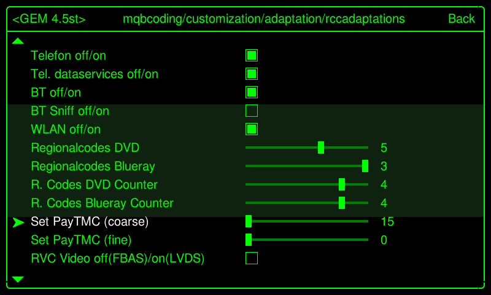
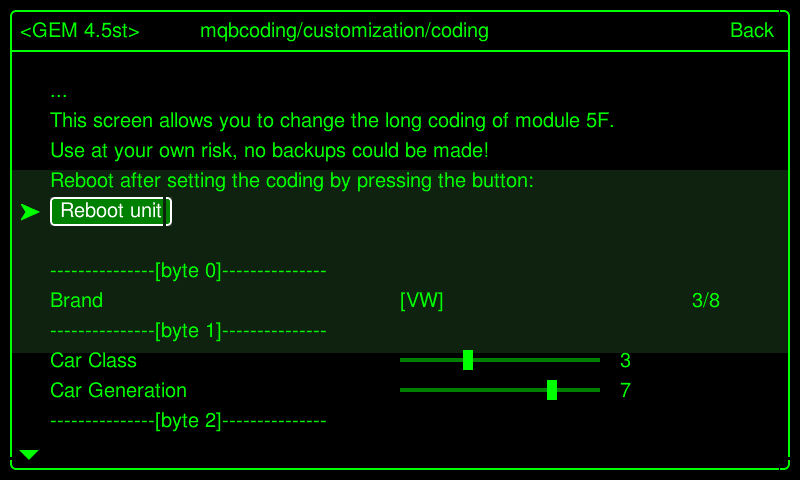
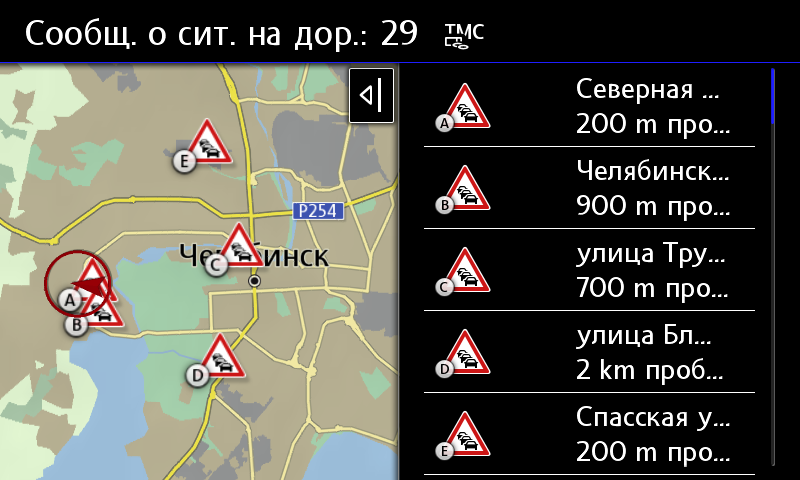

# Activation of TMC for navigation systems MIB2/2.5 HIGH

Traffic Message Channel (TMC) is a technology for transmitting information about traffic jams and adverse road conditions.  
Typically, data is transmitted in the form of digital codes, using a radio notification system (FM-RDS) for conventional FM receivers.  
Support for TMC functions allows the vehicle's navigation system to receive information about areas with traffic incidents and build an alternative route to avoid problem areas.  

!!! info "Cities where broadcasting is carried out"
    Moscow (and cities around)  
    St. Petersburg (and cities around, Kaliningrad)  
    Ekaterinburg (and other cities of the Ural Federal District of the Russian Federation)  
    Nizhny Novgorod (and other cities of the Volga Federal District of the Russian Federation)  
    Krasnodar (and other cities of the Southern Federal District of the Russian Federation)  
    Novosibirsk (and other cities of the Siberian Federal District of the Russian Federation)

## Installation

The installation takes place in several stages using the modified mib2-toolbox utility (the utility was provided by https://www.drive2.ru/users/kisyabrus/)  
[(Assembly for Škoda)](../firmwares/TMC-zz.rar)  
[(Assembly for Volkswagen)](../firmwares/TMC-vw.rar)  

Installing the mib2-toolbox utility with built-in scripts to support regions:  
Setting the desired region  
Reboot using Green Developer Menu, otherwise adaptations will not be applied  
After rebooting, the radio will need a little time to read and pick up information from the desired frequency.  
Enjoy displaying traffic jams!
1. Download the archive
2. Unpack it to the root of the SD card
3. Remove previously installed mib2-toolbox
4. Insert the card into the head unit
5. Long press the MENU button to enter the service menu
6. Select "Software updates/versions" and click the "Update" button in the upper right corner
7. Select SD card and MQB Coding MIB2 Toolbox
8. After installation, the system will prompt you to connect the adapter to clear errors. Select "Cancel"
  
  

9. Long press the MENU button to enter the service menu
10. Go to TESTMODE
11. Go to Green Developer Menu
    
12. An additional item will appear in the menu - “mqbcoding”
1. Go to "mqbcoding", select customization/advanced
2. Install the desired patch corresponding to the region, for example, Install RussiaTMC Patch (Ekaterinburg, TMC25)
  
  
  
3. Reboot the device

  
  
4. Go to "mqbcoding", select customization/adaptation/rccadaptations

5. In PayTMC adaptations, set the value to 15

