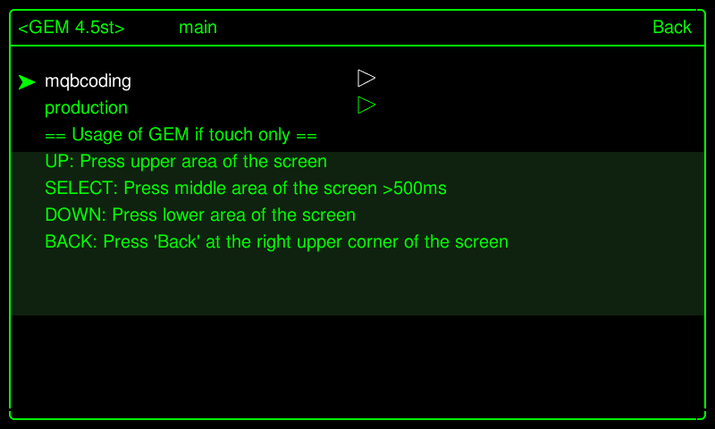
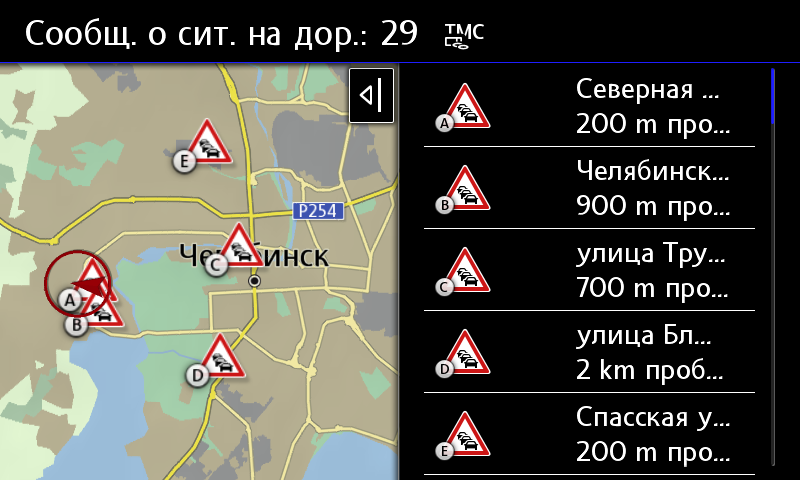

# Активация TMC для систем навигации MIB2/2.5 HIGH

Канал автодорожных сообщений (Traffic Message Channel, TMC) — технология для передачи информации о дорожных пробках и неблагоприятных дорожных условиях.  
Как правило, данные передаются в виде цифровых кодов, с использованием радиосистемы оповещения (FM-RDS) для обычных FM-приёмников.  
Поддержка функций TMC позволяет навигационной системе автомобиля получить информацию об участках с дорожными инцидентами и построить альтернативный маршрут для объезда проблемных участков.  

!!! info "Города, где ведется вещание"
    Москва (и города вокруг)  
    Санкт-Петербург (и города вокруг, Калининград)  
    Екатеринбург (и другие города Уральского ФО РФ)  
    Нижний Новгород (и другие города Приволжского ФО РФ)  
    Краснодар (и другие города Южного ФО РФ)  
    Новосибирск (и другие города Сибирского ФО РФ)

## Установка

Установка проходит в несколько этапов с помощью модифицированной утилиты mib2-toolbox (утилиту предоставил https://www.drive2.ru/users/kisyabrus/)  
[(Сборка для Škoda)](../firmwares/TMC-zz.rar)  
[(Сборка для Volkswagen)](../firmwares/TMC-vw.rar)  

Установка утилиты mib2-toolbox со встроенными скриптами для поддержки регионов:  
1. Скачать архив  
2. Распаковать его в корень SD карты  
3. Удалить ранее установленный mib2-toolbox  
4. Вставить карту в головное устройство  
5. Долгим нажатием по кнопке MENU зайти в сервисное меню  
6. Выбрать пункт "Software updates/versions" и нажать кнопку "Update" в правом верхнем углу  
7. Выбрать SD карту и MQB Coding MIB2 Toolbox  
8. После установки система предложит подсоединить адаптер для удаления ошибок. Выбрать "Cancel"  
9. Долгим нажатием по кнопке MENU зайти в сервисное меню  
10. Зайти в TESTMODE  
11. Зайти в Green Developer Menu  
12. В меню появится дополнительный пункт - "mqbcoding"  
  
  

Установка нужного региона  
1. Зайти в "mqbcoding", выбрать customization/advanced  
2. Установить нужный патч, соответствующий региону, например, Install RussiaTMC Patch (Ekaterinburg, TMC25)
    
3. Перезагрузить устройство  
4. Зайти в "mqbcoding", выбрать customization/adaptation/rccadaptations  
5. В PayTMC адаптациях задать значение 15  
  
  
  
Перезагрузить с помощью Green Developer Menu, в противном случае адаптации не применятся  

  
  
После перезагрузки магнитоле нужно будет немного времени, чтобы прочитать и подхватить информацию с нужной частоты.  

Наслаждаемся отображением пробок!  

 

