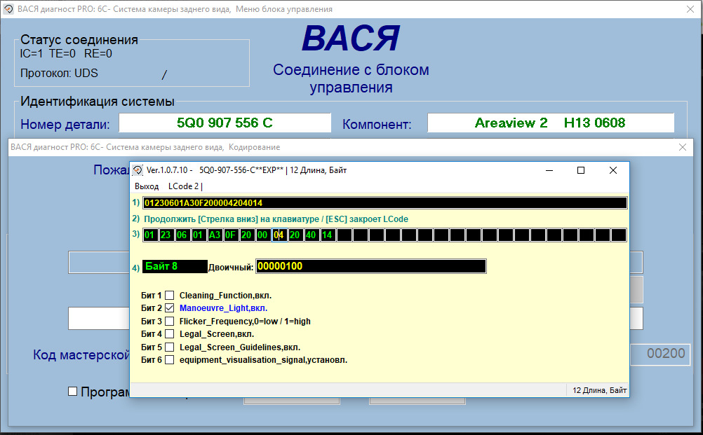
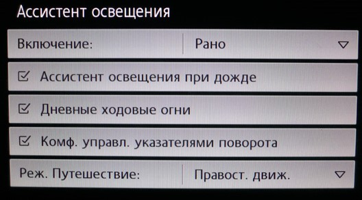

# Headlights

### Maintaining long-range mode after turning off the engine

``` yaml title="Login code: 31347"
Block 09 (on-board network) → Adaptation:
Fernlicht_assistent:
- Fernlichtassistent Reset: not active
→ Apply
```


### Adjusting the Light Sensor

=== "Coding in ODIS"
    
``` yaml title="Login code: 31347"
Block 09 → Coding → Subblock RLHS:
3CA8DD: headlights come on earlier, at about 1200 lx
    3CA8D7: headlights come on very late, at 800 lx
    ```


  
=== "Coding in VCDS"
    
``` yaml title="Login code: 31347"
Block 09 – On-board network electronics → Coding → Subblock RLHS:
Bytes 0 and 2: 3C A8 D7 # (1)!
    ```


    1. Byte 0 is 2,3,4,5 bits, and byte 2 is 0,1,2,4,6,7

### Maneuvering light from mirrors when parking

!!! note ""
The adaptation is only suitable for vehicles with Area View installed.

=== "Coding in ODIS"
    
``` yaml title="Login code: 31347"
    Block 09 → Adaptation:
    Aussenlicht_uebergreifend:
    – Umfeldleuchte_als_Manoevrierleuchte: Activate 
    → Apply
    ```


    
``` yaml title="Login code: 31347"
    Block 6C → Coding:
    – Manoeuvre_Light: Activate
    → Apply (with block reboot)
    ```


=== "Coding in VCDS"
    
``` yaml title="Login code: 31347"
    Block 6C — Rear view camera system → Coding → Long coding:
    Byte 8 – Bit 2 (Manoeuvre_Light): Activate  
    Exit → Save  
    ```


    

### Turning on the PTF when turning on the high beams

Left front PTF
``` yaml title="Login code: 31347"
Block 09 → Adaptation:
Leuchte12NL LB45:
- Lichtfunktion B 12: Fernlicht links , was not active
→ Apply
```


Right front PTF
``` yaml title="Login code: 31347"
Block 09 → Adaptation:
Leuchte13NL RB5:
- Lichtfunktion B 13: Fernlicht rechts , was not active
→ Apply
```


### Flashing of high beams and PTF when PTF is on (strobe)

=== "Coding in ODIS"
    
``` yaml title="Login code: 31347"
    Block 09 → Adaptation:
    Aussenlicht_Front (Driving light and parking light):
    - Zahl der aktivern Sheinwerfer Auf 2 limitieren: limitieren (was leave in operation)
    → Apply
    ```


=== "Coding in OBD11"
    
``` yaml title="Login code: 31347"
    9 Block on-board network control → Security access  → Coding:
    Aussenlicht_Front:
    - Zahl der aktiven Scheinwerfer auf 2 limitieren: limitieren (was leave in operation)
    ```


### Flashing between high beam and low beam (strobe option for halogen headlights)

Left low beam
``` yaml title="Login code: 31347"
Block 09 → Adaptation:
Leuchte6ABL LC5:
- Lichtfunktion B 6: Lichthupe generell change to not active
- Lichtfunktion C 6: not active change to Lichthupe generell
- Dimming Direction CD 6: maximize change to minimize
→ Apply
```


Right low beam
``` yaml title="Login code: 31347"
Block 09 → Adaptation:
Leuchte7ABL RB1:
- Lichtfunktion B 7: Lichthupe generell change to not active
- Lichtfunktion C 7: not active change to Lichthupe generell
- Dimming Direction CD 7: maximize change to minimize
→ Apply
```


### Flashing of high beams and PTF when PTF is turned off (strobe)

Left front PTF
``` yaml title="Login code: 31347"
Block 09 → Adaptation:
Leuchte12NL LB45:
- Dimming direction CD 12: maximum
- Dimmwert CD 12: 0 change to 110
- Lichtfunktion C 12: Lichthupe generell 
→ Apply
```


Right front PTF
``` yaml title="Login code: 31347"
Block 09 → Adaptation:
Leuchte13NL RB5:
- Dimming direction CD 13: maximum
- Dimmwert CD 13: 0 change to 110
- Lichtfunktion C 13: Lichthupe generell 
→ Apply
```


### Changing the amount of blinking of the turn signal when overtaking or changing lanes

``` yaml title="Login code: 31347"
Block 09 → Adaptation:
Aussenlicht_Blinker:
- Komfortblinken Blinkzyklen (Turn signal control): change to required quantity 2-5
→ Apply
```


### American style turn signals for halogen headlights (constantly on with DRL at half intensity)

!!! note ""
Relevant for cars with turn signals and incandescent lamps

``` yaml title="Login code: 31347"
Block 09 → Adaptation:
Leuchte0BLK VLB36:
- Lichtfunktion D0: Standlicht allgemein (Schlusslicht, Positionslicht, Begrenzungslicht) 
- Dimmwert CD0: 0 change to 30
- Lichtfunktion E0: Blinken Links Dunkelphase
- Dimming Direction EF0: maximize change to minimize
→ Apply
---
Leuchte1BLK VRB20:
- Lichtfunktion D1: Standlicht allgemein (Schlusslicht, Positionslicht, Begrenzungslicht)
- Dimmwert CD1: 0 change to 30
- Lichtfunktion E1: Blinken Rechts Dunkelphase
- Dimming Direction EF1: maximize change to minimize
 → Apply
```


### Disable low beam/DRL warning

``` yaml title="Login code: 31347"
Block 09 → Adaptation:
Leuchte2SL VLB10:
- Lichtfunktion G 2: Blinken links Hellphase  
- Dimmwert GH 2: 0  
- Dimming Direction GH 2: minimize  
→ Apply  
---
Leuchte3SL VRB21:
- Lichtfunktion G 3: Blinken rechts Hellphase  
- Dimmwert GH 3: 0  
- Dimming Direction GH 3: minimize  
→ Apply
```


!!! tip "Audi Style"
    
``` yaml
    - Lichtfunktion G 2: Blinken links aktiv (beide Phase)  
- Dimmwert GH 2: value from 20 to 35
    - Lichtfunktion G 2: Blinken links aktiv (beide Phase)  
- Dimmwert GH 3: value from 20 to 35
    ```


### Disabling DRLs when the handbrake is up

``` yaml title="Login code: 31347"
Block 09 → Adaptation:
Aussenlicht_uebergreifend:
- Fahrlichtwarnung_Hinweis_Konfig: kein_Hinweis 
→ Apply
```


### Disable DRL in position 0 on light switch

``` yaml title="Login code: 31347"
Block 09 → Adaptation:
Aussenlicht_Front:
- Tagfahrlicht Dauerfahrlicht bei Handbremse abschalten: Activate
→ Apply
```


### Settings menu item "Daylight" to turn off DRL only when necessary

``` yaml title="Login code: 31347"
Block 09 → Adaptation:
Aussenlicht_Front:
- Tagfahrlicht nur in Schalterstellung AUTO: Activate
→ Apply
```


### LEDs in PTF

In the lighting settings menu, the “daytime running lights” item appears:


``` yaml title="Login code: 31347"
Block 09 → Adaptation:
Aussenlicht_Front:
Tagfahrlicht aktivierung durch BAP oder Bedienfolge moeglich: Activate:
→ Apply
```


### Automatic follow-up, not distant blinking before exiting the car

``` yaml title="Login code: 31347"
Block 09 → Adaptation:
Leuchte12NL LB45:
- Lasttyp 12: 6-LED Lichtmodul
→ Apply
---
Leuchte13NL RB5:
- Lasttyp 13: 6-LED Lichtmodul
→ Apply
```


Dimming LEDs:

``` yaml
Leuchte12NL LB45:
- DimmwertAB 12: 60
→ Apply
---
Leuchte13NL RB5:
- DimmwertAB 13: 60
→ Apply
```


### Activation of front PTFs when reverse gear is engaged

``` yaml title="Login code: 31347"
Block 09 → Adaptation:
Aussenlicht_uebergreifend:
- Coming Home Verbaustatus: Auto
- Menueeinstellung Cominghome: # Glow time
→ Apply
```


### Cornering light system (CORNER)

``` yaml title="Login code: 31347"
Block 09 → Adaptation:
Static AFS light :
- Bei Rueckwaertsfahrt: double sided 
→ Apply
```


### Cornering light system (CORNER)

``` yaml title="Login code: 31347"
Block 09 → Adaptation:
Leuchte12NL LB45:
- Lichtfunktion D 12: Abbieglicht links (was not active)
→ Apply
---
Leuchte13NL RB5:
- Lichtfunktion D 13: Abbieglicht rechts (was not active)
→ Apply
```


	
1. You can set the value to no more than 60. To disable the function, you must set the value to 0

``` yaml title="Login code: 31347"
Block 09 → Adaptation:
Static AFS light :
- Untere Geschwindigkeitsschwelle (Lower speed limit): 0 km/h
- Obere Geschwindigkeitsschwelle (Upper speed threshold): 50 km/h # (1)!
→ Apply
```


1. You can set the value to no more than 60. To disable the function, you must set the value to 0