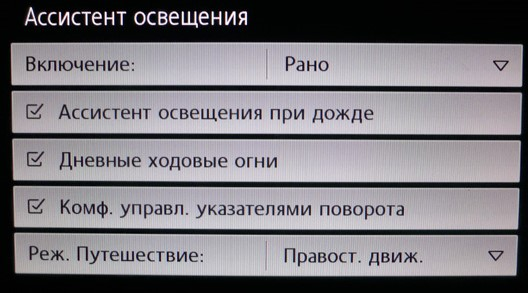

# Передние фары

### Сохранение автодальнего режима после выключения двигателя

``` yaml title="логин-пароль: 31347"
Блок 09 (бортовая сеть) → Адаптация:
Fernlicht_assistent:
- Fernlichtassistent Reset: not active
→ Применить 
```
  
### Регулировка Датчика Освещённости

=== "Кодирование в ODIS"
    ``` yaml title="логин-пароль: 31347"
    Блок 09 → Кодирование → Подблок RLНS:
    3СА8DD: фары включаются не так поздно, где то при 1200lx
    3CA8D7: фары включаются совсем поздно, при 800lx
    ```
  
=== "Кодирование в VCDS"
    ``` yaml title="логин-пароль: 31347"
    Блок 09 – Электроника бортовой сети → Кодирование → Подблок RLНS:
    Байты 0 и 2: 3С А8 D7 # (1)!
    ```

    1. Байт 0 – 2,3,4,5 биты, а байт 2 — 0,1,2,4,6,7

### Манёвровый свет от зеркал при парковке

!!! note ""
    Адаптация подходит только для автомобилей с установленным круговым обзором Area View

=== "Кодирование в ODIS"
    ``` yaml title="логин-пароль: 31347"
    Блок 09 → Адаптация:
    Aussenlicht_uebergreifend:
    – Umfeldleuchte_als_Manoevrierleuchte: Активировать 
    → Применить
    ```
    ``` yaml title="логин-пароль: 31347"
    Блок 6C → Кодирование:
    – Manoeuvre_Light: Активировать
    → Применить (с перезагрузкой блока)
    ```

=== "Кодирование в VCDS"
    ``` yaml title="логин-пароль: 31347"
    Блок 6С — Система камеры заднего вида → Кодирование → Длинное кодирование:
    Байт 8 – Бит 2 (Manoeuvre_Light): Активировать  
    Выход → Сохранить  
    ```
    

### Включение ПТФ при включении дальнего света

Левая передняя ПТФ
``` yaml title="логин-пароль: 31347"
Блок 09 → Адаптация:
Leuchte12NL LB45:
- Lichtfunktion B 12: Fernlicht links (Горит при дальнем левом свете), было nicht aktiv
→ Применить
```
Правая передняя ПТФ
``` yaml title="логин-пароль: 31347"
Блок 09 → Адаптация:
Leuchte13NL RB5:
- Lichtfunktion B 13: Fernlicht rechts (Горит при дальнем правом свете), было nicht aktiv
→ Применить
```

### Перемигивание дальнего света и ПТФ при включенных ПТФ (стробоскоп)

=== "Кодирование в ODIS"
    ``` yaml title="логин-пароль: 31347"
    Блок 09 → Адаптация:
    Aussenlicht_Front (Driving light and parking light):
    - Zahl der aktivern Sheinwerfer Auf 2 limitieren: limitieren (было in Betrieb lassen)
    → Применить
    ```

=== "Кодирование в OBD11"
    ``` yaml title="логин-пароль: 31347"
    9 Блок управления бортовой сети → Безопасный доступ (Логин: 31347) → Кодирование:
    Aussenlicht_Front:
    - Zahl der aktiven Scheinwerfer auf 2 limitieren: limitieren (было in Betrieb lassen)
    ```
  
### Перемигивание дальнего света и ближнего (вариант стробоскопа для галогеновых фар)

Левый ближний свет
``` yaml title="логин-пароль: 31347"
Блок 09 → Адаптация:
Leuchte6ABL LC5:
- Lichtfunktion B 6: Lichthupe generell меняем на not active
- Lichtfunktion C 6: not active меняем на Lichthupe generell
- Dimming Direction CD 6: maximize меняем на minimize
→ Применить
```

Правый ближний свет
``` yaml title="логин-пароль: 31347"
Блок 09 → Адаптация:
Leuchte7ABL RB1:
- Lichtfunktion B 7: Lichthupe generell меняем на not active
- Lichtfunktion C 7: not active меняем на Lichthupe generell
- Dimming Direction CD 7: maximize меняем на minimize
→ Применить
```
	
### Перемигивание дальнего света и ПТФ при выключенных ПТФ (стробоскоп)

Левая передняя ПТФ
``` yaml title="логин-пароль: 31347"
Блок 09 → Адаптация:
Leuchte12NL LB45:
- Dimming direction CD 12: maximum
- Dimmwert CD 12: 0 меняем на 110
- Lichtfunktion C 12: Lichthupe generell (было Nebellicht rechts)
→ Применить
```

Правая передняя ПТФ
``` yaml title="логин-пароль: 31347"
Блок 09 → Адаптация:
Leuchte13NL RB5:
- Dimming direction CD 13: maximum
- Dimmwert CD 13: 0 меняем на 110
- Lichtfunktion C 13: Lichthupe generell (было Nebellicht rechts)
→ Применить
```

### Изменение количества мигания поворотника в режиме обгона или перестроения

``` yaml title="логин-пароль: 31347"
Блок 09 → Адаптация:
Aussenlicht_Blinker:
- Komfortblinken Blinkzyklen (Turn signal control): меняем на нужное количество 2-5
→ Применить
```

### Американский стиль поворотников для галогеновых фар (горят постоянно с ДХО в пол-накала)

!!! note ""
    Актуально для автомобилей с поворотниками, в которых стоят лампы накаливания

``` yaml title="логин-пароль: 31347"
Блок 09 → Адаптация:
Leuchte0BLK VLB36:
- Lichtfunktion D0: Standlicht allgemein (Schlusslicht, Positionslicht, Begrenzungslicht) 
- Dimmwert CD0: 0 меняем на 30
- Lichtfunktion E0: Blinken Links Dunkelphase
- Dimming Direction EF0: maximize меняем на minimize
→ Применить
---
Leuchte1BLK VRB20:
- Lichtfunktion D1: Standlicht allgemein (Schlusslicht, Positionslicht, Begrenzungslicht)
- Dimmwert CD1: 0 меняем на 30
- Lichtfunktion E1: Blinken Rechts Dunkelphase
- Dimming Direction EF1: maximize меняем на minimize
 → Применить
```

### Перемигивание поворотников с ДХО (для галогеновых фар)

``` yaml title="логин-пароль: 31347"
Блок 09 → Адаптация:
Leuchte2SL VLB10:
- Lichtfunktion G 2: Blinken links Hellphase  
- Dimmwert GH 2: 0  
- Dimming Direction GH 2: minimize  
→ Применить  
---
Leuchte3SL VRB21:
- Lichtfunktion G 3: Blinken rechts Hellphase  
- Dimmwert GH 3: 0  
- Dimming Direction GH 3: minimize  
→ Применить
```

!!! tip "Audi Style"
    ``` yaml
    - Lichtfunktion G 2: Blinken links aktiv (beide Phase)  
    - Dimmwert GH 2: значение от 20 до 35  
    - Lichtfunktion G 2: Blinken links aktiv (beide Phase)  
    - Dimmwert GH 3: значение от 20 до 35  
    ```
  
### Отключение оповещения о ближнем свете фар / ДХО

``` yaml title="логин-пароль: 31347"
Блок 09 → Адаптация:
Aussenlicht_uebergreifend:
- Fahrlichtwarnung_Hinweis_Konfig: kein_Hinweis (было Hinweis_in_LDS-Stellung_Null_und_SL)
→ Применить
```

### Отключение ДХО при поднятом ручном тормозе

``` yaml title="логин-пароль: 31347"
Блок 09 → Адаптация:
Aussenlicht_Front:
- Tagfahrlicht Dauerfahrlicht bei Handbremse abschalten: Активировать
→ Применить
```

### Отключение ДХО в положении 0 на переключателе света

``` yaml title="логин-пароль: 31347"
Блок 09 → Адаптация:
Aussenlicht_Front:
- Tagfahrlicht nur in Schalterstellung AUTO: Активировать
→ Применить
```

### Пункт меню настроек "Дневной свет", чтоб отключать ДХО только по необходимости

В меню настройки освещения, появляется пункт "дневные ходовые огни":  


``` yaml title="логин-пароль: 31347"
Блок 09 → Адаптация:
Aussenlicht_Front:
Tagfahrlicht aktivierung durch BAP oder Bedienfolge moeglich: Активировать:
→ Применить
```

### Светодиоды в ПТФ

``` yaml title="логин-пароль: 31347"
Блок 09 → Адаптация:
Leuchte12NL LB45:
- Lasttyp 12: 6-LED Lichtmodul
→ Применить
---
Leuchte13NL RB5:
- Lasttyp 13: 6-LED Lichtmodul
→ Применить
```

Уменьшение яркости светодиодов:

``` yaml
Leuchte12NL LB45:
- DimmwertAB 12: 60
→ Применить
---
Leuchte13NL RB5:
- DimmwertAB 13: 60
→ Применить
```

### Автоматическое провожание, а не морганием дальним перед выходом из машины

``` yaml title="логин-пароль: 31347"
Блок 09 → Адаптация:
Aussenlicht_uebergreifend:
- Coming Home Verbaustatus: Авто
- Menueeinstellung Cominghome: # Время свечения
→ Применить
```

### Активация передних ПТФ при включении заднего хода

``` yaml title="логин-пароль: 31347"
Блок 09 → Адаптация:
Static AFS light (Система статического адаптивного освещения):
- Bei Rueckwaertsfahrt: double sided (С обеих сторон)
→ Применить
```

### Система освещения поворотов (CORNER)

``` yaml title="логин-пароль: 31347"
Блок 09 → Адаптация:
Leuchte12NL LB45:
- Lichtfunktion D 12: Abbieglicht links (было nicht aktiv)
→ Применить
---
Leuchte13NL RB5:
- Lichtfunktion D 13: Abbieglicht rechts (было nicht aktiv)
→ Применить
```
	
Изменение скорости включения освещения поворотов

``` yaml title="логин-пароль: 31347"
Блок 09 → Адаптация:
Static AFS light (Система статического адаптивного освещения):
- Untere Geschwindigkeitsschwelle (Lower speed limit): 0 км\ч
- Obere Geschwindigkeitsschwelle (Upper speed threshold): 50 км\ч # (1)!
→ Применить
```

1. Допускается установка значения не больше 60. Для отключения функции необходимо выставить значение 0