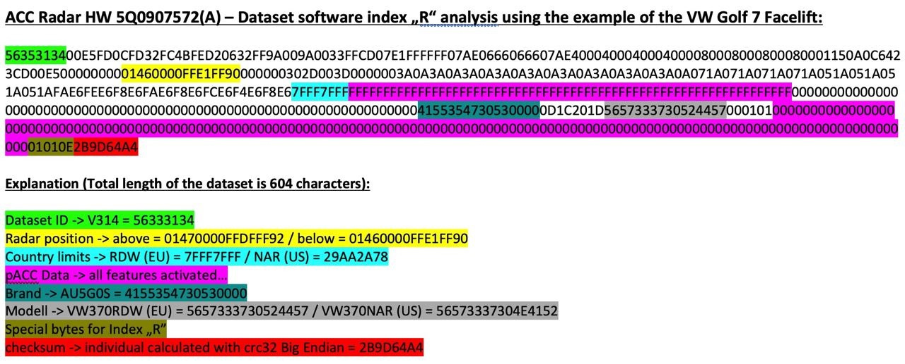
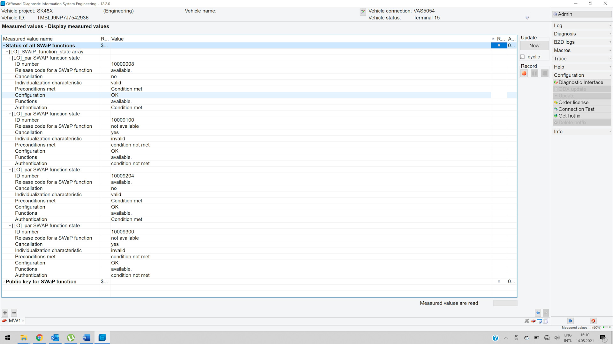
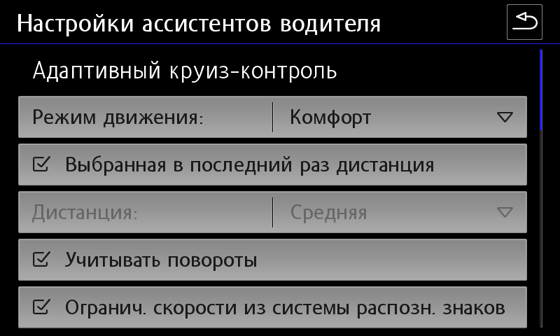

# Activation of ACC and pACC (SWaP)

!!! warning ""
    You do all actions at your own peril and risk! We are not responsible for damaged equipment.  
    Firmware requires ODIS Engineering version 12. Earlier versions may display an error when flashing the firmware - “Options not recognized.”  

SWaP is a code based on the VIN code of the vehicle, a special individual characteristic VCRN (Vehicle Component Registration Number) of the vehicle unit to which SWaP is applied, and directly the list of FEC (Function Enabling Codes) or FSC (FreiSchaltungsCode) functions.  
SWaP is signed with a private key (RSA1024).  

pACC (Predictive ACC) is an adaptive cruise control that can automatically set driving speed using map data (predictive data, PSD) and recognized road signs.  

Archive with SWaP generator, firmware and parameters:
[Download (version from 02.02.2022) :material-download:](../firmwares/accGenerator.zip){ .md-button .md-button--primary }

=== "FEC function codes for 2Q0/3QF/5Q0/5QF radars"
    10009001 MRR-Packet 1: ACClow (Basis-ACC) + FrontAssist inkl. CityANB
    10009002 MRR-Packet 2: ACClow (ACC FTS) + FrontAssist inkl. CityANB
    10009003 MRR-Packet 3: ACClow (ACC S&G) + FrontAssist inkl. CityANB
    10009004 MRR-Packet 4: FrontAssist inkl. CityANB (without ACC)
    10009005 MRR-Paket 5: CityANB (without ACC)
    10009006 MRR-Packet 6: ACChigh (Basis-ACC) + FrontAssist inkl. CityANB
    10009007 MRR-Packet 7: ACChigh (ACC FTS) + FrontAssist inkl. CityANB
    10009008 MRR-Packet 8: ACChigh (ACC S&G) + FrontAssist inkl. CityANB
    10009101 ACC-Funktionserweiterungs-Paket "predictiveACC"
    10009102 ACC-Funktionserweiterungs-Paket "StauAssistent"
    10009103 ACC-Funktionserweiterungs-Paket "predictiveACC & StauAssistent"
    10009201 AWV-Auspraegung "AWV1,2 - Warnung nur visuell & auditiv" (warning only visual and auditory)
    10009202 AWV-Auspraegung "AWV1,2"
    10009203 AWV-Auspraegung "AWV1,2,3"
    10009204 AWV-Auspraegung "AWV1,2,3, vFGS
    10009205 AWV-Auspraegung "AWV1,2,3, vFGS, vRFS“
    10009300 AWV-Funktionserweiterungs-Paket "Elektronische Parkbremse"
    10009301 AWV-Funktionserweiterungs-Paket "EmergencyAssist"
    10009302 AWV-Funktionserweiterungs-Paket "Abbiegeassistent"
    10009303 AWV-Funktionserweiterungs-Paket "AWV-Gegenverkehr"
    10009304 AWV-Funktionserweiterungs-Paket "Abbiegeassistent & AWV-Gegenverkehr"
    10009305 AWV-Funktionserweiterungs-Paket "EmergencyAssist & AWV-Gegenverkehr"
    10009306 AWV-Funktionserweiterungs-Paket "EmergencyAssist & Abbiegeassistent"
    10009307 AWV-Funktionserweiterungs-Paket "EmergencyAssist & Abbiegeassistent & AWV-Gegenverkehr"
    10009500 Verkehrszeichenerkennung (VZE)
    10009600 Vorrausschauender Fussgaengerschutz (VFS) - FCWP
    FGS = Fußgängerschutz (Pedestrian Protection)
    RFS = Radfahrer-Schutz (Bicycle Protection)
  

=== "Functional FEC codes for 3Q0 radars"
    10003100 MRR-Packet 1: ACClow (Basis-ACC) + FrontAssist inkl. CityANB
    10003200 MRR-Packet 2: ACClow (ACC FTS) + FrontAssist inkl. CityANB
    10003300 MRR-Packet 3: ACClow (ACC S&G) + FrontAssist inkl. CityANB
    10003400 MRR-Packet 4: FrontAssist inkl. CityANB (ohne ACC)
    10003500 MRR-Paket 5: CityANB (ohne ACC)
    10003600 MRR-Packet 6: ACChigh (Basis-ACC) + FrontAssist inkl. CityANB
    10003700 MRR-Packet 7: ACChigh (ACC FTS) + FrontAssist inkl. CityANB
    10003800 MRR-Packet 8: ACChigh (ACC S&G) + FrontAssist inkl. CityANB
    10003900 MRR-Packet 9: ACChigh konservativ (Basis-ACC) + FrontAssist inkl. CityANB
    10003A00 MRR-Paket 10: ACChigh konservativ (ACC FTS) + FrontAssist inkl. CityANB
    10003B00 MRR-Paket 11: ACChigh konservativ (ACC S&G) + FrontAssist inkl. CityANB
    10004000 zFAS AreaView3
    10004100 zFAS Bildverarbeitung AV3/IPA
    10004200 zFAS Anhaenger-Rangier-Assistent
    10004300 zFAS Aktionsgenerierung Warnen
    10004600 zFAS AWC Ladeplattenerkennung
    10005000 Personalisierung
    10006100 ACC-Funktionserweiterungs-Paket "predictiveACC"
    10006200 ACC-Funktionserweiterungs-Paket "StauAssistent"
    10006300 ACC-Funktionserweiterungs-Paket "predictiveACC&StauAssistent"
    10007100 AWV-Auspraegung "AWV1,2 - Warnung nur visuell&auditiv"
    10007200 AWV-Auspraegung "AWV1,2"
    10007300 AWV-Auspraegung "AWV1,2,3"
    10007400 AWV-Auspraegung "AWV1,2,3, vFGS10008100 AWV-Funktionserweiterungs-Paket "EmergencyAssist"
    10008200 AWV-Funktionserweiterungs-Paket "Abbiegeassistent"
    10008300 AWV-Funktionserweiterungs-Paket "AWV-Gegenverkehr"
    10008400 AWV-Funktionserweiterungs-Paket "Abbiegeassistent&AWV-Gegenverkehr"
    10008500 AWV-Funktionserweiterungs-Paket "EmergencyAssist&AWV-Gegenverkehr"
    10008600 AWV-Funktionserweiterungs-Paket "EmergencyAssist&Abbiegeassistent"
    10008700 AWV-Funktionserweiterungs-Paket "EmergencyAssist&Abbiegeassistent&AWV-Gegenverkehr"

### Parameter structure using the example of 5Q0 radar



### Matching radars and firmware  

| Equipment ID |     Firmware X |            Firmware | Parameter<br/>(ODIS XML) |
|----------------:|:------------------:|--------------------:|:-------------------------------------------------------|
|       2Q0907572 | FL_2Q0907572T_X383 | FL_2Q0907572AB_0397 | ARBEITS_DATEI_DSDL2.xml (VW and Škoda variants available) |
|   3QF_5QF907572 | FL_5Q0907572M_X720 |  FL_5Q0907572S_0780 | 13_5Q0907572R_EU_RDW.xml                               |
|       3Q0907572 | FL_3Q0907572A_X180 |  FL_3Q0907572C_0196 | DA_013_7200_3H0_V002_VW483A2RDW.xml                    |
|       5Q0907572 | FL_5Q0907572E_X312 |  FL_5Q0907572K_0402 | 13_5Q0907572K.xml                                      |

To activate adaptive cruise control, you must first find out the current version of the radar that is installed:
```
System designation: ACCCONTIMQB  
Software version: 0372  
ASAM version: H01  
VW/Audi part number: 2Q0907572R  
ASAM part number: 2Q0907572B  
```


### Changing the firmware on the radar without changing the SWaP code

1. Make a backup of current encodings and adaptations

2. In the case of 2Q0 radar, you must first install the firmware FL_2Q0907572T_0383_BOOTLOADER_V001_S

3. Installation of normal firmware, not X in accordance with the table

4. Fill in the required parameters in accordance with the table

5. Restoration of encodings and adaptations

### Firmware and SWaP code generation

You can view it in the measured values ​​of block 13:
   You need to start the process of unprotecting the components (with the protection already unprotected) and disable the VAS5054A in the process. If a successful combination of circumstances occurs, the existing pairing codes will be erased, but new ones will still have time to pour into the block, and after the block is rebooted, it will fall into the CP. If it doesn't work, we repeat again.  
    
```
    for 2Q0.. - A6 2C 69 ...  
    for 5Q0/3QF.. - 9C 47 73...  
    for 3Q0.. - D2 C3 3E...  
    for 5Q0.. - "8F 51 4A...  
    ```


After removing the protection, you need to make sure that the public key has changed to the correct one.  
  
You can view it in the measured values ​​of block 13.
This code can be extracted from the measured values ​​of block 13:

Maximum - 4 pieces. They depend on what swaps the radar itself supports.
    
```
    For 2Q0 radar — if the version is below 0380, first install firmware FL_2Q0907572T_0383_BOOTLOADER_V001_S, then FL_2Q0907572AA_X390___S.odx  
    ```


For example, radar 3qf907561d supports: 10009000 10009100 10009200 10009300
    If all is well, you will see a list of your FEC codes, for each of which available, valid, condition met will be indicated.
1. First, you should check that the public key differs from the required value.
    
```
    for 2Q0.. - A6 2C 69 ...  
    for 5Q0/3QF.. - 9C 47 73...  
    for 3Q0.. - D2 C3 3E...  
    for 5Q0.. - "8F 51 4A...  
    ```


2. Force component protection to be activated on the radar using the ODIS Service online account.
3. Installing X firmware, for example, FL_2Q0907572AA_X390___S.odx
4. Remove component protection
    
``` yaml
Block 003 - Measured quantities → individualizing characteristic (VCRN)
    ```

 
  
5. To generate SWaP codes you will need VCRN (Vehicle Component Registration Number).
6. Selecting the required FEC codes
    
``` yaml
Block 003 - Measured quantities → List of all SWaP functions
    ```


      
7. Using the afcg.exe utility, generate a SWaP code. To generate a code you will need to enter: VIN, VCRN (from step 3) and a set of FEC codes separated by a space
    
```
    10009008 — ACC High 210 & stop and go & fts  
    10009204 — front assist  
    10009101 — pre acc  
    10009307 (doesn't work for 3QF Bosch sensors
    ```


8. The received SWaP code must be entered in adaptation block 13 (Transferring the unlock code for the SWaP function):

9. Installing regular firmware, not X in accordance with the table
    
``` yaml
Block 009 - Diagnostic session → Exit mode (EOL)
Block 008 - Access right → code 20103
Block 007 — Adaptations — Transferring the unlock code to the SWaP function → Entering the generated code in the “Data Entry” field
Block 005 - Basic UDS Installation → Unlock SWaP Feature
Block 003 - Measured quantities → Status of all SWaP functions
    ```


10. Filling in the required parameters in accordance with the table
11. Restoring encodings and adaptations or setting up from scratch (see below)

9. Installing regular firmware, not X in accordance with the table

10. Filling in the required parameters in accordance with the table

11. Restoring encodings and adaptations or setting up from scratch (see below)

### Carrying out encodings and adaptations for the primary activation of ACC

**Setting up engine electronics**
``` yaml
Block 01 → Coding:
Byte 5 – Bit 6: Activate
→ Apply (with block reboot)
```


In the group FSID, you must enter the last digits of the selected FEC codes in order (1 - 90, 2 - 91, 3 - 92, 4 - 93)  
``` yaml
Block 03 → Coding:
Byte 24 – Bit 3: Activate
→ Apply (with block reboot)
```


For example, FEC codes are selected: 10009008, 10009101, 10009204, 10009307
In the group FSID, you must enter the last digits of the selected FEC codes in order (1 - 90, 2 - 91, 3 - 92, 4 - 93)
For example, FEC codes are selected: 10009008, 10009101, 10009204, 10009307
``` yaml
Block 13 → Coding:
SWaP_FSID_group_1: 8
SWaP_FSID_group_2: 1
SWaP_FSID_group_3: 4
SWaP_FSID_group_4: 7
→ Apply (with block reboot)
```


**Setting up the adaptive cruise control unit**
``` yaml
Block 13 → Coding:
Front_camera: installed – if there is an assistant camera
Control_module_for_lane_assistant: installed
Initialization_concept_front_assist:
- Initialization_1 — a large icon waiting for Front Assist to be ready in the upper left corner of the AID, Front Assist is activated only after the start of movement, this value is set from the factory;
- Initialization_2 - a small icon waiting for Front Assist to be ready in the same place where the ACC icon then appears. Front Assist is activated a couple of seconds after turning on the ignition and immediately sees obstacles in front of the car.
Automatic_driveaway_by_pretrigger: Activate  
Automatic_driveaway_after_short_stop: Activate  
Driveaway_by_triggerleaver: Activate  
Pretriggertime_reduction: deactivated   
FPK_functions: installed 
Overtaking_right_prevention: deactivated 
Drive_pmode_selection: MMI_menu_ACC  
→ Apply (with block reboot)
```


``` yaml title="Login code: 20103"
Block 13 → Adaptation:
Distance_Setting:
- par_Distance_Setting: on
Adjustment_mode_time_slot_adaptive_distance_control:
- Adjustment_mode_time_slot_adaptive_distance_control: on
→ Apply
```


**Dashboard Customization**
``` yaml
Block 17 → Coding:
adaptive_cruise_control: yes
→ Apply (with block reboot)
```


**Gateway setup (for VW)**
``` yaml
Block 19 → Coding:
FPA_Funktion_ACC: Activate
→ Apply (with block reboot)
```


``` yaml
Block 19 → Adaptation:
Multi_function_steering_wheel_control_module Coding Value:
- variant: ACC-High
→ Apply
```


**Setting the steering rack (for Škoda)**
``` yaml
Block 16  → Coding:
Switch_for_cruise_control_integrated_in_turn_signal_switch: not installed
Switch_for_cruise_control: installed
Adaptive_cruise_control: installed
→ Apply (with block reboot)
```


**Setting up GU**
``` yaml title="Login code: 20103"
Block 5F → Adaptation:
Car_Function_Adaptations_Gen2 – menu_display_ACC: Activate
Car_Function_Adaptations_Gen2 – menu_display_ACC_over_threshold_high: Activate
Car_Function_List_BAP_Gen2 – ACC_0x05: Activate
→ Apply
```


**Setting up parking assistant**
``` yaml
Block 76 → Coding:
Adaptive_cruise_control: Activate
→ Apply (with block reboot)
```


### Carrying out encodings and adaptations to activate pACC

  

``` yaml
Block 13 → Coding:
Traffic_sign_detection: Activate
Speed_limit_assistent: Activate
Curve_assistent: Activate
Kurvenassistent_CarMenu: Activate
→ Apply (with block reboot)
```


``` yaml title="Login code: 20103"
Block 13 → Adaptation:
Predictive speed limit control:
- par_Predictive_speed_limit_control: Activate
→ Apply
```


### Additional encodings for radar version 5Q

``` yaml title="Login code: 20103"
Block 13 → Coding:
zul_Regelabweichung_CarMenu — large
pACC_Regulation_on_priority: Activate
pACC_Reaction_to_end_of_traffic_jam: with speed adaptation
pACC_Learning_drivers_offset: Activate
pACC_Reaction_to_narrow_places: dynamic and static
→ Apply (with block reboot)
```
