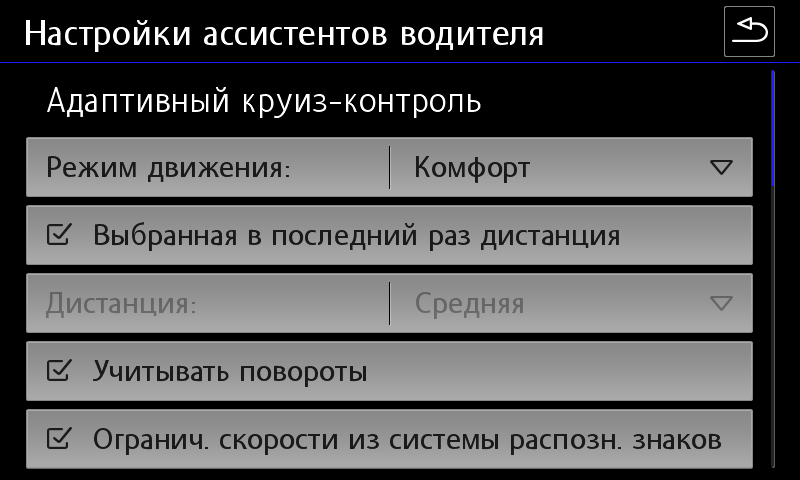

# Активация ACC и pACC (SWaP)

!!! warning ""
    Все действия вы делаете на свой страх и риск! Мы не несем ответственность за испорченное оборудование.  
    Для прошивки необходим ODIS Engineering 12 версии. Более ранние версии могут выдавать ошибку при прошивке - "Не распознаны варианты".    

SWaP - код на основе VIN-кода автомобиля, специального индивидуализирующего признака VCRN (Vehicle Component Registration Number) блока автомобиля, к которому применяется SWaP, и непосредственно перечня функций FEC (Function Enabling Codes) или FSC (FreiSchaltungsCode).  
SWaP подписывается закрытым ключом (RSA1024).  

pACC (Predictive ACC) — это адаптивный круиз-контроль, который может автоматически устанавливать скорость движения с помощью картографических данных (прогнозируемых данных, PSD) и распознаваемых дорожных знаков.  

Архив с генератором SWaP, прошивками и параметриями:
[Скачать (версия от 02.02.2022) :material-download:](../firmwares/accGenerator.zip){ .md-button .md-button--primary }

=== "Функциональные FEC коды для 2Q0/3QF/5Q0/5QF радаров"
    10009001	MRR-Paket 1: ACClow (Basis-ACC) + FrontAssist inkl. CityANB  
    10009002	MRR-Paket 2: ACClow (ACC FTS) + FrontAssist inkl. CityANB   
    10009003	MRR-Paket 3: ACClow (ACC S&G) + FrontAssist inkl. CityANB   
    10009004	MRR-Paket 4: FrontAssist inkl. CityANB (без ACC)   
    10009005	MRR-Paket 5: CityANB (без ACC)   
    10009006	MRR-Paket 6: ACChigh (Basis-ACC) + FrontAssist inkl. CityANB   
    10009007	MRR-Paket 7: ACChigh (ACC FTS) + FrontAssist inkl. CityANB    
    10009008	MRR-Paket 8: ACChigh (ACC S&G) + FrontAssist inkl. CityANB   
    10009101	ACC-Funktionserweiterungs-Paket "predictiveACC"   
    10009102	ACC-Funktionserweiterungs-Paket "StauAssistent" (Ассистент пробок)  
    10009103	ACC-Funktionserweiterungs-Paket "predictiveACC & StauAssistent"   
    10009201	AWV-Auspraegung "AWV1,2 - Warnung nur visuell & auditiv" (предупреждение только визуальное и слуховое)    
    10009202	AWV-Auspraegung "AWV1,2"   
    10009203	AWV-Auspraegung "AWV1,2,3"   
    10009204	AWV-Auspraegung "AWV1,2,3, vFGS   
    10009205	AWV-Auspraegung "AWV1,2,3, vFGS, vRFS“  
    10009300	AWV-Funktionserweiterungs-Paket "Elektronische Parkbremse"  
    10009301	AWV-Funktionserweiterungs-Paket "EmergencyAssist"   
    10009302	AWV-Funktionserweiterungs-Paket "Abbiegeassistent"   
    10009303	AWV-Funktionserweiterungs-Paket "AWV-Gegenverkehr"   
    10009304	AWV-Funktionserweiterungs-Paket "Abbiegeassistent & AWV-Gegenverkehr"   
    10009305	AWV-Funktionserweiterungs-Paket "EmergencyAssist & AWV-Gegenverkehr"   
    10009306	AWV-Funktionserweiterungs-Paket "EmergencyAssist & Abbiegeassistent"   
    10009307	AWV-Funktionserweiterungs-Paket "EmergencyAssist & Abbiegeassistent & AWV-Gegenverkehr"   
    10009500	Verkehrszeichenerkennung (VZE)  
    10009600	Vorrausschauender Fussgaengerschutz (VFS) - FCWP    
  
    FGS = Fußgängerschutz (Pedestrian Protection)  
    RFS = Radfahrer-Schutz (Bicycle Protection)  

=== "Функциональные FEC коды для 3Q0 радаров"
    10003100	MRR-Paket 1: ACClow (Basis-ACC) + FrontAssist inkl. CityANB  
    10003200	MRR-Paket 2: ACClow (ACC FTS) + FrontAssist inkl. CityANB  
    10003300	MRR-Paket 3: ACClow (ACC S&G) + FrontAssist inkl. CityANB  
    10003400	MRR-Paket 4: FrontAssist inkl. CityANB (ohne ACC)  
    10003500	MRR-Paket 5: CityANB (ohne ACC)  
    10003600	MRR-Paket 6: ACChigh (Basis-ACC) + FrontAssist inkl. CityANB  
    10003700	MRR-Paket 7: ACChigh (ACC FTS) + FrontAssist inkl. CityANB  
    10003800	MRR-Paket 8: ACChigh (ACC S&G) + FrontAssist inkl. CityANB  
    10003900	MRR-Paket 9: ACChigh konservativ (Basis-ACC) + FrontAssist inkl. CityANB  
    10003A00	MRR-Paket 10: ACChigh konservativ (ACC FTS) + FrontAssist inkl. CityANB  
    10003B00	MRR-Paket 11: ACChigh konservativ (ACC S&G) + FrontAssist inkl. CityANB  
    10004000	zFAS AreaView3  
    10004100	zFAS Bildverarbeitung AV3/IPA  
    10004200	zFAS Anhaenger-Rangier-Assistent  
    10004300	zFAS Aktionsgenerierung Warnen  
    10004600	zFAS AWC Ladeplattenerkennung  
    10005000	Personalisierung  
    10006100	ACC-Funktionserweiterungs-Paket "predictiveACC"  
    10006200	ACC-Funktionserweiterungs-Paket "StauAssistent"  
    10006300	ACC-Funktionserweiterungs-Paket "predictiveACC&StauAssistent"  
    10007100	AWV-Auspraegung "AWV1,2 – Warnung nur visuell&auditiv"  
    10007200	AWV-Auspraegung "AWV1,2"  
    10007300	AWV-Auspraegung "AWV1,2,3"  
    10007400	AWV-Auspraegung "AWV1,2,3, vFGS  
    10008100	AWV-Funktionserweiterungs-Paket "EmergencyAssist"  
    10008200	AWV-Funktionserweiterungs-Paket "Abbiegeassistent"  
    10008300	AWV-Funktionserweiterungs-Paket "AWV-Gegenverkehr"  
    10008400	AWV-Funktionserweiterungs-Paket "Abbiegeassistent&AWV-Gegenverkehr"  
    10008500	AWV-Funktionserweiterungs-Paket "EmergencyAssist&AWV-Gegenverkehr"  
    10008600	AWV-Funktionserweiterungs-Paket "EmergencyAssist&Abbiegeassistent"  
    10008700	AWV-Funktionserweiterungs-Paket "EmergencyAssist&Abbiegeassistent&AWV-Gegenverkehr"  

### Структура параметрии на примере 5Q0 радара

  

### Соответствие радаров и прошивок  

| ID оборудования |     Прошивка X     |            Прошивка | Параметрия<br/>(ODIS XML)                              |
|----------------:|:------------------:|--------------------:|:-------------------------------------------------------|
|       2Q0907572 | FL_2Q0907572T_X383 | FL_2Q0907572AA_0396 | ARBEITS_DATEI_DSDL2.xml (доступны варианты VW и Škoda) |
|   3QF_5QF907572 | FL_5Q0907572M_X720 |  FL_5Q0907572S_0780 | 13_5Q0907572R_EU_RDW.xml                               |
|       3Q0907572 | FL_3Q0907572A_X180 |  FL_3Q0907572C_0196 | DA_013_7200_3H0_V002_VW483A2RDW.xml                    |
|       5Q0907572 | FL_5Q0907572E_X312 |  FL_5Q0907572K_0402 | 13_5Q0907572K.xml                                      |

Для активации адаптивного круиз контроля необходимо сначала узнать текущую версию радара, который установлен:  
```
Обозначение системы: ACCCONTIMQB  
Версия ПО: 0372  
Версия АО: H01  
Номер детали VW/Audi: 2Q0907572R  
Номер детали АО: 2Q0907572B  
```

### Смена прошивки на радаре без изменения SWaP кода

1. Сделать бэкап текущих кодировок и адаптаций  

2. В случае 2Q0 радара сначала необходимо установить прошивку FL_2Q0907572T_0383_BOOTLOADER_V001_S    

3. Установка обычной прошивки, не X в соответствии с таблицей   

4. Заливка нужной параметрии в соответствии с таблицей  

5. Восстановление кодировок и адаптаций  

### Прошивка и генерация SWaP кода

1. Для начала стоит проверить, что открытый ключ отличается от требуемого значения.  
Посмотреть его можно в измеряемых величинах блока 13:
```
для 2Q0.. - A6 2C 69 ...  
для 5Q0/3QF.. - 9C 47 73...  
для 3Q0.. - D2 C3 3E...  
для 5Q0.. - "8F 51 4A...  
```
**Если открытый ключ совпадает с одним из списка, то можно смело переходить к шагу 5!**    
  
2. Принудительно на радаре активировать защиту компонентов с помощью онлайн-аккаунта ODIS Service.  
   Нужно начать процедуру снятия защиты компонентов (с уже снятой защитой) и в процессе отключить VAS5054A. При удачном стечении обстоятельств имеющиеся коды сопряжения будут стерты, а новые еще успеют залиться в блок, и после перезагрузки блока он упадет в CP. Если не получилось, повторяем снова.   

3. Установка X прошивки, например, FL_2Q0907572AA_X390___S.odx  
```
В случае 2Q0 радара — если версия ниже 0380, то сначала необходимо установить прошивку FL_2Q0907572T_0383_BOOTLOADER_V001_S, а затем FL_2Q0907572AA_X390___S.odx  
```

4. Снять защиту компонентов  
После снятия защиты необходимо убедиться, что открытый ключ изменился на нужный.  
Посмотреть его можно в измеряемых величинах блока 13.
```
для 2Q0.. - A6 2C 69 ...  
для 5Q0/3QF.. - 9C 47 73...  
для 3Q0.. - D2 C3 3E...  
для 5Q0.. - "8F 51 4A...  
```
Если все в порядке, переходим к генерации SWaP  
5. Для генерирования SWaP кодов понадобится VCRN (Vehicle Component Registration Number).  
Данный код можно вытянуть из измеряемых величин 13 блока:
``` yaml
Блок 003 — Измеряемые величины → индивидуализирующий признак (VCRN) 
``` 
   
6. Выбор нужных FEC кодов  
Максимально - 4 штуки. Они зависят от того, зависит от того какие свапы поддерживает сам радар.  
``` yaml
Блок 003 — Измеряемые величины → Список всех функций SWaP
```
  
Например, радар 3qf907561d поддерживает: 10009000 10009100 10009200 10009300  
```
10009008 — ACC High 210 & stop and go & fts  
10009204 — front assist  
10009101 — pre acc  
10009307 (doesn't work for 3QF Bosch sensors
```

7. С помощью утилиты afcg.exe сгенерировать SWaP код. Для генерации кода понадобится ввести: VIN, VCRN (из 3 шага) и набор FEC кодов через пробел     

8. Полученный SWaP код необходимо ввести в адаптации 13 блока (Передача кода разблокировки функции SWaP):  
``` yaml
Блок 009 — Диагностический сеанс → Режим при сходе с конвейера (EOL)  
Блок 008 — Право доступа → код 20103  
Блок 007 — Адаптации - Передача кода разблокировки функции SWaP → Ввод сгенерированного кода в поле "Ввод данных"  
Блок 005 — Базовая установка UDS → Разблокировка функции SWaP  
Блок 003 — Измеряемые величины → Статус всех функций SWaP
```
Проверить, все ли сделали правильно, можно в измеряемых величинах (003 Измеряемые величины → Статус всех функций SWaP).   
Если все хорошо, то вы увидите перечень ваших FEC-кодов, для каждого из которых будет указано available, valid, condition met (доступн., действ., условие выполнено).  

9. Установка обычной прошивки, не X в соответствии с таблицей   

10. Заливка нужной параметрии в соответствии с таблицей  

11. Восстановление кодировок и адаптаций или настройка с нуля (см. ниже)  
   
### Проведение кодировок и адаптаций для первичной активации ACC

**Настройка электроники двигателя**  
``` yaml
Блок 01 → Кодирование:
Байт 5 – Бит 6: Активировать
→ Применить (с перезагрузкой блока)
```
**Настройка тормозной системы**  
``` yaml
Блок 03 → Кодирование:
Байт 24 – Бит 3: Активировать
→ Применить (с перезагрузкой блока)
```

**Сохранение номеров выбранных FEC кодов**  
В FSID группы необходимо по порядку прописать последние цифры выбранных FEC кодов (1 — 90, 2 — 91, 3 — 92, 4 — 93)  
Например, выбраны FEC коды: 10009008, 10009101, 10009204, 10009307  
``` yaml
Блок 13 → Кодирование:
SWaP_FSID_group_1: 8
SWaP_FSID_group_2: 1
SWaP_FSID_group_3: 4
SWaP_FSID_group_4: 7
→ Применить (с перезагрузкой блока)
```
**Настройка блока адаптивного круиз-контроля** 
``` yaml
Блок 13 → Кодирование:
Front_camera: installed - в случае наличия камеры ассистентов
Control_module_for_lane_assistant: installed
Initialization_concept_front_assist:
- Initialization_1 — большая иконка ожидания готовности Front Assist в верхнем левом углу AID, Front Assist активируется только после начала движения, это значение стоит с завода; 
- Initialization_2 — маленькая иконка ожидания готовности Front Assist там же, где потом появляется иконка ACC, Front Assist активируется через пару секунд после включения зажигания и сразу видит препятствия перед машиной.
Automatic_driveaway_by_pretrigger: Активировать  
Automatic_driveaway_after_short_stop: Активировать  
Driveaway_by_triggerleaver: Активировать  
Pretriggertime_reduction: deactivated (увеличение времени ожидания при остановке до 10 секунд)  
FPK_functions: installed (если есть кнопка Drive Mode)
Overtaking_right_prevention: deactivated (обгон справа)
Drive_pmode_selection: MMI_menu_ACC (выбор режима работы в меню ассистентов на магнитоле) 
→ Применить (с перезагрузкой блока)
```
``` yaml title="логин-пароль: 20103"
Блок 13 → Адаптация:
Distance_Setting:
- par_Distance_Setting: on
Adjustment_mode_time_slot_adaptive_distance_control:
- Adjustment_mode_time_slot_adaptive_distance_control: on
→ Применить
```

**Настройка приборной панели** 
``` yaml
Блок 17 → Кодирование:
adaptive_cruise_control: yes
→ Применить (с перезагрузкой блока)
```
**Настройка гейтвея (для VW)** 
``` yaml
Блок 19 → Кодирование:
FPA_Funktion_ACC: Активировать
→ Применить (с перезагрузкой блока)
```
``` yaml
Блок 19 → Адаптация:
Multi_function_steering_wheel_control_module Coding Value:
- variant: ACC-High
→ Применить
```

**Настройка рулевой рейки (для Škoda)**  
``` yaml
Блок 16 (Электроника рулевой колонки) → Кодирование:
Switch_for_cruise_control_integrated_in_turn_signal_switch: not installed
Switch_for_cruise_control: installed
Adaptive_cruise_control: installed
→ Применить (с перезагрузкой блока)
```

**Настройка ГУ** 
``` yaml title="логин-пароль: 20103"
Блок 5F → Адаптация:
Car_Function_Adaptations_Gen2 - menu_display_ACC: Активировать
Car_Function_Adaptations_Gen2 - menu_display_ACC_over_threshold_high: Активировать
Car_Function_List_BAP_Gen2 - ACC_0x05: Активировать
→ Применить
```

**Настройка парковочного ассистента** 
``` yaml
Блок 76 → Кодирование:
Adaptive_cruise_control: Активировать
→ Применить (с перезагрузкой блока)
```

### Проведение кодировок и адаптаций для активации pACC

   

``` yaml
Блок 13 → Кодирование:
Traffic_sign_detection: Активировать
Speed_limit_assistent: Активировать
Curve_assistent: Активировать
Kurvenassistent_CarMenu: Активировать
→ Применить (с перезагрузкой блока)
```
``` yaml title="логин-пароль: 20103"
Блок 13 → Адаптация:
Predictive speed limit control:
- par_Predictive_speed_limit_control: Активировать
→ Применить
```

### Дополнительные кодировки для радаров версии 5Q

``` yaml title="логин-пароль: 20103"
Блок 13 → Кодирование:
zul_Regelabweichung_CarMenu — large
pACC_Regulation_on_priority: Активировать
pACC_Reaction_to_end_of_traffic_jam: with speed adaptation
pACC_Learning_drivers_offset: Активировать
pACC_Reaction_to_narrow_places: dynamic and static
→ Применить (с перезагрузкой блока)
```
