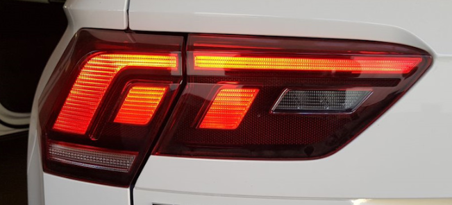
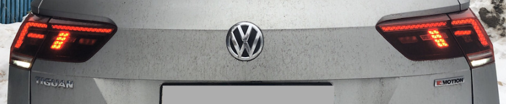

# Taillights

### Dynamic turn signals for Tiguan 2021 (for IQ Light headlights)

!!! info ""
Operation tested on BCM version 5Q0937084DP H42

``` yaml title="Login code: 31347"
Block 09 → Adaptation:
Aussenlicht_Blinker:
- PreCrash_RECAS: PreCrash_passiv change to PreCrash_activ
- Richtungs_blinken_links: Activate – Running turn signal on the left.
- Richtungs_blinken_rechts: Activate – Running turn signal on the right.
- Warnblinken_Zuendung_EIN: Activate – alarm when the ignition is on.
- Warnblinken_Zuendung_AUS: Activate – alarm when the ignition is off.
- ZV_Blinken_zu: Activate – running turn signal when arming.
- ZV_Blinken_auf: Activate – running turn signal when disarmed.
→ Apply
```


### Rear brake light warning when doors are opened

!!! tip "Possible values"
Tuerausstiegslicht hinten links/rechts – rear door only  
    Tuerausstiegslicht vorne links/rechts – front door only  
    Tuerausstiegslicht links/rechts - front and back door

``` yaml title="Login code: 31347"
Block 09 → Adaptation:
Leuchte20BR LA71:
- At Lichtfunktion B 20: new value
→ Apply
```


``` yaml title="Login code: 31347"
Block 09 → Adaptation:
Leuchte21BR RC8:
- At Lichtfunktion B 21: new value
→ Apply
```


### Blinking taillights and turn signals

!!! tip ""
The rear lights turn off when the turn signal is turned on, and come back on when turned off (every cycle of the turn signal flashing)
  
``` yaml title="Login code: 31347"
Block 09 → Adaptation:
Leuchte16BLK SLB35BLK SL KC9:
- Lichtfunktion G 16: from not active to Blinken rechts Hellphase
Leuchte16SL HLC10:
- Dimming Direction GH 16: from maximize to minimize
---
Leuchte17TFL R BLK SRB3TFL R BLK SR KC3:
- Lichtfunktion G 17: from not active to Blinken links Hellphase
Leuchte17SL HLC10:
- Dimming Direction GH 17: from maximize to minimize
---
Leuchte23SL HLC10:
- Lichtfunktion G 23: from not active to Blinken links Hellphase
- Dimming Direction GH 23: from maximize to minimize
---
Leuchte24SL HRA65:
- Lichtfunktion G 24: from not active to Blinken rechts Hellphase
- Dimming Direction GH 24: from maximize to minimize
```


### Turning on the rear lights in DRL only mode - The letters “F” are always on for HIGH lights

``` yaml title="Login code: 31347"
Block 09 → Coding:
Leuchte 28RFL LC11:
- Lichtfunktion C: Active change to Blinken Links Hellphase
- Lichtfunktion D: keep as Not Active
- Dimmwert CD: keep as “0”
- Dimming Direction CD: maximize change to minimize
→ Apply
---
Leuchte 29RFL RA64:
- Lichtfunktion C: Active change to Blinken Rechts Hellphase
- Lichtfunktion D: keep as Not Active
- Dimmwert CD: keep as “0”
- Dimming Direction CD: maximize change to minimize
→ Apply
```


### Enabling tail light sections for BASIS lights

!!! warning ""
Lamp on the cover left
    She is incorrect!

``` yaml title="Login code: 31347"
Block 09 → Adaptation:
Leuchte23SL HLC10 :
- Lichtfunktion D: 23 → (Dauerfahrlicht) Daytime running lights (was not active)
- Dimmwert CD 23: 0 → 127
---
Leuchte24SL HRA65 :
- Lichtfunktion D: 24 → (Dauerfahrlicht) Daytime running lights (was not active)
- Dimmwert CD 23: 0 → 127
---
Leuchte16BLK SLB35BLK SL KC9 :
- Lichtfunktion D: 16 → (Dauerfahrlicht) Daytime running lights (was not active)
- Dimmwert CD 16: 0 → 127
---
Leuchte17TFL R BLK SRB3TFL R BLK SR KC3 :
- Lichtfunktion C: 17 → (Dauerfahrlicht) Daytime running lights (was not active)
- Dimmwert CD 17: 0 → 127
→ Apply
```


### Rear PTF based on brake lights



Disable the main PTF
``` yaml title="Login code: 31347"
Block 09 → Adaptation:
Leuchte23SL HLC10:
- Lichtfunktion C 23: Daytime running lights
- Lichtfunktion E 23: Luggage compartment light
- Lichtfunktion F 23: Stop light or Brake light
- Dimming Direction EF 23: minimize
- Dimmwert CD 23: 60
→ Apply
```


Right lid light
``` yaml title="Login code: 31347"
Block 09 → Adaptation:
Leuchte24SL HRA65:
- Lichtfunktion C 24: Daytime running lights -16
- Lichtfunktion E 24: Luggage compartment light
- Lichtfunktion F 24: Stop light or Brake light
- Dimming Direction EF 24: minimize
- Dimmwert CD 24: 60
→ Apply
```


Left wing light
``` yaml title="Login code: 31347"
Block 09 → Adaptation:
Leuchte20BR LA71:
- Lichtfunktion C 20: Daytime running lights
- Lichtfunktion E 20: Stop light or Brake light
- Dimmwert CD 20: 13
- Dimmwert EF 20: 60
→ Apply
```


Right wing light
``` yaml title="Login code: 31347"
Block 09 → Adaptation:
Leuchte21BR RC8:
- Lichtfunktion C 21: Daytime running lights
- Lichtfunktion E 21: Stop light or Brake light
- Dimmwert CD 21: 13
- Dimmwert EF 21: 60
→ Apply
```


Turning off the lights on the trunk lid when it is opened:
``` yaml title="Login code: 31347"
Block 09 → Adaptation:
Leuchte23SL HLC10:
- Lichtfunktion G 23: Rear lid open (was not active)
- Dimming Direction GH 23: minimize
→ Apply
```


``` yaml title="Login code: 31347"
Block 09 → Adaptation
Leuchte24SL HLC10:
- Lichtfunktion G 24: Rear lid open (was not active)
- Dimming Direction GH 24: minimize
→ Apply
```


### Rear PTF based on brake lights



Disable the main PTF
``` yaml title="Login code: 31347"
Block 09 → Adaptation:
Leuchte26NSL LA72:
- Lichtfunktion A: nicht aktiv 
→ Apply
```


Turn on the brake light sections
``` yaml title="Login code: 31347"
Block 09 → Adaptation:
Leuchte27NSL RC6:
- Lichtfunktion B: Nebelschlusslicht wenn kein Anhaenger gesteckt und Rechtsverkehr 
- Lichtfunktion C: Kofferraumlicht 
→ Apply
```


If you also need to turn on the reverse lights
``` yaml title="Login code: 31347"
Block 09 → Adaptation:
Leuchte28RFL LC11 and Leuchte29RFL RA64:
- Lichtfunktion In: Nebelschlusslicht wenn kein Anhaenger gesteckt und Rechtsverkehr
→ Apply
```
