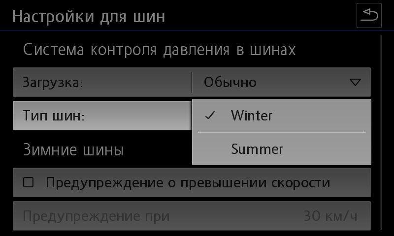
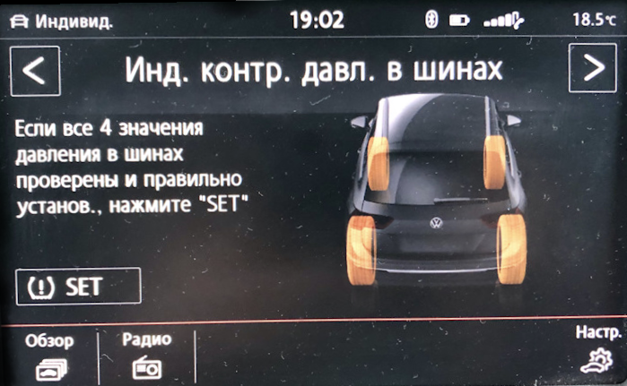

# Setting up tire profiles

!!! note "Tire parameter generator"
    [Online TMPS generator](../utils/tiresCoding.md){ .md-button .md-button--primary }

### Setting up the tire pressure monitoring system via the Individual profile

!!! tip
In older versions of OBD11 the translation was mixed up (normal - full)
  
Settings for normal load
``` yaml
Block 65 → Adaptation:
NOM. front axle pressure, normal: 255 → 22
NOM. rear axle pressure, normal: 255 → 22
→ Apply
```


Full load settings
``` yaml
Block 65 → Adaptation:
NOM. pressure Full front axle load: 255 → 26
NOM. pressure Full rear axle load: 255 → 26
→ Apply
```


### Creating the actual tire profile

[Online TMPS generator](../utils/tiresCoding.md){ .md-button .md-button--primary }

Supported blocks:  
3AA907273D; 3AA907273F; 3AA907273H; 5Q0907273; 5Q0907273B; 7P6907273H; 7P6907273L.

To generate, you need to select the desired format (which utility will perform the download) and the correct bus block. 
Then you need to create/fill in a pressure table for it. 
The names can be anything - tire size, Winter-Summer names, etc. But all names must be in Latin only!

The finished file is uploaded using ODIS E or VCDS to block 65:

Diagnostic function – Write Data Record

 

After loading the data, the settings menu will look like this:  
 
  
!!! warning
    After recording, the car will become a Christmas tree for some time - there will be errors and failures on all blocks.  
    There is no need to worry - everything will fix itself within 10 minutes.

### Indirect tire pressure monitoring

 

Activation in the ABS unit
``` yaml
Block 03 → Coding:
Byte 27 – activate bits 4,5 or bits 4,5,6
Byte 28 – Bit 7: Activate
→ Apply (with block reboot)
```


    After coding, you need to turn on the ignition, radio and press the virtual SET key on the pressure control screen
``` yaml
Block 17 → Coding:
Byte 4 – Bit 0 (Indirect Tire Pressure Monitoring System(TPMS) installed: Activate
→ Apply (with block reboot)
```


Activation in the radio menu
``` yaml
Block 5F → Adaptation:
Car_Function_Adaptations_Gen2:
- menu_display_rdk: Activate
- menu_display_rdk_over_threshold_high: Activate
→ Apply 
---
Car_Function_List_BAP_Gen2:
- tire_pressure_system_0x07: Activate
- tire_pressure_system_0x07_msg_bus: CAN_Comfort 
→ Apply
```


!!! note ""
    After coding, you need to turn on the ignition, radio and press the virtual SET key on the pressure control screen