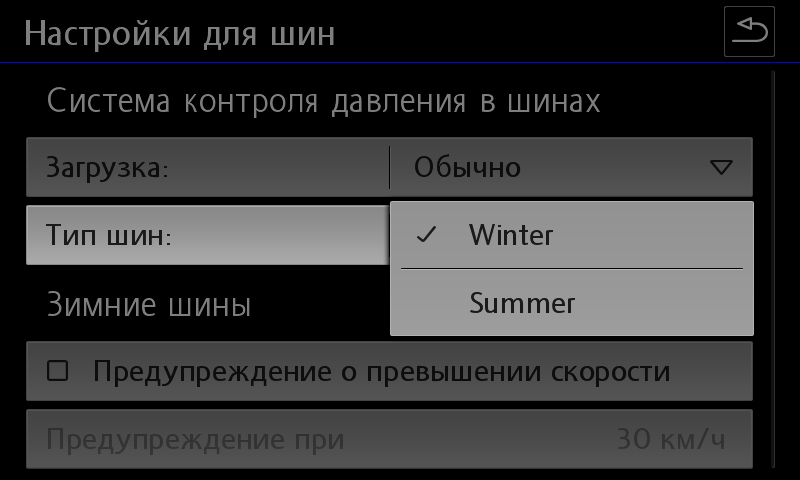
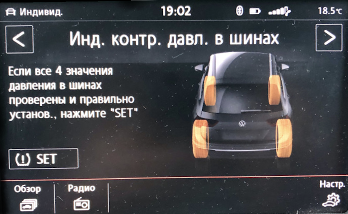

# Настройка профилей шин

!!! note "Генератор параметрии шин"
    [Online генератор TMPS](../utils/tiresCoding.md){ .md-button .md-button--primary }

### Настройка системы контроля давления в шинах через Individual профиль

!!! tip
    В старых версиях OBD11 был перепутан перевод (обычный - полный)
    
Настройки для обычной нагрузки
``` yaml
Блок 65 → Адаптация:
НОМ. давление для передней оси, обычный: 255 → 22 (если нужно 2.2 бара)
НОМ. давление для задней оси, обычный: 255 → 22 (если нужно 2.2 бара)
→ Применить
```

Настройки для полной нагрузки
``` yaml
Блок 65 → Адаптация:
НОМ. давление Полная загрузка передней оси: 255 → 26 (если нужно 2.6 бара)
НОМ. давление Полная загрузка задней оси: 255 → 26 (если нужно 2.6 бара)
→ Применить
```
### Создание собственно профиля шин

[Online генератор TMPS](../utils/tiresCoding.md){ .md-button .md-button--primary }

Поддерживающиеся блоки:   
3AA907273D; 3AA907273F; 3AA907273H; 5Q0907273; 5Q0907273B; 7P6907273H; 7P6907273L.

Для генерации необходимо выбрать нужный формат (какой утилитой будет проводиться загрузка) и правильный блок шин. 
Потом надо создать/наполнить таблицу давлений для него. 
В качестве названий может быть что угодно - размерность шин, названия Winter-Summer и т.д. Но все названия должны быть только на латинице!

Готовый файл заливается с помощью ODIS E или VCDS в блок 65:

Diagnostic function - Write Data Record

 

После загрузки данных меню настроек будет выглядеть так:  
 
    
!!! warning
    После записи машина на некоторое время станет новогодней ёлкой - будут ошибки и отказы по всем блокам.   
    Беспокоиться не надо - в течение 10 минут все само починится.
    
### Косвенный контроль давления в шинах

 

Активация в блоке ABS
``` yaml
Блок 03 → Кодирование:
Байт 27 – активируем биты 4,5 (1-й вариант) или биты 4,5,6 (2-й вариант - для парк-пилота) 
Байт 28 – Бит 7: Активировать
→ Применить (с перезагрузкой блока)
```

Активация отображения на приборной панели
``` yaml
Блок 17 → Кодирование:
Байт 4 – Бит 0 (Indirect Tire Pressure Monitoring System(TPMS) installed / Индикатор контроля давления в шинах): Активировать
→ Применить (с перезагрузкой блока)
```

Активация в меню магнитолы
``` yaml
Блок 5F → Адаптация:
Car_Function_Adaptations_Gen2
- menu_display_rdk: Активировать
- menu_display_rdk_over_threshold_high: Активировать
→ Применить 
---
Car_Function_List_BAP_Gen2
- tire_pressure_system_0x07: Активировать
- tire_pressure_system_0x07_msg_bus: CAN_Comfort (возможно Suspension_data_bus)
→ Применить 
```

!!! note ""
    После кодирования необходимо включить зажигание, магнитолу и на экране контроля давления нажать виртуальную клавишу SET