# LAMP DESIGNATIONS

### Front

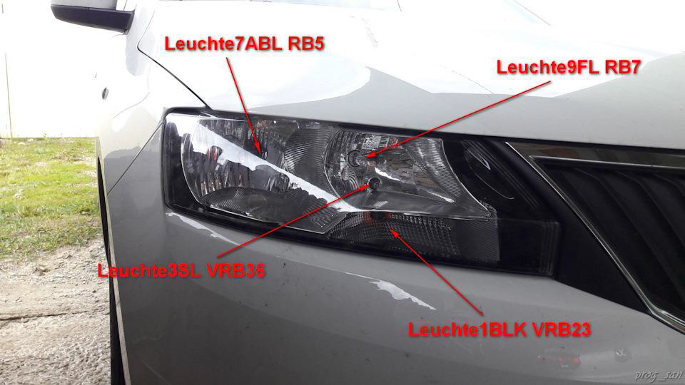  
Leuchte9FL RB7 - far right  
Leuchte7ABL RB5 – low beam right  
Leuchte1BLK VRB23 - right front turn signal  
Leuchte3SL VRB36 - front right marker 

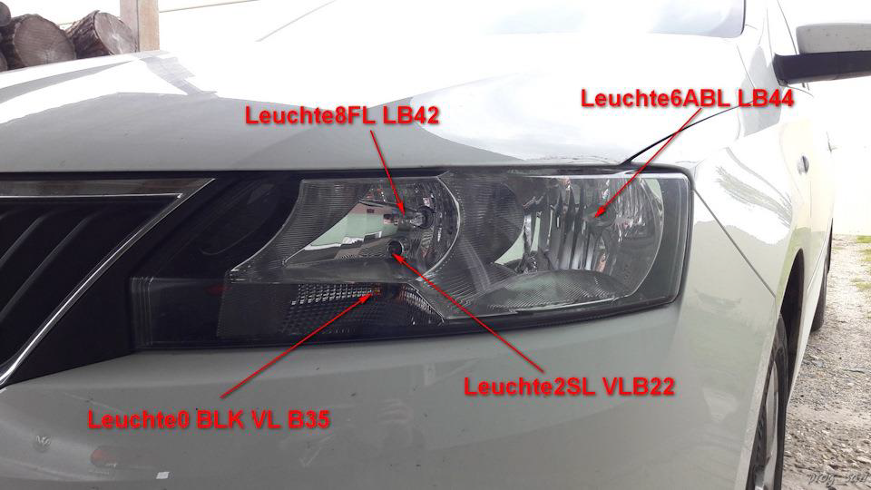  
Leuchte8FL LB42 - far left  
Leuchte6ABL LB44 – low beam left  
Leuchte0 BLK VL B35 — left front turn signal  
Leuchte2SL VLB22 - front left marker  

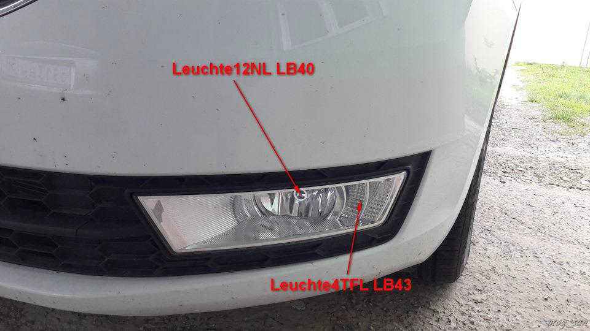  
Leuchte12NL LB40 - left fog light    
Leuchte4TFL LB43 - left DRL

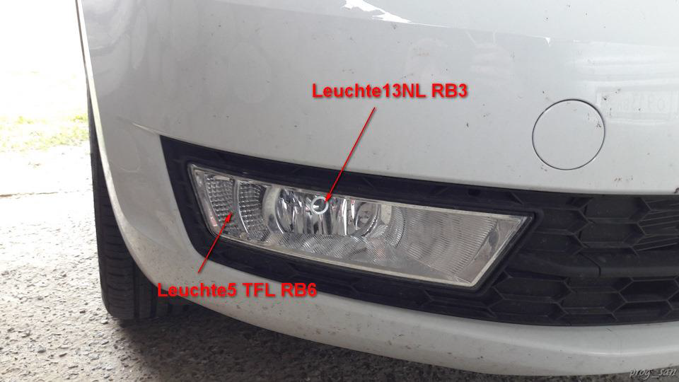  
* Leuchte13NL RB3 - right fog light    
* Leuchte5 TFL RB6 - right DRL

### Rear

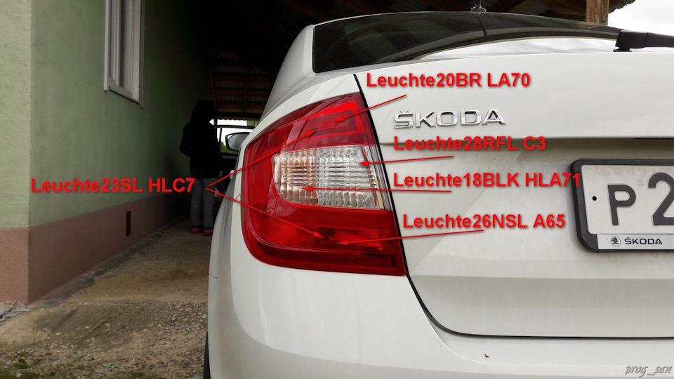  
Leuchte20BR LA70 - left rear stop  
Leuchte26NSL A65 — rear left PTF  
Leuchte18BLK HLA71 — rear left turn signal  
Leuchte23SL HLC7 - left rear marker  
Leuchte28RFL C3 - reverse  

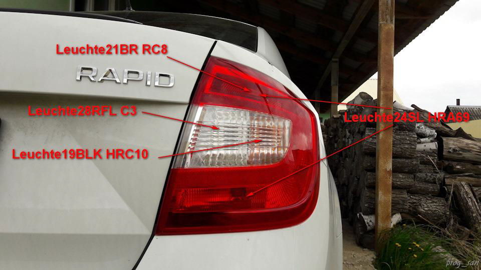  
Leuchte21BR RC8 - right rear stop  
Leuchte19BLK HRC10 - rear right turn signal  
Leuchte24SL HRA69 - right rear marker  
Leuchte28RFL C3 - reverse  

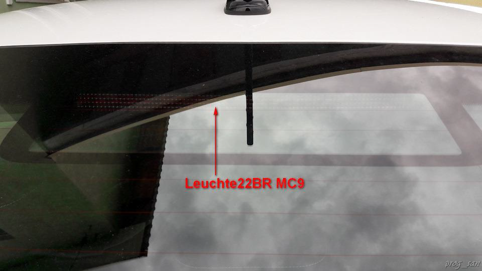  
Leuchte22BR MC9 - additional stop

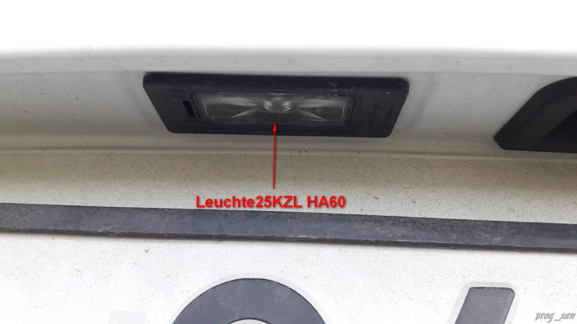  
Leuchte25KZL HA60 — license plate illumination

### Lateral

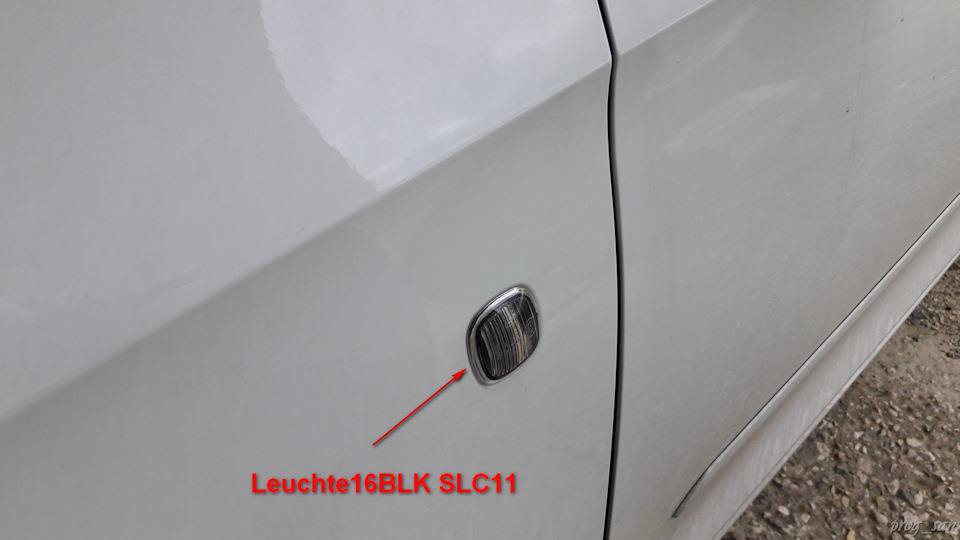  
Leuchte16BLK SLC11 — left side turn signal

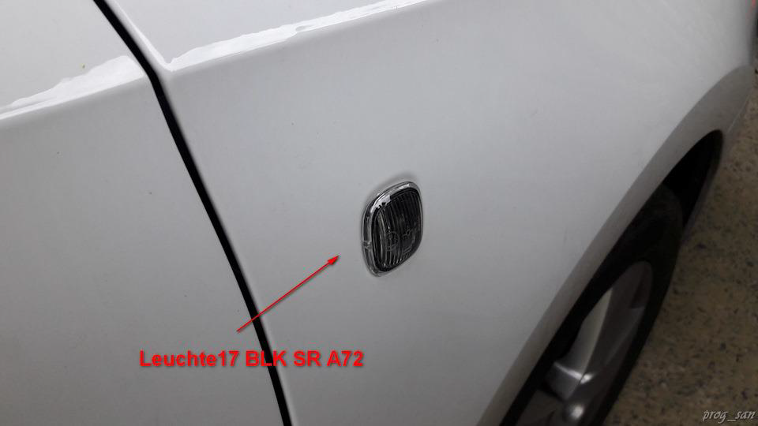  
Leuchte17 BLK SR A72 — right side turn signal

### Salon

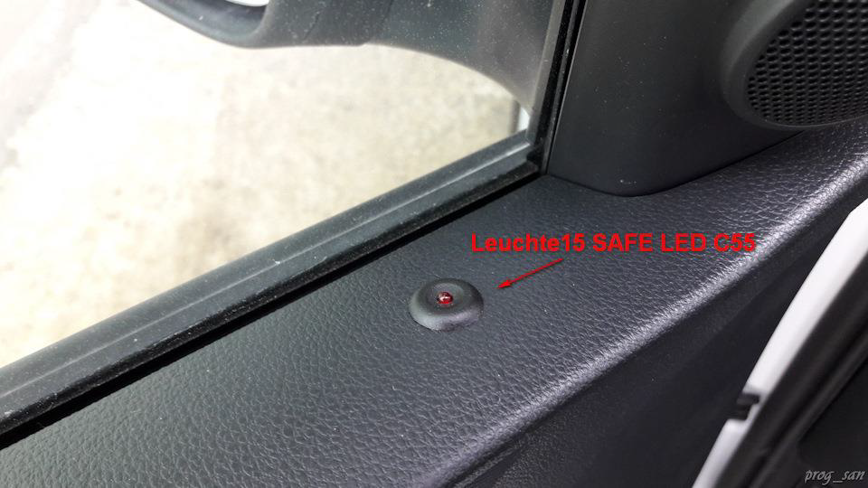  
Leuchte11WARNBLK TASTERC54 warning light  
Leuchte15 SAFE LED C55 - security LED on the door

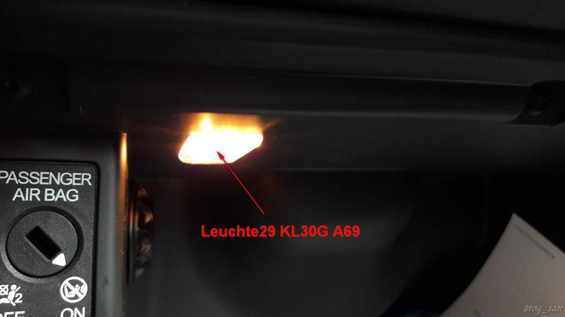  
Leuchte27 KL58XS C67 – Terminal 58xs dimmer  
Leuchte29 KL30G A69 – Klemme 30G (glove compartment light)

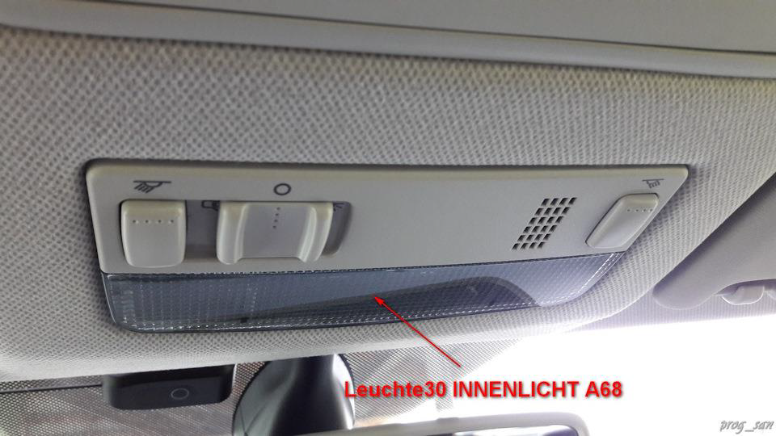  
Leuchte30 INNENLICHT A68 – interior lamp