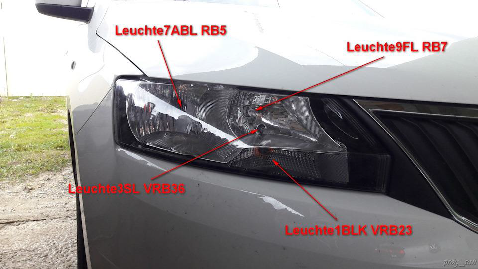
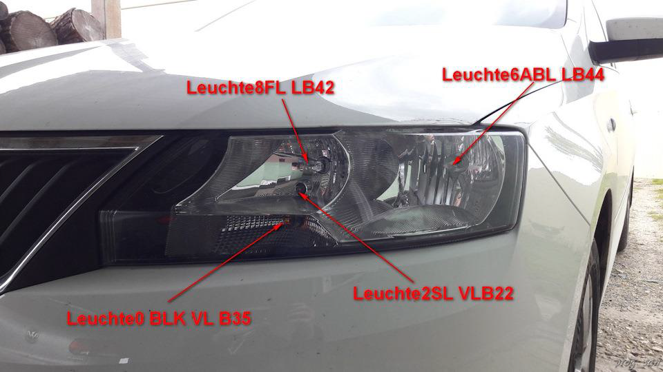
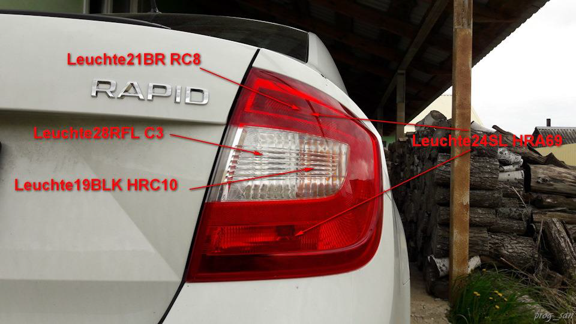
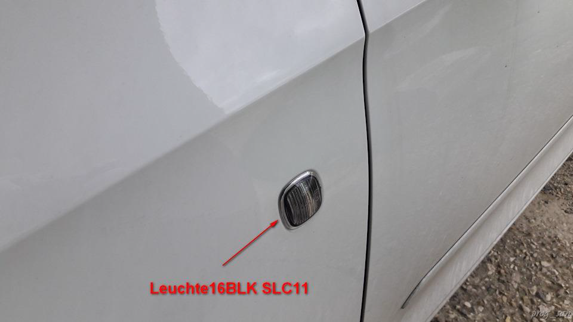
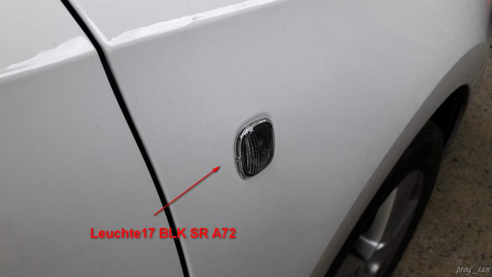
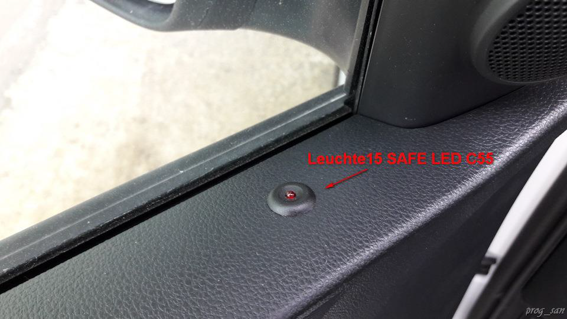

# ОБОЗНАЧЕНИЯ ЛАМП

### Передние

  
Leuchte9FL RB7 — дальний справа  
Leuchte7ABL RB5 — ближний свет справа  
Leuchte1BLK VRB23 — правый передний поворотник  
Leuchte3SL VRB36 — передний правый габарит 

  
Leuchte8FL LB42 — дальний слева  
Leuchte6ABL LB44 — ближний свет слева  
Leuchte0 BLK VL B35 — левый передний поворотник  
Leuchte2SL VLB22 — передний левый габарит  

  
Leuchte12NL LB40 — левая противотуманная фара    
Leuchte4TFL LB43 — левый ДХО

  
* Leuchte13NL RB3 — правая противотуманная фара    
* Leuchte5 TFL RB6 — правый ДХО

### Ззадние

  
Leuchte20BR LA70 — левый задний стоп  
Leuchte26NSL A65 — ПТФ задняя левая  
Leuchte18BLK HLA71 — задний левый поворотник  
Leuchte23SL HLC7 — левый задний габарит  
Leuchte28RFL C3 — задний ход  

  
Leuchte21BR RC8 — правый задний стоп  
Leuchte19BLK HRC10 — задний правый поворотник  
Leuchte24SL HRA69 — правый задний габарит  
Leuchte28RFL C3 — задний ход  

  
Leuchte22BR MC9 — дополнительный стоп

  
Leuchte25KZL HA60 — подсветка номера

### Боковые

  
Leuchte16BLK SLC11 — левый боковой поворотник

  
Leuchte17 BLK SR A72 — правый боковой поворотник

### Салон

  
Leuchte11WARNBLK TASTERC54 световая сигнализация  
Leuchte15 SAFE LED C55 — светодиод охраны на двери

  
Leuchte27 KL58XS C67 – Terminal 58xs dimmer  
Leuchte29 KL30G A69 — Klemme 30G (плафон освещения вещевого ящика)

  
Leuchte30 INNENLICHT A68 – интерьерная лампа

