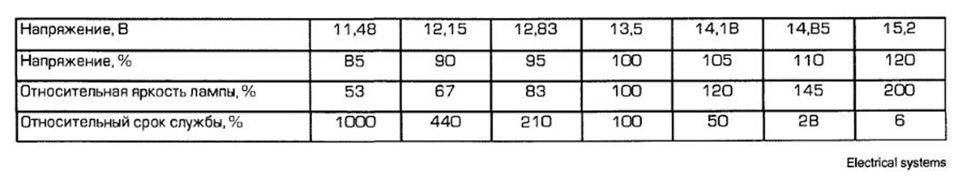

# NON-STANDARD LIGHTING SOLUTIONS

### DRL (LED) together with low beam headlights

``` yaml title="Login code: 31347"
Block 09 → Adaptation:
Leuchte4TFL LB43: Light_Function_C_4 → Abblendlicht links
Leuchte4TFL LB43: Dimming_CD_4 → 127
Leuchte5 TFL RB6: Light_Function_C_5 → Abblendlicht rechts
Leuchte5 TFL RB6: Dimming_CD_5 → 127
→ Apply
```


### Turning on the DRLs in the side lights mode (the light switch is in the side lights position, when the headlights are turned on, the DRLs are turned off)

``` yaml title="Login code: 31347"
Block 09 → Adaptation:
Daytime running lights:
- Standlicht aktiviert zusaetzlich Tagfahrlicht: Activate 
---
For 2019 model year::
Aussenlicht_Front:
- Standlicht aktiviert zusaetzlich Tagfahrlicht: Activate
→ Apply
```


### Dimming of DRL when turning on the direction indicators on the side of the working turn signal

``` yaml title="Login code: 31347"
Block 09 → Adaptation:
Leuchte4TFL LB43: Light_Function_G_4 → Blinken links Rampe
Leuchte4TFL LB43: Dimming_GH_4 → 0 
Leuchte4TFL LB43: Dimming_Direction_GH_4 → minimize
Leuchte5 TFL RB6: Light_Function_G_5 → Blinken rechts Rampe
Leuchte5 TFL RB6: Dimming_GH_5 → 0 
Leuchte5 TFL RB6: Dimming_Direction_GH_5 → minimize
→ Apply
```


### DRL flashing together with turn signals (in the same phase)

``` yaml title="Login code: 31347"
Block 09 → Adaptation:
Leuchte 4TFL LB43: Lichtfunktion G 4 → Blinken links Dunkelpase
Leuchte 4TFL LB43: Dimmwert GH 4 → 0
Leuchte 4TFL LB43: Dimming Direction GH 4 → minimize
Leuchte 5TFL RB6: Lichtfunktion G 5 → Blinken rechts Dunkelpase
Leuchte 5TFL RB6: Dimmwert GH 5 → 0
Leuchte 5TFL RB6: Dimming Direction GH 5 → minimize
→ Apply
```


### Attenuation of the front lights on the side of the working turn signal

``` yaml title="Login code: 31347"
Block 09 → Adaptation:
Leuchte2SL VLB22 – Light_Function_E_2 → Blinken links Rampe
Leuchte2SL VLB22 – Dimming_EF_2 → 0 
Leuchte2SL VLB22 – Dimming_Direction_EF_2 → minimize
Leuchte3SL VRB36 – Light_Function_E_3 → Blinken rechts Rampe
Leuchte3SL VRB36 – Dimming_EF_3 → 0 
Leuchte3SL VRB36 – Dimming_Direction_EF_3 → minimize
→ Apply
```


### US-Standlicht Blinker (parking lights through full turn indicators)

``` yaml title="Login code: 31347"
Block 09 → Adaptation:
Leuchte 0 BLK VL B35 – Light_Function_C_0 → Standlicht
Leuchte 0 BLK VL B35 – Dimming_CD_0 → 35
Leuchte 0 BLK VL B35 – Dimming_Direction_CD_0 → maximize
Leuchte 0 BLK VL B35 – Light_Function_E_0 → Blinken links Dunkelpase
Leuchte 0 BLK VL B35 – Dimming_EF_0 → 0
Leuchte 0 BLK VL B35 – Dimming_Direction_EF_0 → minimize
Leuchte1BLK VRB23 – Light_Function_C_1 → Standlicht
Leuchte1BLK VRB23 – Dimming_CD_1 → 35
Leuchte1BLK VRB23 – Dimming_Direction_CD_1 → maximize
Leuchte1BLK VRB23 – Light_Function_E_1 → Blinken rechts Dunkelpase
Leuchte1BLK VRB23 – Dimming_EF_1 → 0
Leuchte1BLK VRB23 – Dimming_Direction_EF_1 → minimize
→ Apply
```


### US-Standlicht nur bei Standlicht (parking lights through the direction indicators are fully illuminated only in the position of the light switch - side lights)

``` yaml title="Login code: 31347"
Block 09 → Adaptation:
Leuchte 0 BLK VL B35 – Light_Function_A_0 → Standlicht Vorn
Leuchte 0 BLK VL B35 – Dimming_AB_0 → 35
Leuchte 0 BLK VL B35 – Light_Function_C_0 → Abblendlicht links
Leuchte 0 BLK VL B35 – Light_Function_D_0 → Blinken links Dunkelpase
Leuchte 0 BLK VL B35 – Dimming_CD_0 → 0
Leuchte 0 BLK VL B35 – Dimming_Direction_CD_0 → minimize
Leuchte 0 BLK VL B35 – Light_Function_E_0 → Blinken links Hellphase
Leuchte 0 BLK VL B35 – Dimming_EF_0 → 100
Leuchte 0 BLK VL B35 – Dimming_Direction_EF_0 → maximize
Leuchte1BLK VRB23 – Light_Function_A_1 → Standlicht Vorn
Leuchte1BLK VRB23 – Dimming_AB_1 → 35
Leuchte1BLK VRB23 – Light_Function_C_1 → Abblendlicht rechts
Leuchte1BLK VRB23 – Light_Function_D_1 → Blinken rechts Dunkelpase
Leuchte1BLK VRB23 – Dimming_CD_1 → 0
Leuchte1BLK VRB23 – Dimming_Direction_CD_1 → minimize
Leuchte1BLK VRB23 – Light_Function_E_1 → Blinken rechts Hellphase
Leuchte1BLK VRB23 – Dimming_EF_1 → 100
Leuchte1BLK VRB23 – Dimming_Direction_EF_1 → maximize
→ Apply
```


### Dimming the front lights when turning on the low/high beam headlights

``` yaml title="Login code: 31347"
Block 09 → Adaptation:
Leuchte2SL VLB22 – Light_Function_A_2 → Standlicht — change to Standlicht vorn
Leuchte3SL VRB36 – Light_Function_A_3 → Standlicht — change to Standlicht vorn
→ Apply
```


### Blinking front lights out of phase with the direction indicators

Option A - while blinking on one side, the light is off on the other side
``` yaml title="Login code: 31347"
Block 09 → Adaptation:
Leuchte2SL VLB22 – Light_Function_E_2 → Blinken links Dunkelpase
Leuchte2SL VLB22 – Dimming_EF_2 → 100
Leuchte2SL VLB22 – Dimming_Direction_EF_2 → maximize
Leuchte3SL VRB36 – Light_Function_E_3 → Blinken rechts Dunkelpase
Leuchte3SL VRB36 – Dimming_EF_3 → 100
Leuchte3SL VRB36 – Dimming_Direction_EF_3 → maximize
→ Apply
```


* Works only in conjunction with the item “Dimming the front lights when turning on the low/high beam headlights”
* Works only in conjunction with the item “Dimming the front lights when turning on the low/high beam headlights”
``` yaml title="Login code: 31347"
Block 09 → Adaptation:
Leuchte2SL VLB22 – Light_Function_E_2 → Blinken links Dunkelpase
Leuchte2SL VLB22 – Light_Function_F_2 → Blinken rechts aktiv
Leuchte2SL VLB22 – Dimming_EF_2 → 100
Leuchte2SL VLB22 – Dimming_Direction_EF_2 → maximize
Leuchte3SL VRB36 – Light_Function_E_3 → Blinken rechts Dunkelpase
Leuchte3SL VRB36 – Light_Function_F_3 → Blinken links aktiv
Leuchte3SL VRB36 – Dimming_EF_3 → 100
Leuchte3SL VRB36 – Dimming_Direction_EF_3 → maximize
→ Apply
```


### Increasing the brightness of the reversing lamps

``` yaml title="Login code: 31347"
Block 09 → Adaptation:
Leuchte28RFL C3 – Dimmer AB 28 – 100% → change to 125%
→ Apply
```


### Increasing the brightness of the front PTF lamps

``` yaml title="Login code: 31347"
Block 09 → Adaptation:
Leuchte12NL LB40 – Dimmer AB 12 – 100% → change to 125%
Leuchte13NL RB3 – Dimmer AB 12 – 100% → change to 125%
→ Apply
```


### Increasing the brightness of low and high beam lamps

!!! warning ""
It is necessary to understand that these operations entail a reduction in the service life of the lamps.  
    An approximate option for reducing service life is shown in the table below.
      

``` yaml title="Login code: 31347"
Block 09 → Adaptation:
Leuchte6ABL LB44 – Dimming_AB_6 → 100% - change to 120%
Leuchte7ABL RB5 – Dimming_AB_7 → 100% - change to 120%
Leuchte9FL RB7 – Dimming_AB_9 → 100% - change to 120%
Leuchte8FL LB42 – Dimming_AB_8 → 100% - change to 120%
→ Apply
```


### Flashing of reverse lights with turn signals when reverse gear and hazard lights are turned on

``` yaml title="Login code: 31347"
Block 09 → Adaptation:
Leuchte28RFL C3 – Light_Function_C_28 → Blinken Links Hellphase
Leuchte28RFL C3 – Light_Function_D_28 → Blinken Rechts Hellphase
Leuchte28RFL C3 – Dimming_CD_28 → 0
Leuchte28RFL C3 – Dimming_Direction_CD_28 → minimize
→ Apply
```


### Turning on the brake light from the side of the open door

``` yaml title="Login code: 31347"
Block 09 → Adaptation:
Leuchte20BR LA70 – Light_Function_C_20 → Tuerausstiegslichtv links .
Leuchte20BR LA70 – Dimming_CD20 → 100
Leuchte20BR LA70 – Dimming_Direction_CD20 → maximize
Leuchte21BR RC8 – Light_Function_C_21 → Tuerausstiegslichtv rechts 
Leuchte21BR RC8 – Dimming_CD21 → 100
Leuchte21BR RC8 – Dimming_Direction_CD21 → maximize
→ Apply
```


### Turning on the side turn signals when opening the trunk

``` yaml title="Login code: 31347"
Block 09 → Adaptation:
Leuchte16BLK SLC11 – Light_Function_C_16 → Rear lid open
Leuchte16BLK SLC11 – Dimming_CD_16 → 50
Leuchte17 BLK SR A72 – Light_Function_C_17 → Rear lid open
Leuchte17 BLK SR A72 – Dimming_CD_17 → 50
→ Apply
```
