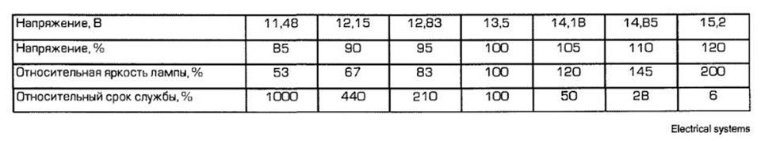

# НЕСТАНДАРТНЫЕ СВЕТОВЫЕ РЕШЕНИЯ

### ДХО (LED) совместно с фарами ближнего света
``` yaml
Блок 09 → Адаптация:
> Leuchte4TFL LB43 - Light_Function_C_4 → Abblendlicht links
> Leuchte4TFL LB43 - Dimming_CD_4 → 127
> Leuchte5 TFL RB6 - Light_Function_C_5 → Abblendlicht rechts
> Leuchte5 TFL RB6 - Dimming_CD_5 → 127
→ Применить
```
> логин-пароль 31347	

### Включение ДХО в режиме габаритных огней (переключатель света в положении габаритные огни, при включении света фар ДХО отключаются)
``` yaml
Блок 09 → Адаптация:
> Daytime running lights - Standlicht aktiviert zusaetzlich Tagfahrlicht → active Для 19 м.г.:
>  Aussenlicht_Front — Standlicht aktiviert zusaetzlich Tagfahrlicht → акт.
→ Применить
```
> логин-пароль 31347	

### Притухание ДХО при включении указателей поворота на стороне работающего поворотника
``` yaml
Блок 09 → Адаптация:
> Leuchte4TFL LB43 - Light_Function_G_4 → Blinken links Rampe
> Leuchte4TFL LB43 - Dimming_GH_4 → 0 (или другое значение в %)
> Leuchte4TFL LB43 - Dimming_Direction_GH_4 → minimize
> Leuchte5 TFL RB6 - Light_Function_G_5 → Blinken rechts Rampe
> Leuchte5 TFL RB6 - Dimming_GH_5 → 0 (или другое значение в %)
> Leuchte5 TFL RB6 - Dimming_Direction_GH_5 → minimize
→ Применить
```
> логин-пароль 31347	

### Мигание ДХО вместе с поворотниками (в одной фазе)
``` yaml
Блок 09 → Адаптация:
> Leuchte 4TFL LB43 - Lichtfunktion G 4 → Blinken links Dunkelpase
> Leuchte 4TFL LB43 - Dimmwert GH 4 → 0
> Leuchte 4TFL LB43 - Dimming Direction GH 4 → minimize
> Leuchte 5TFL RB6 - Lichtfunktion G 5 → Blinken rechts Dunkelpase
> Leuchte 5TFL RB6 - Dimmwert GH 5 → 0
> Leuchte 5TFL RB6 - Dimming Direction GH 5 → minimize
→ Применить
```
> логин-пароль 31347	

### Притухание передних габаритов на стороне работающего указателя поворота
``` yaml
Блок 09 → Адаптация:
> Leuchte2SL VLB22 - Light_Function_E_2 → Blinken links Rampe
> Leuchte2SL VLB22 - Dimming_EF_2 → 0 (или другое значение в %)
> Leuchte2SL VLB22 - Dimming_Direction_EF_2 → minimize
> Leuchte3SL VRB36 - Light_Function_E_3 → Blinken rechts Rampe
> Leuchte3SL VRB36 - Dimming_EF_3 → 0 (или другое значение в %)
> Leuchte3SL VRB36 - Dimming_Direction_EF_3 → minimize
→ Применить
```
> логин-пароль 31347	

### US-Standlicht Blinker (габаритные огни через указатели поворота вполнакала)
``` yaml
Блок 09 → Адаптация:
> Leuchte 0 BLK VL B35 - Light_Function_C_0 → Standlicht
> Leuchte 0 BLK VL B35 - Dimming_CD_0 → 35
> Leuchte 0 BLK VL B35 - Dimming_Direction_CD_0 → maximize
> Leuchte 0 BLK VL B35 - Light_Function_E_0 → Blinken links Dunkelpase
> Leuchte 0 BLK VL B35 - Dimming_EF_0 → 0
> Leuchte 0 BLK VL B35 - Dimming_Direction_EF_0 → minimize
> Leuchte1BLK VRB23 - Light_Function_C_1 → Standlicht
> Leuchte1BLK VRB23 - Dimming_CD_1 → 35
> Leuchte1BLK VRB23 - Dimming_Direction_CD_1 → maximize
> Leuchte1BLK VRB23 - Light_Function_E_1 → Blinken rechts Dunkelpase
> Leuchte1BLK VRB23 - Dimming_EF_1 → 0
> Leuchte1BLK VRB23 - Dimming_Direction_EF_1 → minimize
→ Применить
```
> логин-пароль 31347	

### US-Standlicht nur bei Standlicht (габаритные огни через указатели поворота вполнакала только в положении переключателя света – габаритные огни)
``` yaml
Блок 09 → Адаптация:
> Leuchte 0 BLK VL B35 - Light_Function_A_0 → Standlicht Vorn
> Leuchte 0 BLK VL B35 - Dimming_AB_0 → 35
> Leuchte 0 BLK VL B35 - Light_Function_C_0 → Abblendlicht links
> Leuchte 0 BLK VL B35 - Light_Function_D_0 → Blinken links Dunkelpase
> Leuchte 0 BLK VL B35 - Dimming_CD_0 → 0
> Leuchte 0 BLK VL B35 - Dimming_Direction_CD_0 → minimize
> Leuchte 0 BLK VL B35 - Light_Function_E_0 → Blinken links Hellphase
> Leuchte 0 BLK VL B35 - Dimming_EF_0 → 100
> Leuchte 0 BLK VL B35 - Dimming_Direction_EF_0 → maximize
> Leuchte1BLK VRB23 - Light_Function_A_1 → Standlicht Vorn
> Leuchte1BLK VRB23 - Dimming_AB_1 → 35
> Leuchte1BLK VRB23 - Light_Function_C_1 → Abblendlicht rechts
> Leuchte1BLK VRB23 - Light_Function_D_1 → Blinken rechts Dunkelpase
> Leuchte1BLK VRB23 - Dimming_CD_1 → 0
> Leuchte1BLK VRB23 - Dimming_Direction_CD_1 → minimize
> Leuchte1BLK VRB23 - Light_Function_E_1 → Blinken rechts Hellphase
> Leuchte1BLK VRB23 - Dimming_EF_1 → 100
> Leuchte1BLK VRB23 - Dimming_Direction_EF_1 → maximize
→ Применить
```
> логин-пароль 31347	

### Гашение передних габаритов при включении ближнего/дальнего света фар
``` yaml
Блок 09 → Адаптация:
> Leuchte2SL VLB22 - Light_Function_A_2 → Standlicht — меняем на Standlicht vorn
> Leuchte3SL VRB36 - Light_Function_A_3 → Standlicht — меняем на Standlicht vorn
→ Применить
```
> логин-пароль 31347	

### Перемигивание передних габаритов в противофазе с указателями поворотов
Вариант А - во время перемигивания на одной стороне — на другой стороне габарит погашен
``` yaml
Блок 09 → Адаптация:
> Leuchte2SL VLB22 - Light_Function_E_2 → Blinken links Dunkelpase
> Leuchte2SL VLB22 - Dimming_EF_2 → 100
> Leuchte2SL VLB22 - Dimming_Direction_EF_2 → maximize
> Leuchte3SL VRB36 - Light_Function_E_3 → Blinken rechts Dunkelpase
> Leuchte3SL VRB36 - Dimming_EF_3 → 100
> Leuchte3SL VRB36 - Dimming_Direction_EF_3 → maximize
→ Применить
```
Вариант Б - во время перемигивания на одной стороне — на другой стороне габарит горит
* Работает только совместно с пунктом “Гашение передних габаритов при включении ближнего/дальнего света фар”
``` yaml
Блок 09 → Адаптация:
> Leuchte2SL VLB22 - Light_Function_E_2 → Blinken links Dunkelpase
> Leuchte2SL VLB22 - Light_Function_F_2 → Blinken rechts aktiv
> Leuchte2SL VLB22 - Dimming_EF_2 → 100
> Leuchte2SL VLB22 - Dimming_Direction_EF_2 → maximize
> Leuchte3SL VRB36 - Light_Function_E_3 → Blinken rechts Dunkelpase
> Leuchte3SL VRB36 - Light_Function_F_3 → Blinken links aktiv
> Leuchte3SL VRB36 - Dimming_EF_3 → 100
> Leuchte3SL VRB36 - Dimming_Direction_EF_3 → maximize
→ Применить
```
> логин-пароль 31347	

### Увеличение яркости ламп заднего хода
``` yaml
Блок 09 → Адаптация:
> Leuchte28RFL C3 — Dimmer АВ 28 - 100% → меняем на 125%
→ Применить
```
> логин-пароль 31347	

### Увеличение яркости ламп передних ПТФ
``` yaml
Блок 09 → Адаптация:
> Leuchte12NL LB40 - Dimmer АВ 12 - 100% → меняем на 125%
> Leuchte13NL RB3 - Dimmer АВ 12 - 100% → меняем на 125%
→ Применить
```
> логин-пароль 31347	

### Увеличение яркости ламп ближнего и дальнего света

!!! warning ""
    Необходимо понимать, что эти операции влекут за собой снижение срока службы ламп.   
    Примерный вариант снижения срока службы приведен в таблице ниже.  
      

``` yaml
Блок 09 → Адаптация:
> Leuchte6ABL LB44 - Dimming_AB_6 → 100% - меняем на 120%
> Leuchte7ABL RB5 - Dimming_AB_7 → 100% - меняем на 120%
> Leuchte9FL RB7 - Dimming_AB_9 → 100% - меняем на 120%
> Leuchte8FL LB42 - Dimming_AB_8 → 100% - меняем на 120%
→ Применить
```
> логин-пароль 31347	

### Перемигивание ламп заднего хода с поворотниками при включении задней скорости и аварийной сигнализации
``` yaml
Блок 09 → Адаптация:
> Leuchte28RFL C3 - Light_Function_C_28 → Blinken Links Hellphase
> Leuchte28RFL C3 - Light_Function_D_28 → Blinken Rechts Hellphase
> Leuchte28RFL C3 - Dimming_CD_28 → 0
> Leuchte28RFL C3 - Dimming_Direction_CD_28 → minimize
→ Применить
```
> логин-пароль 31347	

### Включение стоп-сигнала со стороны открытой двери
``` yaml
Блок 09 → Адаптация:
> Leuchte20BR LA70 - Light_Function_C_20 → Tuerausstiegslichtv links (при откр.двери с левой стороны).
> Leuchte20BR LA70 - Dimming_CD20 → 100
> Leuchte20BR LA70 - Dimming_Direction_CD20 → maximize
> Leuchte21BR RC8 - Light_Function_C_21 → Tuerausstiegslichtv rechts (при откр.двери с правой стороны)
> Leuchte21BR RC8 - Dimming_CD21 → 100
> Leuchte21BR RC8 - Dimming_Direction_CD21 → maximize
→ Применить
```
> логин-пароль 31347	

### Включение боковых указателей поворота при открытии багажника
``` yaml
Блок 09 → Адаптация:
> Leuchte16BLK SLC11 - Light_Function_C_16 → Rear lid open
> Leuchte16BLK SLC11 - Dimming_CD_16 → 50
> Leuchte17 BLK SR A72 - Light_Function_C_17 → Rear lid open
> Leuchte17 BLK SR A72 - Dimming_CD_17 → 50
→ Применить
```
> логин-пароль 31347	

