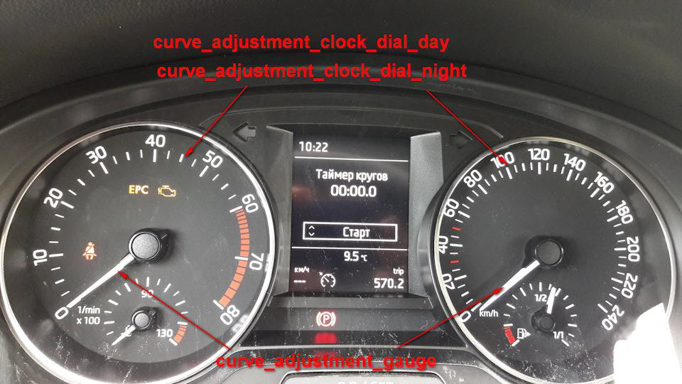
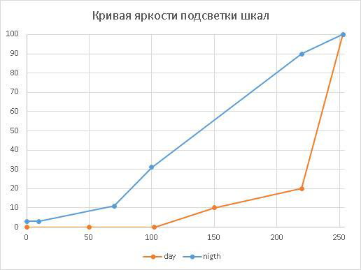
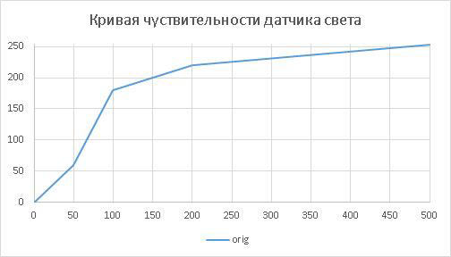
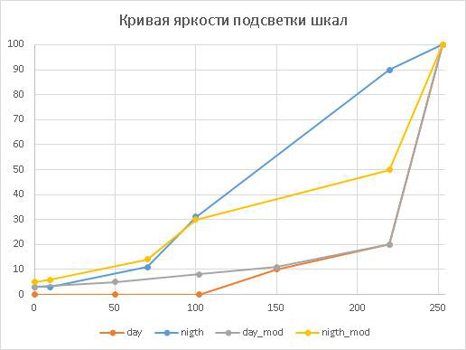
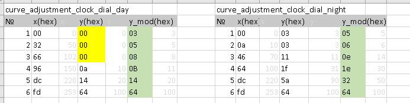
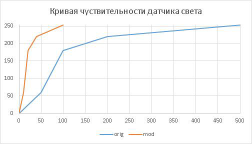
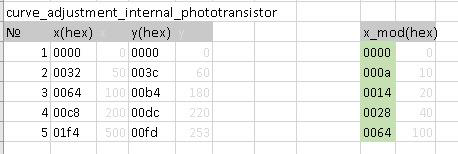

# INSTRUMENT PANEL LIGHTING CURVES 

  
So, we all saw these channels in block 17 (I will tell you further using the example of 5JA-920-740-A, which can be extended to 5JA 920 7XX):  
ENG105831-ENG101574-dimming_characteristic_curve_adjustment_clock_dial_day-X1.00 …  
ENG105831-ENG99777-dimming_characteristic_curve_adjustment_clock_dial_day-Y1.00 …  
ENG105832-ENG101574-dimming_characteristic_curve_adjustment_clock_dial_night-X1.00 …  
ENG105832-ENG99777-dimming_characteristic_curve_adjustment_clock_dial_night-Y1.02 …  
ENG105834-ENG101574-dimming_characteristic_curve_adjustment_gauge-X1.00 …  
ENG105834-ENG99777-dimming_characteristic_curve_adjustment_gauge-Y1.03 …  
ENG105835-ENG101574-dimming_characteristic_curve_adjustment_indicator_lights-X1.00 …  
ENG105835-ENG99777-dimming_characteristic_curve_adjustment_indicator_lights-Y1.05 …  
ENG119878-ENG101574-dimming_characteristic_curve_adjustment_internal_phototransistor-X1.00 00 …  
ENG119878-ENG99777-dimming_characteristic_curve_adjustment_internal_phototransistor-Y1.00 00 …  
ENG105836-ENG101574-dimming_characteristic_curve_adjustment_middle_display_main_field-X1.00 …  
ENG105836-ENG99777-dimming_characteristic_curve_adjustment_middle_display_main_field-Y1.01 …  

There are many of them, 5–6 X and Y values for each position. Let's call a pair of X and Y settings a curve.  
It turns out there are 6 curves:  

* dimming_characteristic_curve_adjustment_clock_dial_day - brightness of the dial backlight for daytime mode  
* dimming_characteristic_curve_adjustment_clock_dial_night - brightness of the dial backlight for night mode  
* dimming_characteristic_curve_adjustment_gauge - brightness of instrument needle backlight  
* dimming_characteristic_curve_adjustment_indicator_lights - brightness of additional instrument panel indicators  
* dimming_characteristic_curve_adjustment_internal_phototransistor - normalization curve for panel light sensor readings  
* dimming_characteristic_curve_adjustment_middle_display_main_field - display brightness in the middle part of the instrument panel  

Day mode differs from night mode when the low beam is on. Low light is on - night mode.  

Let's try to adapt the values ​​of the scale backlight brightness curves for day/night mode and the normalization curve for the panel light sensor readings.  
Channel values ​​are specified in hexadecimal. HEX. Plotting the X and Y values on the graph, we get the following pictures:  
  
Scale backlight brightness

  
Normalization curve for panel light sensor readings  

We work only with hexadecimal numbers. Conversion to the decimal system was done to construct graphs.  
Option for modifying brightness settings:  

* dimming_characteristic_curve_adjustment_clock_dial_day,  
* dimming_characteristic_curve_adjustment_clock_dial_night  
Curves for setting the brightness of the scale backlight for day and night modes. We work only with Y values. 0 — backlight is disabled. 253 - maximum brightness. In order to prevent the scale backlight from being turned off at dusk, you need to get rid of the 0 values ​​in the daylight backlight curve (highlighted in yellow in the table). The values ​​in the green columns can be adjusted as desired. For daytime mode, full scale blanking at twilight has been removed. For night mode, a curve with a dimmer glow at high sensor readings is proposed.

  
  
dimming_characteristic_curve_adjustment_internal_phototransistor  

We normalize the curve of the light sensor readings to the interval 0.253. 0 - dark, 253 - maximum light. You can make the curve's exit to the maximum value sharper. We work only with the X coordinate.

  
  
As you know, the device is configured to notify by turning off the backlight of the scales that the neighbor has been forgotten and turned on at dusk.  
Many people do not like this algorithm of work - the solution is:  
ENG105831-ENG99777-dimming_characteristic_curve_adjustment_clock_dial_day-Y1.03  
ENG105831-ENG100480-dimming_characteristic_curve_adjustment_clock_dial_day-Y2.05  
ENG105831-ENG100773-dimming_characteristic_curve_adjustment_clock_dial_day-Y3.08  

By changing the values of these three channels, you will get non-switchable backlighting of instrument scales at dusk. Initially, these channels have a value of 0.  

I do not recommend changing the direction of brightness changes, or turning the values ​​to maximum.I didn’t set myself to turn off the backlight at dusk - everything suits me.  

You need to select an access code. Try 47115.