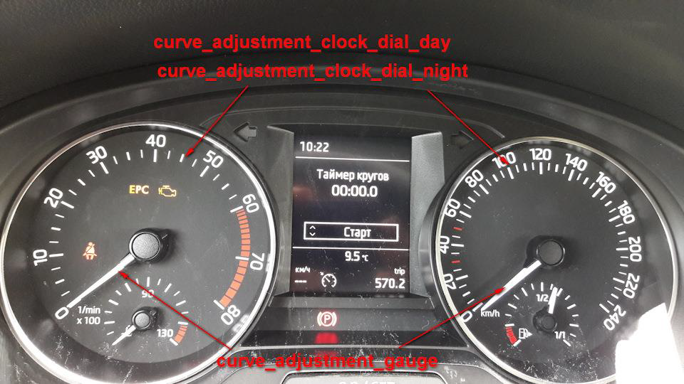

# КРИВЫЕ ПОДСВЕТКИ ПАНЕЛИ ПРИБОРОВ 

  
Итак, все мы видели эти каналы в 17 блоке (далее рассказывать буду на примере 5JA-920-740-A, можно распространять на 5JA 920 7XX):   
> ENG105831-ENG101574-dimming_characteristic_curve_adjustment_clock_dial_day-X1,00 …   
ENG105831-ENG99777-dimming_characteristic_curve_adjustment_clock_dial_day-Y1,00 …   
ENG105832-ENG101574-dimming_characteristic_curve_adjustment_clock_dial_night-X1,00 …   
ENG105832-ENG99777-dimming_characteristic_curve_adjustment_clock_dial_night-Y1,02 …   
ENG105834-ENG101574-dimming_characteristic_curve_adjustment_gauge-X1,00 …   
ENG105834-ENG99777-dimming_characteristic_curve_adjustment_gauge-Y1,03 …   
ENG105835-ENG101574-dimming_characteristic_curve_adjustment_indicator_lights-X1,00 …   
ENG105835-ENG99777-dimming_characteristic_curve_adjustment_indicator_lights-Y1,05 …   
ENG119878-ENG101574-dimming_characteristic_curve_adjustment_internal_phototransistor-X1,00 00 …   
ENG119878-ENG99777-dimming_characteristic_curve_adjustment_internal_phototransistor-Y1,00 00 …   
ENG105836-ENG101574-dimming_characteristic_curve_adjustment_middle_display_main_field-X1,00 …   
ENG105836-ENG99777-dimming_characteristic_curve_adjustment_middle_display_main_field-Y1,01 …  

Их много, по 5-6 значений X и Y по каждой позиции. Пару настроек X и Y назовем кривая.  
Получается имеется 6 кривых:  

* dimming_characteristic_curve_adjustment_clock_dial_day — яркость подсветки шкал для дневного режима   
* dimming_characteristic_curve_adjustment_clock_dial_night — яркость подсветки шкал для ночного режима   
* dimming_characteristic_curve_adjustment_gauge — яркость подсветки стрелок приборов   
* dimming_characteristic_curve_adjustment_indicator_lights — яркость дополнительных индикаторов панели приборов   
* dimming_characteristic_curve_adjustment_internal_phototransistor — кривая нормировки показаний датчика света панели   
* dimming_characteristic_curve_adjustment_middle_display_main_field — яркость дисплея в средней части панели приборов  

Дневной режим от ночного отличается включенным ближнем светом. Горит ближний — режим ночной.  

Попробуем адаптировать значения кривых яркости подсветки шкал для дневного\ночного режима и кривой нормировки показаний датчика света панели.   
Значения каналов задаются в 16-ричной системе. HEX. Отложив значения X и Y на графике, получаем следующие картинки:   
  
Яркость подсветки шкал

  
Кривая нормировки показаний датчика света панели  

Работаем только с шестнадцатеричными числами. Перевод в десятичную систему делал для построения графиков.  
Вариант модификации настроек яркости:  

* dimming_characteristic_curve_adjustment_clock_dial_day,   
* dimming_characteristic_curve_adjustment_clock_dial_night  
Кривые задания яркости подсветки шкал для дневного и ночного режима. Работаем только с Y значениями. 0 — подсветка отключена. 253 — максимальная яркость. Для того, чтобы не срабатывало отключение подсветки шкал в сумерках — необходимо избавится от 0 значений в кривой дневной подсветки (выделены в таблице желтым). Значения в зеленых столбцах могут быть скорректированы по желанию. Для дневного режима убрано полное гашение шкал в сумерках. Для ночного режима предложена кривая с более тусклым свечением при высоких показания датчика.

   
   
dimming_characteristic_curve_adjustment_internal_phototransistor  

Кривая нормируем показания датчика света к интервалу 0.253. 0 -темно, 253 — максимально светло. Можно сделать выход кривой на максимальное значение более резким. Работаем только с координатой X.

   
   
Как известно, приборка настроена так, чтобы уведомлять отключением подсветки шкал о забытом включенном ближнем в сумерках.   
Многим такой алгоритм работы не по душе — решение:   
> ENG105831-ENG99777-dimming_characteristic_curve_adjustment_clock_dial_day-Y1,03   
ENG105831-ENG100480-dimming_characteristic_curve_adjustment_clock_dial_day-Y2,05   
ENG105831-ENG100773-dimming_characteristic_curve_adjustment_clock_dial_day-Y3,08   

Изменением значений этих трех каналов — получите не отключаемую подсветку шкал приборов в сумерках. Изначально, эти каналы имеет 0 значения.  

Не рекомендую менять направление изменения яркости, либо выкручивать значения на максимальные.
Себе отключение подсветки в сумерках не настраивал — все устраивает.  

Код доступа надо подбирать. Попробуйте 47115.  