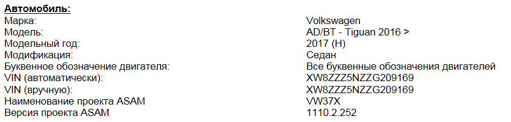

disqus: https-mqb-readthedocs-io
# Работа с ODIS ENGINEERING

### Загрузка нужного профиля машины

1. В ODIS S нужно начать диагностику (можно не ждать окончания диагностики, главное начать её делать)
2. Сохранить протокол диагностики
3. Открыть его в браузере > Развернуть всё > чуть ниже начала протокола будет написано название проекта на данный авто

Нас интересует пункт: Наименование проекта ASAM

### Экспорт адаптаций и кодировок

1. Пункт "Функции автомобиля" (Vehicle services), подпункт 046-Специальные функции автомобиля (Fzg.Sonderfunktionen)   
2. Выбираем нужный блок. 
3. Ставим галки на против пунктов "Адаптация", "Кодировки", нажимаем "Считывание данных" (Read data)   
3. Указываем путь и нажимаем сохранить.   

Некоторые блоки могут спросить пароли (логины) После окончания сканирования наши протоколы сохранены в выбранную папку. 

### Считывание параметрии

1. Выбираем нужный блок  
2. Пункт 010, подпункт 010.02 "ячейки памяти"   
3. Выбираем нужный адрес - нажимаем "считать ячейки"  
4. Указываем путь и нажимаем сохранить.   

### Обновление ПО блоков

Перед обновлением ПО необходимо выполнить следующие указания:

• Обеспечить подключение зарядного устройства к АКБ автомобиля
• При обновлении ПО все электрические потребители, в которых нет необходимости (вентиляция, подогрев сидений, освещение салона и т. д.), должны быть отключены.
• В обязательном порядке использовать кабельное соединение между тестером с Offboard Diagnostic Information System Service и автомобилем. При соединении по Bluetooth© (трансмиттер) возможны нежелательные прерывания процесса обновления ПО!
• В обязательном порядке отключить все сторонние подключения к автомобилю (сотовые телефоны, внешние диски) и вынуть SIM-карту из ГУ!
• Дверь водителя во время обновления ПО должна быть открыта.
• Во время обновления ПО включить на автомобиле аварийную световую сигнализацию, чтобы обеспечить постоянную активность шины CAN на стороне автомобиля.