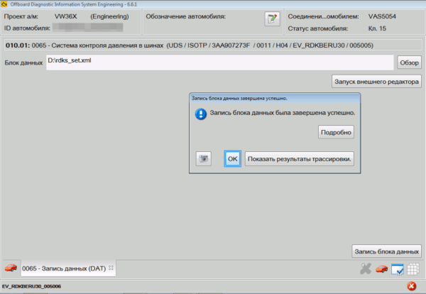

# Поддержка и развитие проекта

## Помощь проекту

Если вам понравился этот проект и вы готовы его поддержать для дальнейшего развития, 
то вы можете это сделать с помощью Яндекс-перевода в рублях или биткоина:

<div class="grid cards" markdown>

-   :fontawesome-solid-money-bill:{ .lg .middle } __Перевод с российских карт__

    ---
    Перевод в рублях с помощью карты или кошелька Яндекс  

    [Поддержать :fontawesome-solid-paper-plane:](https://yoomoney.ru/to/4100110582992748/100){ .md-button }

-   :fontawesome-brands-btc:{ .lg .middle } __Криптовалюта__

    ---
    { width="100" align=left }  
  
    Перевод на BTC кошелек: `1BKR5d91YUic3aqwc6nTGTMLkGBBrZkkcj`

</div>

## Добавление новых материалов

### Структура сайта

Путь для хранения изображений: `/docs/images`  
Путь до прошивок: `/docs/firmwares`  
Путь до параметрий: `/docs/parameters`  

### Добавление новых кодировок

Данный сайт построен с использованием языка разметки Markdown.  

Шаблон для страниц:

```
    # Название страницы
    ### Название кодировки/адаптации

    !!! tip ""
        Описание/Цель, если есть

    !!! warning ""
        Предупреждение, если есть

    ``` yaml title="логин-пароль: XXXXX (если есть)"
    Блок XX → Адаптация/Кодирование:
    Байт XX – Бит X (название бита): Активировать
    Название раздела:
    - Название адаптации: Активировать
    → Применить
    ```

    ??? note "Название раскрывающегося списка"
        Здесь находится информация, которая по умолчанию на сайте отображается свернутой
```

Пример вставки изображений на страницу сайта:  
```
```

Пример вставки файлов на страницу сайта:  
```
[(Сборка для Škoda)](../firmwares/TMC-zz.rar)```

### Двуязычный контент

Сайт поддерживает русский и английский языки. Каждая страница существует в двух файлах:

- `page.md` — русская версия (язык по умолчанию)
- `page.en.md` — английская версия

**При добавлении или изменении кодировок и адаптаций правки нужно вносить сразу в оба файла** и отправлять один pull request.

1. Найдите нужную страницу в `/docs`, например `docs/MQB/drive.md`.
2. Внесите изменение в русскую версию.
3. Внесите эквивалентное изменение в `docs/MQB/drive.en.md`.
4. Если создаётся новая страница — добавьте оба файла и пункт в `nav` файла `mkdocs.yml`.
5. Для нового пункта меню добавьте перевод в `nav_translations` (секция `locale: en`).
6. Проверьте сборку: `mkdocs build`.
7. Создайте pull request.

Подробнее — в [README.md](https://github.com/Kanaduchi/vwcoding/blob/master/README.md) и [CONTRIBUTING.md](https://github.com/Kanaduchi/vwcoding/blob/master/CONTRIBUTING.md).