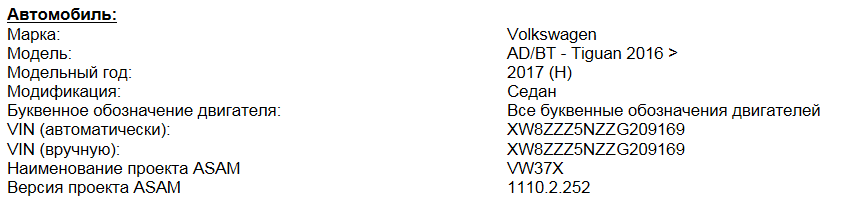

# Working with ODIS ENGINEERING

## ODIS E main functions

Below is a description of ODIS Engineering (ODIS E) menu items. Numbers match the program interface.

### 001 — Identification

View basic ECU information: hardware and software versions, part number. Click **Show extended identification** for additional parameters, such as the engine ECU flash cycle counter and others.

### 002 — Event memory

All stored fault codes (DTCs) are shown here. For each entry you can see details: trigger conditions, mileage, and status. Faults are also cleared from this screen.

### 003 — Measuring values

Real-time parameter monitoring (engine speed, temperatures, pressures, etc.). Add parameters to the list with a double-click, then start display with the blue arrow to the right.

### 004 — Actuator diagnostics

Runs a standardized test by activating selected actuators controlled by the chosen ECU. Helps verify mechanical operation.

### 005 — Basic settings

Service function that puts the ECU into a special mode for calibration, learning (e.g. climate flap positions), or component initialization.

### 006 — Coding

Turn vehicle functions on or off.

!!! warning
    Incorrect coding can cause systems to behave wrongly. Always note original values or back up before changing anything.

### 007 — Adaptation

Similar to coding but allows finer tuning with specific numeric values for various functions.

### 008 — Access authorization

Protected coding and adaptation settings require an access code. Without the correct code entered here, changes cannot be saved.

### 009 — Diagnostic session

Select access level when working with ECUs. Rarely used in everyday diagnostics. For example, **development mode** for a specific ECU is enabled here — useful when adaptation returns “Out of range” or “Function unavailable” (see section below).

### 010 — Data transfer

Write parameter datasets to ECUs. Data may be XML or a ZIP archive. Select the ECU, choose the file, then click **Write data block**.

Some ECUs also offer **Memory cells** — direct EEPROM access to view and edit cells.

### 042 — Flashing

Update ECU firmware. Select the ECU, choose the new flash file, click **Start flashing**, and wait until the process completes. Follow the checklist in [ECU software update](#ecu-software-update) beforehand.

### 045 — Transport mode

Special mode for situations such as towing on a flatbed. Disables certain systems to save energy and avoid faults.

### 046 — Special vehicle functions

Very important section. Create a backup of all codings and adaptations on the vehicle.

!!! tip
    Always save a backup before changing any ECU. Some ECUs may require a password. Step-by-step export: [Export adaptations and codings](#export-adaptations-and-codings).

### 047 — Scan all systems

Global diagnostics: read or clear faults in all ECUs with one action. Useful for finding permanent (non-clearable) faults.

### 048 — Unlock ECU for SFD

Work with **SFD** — a protection system introduced on VAG Group vehicles from around 2020. Grants temporary access to protected ECUs for service work. See [SFD](../sfd.en.md).

### 049 — Vehicle functions

Activate or deactivate paid options and features pre-installed by the manufacturer but initially locked for the user.

!!! note
    Some ODIS E menu items are intentionally omitted here; they are advanced professional functions and not required for basic understanding of the system.

---

## Practical ODIS Engineering notes

### Explanation of parameters

- LN, LO, SO, SN – parameter (L – long, S – short)  
- VO, VN – table of parameters (V – volume)  
- VN – value (V – value)  

Names, values, and units for text identifiers from ODX data use the corresponding text from the CS dictionary.  

If the parameter/section name is in the language dictionary installed in ODIS Engineering, 
the value shows the letter N (Normalized) and the name is translated:  
- [SN, LN, VN] name_from_dictionary  

If the name is not in the language dictionary, information comes directly from ODX data (letter O):  
- [SO, LO, VO] name_from_ODX_data  

### Load the desired vehicle profile

1. In ODIS S, start diagnostics (you do not need to wait for it to finish — only start the session)  
2. Save the diagnostic log  
3. Open it in a browser → **Expand all** → just below the start of the log you will see the project name for this vehicle  

Look for: **ASAM project name**

### Export adaptations and codings

1. **Vehicle services**, sub-item **046 — Special vehicle functions** (Fzg. Sonderfunktionen)  
2. Select the desired ECU.  
3. Check **Adaptation** and **Codings**, click **Read data**  
4. Choose a path and save.  

Some ECUs may ask for passwords (logins). When scanning finishes, the logs are saved to the chosen folder.

### Activate development mode

When enabling certain adaptations you may see **Out of range** or **Function unavailable**.  

In most cases, enable **development mode** in the diagnostic session for that ECU:  

### Saving presets

1. Open the desired ECU (adaptation or coding)  
2. Select the item ([VO]_, [VN]_), expand it with the arrow on the left (>)  
3. Click **Preset** in the upper right  
4. In the menu, choose **New** and give it a name  
5. In the same **Preset** menu, choose **Export** and select where to save  
  
Import presets via **Preset** → **Import**.  
  
Delete a preset with **Delete event** in the same menu.  

### Loading parameters

1. Select the desired ECU  
2. Item **010**, sub-item **010.01 “Download data”**  
3. Select the file and start the upload  

### ECU software update

Before updating software:  

- Connect a battery charger to the vehicle battery  
- Turn off unnecessary electrical loads (ventilation, seat heating, interior lights, etc.)  
- Use a cable between the adapter and the vehicle. Bluetooth© connections may interrupt the update  
- Disconnect third-party devices (phones, external drives) and remove the SIM card from the head unit  
- Keep the driver’s door open during the update  
- Turn on hazard warning lights so the vehicle-side CAN bus stays active  
