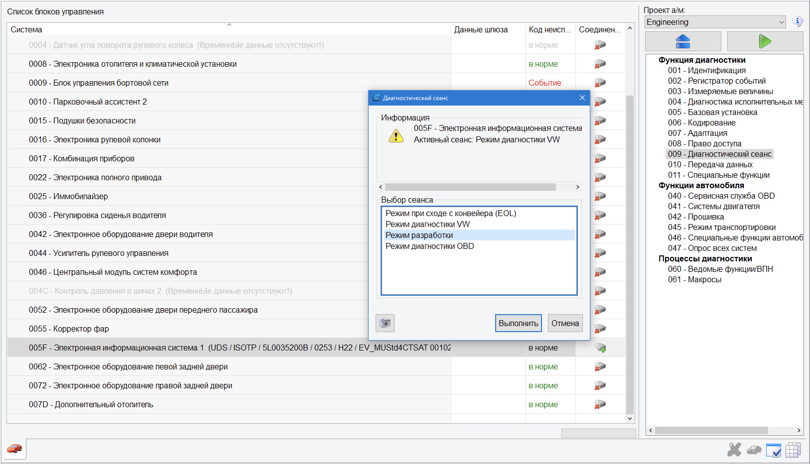

# Working with ODIS ENGINEERING

### Explanation of parameters

- LN, LO, SO, SN – parameter (L – long, S – short)  
- VO, VN – table of parameters (V – volume)  
- VN – value (V – value)  

To display the names, values and units of control units for text identifiers from the ODX data, the corresponding text from the CS dictionary is used.  

If the parameter/section name is present in the dictionary of the language installed in ODIS Engineering, 
then the letter N (Normalized) is displayed in the value, and the name itself is translated into the appropriate language:  
- [SN, LN, VN] name_from_dictionary  

If the parameter/section name is not available in the language dictionary, then the information is taken directly from the ODX data (letter O):  
- [SO, LO, VO] name_from_ODX_data

### Load the desired machine profile

We are interested in the item: Name of the ASAM project
1. In ODIS S you need to start diagnostics (you don’t have to wait for the diagnostics to finish, the main thing is to start doing it)
2. Save diagnostic protocol

3. Open it in the browser > "Expand all" > just below the beginning of the protocol the name of the project for this car will be written

### Export adaptations and encodings

Some blocks may ask for passwords (logins). After scanning is completed, our protocols are saved in the selected folder.
1. Item “Vehicle services”, subitem 046-Special vehicle functions (Fzg. Sonderfunktionen)
2. Select the desired block.
3. Check the boxes next to the items “Adaptation”, “Encodings”, click “Read data”

4. Specify the path and click save.

### Activate development mode

Sometimes, to activate certain adaptations, an “Out of range” or “Function unavailable” error may appear.  

In most cases, to solve this problem, it is enough to enable Development Mode in the diagnostic session for the desired block:

### Saving presets/presets

Loading of presets/presets is carried out in the same place in the button menu “Preset” - “Import”.  
You can delete a preset/preset from ODIS in the same place, the “Delete event” menu.
1. Go to the desired block (adaptation or encoding)
2. Select the desired item (the one [VO]_, [VN]_), expand it by clicking the arrow on the left (>)
3. In the upper right you need to click "Preset"
  
4. In the drop-down menu, select “New”, give it a name
  
5. In the same place, in “Preset”, select “Export” and indicate where to save

### Loading parameters

1. Select the desired block
2. Clause 010, subclause 010.01 “Downloading data”
3. Select the file and start downloading

### Unit software update

Before updating the software, you must follow these instructions:  

• Ensure that the charger is connected to the car battery  
• When updating the software, all electrical consumers that are not necessary (ventilation, heated seats, interior lighting, etc.) must be turned off.  
• It is imperative to use a cable connection between the adapter and the vehicle. When connecting via Bluetooth© (transmitter), unwanted interruptions to the software update process may occur!  
• Be sure to disconnect all third-party connections to the car (cell phones, external drives) and remove the SIM card from the GU!  
• The driver's door must be open during the software update.  
• During the software update, turn on the hazard warning lights on the vehicle to ensure that the CAN bus on the vehicle side is always active.