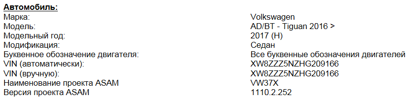
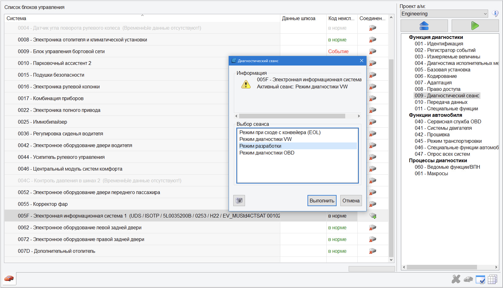

# Работа с ODIS ENGINEERING

### Расшифровка параметров

- LN, LO, SO, SN – параметр (L – long, S – short)  
- VO, VN – таблица параметров (V – volume)  
- VN – значение (V – value)  

Для отображения имен, значений и единиц измерения блоков управления для текстовых идентификаторов из данных ODX используется соответствующий текст из CS словаря.  

Если имя параметра/раздела присутствует в словаре языка, установленного в ODIS Engineering, 
то в значении отображается буква N (Normalized), а само имя переведено на соответствующий язык:  
- [SN, LN, VN] имя_из_словаря  

Если имя параметра/раздела недоступно в словаре языка, то информация берется напрямую из данных ODX (буква O):  
- [SO, LO, VO] имя_из_ODX_данных  

### Загрузка нужного профиля машины

1. В ODIS S нужно начать диагностику (можно не ждать окончания диагностики, главное начать её делать)  
2. Сохранить протокол диагностики  
3. Открыть его в браузере > "Развернуть всё" > чуть ниже начала протокола будет написано название проекта на данный авто  

Нас интересует пункт: Наименование проекта ASAM

### Экспорт адаптаций и кодировок

1. Пункт "Функции автомобиля" (Vehicle services), подпункт 046-Специальные функции автомобиля (Fzg. Sonderfunktionen)  
2. Выбираем нужный блок.  
3. Ставим галки напротив пунктов "Адаптация", "Кодировки", нажимаем "Считывание данных" (Read data)  
4. Указываем путь и нажимаем сохранить.  

Некоторые блоки могут спросить пароли (логины) После окончания сканирования наши протоколы сохранены в выбранную папку.

### Активация режима разработки

Иногда для активации тех или иных адаптаций может выходить ошибка "Вне диапазона" или "Функция недоступна".  

В большинстве случаев для решения данной проблемы достаточно включить Режим разработки в диагностическом сеансе у нужного блока:  

### Сохранение пресетов/предустановок

1. Заходим в нужный блок (адаптация или кодировка)  
2. Выбираем нужный пункт (тот что [VO]_, [VN]_), раскрываем его по нажатию стрелочки слева (>)  
3. В правом верхнем необходимо нажать "Предустановка"  
4. В выпавшем меню выбираем "Новое", задаем ей имя  
5. Там же в "Предустановка" выбираем "Экспорт" и указываем куда сохранить  
  
Загрузка пресетов/предустановок осуществляется все там же в меню кнопки "Предустановка" — "Импорт".  
  
Удалить пресет/предустановку из ODIS можно все там же, меню "Удалить событие".  

### Загрузка параметрии

1. Выбираем нужный блок  
2. Пункт 010, подпункт 010.01 "Загрузка данных"  
3. Выбираем файл и начинаем загрузку  

### Обновление ПО блоков

Перед обновлением ПО необходимо выполнить следующие указания:  

• Обеспечить подключение зарядного устройства к АКБ автомобиля  
• При обновлении ПО все электрические потребители, в которых нет необходимости (вентиляция, подогрев сидений, освещение салона и т. д.), должны быть отключены.  
• В обязательном порядке использовать кабельное соединение между адаптером и автомобилем. При соединении по Bluetooth© (трансмиттер) возможны нежелательные прерывания процесса обновления ПО!  
• В обязательном порядке отключить все сторонние подключения к автомобилю (сотовые телефоны, внешние диски) и вынуть SIM-карту из ГУ!  
• Дверь водителя во время обновления ПО должна быть открыта.  
• Во время обновления ПО включить на автомобиле аварийную световую сигнализацию, чтобы обеспечить постоянную активность шины CAN на стороне автомобиля.